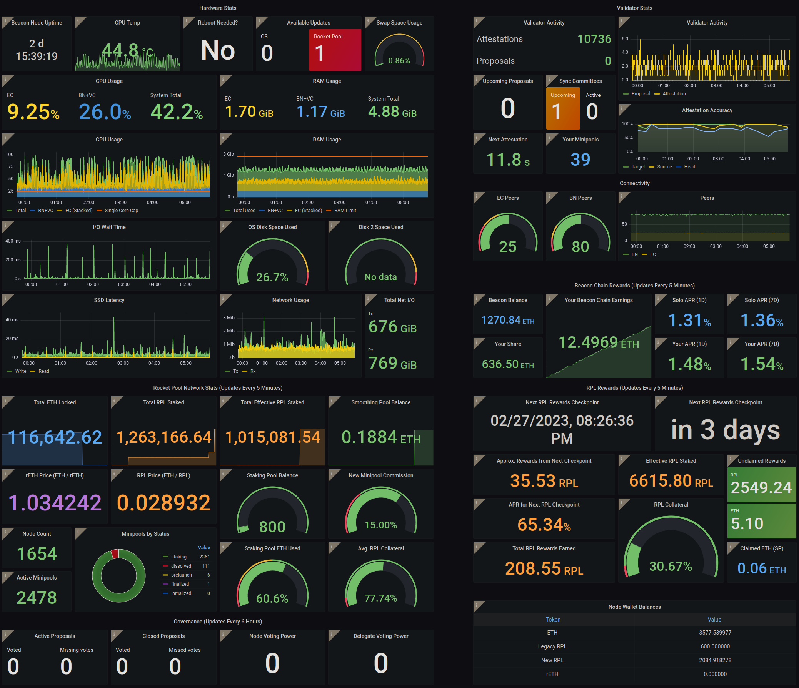

# The Rocket Pool Atlas Update

::: warning NOTE
This page describes features that are currently in BETA and only apply to certain test networks.
Nothing here is live on Mainnet yet.
:::

Rocket Pool's next major update, titled **Atlas**, has been released for beta testing on the Zhejiang and Prater (Goerli) test networks.
This page describes the major changes that Atlas brings, including updates to both the Smartnode stack and to the Rocket Pool protocol in general.

Please read through this page thoroughly to understand all of the differences between the previous version of Rocket Pool (Redstone) and Atlas.

## New Protocol Features

Atlas brings about some exciting new features that are based on both community feedback and changes to the Ethereum protocol itself.
Below is a brief list of these changes - click on any of them to learn more about it.

### Shapella and Withdrawals

The Ethereum protocol is preparing to undergo its next major upgrade: **Shanghai** on the Execution layer, and **Capella** on the Consensus layer - since these are now interconnected, both will occur at the same time.
Ethereum users have affectionately come to call the combined upgrade [**"Shapella"**](https://blog.ethereum.org/2023/02/21/sepolia-shapella-announcement) accordingly.

Shapella introduces **withdrawals** to the Beacon Chain, meaning node operators are now able to access the ETH that is currently locked on the Beacon Chain.
This comes in two flavors:

- Partial withdrawals (**skimming**), where your rewards (your excess Beacon Chain balance over 32 ETH) are sent to your minipool on the Execution Layer. This is done *automatically by the protocol itself* every so often (about once every four or five days on Mainnet).
- **Full withdrawals**, where you exit your validator from the Beacon Chain and its entire balance is sent to your minipool on the Execution Layer. This is done *automatically by the protocol itself* once your validator has been exited from the chain long enough.

Atlas introduces a new delegate contract for minipools that allows node operators to **distribute** the minipool's ETH balance, splitting it evenly between the node operator and the rETH holders (plus commission, of course) at any time.
This gives node operators **immediate access** to their Beacon Chain rewards!

To learn more about withdrawals and rewards, please visit the [Withdrawals](./withdrawals.md) guide.

### 8-ETH Bonded Minipools

One of the most anticipated changes made in Atlas is the introduction of the ability to only provide 8 ETH to make a minipool instead of 16 ETH.
Minipools with only 8 ETH bonded by their owning node operator are matched with **24 ETH** from the staking pool (provided by rETH holders) in order to make a validator.
This significantly reduces the capital requirement for running your own validator *and* results in greater returns for both the node operator and the rETH stakers!
In fact, running two 8-ETH minipool instead of one 16-ETH minipool will provide **over 18% more rewards** - even if the 16-ETH minipool has a commission rate of 20%.

Creating an 8 ETH minipool requires that you stake a **minimum of 2.4 ETH worth of RPL** and a **maximum of 12 ETH worth of RPL**.
These represent 10% of the amount you're *borrowing* from the protocol, and 150% of the amount you're *bonding* (staking) yourself.

New minipools be created with either 8 ETH or 16 ETH.
16 ETH minipools are unchanged from how they work today, and are available for users that want to minimize their exposure to the RPL token.

Finally, once the Shapella upgrade has been applied, node operators can **migrate existing 16-ETH minipools directly into 8-ETH minipool without needing to exit**.
This will give them 8 ETH back in [deposit credit](./credit.md), which can be used to create a **new 8-ETH minipool for free**!

To learn more about 8-ETH bond minipools, please visit the [8-ETH Bonded Minipools](./lebs.md) guide.

### Solo Validator Conversion

Part of the Shapella upgrade involves the ability for solo validators to [change their validators' withdrawal credentials](https://notes.ethereum.org/@launchpad/withdrawals-faq) from the original (now unused) BLS-based withdrawal key to an address on the Execution layer.
This address will the be the recipient for all of that validator's rewards its full ETH balance once it exits the Beacon Chain.

Regular Rocket Pool node operators don't need to worry about any of this, as the protocol automatically set this up for your minipools when you created them.
*However*, as part of this new requirement for solo validators, Atlas brings an exciting opportunity: the ability to **create a special minipool** that will become the withdrawal address for your **existing solo validator**.

In other words, this will allow you to **directly convert a solo validator into a Rocket Pool minipool without needing to exit it!**

This means you will get all the benefits of Rocket Pool minipools, including:
- The ability to convert your one validator (with a 32 ETH bond) into **four minipools** (each with an 8 ETH bond), effectively **quadrupling** your presence on the Beacon Chain
- Commission on the portion of those minipools provided by rETH stakers
- Access to Rocket Pool's [Smoothing Pool](../node/fee-distrib-sp.md#the-smoothing-pool) to pool and evenly distribute rewards from block proposals and MEV 

To learn more about converting a solo validator into a minipool, please visit the [Converting a Solo Validator into a Minipool](./solo-staker-migration.md) guide.

## New Smartnode Features 

In addition to core changes to the Rocket Pool protocol, Atlas also brings some exciting upgrades to the Smartnode stack itself which are present in v1.9.0.

### Unified Grafana Dashboard

By popular demand, we have created a new **Grafana dashboard** to help node operators track and assess the status, progress, and overall health of their nodes:

It comes with the following highly requested features:

- Support for all Execution and Consensus clients in a single dashboard - no more changing dashboards based on which clients you're using!
- Execution client stats, including CPU and RAM usage, and peer count
- Attestation accuracy tracking which follows how "correct" your attestations were for the previous epoch, so you know how far off from optimal rewards you're getting
- Tracking of the Smoothing Pool's balance
- Tracking of claimed and unclaimed rewards, now including ETH from the Smoothing Pool
- Stats about Rocket Pool's Snapshot-based governance votes
- And more!

Grafana's dashboard uploading service is unfortunately not working right now so it can't imported from their service via ID, but you can import it via JSON - [the dashboard's JSON is available in our GitHub repository](https://raw.githubusercontent.com/rocket-pool/smartnode-install/atlas/Dashboards/Rocket%20Pool%20Dashboard%20v1.2.0-rc1.json).
Simply click the link, copy the JSON, and pop it into your dashboard's import dialog.

This new dashboard was a labor of love that involved extensive help from community member **0xFornax** - thank you for all of your hard work!

### Nimbus Changes

Smartnode v1.9.0 introduces **split mode support** for Nimbus!
Instead of running the Beacon Node and Validator Client inside a single process / container, the Smartnode will now run them in separate containers like the other clients. This has the following benefits:
- Nimbus now supports **fallback clients** (a secondary Execution client and Beacon Node that Nimbus's Validator Client can connect to when your primary clients are down for maintenance, such as resyncing).
- Nimbus is now supported in **Externally-Managed (Hybrid) Mode**, so you can couple the Validator Client that the Smartnode manages to an external Beacon Node that you maintain on your own.
- The Beacon Node no longer needs to be restarted after the addition of new minipools, meaning you don't lose attestations while it reconnects to its peers.

### Lodestar Support

[Lodestar](https://chainsafe.github.io/lodestar/) is now supported as an option for your Consensus Client of choice!
This is the newest addition to be officially accepted onto [Ethereum's Launchpad](https://launchpad.ethereum.org/en/lodestar), and it's ready for validation.
Lodestar supports many of the great features you've come to love from the other clients, including Doppelganger Detection, MEV-Boost, externally-managed clients (Hybrid Mode), and more!

### New Network Snapshot System

On a slightly more technical note, v1.9.0 introduces a brand new system for quickly capturing a snapshot the state of **everything about your node** on both the Execution and the Consensus layers.
Under the hood, this system leverages [MakerDAO's multicall contract](https://github.com/makerdao/multicall) and Will O'Beirne's [Ethereum Balance Checker contract](https://github.com/wbobeirne/eth-balance-checker) to batch thousands of individual Execution client queries up into a single request. 

This makes the `node` process much less taxing on the Execution client for node operators with a large number of validators, and should significantly reduce its CPU load which will improve attestations and overall rewards.

This new system hasn't made its way into the CLI itself yet, so any commands you run there (such as `rocketpool minipool status`) will still use the old single-query setup.
Over time we'll introduce it into the CLI too, which will make all of its commands lightning fast (*except for waiting for transactions to be validated, that still takes a while*).

### Zhejiang Testnet

Finally, what would all of these great new features be without a way to test them?
Smartnode v1.9.0 introduces support for the [Zhejiang](https://zhejiang.ethpandaops.io/) test network.
Similar to how Ropsten was introduced in v1.5.0 to allow people to get an early preview of the Merge, Zhejiang **already has both Shapella and Atlas deployed** so testers can experiment with the new features before they make their way to Goerli (Prater) and ultimately onto Mainnet.
