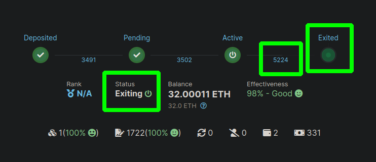
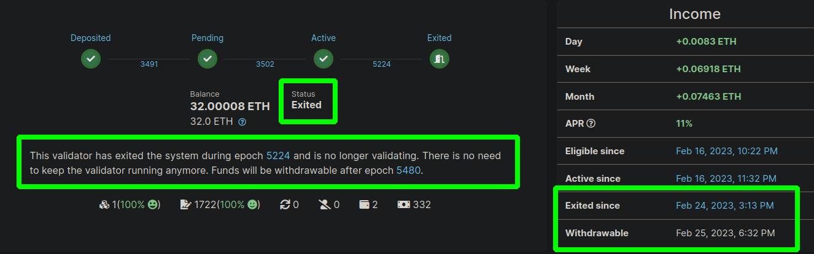

# Withdrawals

::: warning NOTE
This page describes features that are currently in BETA and only apply to certain test networks.
Nothing here is live on Mainnet yet.
:::

The next major protocol upgrade for Ethereum (affectionately called [**"Shapella"**](https://blog.ethereum.org/2023/02/21/sepolia-shapella-announcement) by the Ethereum community) introduces withdrawals to the protocol.
This means validators will finally be able to access the ETH that was previously locked on the Beacon Chain as part of staking.

There are two varieties of withdrawals:

- Partial withdrawals (**skimming**), where your rewards (your excess Beacon Chain balance over 32 ETH) are sent to your minipool on the Execution Layer. This is done *automatically by the protocol itself* every so often (about once every four or five days on Mainnet).
- **Full withdrawals**, where you exit your validator from the Beacon Chain and its entire balance is sent to your minipool on the Execution Layer. This is done *automatically by the protocol itself* once your validator has been exited from the chain long enough.

In both cases, the withdrawn ETH is deposited directly into the minipool contract that owns the corresponding validator on the Beacon Chain.
From here, it can be accessed by the minipool's node operator and **distributed**.
Distributing the minipool's balance will split it evenly (plus commission) between the node operator and the rETH stakers; the node operator's portion will go to the node's **withdrawal address**, and the rETH portion will go back into the staking pool.


## The Minipool Delegate

Many operators will prefer to keep their validators active on the Beacon Chain and simply collect the rewards from them at each skimming interval.
The original Rocket Pool minipool contract wasn't designed with this capability in mind (as skimming didn't exist yet).
Luckily, Atlas provides a powerful new **minipool delegate contract** that gives node operators the ability to access the minipool's balance at any time.

The minipool delegate contract is simply an extension of your own minipool that adds new functionality to it; you can upgrade to it at any time, and upgrades are **opt-in** so that Rocket Pool can't force new behavior on your minipool without your consent.
That being said, the original delegate was designed around withdrawal behavior that is no longer accurate so withdrawaling ETH and RPL while using it is not supported by the Smartnode.
For more information, see [the note on the original delegate](#a-note-on-the-old-delegate) at the bottom of this guide.

If you intend to access your rewards, **you should upgrade to the Atlas delegate**.
The process is quick and cheap, and is explained below.


### Upgrading your Delegate

To upgrade a minipool to the new delegate contract, simply run the following command:

```
rocketpool minipool delegate-upgrade
```

This will present you with a list of your minipools that are not currently using the latest delegate and are eligible for upgrading:

```
Please select a minipool to upgrade:
1: All available minipools
2: 0x7e5702a2cE66B5B35E59B9Ac00eEAAa547881e40 (using delegate 0x5c2D33A015D132D4f590f00df807Bb1052531ab9)
3: 0x7E5703fdA638CD86c316B9EbAF76927fF695ADC5 (using delegate 0x5c2D33A015D132D4f590f00df807Bb1052531ab9)
4: 0x7E5704aD2a63eb90880426Dcd4a3811246dF3cB0 (using delegate 0x5c2D33A015D132D4f590f00df807Bb1052531ab9)
5: 0x7E5705c149D11efc951fFc20349D7A96bc6b819C (using delegate 0x5c2D33A015D132D4f590f00df807Bb1052531ab9)
6: 0x7E570625cE8F586c90ACa7fe8792EeAA79751778 (using delegate 0x5c2D33A015D132D4f590f00df807Bb1052531ab9)
7: 0x7E5700c82E38434C6c72890bb82f5B5305f4328a (using delegate 0x6aCEA7f89574Dd8BC6ffDfDca1965A3d756d5B20)
```

Select the one(s) you would like to upgrade from the list by entering the corresponding number on the left of the minipool address.
Once selected, you will be prompted to confirm your gas price settings, and after that a transaction to upgrade the minipool will be sent:

```
Using a max fee of 26.00 gwei and a priority fee of 2.00 gwei.
Are you sure you want to upgrade 1 minipools? [y/n]
y

Upgrading minipool 0x7e5702a2cE66B5B35E59B9Ac00eEAAa547881e40...
Transaction has been submitted with hash 0xcd91c9a38f3438c3d8a45bb5f439014e5935dcb50b0704f3c5077f54174e99bb.
Waiting for the transaction to be included in a block... you may wait here for it, or press CTRL+C to exit and return to the terminal.

Successfully upgraded minipool 0x7e5702a2cE66B5B35E59B9Ac00eEAAa547881e40.
```

You can verify that it's using the latest delegate with `rocketpool minipool status`.
Any minipools that are *not* using the latest delegate will have a yellow notification under their status letting you know that they can be upgraded:

```
Address:              0x7E5703fdA638CD86c316B9EbAF76927fF695ADC5
Penalties:            0
...
Delegate address:      0x5c2D33A015D132D4f590f00df807Bb1052531ab9
Rollback delegate:     <none>
Effective delegate:    0x5c2D33A015D132D4f590f00df807Bb1052531ab9
*Minipool can be upgraded to delegate 0x149aE025fFC7E7bbcCc8d373d56797D637bF5D33!
```


## Distributing Your ETH with the New Delegate

Once your delegate is upgraded, you will be able to access your minipool's balance.
There are some **important rules** about how the new delegate determines how to treat it:

- If your minipool has **below 8 ETH**, it will be treated as **skimmed rewards**. You can safely distribute them between you and the rETH stakers. Your minipool will remain alive and continue during this process.
- If your minipool has **above 32 ETH**, it will be treated as **full balance and rewards** from a validator that has exited and withdrawn. You can safely distribute them between you and the rETH stakers. Your minipool will be **finalized**, meaning it is no longer active and has been shut down.
- If your minipool has **between 8 and 32 ETH**, it will be treated as **full rewards** from a **slashed validator**. 16 ETH will be given to the rETH stakers, and you will be given whatever is left over. If your minipool has less than 16 ETH, the entire balance will be give to the rETH stakers.

The sections below cover how to access your rewards in each scenario.


### Distributing Skimmed Rewards

If your minipool has less than 8 ETH in it, you can distribute your rewards using the following command:

```
rocketpool minipool distribute-balance
```

This will show you the minipools you have that are eligible for distribution, how much ETH they have, and how much ETH you (the node operator) will receive:

```
WARNING: The following minipools are using an old delegate and cannot have their rewards safely distributed:
	0x7E5703fdA638CD86c316B9EbAF76927fF695ADC5
	0x7E5704aD2a63eb90880426Dcd4a3811246dF3cB0
	0x7E5705c149D11efc951fFc20349D7A96bc6b819C
	0x7E570625cE8F586c90ACa7fe8792EeAA79751778

Please upgrade the delegate for these minipools using `rocketpool minipool delegate-upgrade` in order to distribute their ETH balances.

Please select a minipool to distribute the balance of:
1: All available minipools
2: 0x7E5700bcd65B1770bA68abB288D3f53814d376aC (0.112307 ETH available, 0.031200 ETH goes to you plus a refund of 0.024419 ETH)
3: 0x7E570195026dC29f4B2DfF08B56c3b5D0FF988Ef (0.070754 ETH available, 0.000481 ETH goes to you plus a refund of 0.069399 ETH)
4: 0x7e5702a2cE66B5B35E59B9Ac00eEAAa547881e40 (0.122064 ETH available, 0.070187 ETH goes to you plus a refund of 0.000000 ETH)
5: 0x7E5700c82E38434C6c72890bb82f5B5305f4328a (0.102739 ETH available, 0.000000 ETH goes to you plus a refund of 0.000000 ETH)
6: 0xffCAB546539b55756b1F85678f229dd707328A2F (0.070989 ETH available, 0.025201 ETH goes to you plus a refund of 0.000000 ETH)
```

Any minipools using the original launch delegate will be mentioned at the start, letting you know that you cannot call `distribute-balance` on them until you upgrade their delegates.

Note that for eligible minipools, you are also shown the **refund amount**.
This is an amount owed directly to you (for example, because you had a balance in your minipool prior to [migrating from a 16-ETH bond down to an 8-ETH bond](./lebs.md) or you [converted a solo validator into a minipool](./solo-staker-migration.md) with existing rewards).
It will not be shared with the rETH holders.

::: tip NOTE
You might be wondering why the amount going to the node operator (0.031200 ETH) appears lower than you might expect in this case.
That's because in this example, we used an 8-ETH bonded minipool (an LEB8) instead of a 16-ETH bonded minipool!
Read [**our guide on 8-ETH bonded minipools**](lebs.md) if you'd like to learn more about them.
:::

Enter the number of the minipool that you want to distribute.
You will be prompted with the gas price chart as usual, and asked to confirm your decision.
Once you have, your minipool's balance will be distributed:

```
Using a max fee of 2.00 gwei and a priority fee of 2.00 gwei.
Are you sure you want to distribute the ETH balance of 1 minipools? [y/n]
y

Distributing balance of minipool 0x7E5700bcd65B1770bA68abB288D3f53814d376aC...
Transaction has been submitted with hash 0xb883eab903d9688b40d291c5c2030084f9bce19135837ebf96a5c1e8871cfbf9.
Waiting for the transaction to be included in a block... you may wait here for it, or press CTRL+C to exit and return to the terminal.

Successfully distributed the ETH balance of minipool 0x7E5700bcd65B1770bA68abB288D3f53814d376aC.
```

As you can see [from the transaction](https://zhejiang.beaconcha.in/tx/b883eab903d9688b40d291c5c2030084f9bce19135837ebf96a5c1e8871cfbf9), this provided the node's withdrawal address with the node's share of the rewards (plus the refund amount) and returned the rest to the staking pool.


### Distributing Full Rewards

::: tip NOTE
This process requires your validator to be exited from the Beacon Chain and your validator's balance to have been transferred to the minipool contract.
If you need a refresher on how to do that process, please see the [**Exiting your Validator**](#exiting-your-validator) section below - return here once you're done.
:::

If you have exited your validator from the Beacon Chain and your balance has been deposited into the minipool contract, you can safely withdraw the entire thing in one command.
Unlike the `distribute` command above, this process will actually **finalize** your minipool which closes it and renders it inactive.
For all intents and purposes, once your balance has been withdrawn from the Beacon Chain and you go through the following process to access the funds, the minipool's duty is over.

To retrieve the funds and close the minipool, run the following command:

```
rocketpool minipool close
```

This will present you with a list of minipools that are eligible for closure:

```
Please select a minipool to close:
1: All available minipools
2: 0xffCAB546539b55756b1F85678f229dd707328A2F (32.074633 ETH available, 8.026494 ETH is yours plus a refund of 0.000000 ETH)
```

Here you can see the total balance for each eligible minipool, how much of that balance will be distributed to you, and how much of that balance is reserved for you as a refund (which bypasses distribution).

Select which minipool you'd like to distribute and close from the list, confirm the action, and all you need to do is wait for your transaction to be validated.
Once it does, your share of the minipool balance (and your refund) will be sent to your withdrawal address, and the minipool will enter the `finalized` state.

You can verify it by looking at the transaction on a block explorer; for example, feel free to look at [the transaction for closing the above minipool](https://zhejiang.beaconcha.in/tx/0x5557d5e052422d4a46bb4204cabb8093b22fc944664aa0d5d4e8c9adca1865a5).

At this point, your effective RPL will be updated to remove this minipool from the calculation.
You can now unstake any RPL you have that would put you over the 150% limit. 


## Exiting your Validator

::: danger WARNING
Your validator's funds will be **locked** on the Beacon Chain until the Shapella hardfork has been deployed and withdrawals have been implemented.
If you are planning to exit your validator, *please bear this in mind*.

The Shapella hardfork has currently been deployed to the Zhejiang testnet, so if you'd like to test exiting and withdrawals, please do so there.
:::

When you have decided that you no longer want to run a minipool and want to access the full balance locked on the Beacon Chain, you will have to take several steps:

1. Send a voluntarily exit request for the minipool's validator from the Beacon Chain.
2. Wait for your validator to exit.
3. Wait for your validator's balance to be withdrawn to your minipool on the Execution layer.

We'll cover each step below.


### Sending the Exit Request

If you want to exit the validator attached to a minipool, run the following command:

```
rocketpool minipool exit
```

You will be presented with a list of minipools that can be exited:

```
Please select a minipool to exit:
1: All available minipools
2: 0x7E5700bcd65B1770bA68abB288D3f53814d376aC (staking since 2023-02-08, 06:33 +0000 UTC)
3: 0x7E570195026dC29f4B2DfF08B56c3b5D0FF988Ef (staking since 2023-02-08, 06:33 +0000 UTC)
4: 0x7e5702a2cE66B5B35E59B9Ac00eEAAa547881e40 (staking since 2023-02-08, 06:33 +0000 UTC)
5: 0x7E5703fdA638CD86c316B9EbAF76927fF695ADC5 (staking since 2023-02-08, 06:33 +0000 UTC)
6: 0x7E5704aD2a63eb90880426Dcd4a3811246dF3cB0 (staking since 2023-02-08, 06:34 +0000 UTC)
7: 0x7E5705c149D11efc951fFc20349D7A96bc6b819C (staking since 2023-02-08, 06:34 +0000 UTC)
8: 0x7E570625cE8F586c90ACa7fe8792EeAA79751778 (staking since 2023-02-08, 06:56 +0000 UTC)
9: 0x7E5700c82E38434C6c72890bb82f5B5305f4328a (staking since 2023-02-13, 06:11 +0000 UTC)
10: 0xffCAB546539b55756b1F85678f229dd707328A2F (staking since 2023-02-16, 11:19 +0000 UTC)
```

Once you confirm you want to exit, your node will send a voluntary exit request to the Beacon Chain.
This is **not** a normal Execution layer transaction, so you do not need to pay gas for it.

If you need the validator public key for the minipool you just exited, you can retrieve it using `rocketpool minipool status`.
You can view your validator's exit status on a Beacon Chain explorer such as [https://zhejiang.beaconcha.in](https://zhejiang.beaconcha.in) (for the Zhejiang testnet).
It will take some time for your status to be updated, but once it is you will see it in the "exiting" state:

<center>



</center>

Here you can see the Status is `Exiting`, the epoch it will exit on is highlighted (5224), and the "Exited" icon will be pulsing green to indicate the operation is in progress.
It may take some time for your validator to exit, *especially* if there are a large number of validators exiting the Beacon Chain at the same time; the protocol is designed to only allow a small number of validators to exit per epoch so you may have to wait your turn.

Once your exit epoch has passed, your validator will officially exit the chain and will no longer attest or propose blocks.
You can confirm this in your Validator Client logs, or on the explorer:

<center>



</center>

The status has changed to `Exited` and there is some text underneath that indicates your **withdrawable epoch** (which should be 256 epochs after you exit, or about 27 hours).
Beaconcha.in also conveniently provides the local timestamps for when your validator will exit and when it will be withdrawable.

Once it has entered the **withdrawable** state, your validator will be enqueued by the Beacon Chain for rewards distribution.
This queue depends on how many validators are currently withdrawing.
Once it's your turn, the Beacon Chain will *automatically* send your balance to your minipool's address on the Execution layer.
At this point, you can access it using the Smartnode CLI to do a distribution.
See [Distributing Full Rewards](#distributing-full-rewards) for more information on this process.


## A Note on the Old Delegate

As mentioned previously, the **original minipool delegate** assigned to every minipool from Rocket Pool's launch until Atlas's deployment was built with two assumptions in mind:
1. The only time your minipool will ever have a balance is after the validator has exited the Beacon Chain.
2. The Oracle DAO will change your minipool's state from "staking" to "withdrawable" once the balance has been transferred from the Beacon Chain to the minipool contract.

The first point is clearly no longer relevant now that Ethereum is being upgraded to support skimming.
The second point is *also* no longer true, because the Oracle DAO is **no longer** going to flag "withdrawable" minipools.
This was an intentional design decision to reduce the power that the Oracle DAO yields over Rocket Pool node operators and allow them to access rewards without any supplemental requirement on trusted parties.

Because of these deficiencies, the Smartnode CLI **no longer supports** withdrawals or fund distribution on the original minipool delegate.
If you'd like to access your rewards, you **must** upgrade to the Atlas delegate which supports the new withdrawal conditions listed above.

::: danger DANGER
If you are an advanced user and bypass the CLI to invoke the distribution functionality on the contract directly via a third-party tool, be advised of the following things:
1. The delegate's distribution function will revert if the minipool's balance is **below 16 ETH**. Balances below 16 ETH **cannot be accessed.** 
2. If the minipool has **between 16 and 32 ETH** in its balance, distribution by the original delegate will assume your validator has been **slashed**. It will return 16 ETH to the staking pool and give you whatever is left over. It will *only* function properly if the minipool balanace is above 32 ETH.
3. The minipool will never enter the `finalized` state because the Oracle DAO will never mark it as `withdrawable`, so even though you may be able to access your ETH, **your RPL will be locked** until you upgrade to the Atlas delegate.

Because of these points, we **strongly recommend** you just upgrade to the Atlas delegate in the first place and avoid them entirely.
:::