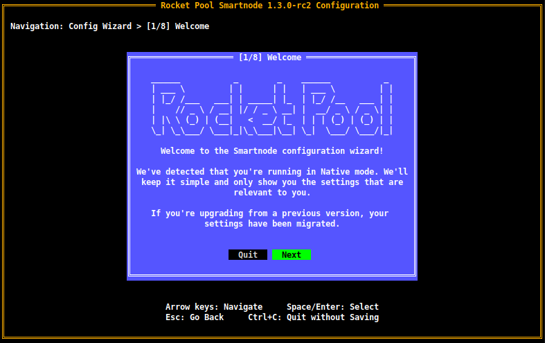
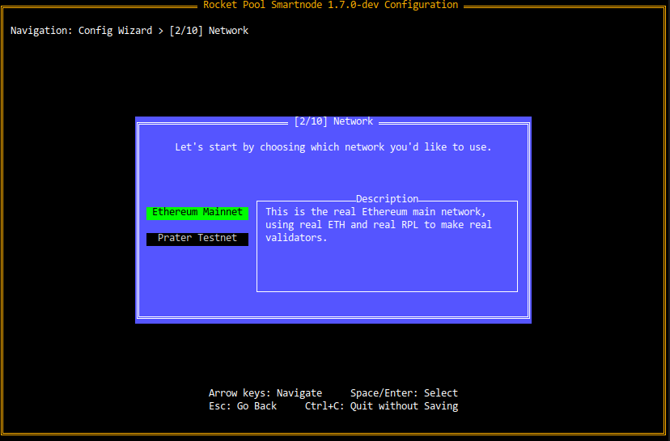
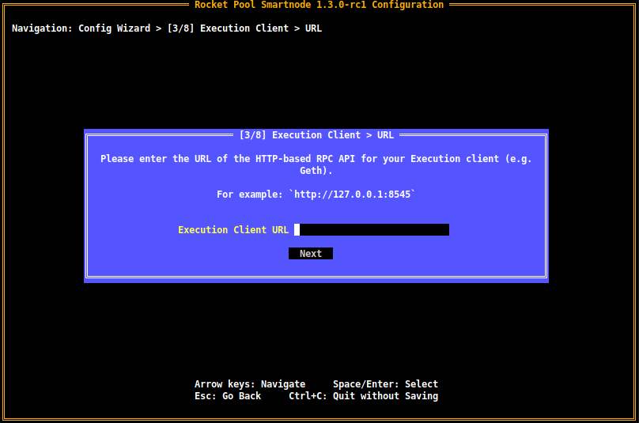
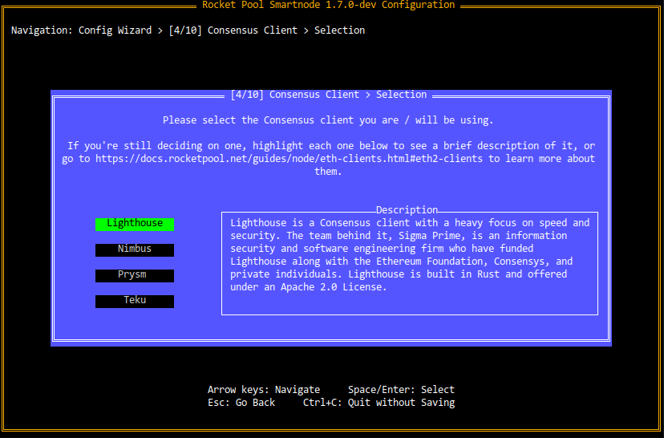
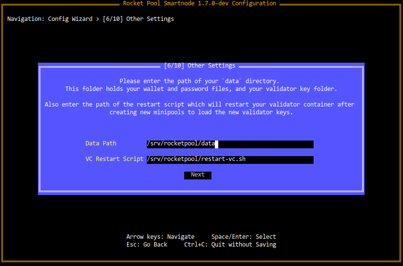
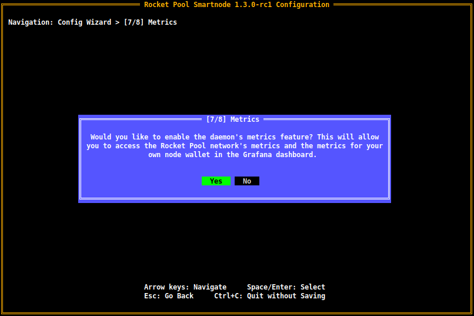
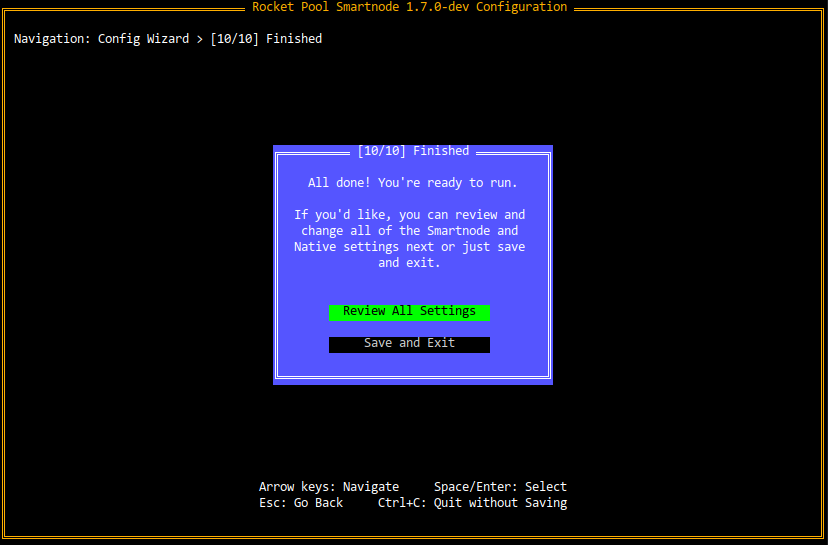
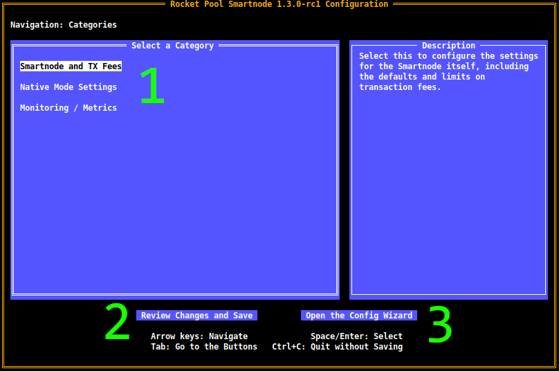
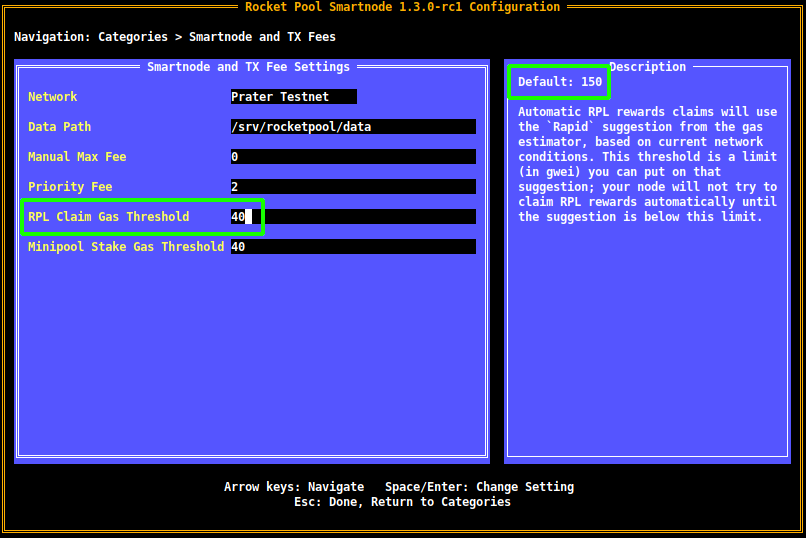
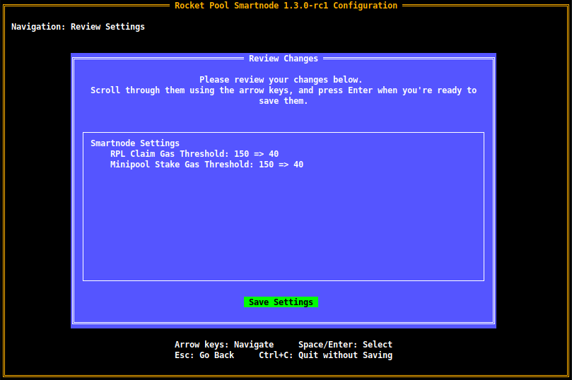

# [BETA] Configuring a Native Rocket Pool Node without Docker

:::danger CAUTION
*The following guide is intended for Rocket Pool's beta testers to use with the Release Candidate of v1.3.0.
As this release is still **just for testing on the Prater testnet**, you should *not* look at this page for Mainnet instructions until it has been formally released!
:::

In this section, we will walk through the process of installing the Rocket Pool Smartnode stack natively onto your system, without the use of Docker containers.

The general plan is as follows:
- Create system services for the Rocket Pool components (the **node** process, and optionally the **watchtower** process if you are an Oracle Node)
- Create a system service for the Execution client
- Create a system service for the Beacon node
- Create a system service for the Validator client
- Configure Rocket Pool to use communicate with those services

This is a fairly involved setup so it will take some time to complete.

The diversity of Operating Systems and distros available make it impractical to make guides available for all of them.
The instructions in this guide are tailored to a Debian-based system (including Ubuntu).
For other distros or operating systems, you may follow the high-level steps described in the guide but will have to substitute certain commands for the ones that your system uses as appropriate.

::: warning
This guide is intended for users that are experienced with Linux system administration and usage.
This includes using the terminal, creating system accounts, managing permissions, and installing services. 
**If you are not familiar with these activites, we do not recommend that you use the native mode.**
:::


## Creating Service Accounts

The first step is to create new system accounts for the services and disable logins and shell access for them.
The reason for having separate user accounts is practical: if your Execution or Consensus clients have a major vulnerability like an [Arbitrary Code Execution](https://en.wikipedia.org/wiki/Arbitrary_code_execution) exploit, doing this will limit the amount of damage an attacker can actually do since they're running on an account with limited permissions.

We're going to create one account for your Execution client, one for your Beacon Node, and one for both Rocket Pool and the validator client.
The sharing is necessary because Rocket Pool will create the validator's key files once you create a new minipool, and it will set the permissions so that only its own user has access to them.
If you're using **Nimbus** for your Consensus client, then it will share an account with Rocket Pool instead since it doesn't have a separate validator client. 

Start by creating an account for your Execution client, which we'll call `eth1`:
```shell
sudo useradd -r -s /sbin/nologin eth1
```

Do the same for your Beacon Node, which we'll call `eth2`:
```shell
sudo useradd -r -s /sbin/nologin eth2
```

Finally, make one for the validator and Rocket Pool, which we'll call `rp`:
```shell
sudo useradd -r -s /sbin/nologin rp
```

::: tip NOTE
If you're using Nimbus, ignore the `rp` account.
Any time you see it used in this guide, just substitute it with `eth2` instead.
:::

Now, add yourself to the `rp` group.
You'll need to do this in order to use the Rocket Pool CLI, because it and the Rocket Pool daemon both need to access the Execution layer wallet file.
```shell
sudo usermod -aG rp $USER
```

After this, logout and back in for the changes to take effect.


## Installing Rocket Pool

### Setting up the Binaries
Start by making a folder for Rocket Pool and a data subfolder.
You can put this wherever you want; for this guide, I'll put it into `/srv`:
```shell
sudo mkdir -p /srv/rocketpool/data

sudo chown -R $USER:$USER /srv/rocketpool
```

Now, download the CLI and daemon binaries (or ignore this and build them from source if you prefer).
Choose the platform that your system uses from the tabs below.

:::: tabs

::: tab Linux x64
```shell
sudo wget https://github.com/rocket-pool/smartnode-install/releases/latest/download/rocketpool-cli-linux-amd64 -O /usr/local/bin/rocketpool

sudo wget https://github.com/rocket-pool/smartnode-install/releases/latest/download/rocketpool-daemon-linux-amd64 -O /usr/local/bin/rocketpoold

sudo chmod +x /usr/local/bin/rocketpool /usr/local/bin/rocketpoold
```
:::

::: tab Linux arm64
```shell
sudo wget https://github.com/rocket-pool/smartnode-install/releases/latest/download/rocketpool-cli-linux-arm64 -O /usr/local/bin/rocketpool

sudo wget https://github.com/rocket-pool/smartnode-install/releases/latest/download/rocketpool-daemon-linux-arm64 -O /usr/local/bin/rocketpoold

sudo chmod +x /usr/local/bin/rocketpool /usr/local/bin/rocketpoold
```
:::

::: tab macOS x64
```shell
sudo wget https://github.com/rocket-pool/smartnode-install/releases/latest/download/rocketpool-cli-darwin-amd64 -O /usr/local/bin/rocketpool

sudo wget https://github.com/rocket-pool/smartnode-install/releases/latest/download/rocketpool-daemon-darwin-amd64 -O /usr/local/bin/rocketpoold

sudo chmod +x /usr/local/bin/rocketpool /usr/local/bin/rocketpoold
```
:::

::: tab macOS arm64
```shell
sudo wget https://github.com/rocket-pool/smartnode-install/releases/latest/download/rocketpool-cli-darwin-arm64 -O /usr/local/bin/rocketpool

sudo wget https://github.com/rocket-pool/smartnode-install/releases/latest/download/rocketpool-daemon-darwin-arm64 -O /usr/local/bin/rocketpoold

sudo chmod +x /usr/local/bin/rocketpool /usr/local/bin/rocketpoold
```
:::

::::

Next, grab the validator restart script - Rocket Pool will use this when it needs to restart your Validator Client to load new keys after you create a new minipool:

```shell
wget https://github.com/rocket-pool/smartnode-install/raw/release/install/scripts/restart-vc.sh -O /srv/rocketpool/restart-vc.sh

chmod +x /srv/rocketpool/restart-vc.sh
```

Now open `~/.profile` with your editor of choice and add this line to the end:
```shell
alias rp="rocketpool -d /usr/local/bin/rocketpoold -c /srv/rocketpool"
```

Save it, then reload your profile:
```shell
source ~/.profile
```

This will let you interact with Rocket Pool's CLI with the `rp` command, which is a nice shortcut.


### Creating the Services

Next up, we'll create a `systemd` service for the Rocket Pool node daemon.
This is the service that will automatically check for and claim RPL rewards after each checkpoint, and stake minipools once you've created them via `node deposit`.

Optionally, if you're an Oracle DAO member, create the corresponding `watchtower` service as well.
If you are not an Oracle DAO member, you can ignore that service.

:::: tabs

::: tab Node

Create the `rp-node` service:
```
sudo nano /etc/systemd/system/rp-node.service
```

Contents:
```
[Unit]
Description=rp-node
After=network.target

[Service]
Type=simple
User=rp
Restart=always
RestartSec=5
ExecStart=/usr/local/bin/rocketpoold --settings /srv/rocketpool/user-settings.yml node

[Install]
WantedBy=multi-user.target
```

Create a log file for the service, so you can watch its output - this will replace the behavior of `rocketpool service logs node`:
```
nano /srv/rocketpool/node-log.sh
```
Contents:
```
#!/bin/bash
journalctl -u rp-node -b -f
```

Save it, then make it executable:
```
chmod +x /srv/rocketpool/node-log.sh
```

Now you can watch the node's logs by simply running `$ /srv/rocketpool/node-log.sh`.
:::

::: tab Watchtower
Create a service for the watchtower:
```
sudo nano /etc/systemd/system/rp-watchtower.service
```

Contents:
```
[Unit]
Description=rp-node
After=network.target

[Service]
Type=simple
User=rp
Restart=always
RestartSec=5
ExecStart=/usr/local/bin/rocketpoold --settings /srv/rocketpool/user-settings.yml watchtower

[Install]
WantedBy=multi-user.target
```

Create a log file for the watchtower:
```
nano /srv/rocketpool/watchtower-log.sh
```
Contents:
```
#!/bin/bash
journalctl -u rp-watchtower -b -f
```

Save it, then make it executable:
```
chmod +x /srv/rocketpool/watchtower-log.sh
```
:::

::::


## Configuring the Smartnode Stack via the Wizard

The next step is to configure the Smartnode.
To do this, run the configuration command:

```
rp service config
```

This will launch a terminal-based UI that will allow you to quickly and easily configure your node, as well as provide optional fine-grained control over the settings that are relevant to Native mode.

::: tip NOTE
If you've already configured the Smartnode, you will instead be greeted with the [Settings Manager](#configuring-the-smartnode-stack-via-the-settings-manager).
You can choose to re-open the Wizard from there if you prefer it, and all of your existing settings will be pre-selected for you.
:::

When you run the config UI for the first time (or if you choose to run the Wizard again later), you will be presented with a screen that looks like this:

<center>



</center>

::: tip TIP
To use the Wizard, **press the `Arrow Keys` (up/down/left/right) to navigate between things such as buttons (choices) or text boxes**.
You can also use `Tab` and `Shift+Tab` if you prefer - it will do the same thing.

For buttons, **the one that's currently selected will be highlighted in green**.
The ones in black are not selected.
In the screenshot above, `Next` is currently selected and `Quit` is not.

**Press `Enter` or `Space` to select a button**, analogous to clicking on it with the mouse.

**Press `Escape` to go back to the previous dialog** if you changed your mind about something.
This will come in handy as you progress through the various Wizard pages.

**Hold `Ctrl` and press `C` at any time to exit the Wizard without saving anything**.

For example, on the screen above, you could press the `left` and `right` arrow keys to move between the `Next` and `Quit` buttons.

Pressing `Enter` while `Next` is selected will proceeed to the next screen.
Pressing `Enter` while `Quit` is selected will quit the Wizard without saving.
::: 

When you're ready to begin, press `Next`.


### Choosing a Network

In the next screen, you will be asked to choose which network you want to use:

<center>



</center>

You can highlight the different choices with the `Up` and `Down` arrow keys (or `Tab` and `Shift+Tab`).
When you change choices, the **Description** box on the right will show you a brief description of each option.
This is true for all choice-based pages in the Wizard, not just the network selection, so you will see this style of page frequently.

If you want to practice running a Rocket Pool node on the Prater test network with fake ETH and RPL you can get for free, select **Prater Testnet**.

If you're ready to create a real Rocket Pool node on Mainnet to earn real rewards, select **Mainnet**.


### Execution Client Setup

The next screen will prompt you for the URL of your Execution client's HTTP-based RPC API:

<center>



</center>

Enter `http://127.0.0.1:8545` here if you plan to run an Execution client on the same machine as the Smartnode (in the rest of this guide, we will assume this is what you plan to do).
However, if you already have an Execution client set up elsewhere, use its URL here instead.

Note that you can always change this by running `rp service config` again later.


### Consensus Client Setup

Next, you'll be asked which Consensus client you are using (or plan to use).
Because each Consensus client has slightly different behavior, the Smartnode needs to know which one you're using so it can adapt its own behavior accordingly.
Choose your client from the list in the following screen:

<center>



</center>

Next, you will see a screen prompting you for your client's API URL:

<center>


</center>

Enter `http://127.0.0.1:5052` here if you plan to run the Beacon Node of your Consensus client on the same machine as the Smartnode (in the rest of this guide, we will assume this is what you plan to do).
However, if you already have a Beacon Node set up elsewhere, use its URL here instead.


### Other Settings

The next screen will have a few other miscellaneous settings:

<center>



</center>

Leave these as the default options unless you have decided to use a directory other than `/srv/rocketpool` for your Smartnode installation.


### Metrics

Rocket Pool has the ability to integrate with Prometheus and Grafana to produce convenient web-based dashboards that let you observe your node's health at a glance:

<center>


</center>

The final question in the Wizard will ask you if you want to enable this:

<center>



</center>

If you choose to enable it, you will learn more about setting it up and how to use it in the [Setting up the Grafana Dashboard](./grafana.md) section later in the process.

::: warning NOTE
All of the data collected by this system **stays on your machine**.
Rocket Pool does not collect any of the telemetry or send it to a separate service.
It's purely there for you to use so you can monitor your own node!
:::

After this question, you've finished setting up the Smartnode configuration.
You will see the following dialog:

<center>



</center>

If you're happy with your setup and are ready to start the Smartnode, click `Save and Exit` here and go to the [Installing the Execution Client](#installing-the-execution-client) section next.

If you would like to review all of the settings and customize many additional settings that weren't included in the Wizard, click `Review All Settings` and go to the [next section](#configuring-the-smartnode-stack-via-the-settings-manager).


## Configuring the Smartnode Stack via the Settings Manager

If you've already run `rp service config`, instead of being greeted by the Wizard, you will see the **Settings Manager** screen:

<center>



</center>

There are three main features of this screen:

1. The **Category List**, which lets you drill down into the settings for each category of the Smartnode stack that is relevant to Native mode
2. The **Review Changes and Save** button, which you can use when you're ready to see what settings you've changed and save the updated configuration
3. The **Open the Config Wizard** button, which will bring you to the [Setup Wizard](#configuring-the-smartnode-stack-via-the-wizard) if you prefer that interface instead

::: tip TIP
To use the Settings Manager, **press the `Arrow Keys` (up/down/left/right) to navigate between options in the home page**.

Press `Tab` to go **between the category list (1) and the buttons (2 and 3)** at the bottom of the screen. 
The button that's currently selected will be **highlighted in green**.

**Press `Enter` or `Space` to select a button**, analogous to clicking on it with the mouse.

**Hold `Ctrl` and press `C` at any time to exit the Settings Manager without saving anything**.
:::

As you scroll through the categories list, each option will have a helpful description appear in the **Description Box** to the right of the screen.
Feel free to explore them; nothing you do will be saved until you go through the Review dialog via the **Review Changes and Save** button, and you can press **Ctrl+C** at any time to exit without saving, so you won't accidentally mess something up by playing with the settings here.


### Configuring the Settings

From the home screen, select any one of the categories with the `Enter` key to view the settings for that category.
For example, here is the screen for the **Smartnode and TX Fees** category:

<center>



</center>

Use the `Arrow Keys` to move up and down between the settings.
The currently selected one will have a white square at the end of it (if it's a text box or a check box), or will be highlighted in white (if it's a drop down).

Press `Escape` to go back to the home screen of the Settings Manager when you're done.

As you scroll through the settings, each one will show a brief description of what it does in the **Description Box** on the right.
It will also show the **default value** there in case you want to revert it to its stock setting.

In this example, the **RPL Claim Gas Threshold** setting is currently selected (highlighted with a green box on the left-hand side of the screen).
It has been changed to `40`, but you can see that it has a default of `150` in the top-right corner (the top of the **Description Box**).

::: tip TIP
As a reminder, nothing will be saved to disk until you go through the Review dialog via the **Review Changes and Save** button.
You are encouraged to explore all of the settings to learn about them.
:::


### The Setting Types and How to Use Them

The settings manager uses the following setting types and UI elements:

#### Text Boxes

Text boxes are used to enter arbitrary strings of text or numbers.
They look like this:

<center>


</center>

Enter your desired values into them, then **press `Enter` or use the `Arrow Keys` to navigate to a different setting in order to preserve your changes.**
If you don't, the Settings Manager will assume you're still updating that setting and won't mark it as changed yet.


#### Drop Downs

Drop downs are used to select an option from a list of choices.
They look like this (when they're open):

<center>


</center>

The **green** item is the one that is currently selected.
Use the `Arrow Keys` to change options - as you do, the **Description Box** on the right will update to tell you more about the currently selected option.
When you're happy with your choice, press `Enter` to choose the selected option and the drop down will close, revealing the option that is currently selected:

<center>


</center>


#### Check Boxes

Check boxes are used for simple Yes/No questions.
They look like this:

<center>


</center>

When they are checked, they will have an `X` in the middle as you see above.
When they are *unchecked*, they will simply be blank like this:

<center>


</center>

To change the setting, simply select it and press `Enter`.


### Saving Changes

When you're happy with your changes and you'd like to review them before saving, press the **Review Changes and Save** button on the home screen.
As a reminder, to get to it, press the `Tab` key.

You will be presented with a view that looks like this:

<center>



</center>

The **Review Box** here will present all of the settings you've changed, showing the old values and the new ones.
For example, the first line here shows that the **RPL Claim Gas Threshold** used to be `150`, and it's been changed to `40`.

::: tip NOTE
At this point, your changes **still haven't been saved yet**.
If you want to go back and modify something, press `Escape` to return to the home screen.
:::

When you are satisfied with the changes, press `Enter` to save the new configuration to disk.
You will then exit the Terminal UI and be presented with this message:

```
Your changes have been saved!
Please restart your daemon service for them to take effect.
```

Don't worry about restarting the services at this point; that is only relevant once you've finished the installation.


## Installing the Execution Client

For the sake of simplicity, we're going to use Geth as our example during this guide.
If you have another client in mind, adapt these instructions to that client accordingly.

Start by making a folder for the Geth binary and the log script:
```
sudo mkdir /srv/geth

sudo chown $USER:$USER /srv/geth
```

Next, make a folder for the chain data on the SSD.
Pick the set up that you have below:
:::: tabs

::: tab Same SSD as the OS
```
sudo mkdir /srv/geth/geth_data

sudo chown eth1:eth1 /srv/geth/geth_data
```
:::

::: tab Separate SSD (Raspberry Pi)
This assumes that your SSD is mounted on a folder like `/mnt/rpdata`; substitute it accordingly with the folder you used.
```
sudo mkdir /mnt/rpdata/geth_data

sudo chown eth1:eth1 /mnt/rpdata/geth_data
```
:::

::::


Now, grab [the latest Geth binary](https://geth.ethereum.org/downloads/) for your architecture, or [build it from source](https://github.com/ethereum/go-ethereum/) if you want.
If you download it, it will be an archive.
Extract it and copy the contents of the `geth` folder to `/srv/geth`.
For example, if you have an x64 system:
```
cd /tmp

wget https://gethstore.blob.core.windows.net/builds/geth-linux-amd64-1.10.3-991384a7.tar.gz

tar xzf geth-linux-amd64-1.10.3-991384a7.tar.gz

cp geth-linux-amd64-1.10.3-991384a7/geth /srv/geth
```

Next, create a systemd service for Geth. You can use this as a template, and modify the command line arguments as you see fit:
```
sudo nano /etc/systemd/system/geth.service
```

:::: tabs
::: tab Same SSD as the OS
Contents:
```
[Unit]
Description=Geth
After=network.target

[Service]
Type=simple
User=eth1
Restart=always
RestartSec=5
ExecStart=/srv/geth/geth --datadir /srv/geth/geth_data --mainnet --http --http.port 8545 --http.api eth,net,personal,web3 --ws --ws.port 8546 --ws.api eth,net,personal,web3

[Install]
WantedBy=multi-user.target
```
:::

::: tab Separate SSD (Raspberry Pi)
Contents:
```
[Unit]
Description=Geth
After=network.target

[Service]
Type=simple
User=eth1
Restart=always
RestartSec=5
ExecStart=taskset 0x0c ionice -c 3 /srv/geth/geth --mainnet --cache 512 --maxpeers 12 --datadir /mnt/rpdata/geth_data --http --http.port 8545 --http.api eth,net,personal,web3 --ws --ws.port 8546 --ws.api eth,net,personal,web3

[Install]
WantedBy=multi-user.target
```

Note that the `taskset 0x0c ionice -c 3` at the start is meant for Raspberry Pi's or other similarly low-power systems:

- `taskset 0x0c` constrains Geth to only run on CPUs 2 and 3. This way, it won't interfere with the Beacon Node.
- `ionice -c 3` tells the system that Geth's disk access is a super low priority - if the Beacon Node needs to access the SSD, it will always have priority over Geth.

You can omit that prefix if you're not on a low-power system.
:::
::::

::: warning NOTE
The above configuration is for the **Ethereum mainnet**.
If you want to run on the **Prater testnet** instead, replace the `--mainnet` flag in the `ExecStart` string with `--goerli`.
:::

Some notes:

- You can optionally use the `--cache` flag to lower the amount of RAM that Geth uses.
  - If you have 4 GB of RAM, **set this to 256**.
  - If you have 8 GB of RAM, **you can leave it at 512** so it syncs faster and doesn't require pruning as frequently.
  - For larger amounts of RAM, you can ignore this flag.
- You can optionally use the `--maxpeers` flag to lower the peer count. The peer count isn't very important for the Execution client, and lowering it can free up some extra resources if you need them.

Lastly, add a log watcher script so you can check on Geth to see how it's doing:
```
sudo nano /srv/geth/log.sh
```

Contents:
```
#!/bin/bash
journalctl -u geth -b -f
```

Make it executable:
```
sudo chmod +x /srv/geth/log.sh
```

Now you can see the Geth logs by doing `$ /srv/geth/log.sh`.
This replaces the behavior that `rocketpool service logs eth1` used to provide, since it can't do that without Docker.

All set on the the Execution client; now for the Consensus client.


## Installing the Beacon Node

Start by making a folder for your Beacon Node binary and log script.
Choose the instructions for the client you want to run:

::::: tabs
:::: tab Lighthouse
```
sudo mkdir /srv/lighthouse

sudo chown $USER:$USER /srv/lighthouse
```

Next, make a folder for Lighthouse's chain data on the SSD.

If your chain data and OS live on the same SSD:
```
sudo mkdir /srv/lighthouse/lighthouse_data

sudo chown eth2:eth2 /srv/lighthouse/lighthouse_data
```

If they live on separate disks (e.g. an external SSD, as with the **Raspberry Pi**), then assuming that your SSD is mounted to `/mnt/rpdata`:
```
sudo mkdir /mnt/rpdata/lighthouse_data

sudo chown eth2:eth2 /mnt/rpdata/lighthouse_data
```

Now, grab [the latest Lighthouse release](https://github.com/sigp/lighthouse/releases/), or [build it from source](https://github.com/sigp/lighthouse/) if you want.

Copy `lighthouse` from the release archive into `/srv/lighthouse/`.
:::: 

:::: tab Nimbus
```
sudo mkdir /srv/nimbus

sudo chown $USER:$USER /srv/nimbus
```

Next, make a folder for Nimbus's chain data on the SSD.

If your chain data and OS live on the same SSD:
```
sudo mkdir /srv/nimbus/nimbus_data

sudo chown eth2:eth2 /srv/nimbus/nimbus_data
```

If they live on separate disks (e.g. an external SSD, as with the **Raspberry Pi**), then assuming that your SSD is mounted to `/mnt/rpdata`:
```
sudo mkdir /mnt/rpdata/nimbus_data

sudo chown eth2:eth2 /mnt/rpdata/nimbus_data
```

Now, grab [the latest Nimbus release](https://github.com/status-im/nimbus-eth2/releases), or [build it from source](https://github.com/status-im/nimbus-eth2/) if you want.

Copy `build/nimbus_beacon_node` from the release archive into `/srv/nimbus/`, optionally renaming it to `nimbus` (the rest of the guide assumes you have done this):

```shell
cp build/nimbus_beacon_node /srv/nimbus/nimbus
```
::::

:::: tab Prysm
```
sudo mkdir /srv/prysm

sudo chown $USER:$USER /srv/prysm
```

Next, make a folder for Prysm's chain data on the SSD.

If your chain data and OS live on the same SSD:
```
sudo mkdir /srv/prysm/prysm_data

sudo chown eth2:eth2 /srv/prysm/prysm_data
```

If they live on separate disks (e.g. an external SSD, as with the **Raspberry Pi**), then assuming that your SSD is mounted to `/mnt/rpdata`:
```
sudo mkdir /mnt/rpdata/prysm_data

sudo chown eth2:eth2 /mnt/rpdata/prysm_data
```

Now, grab [the latest Prysm binaries](https://github.com/prysmaticlabs/prysm/releases/), or [build them from source](https://github.com/prysmaticlabs/prysm/) if you want.

Specifically, you want to save the `beacon-chain-xxx` and `validator-xxx` binaries the release page archive into `/srv/prysm/` (and optionally, rename them to `beacon-chain` and `validator` - the rest of the guide will assume you have done this).

::: warning NOTE
If you want to run on the **Prater testnet**, you will need Prater's `genesis.ssz` file to function correctly.
Download it like this:

```
sudo wget https://github.com/eth-clients/eth2-networks/raw/master/shared/prater/genesis.ssz -O /srv/prysm/genesis.ssz

sudo chown eth2:eth2 /srv/prysm/genesis.ssz 
```
:::

::::

:::: tab Teku
```
sudo mkdir /srv/teku

sudo chown $USER:$USER /srv/teku

sudo mkhomedir_helper rp
```

Next, make a folder for Teku's chain data on the SSD.

If your chain data and OS live on the same SSD:
```
sudo mkdir /srv/teku/teku_data

sudo chown eth2:eth2 /srv/teku/teku_data
```

If they live on separate disks (e.g. an external SSD, as with the **Raspberry Pi**), then assuming that your SSD is mounted to `/mnt/rpdata`:
```
sudo mkdir /mnt/rpdata/teku_data

sudo chown eth2:eth2 /mnt/rpdata/teku_data
```

Teku needs Java 11 to function, ensure that you have it installed.
```
sudo apt install openjdk-11-jre -y
```

Now, grab [the latest Teku release](https://github.com/ConsenSys/teku/releases/), or [build it from source](https://github.com/ConsenSys/teku/) if you want.

Copy the `bin` and `lib` folders from the release archive into `/srv/teku/`.
::::
:::::


Next, create a systemd service for your Beacon Node.
The following are examples that show typical command line arguments to use in each one:

::::: tabs
:::: tab Lighthouse x64
The following assumes you use the default data folder at: `/srv/lighthouse/lighthouse_data`.
If you have a different configuration, like an external SSD, replace all instances of that below with your own folder.
```
sudo nano /etc/systemd/system/lh-bn.service
```

Contents:
```
[Unit]
Description=Lighthouse Beacon Node
After=network.target

[Service]
Type=simple
User=eth2
Restart=always
RestartSec=5
ExecStart=/srv/lighthouse/lighthouse beacon --network mainnet --datadir /srv/lighthouse/lighthouse_data --port 9001 --discovery-port 9001 --eth1 --eth1-endpoints http://localhost:8545 --http --http-port 5052 --eth1-blocks-per-log-query 150 --disable-upnp

[Install]
WantedBy=multi-user.target
```

::: warning NOTE
The above configuration is for the **Ethereum mainnet**.
If you want to use the **Prater testnet** instead, replace the `--network mainnet` flag in the `ExecStart` string with `--network prater`.
:::

:::: 

:::: tab Nimbus x64
The following assumes you use the default data folder at: `/srv/nimbus/nimbus_data`.
If you have a different configuration, like an external SSD, replace all instances of that below with your own folder.
```
sudo nano /etc/systemd/system/nimbus.service
```

Contents:
```
[Unit]
Description=Nimbus
After=network.target

[Service]
Type=simple
User=rp
Restart=always
RestartSec=5
ExecStart=/srv/nimbus/nimbus --non-interactive --network=mainnet --data-dir=/srv/nimbus/nimbus_data --insecure-netkey-password --validators-dir=/srv/rocketpool/data/validators/nimbus/validators --secrets-dir=/srv/rocketpool/data/validators/nimbus/secrets --graffiti="RP Nimbus" --web3-url=ws://localhost:8546 --tcp-port=9001 --udp-port=9001 --rest --rest-port=5052 --num-threads=0

[Install]
WantedBy=multi-user.target
```

::: warning NOTE
The above configuration is for the **Ethereum mainnet**.
If you want to use the **Prater testnet** instead, replace the `--network=mainnet` flag in the `ExecStart` string with `--network=prater`.
:::

Now, create the validator folders that Nimbus needs because it will crash without them:
```
sudo mkdir -p /srv/rocketpool/data/validators/nimbus/validators

sudo mkdir -p /srv/rocketpool/data/validators/nimbus/secrets

sudo chown eth2:eth2 /srv/rocketpool/data/validators/ -R
```

Next, we have to give the `rp` user the ability to restart the validator client when new validator keys are created.

Open the `sudoers` file:
```
sudo visudo
```

Add this line under `# Cmnd alias specification`:
```
Cmnd_Alias RP_CMDS = /usr/bin/systemctl restart nimbus
```

Add this line under `# User privilege specification`:
```
rp    ALL=(ALL) NOPASSWD: RP_CMDS
```

That whole section should now look like this:
```
# Cmnd alias specification
Cmnd_Alias RP_CMDS = /usr/bin/systemctl restart nimbus

# User privilege specification
root    ALL=(ALL:ALL) ALL
rp    ALL=(ALL) NOPASSWD: RP_CMDS
```

Finally, modify `/srv/rocketpool/restart-vc.sh`:
- Uncomment the line at the end and change it to `sudo systemctl restart nimbus`
::::
:::: tab Prysm x64
The following assumes you use the default data folder at: `/srv/prysm/prysm_data`.
If you have a different configuration, like an external SSD, replace all instances of that below with your own folder.
```
sudo nano /etc/systemd/system/prysm-bn.service
```

Contents:
```
[Unit]
Description=Prysm Beacon Node
After=network.target

[Service]
Type=simple
User=eth2
Restart=always
RestartSec=5
ExecStart=/srv/prysm/beacon-chain --accept-terms-of-use --mainnet --datadir /srv/prysm/prysm_data --p2p-tcp-port 9001 --p2p-udp-port 9001 --http-web3provider http://localhost:8545 --rpc-port 5053 --grpc-gateway-port 5052 --eth1-header-req-limit 150

[Install]
WantedBy=multi-user.target
```

::: warning NOTE
The above configuration is for the **Ethereum mainnet**.
If you want to use the **Prater testnet** instead, replace the `ExecStart` string with the following:
```
ExecStart=/srv/prysm/beacon-chain --accept-terms-of-use --prater --genesis-state /srv/prysm/genesis.ssz --datadir /srv/prysm/prysm_data --p2p-tcp-port 9001 --p2p-udp-port 9001 --http-web3provider http://localhost:8545 --rpc-port 5053 --grpc-gateway-port 5052 --eth1-header-req-limit 150
```
:::

::::
:::: tab Teku x64
The following assumes you use the default data folder at: `/srv/teku/teku_data`.
If you have a different configuration, like an external SSD, replace all instances of that below with your own folder.
```
sudo nano /etc/systemd/system/teku-bn.service
```

Contents:
```
[Unit]
Description=Teku Beacon Node
After=network.target

[Service]
Type=simple
User=eth2
Restart=always
RestartSec=5
ExecStart=/srv/teku/bin/teku --network=mainnet --data-path=/srv/teku/teku_data --p2p-port=9001 --eth1-endpoint=http://localhost:8545 --rest-api-enabled --rest-api-port=5052 --eth1-deposit-contract-max-request-size=150

[Install]
WantedBy=multi-user.target
```

::: warning NOTE
The above configuration is for the **Ethereum mainnet**.
If you want to use the **Prater testnet** instead, replace the `--network=mainnet` flag in the `ExecStart` string with `--network=prater`.
:::

::::
:::: tab Lighthouse arm64
The following assumes you have a separate SSD for your chain data mounted to `/mnt/rpdata`.
If you have a different configuration, replace all instances of that below with your own folder.

```
sudo nano /etc/systemd/system/lh-bn.service
```

Contents:
```
[Unit]
Description=Lighthouse Beacon Node
After=network.target

[Service]
Type=simple
User=eth2
Restart=always
RestartSec=5
ExecStart=ionice -c 2 -n 0 /srv/lighthouse/lighthouse beacon --network mainnet --datadir /mnt/rpdata/lighthouse_data --port 9001 --discovery-port 9001 --eth1 --eth1-endpoints http://localhost:8545 --http --http-port 5052 --eth1-blocks-per-log-query 150 --disable-upnp

[Install]
WantedBy=multi-user.target
```

::: warning NOTE
The above configuration is for the **Ethereum mainnet**.
If you want to use the **Prater testnet** instead, replace the `--network=mainnet` flag in the `ExecStart` string with `--network=prater`.
:::

::::
:::: tab Nimbus arm64
Note that since Nimbus runs the beacon node and validator client together, you only need to make one service to act as both.

The following assumes you have a separate SSD for your chain data mounted to `/mnt/rpdata`.
If you have a different configuration, replace all instances of that below with your own folder.

```
sudo nano /etc/systemd/system/nimbus.service
```

Contents:
```
[Unit]
Description=Nimbus
After=network.target

[Service]
Type=simple
User=eth2
Restart=always
RestartSec=5
ExecStart=ionice -c 2 -n 0 /srv/nimbus/nimbus --max-peers=60 --non-interactive --network=mainnet --data-dir=/mnt/rpdata/nimbus_data --insecure-netkey-password --validators-dir=/srv/rocketpool/data/validators/nimbus/validators --secrets-dir=/srv/rocketpool/data/validators/nimbus/secrets --graffiti="RP Nimbus" --web3-url=ws://localhost:8546 --tcp-port=9001 --udp-port=9001 --rest --rest-port=5052 --num-threads=0

[Install]
WantedBy=multi-user.target
```

::: warning NOTE
The above configuration is for the **Ethereum mainnet**.
If you want to use the **Prater testnet** instead, replace the `--network=mainnet` flag in the `ExecStart` string with `--network=prater`.
:::

Note the following:

- Nimbus is preceeded by `taskset 0x01`. Basically, this constrains Nimbus to only run on CPU 0 (since it's single threaded). If you followed the Geth guide for the Execution client (which constrained Geth to CPU 2 and 3), this will ensure that the processes don't overlap on the same core and will provide maximum performance.
- Change the `--graffiti` to whatever you want.
- By default, Nimbus will try to connect to 160 peers. We changed it here to `--max-peers=60` to lighten the CPU load a little, but you are free to experiement with this if you want.

Now, create the validator folders that Nimbus needs because it will crash without them:
```
sudo mkdir -p /srv/rocketpool/data/validators/nimbus/validators

sudo mkdir -p /srv/rocketpool/data/validators/nimbus/secrets

sudo chown eth2:eth2 /srv/rocketpool/data/validators/ -R
```

Next, we have to give the `rp` user the ability to restart the validator client when new validator keys are created.

Open the `sudoers` file:
```
sudo nano /etc/sudoers
```

Add this line under `# Cmnd alias specification`:
```
Cmnd_Alias RP_CMDS = /usr/bin/systemctl restart nimbus
```

Add this line under `# User privilege specification`:
```
rp    ALL=(ALL) NOPASSWD: RP_CMDS
```

That whole section should now look like this:
```
# Cmnd alias specification
Cmnd_Alias RP_CMDS = /usr/bin/systemctl restart nimbus

# User privilege specification
root    ALL=(ALL:ALL) ALL
rp    ALL=(ALL) NOPASSWD: RP_CMDS
```

Finally, modify `/srv/rocketpool/restart-vc.sh`:
- Uncomment the line at the end and change it to `sudo systemctl restart nimbus`
::::
:::: tab Prysm arm64
The following assumes you have a separate SSD for your chain data mounted to `/mnt/rpdata`.
If you have a different configuration, replace all instances of that below with your own folder.

```
sudo nano /etc/systemd/system/prysm-bn.service
```

Contents:
```
[Unit]
Description=Prysm Beacon Node
After=network.target

[Service]
Type=simple
User=eth2
Restart=always
RestartSec=5
ExecStart=ionice -c 2 -n 0 /srv/prysm/beacon-chain --accept-terms-of-use --mainnet --datadir /mnt/rpdata/prysm_data --p2p-tcp-port 9001 --p2p-udp-port 9001 --http-web3provider http://localhost:8545 --rpc-port 5053 --grpc-gateway-port 5052 --eth1-header-req-limit 150

[Install]
WantedBy=multi-user.target
```

::: warning NOTE
The above configuration is for the **Ethereum mainnet**.
If you want to use the **Prater testnet** instead, replace the `ExecStart` string with the following:
```
ExecStart=ionice -c 2 -n 0 /srv/prysm/beacon-chain --accept-terms-of-use --prater --genesis-state /srv/prysm/genesis.ssz --datadir /mnt/rpdata/prysm_data --p2p-tcp-port 9001 --p2p-udp-port 9001 --http-web3provider http://localhost:8545 --rpc-port 5053 --grpc-gateway-port 5052 --eth1-header-req-limit 150
```
:::

::::
:::: tab Teku arm64
The following assumes you have a separate SSD for your chain data mounted to `/mnt/rpdata`.
If you have a different configuration, replace all instances of that below with your own folder.

```
sudo nano /etc/systemd/system/teku-bn.service
```

Contents:
```
[Unit]
Description=Teku Beacon Node
After=network.target

[Service]
Type=simple
User=eth2
Restart=always
RestartSec=5
ExecStart=ionice -c 2 -n 0 /srv/teku/bin/teku --network=mainnet --data-path=/mnt/rpdata/teku_data --p2p-port=9001 --eth1-endpoint=http://localhost:8545 --rest-api-enabled --rest-api-port=5052 -eth1-deposit-contract-max-request-size=150

[Install]
WantedBy=multi-user.target
```

::: warning NOTE
The above configuration is for the **Ethereum mainnet**.
If you want to use the **Prater testnet** instead, replace the `--network=mainnet` flag in the `ExecStart` string with `--network=prater`.
:::

::::
:::::

Some notes:
- The user is set to `eth2`.
- For arm64 systems, `ionice -c 2 -n 0` tells your system to give your Beacon Node the highest possible priority for disk I/O (behind critical system processes), so it can process and attest as quickly as possible

Next, add a log watcher script in the folder you put your Beacon Node into:

:::: tabs
::: tab Lighthouse
```
sudo nano /srv/lighthouse/bn-log.sh
```

The contents should be this:
```
#!/bin/bash
journalctl -u lh-bn -b -f
```

Make it executable:
```
sudo chmod +x /srv/lighthouse/bn-log.sh
```
:::
::: tab Nimbus
```
sudo nano /srv/nimbus/log.sh
```

The contents should be this:
```
#!/bin/bash
journalctl -u nimbus -b -f
```

Make it executable:
```
sudo chmod +x /srv/nimbus/log.sh
```
:::
::: tab Prysm
```
sudo nano /srv/prysm/bn-log.sh
```

The contents should be this:
```
#!/bin/bash
journalctl -u prysm-bn -b -f
```

Make it executable:
```
sudo chmod +x /srv/prysm/bn-log.sh
```
:::
::: tab Teku
```
sudo nano /srv/teku/bn-log.sh
```

The contents should be this:
```
#!/bin/bash
journalctl -u teku-bn -b -f
```

Make it executable:
```
sudo chmod +x /srv/teku/bn-log.sh
```
:::
::::

With that, the Beacon Node is all set.
On to the validator client!


## Installing the Validator Client

::: tip NOTE
Nimbus does not have a seperate validator client at this time, so it is not included in these instructions.
If you plan to use Nimbus, you've already taken care of this during the Beacon Node setup and can skip this section.
:::

First, create a systemd service for your validator client.
The following are examples that show typical command line arguments to use in each one:

::::: tabs
:::: tab Lighthouse
```
sudo nano /etc/systemd/system/lh-vc.service
```

Contents:
```
[Unit]
Description=Lighthouse Validator
After=network.target

[Service]
Type=simple
User=rp
Restart=always
RestartSec=5
ExecStart=/srv/lighthouse/lighthouse validator --network mainnet --datadir /srv/rocketpool/data/validators/lighthouse --init-slashing-protection --beacon-node "http://localhost:5052" --graffiti "RP Lighthouse"

[Install]
WantedBy=multi-user.target
```

::: warning NOTE
The above configuration is for the **Ethereum mainnet**.
If you want to use the **Prater testnet** instead, replace the `--network mainnet` flag in the `ExecStart` string with `--network prater`.
:::

:::: 
:::: tab Prysm
```
sudo nano /etc/systemd/system/prysm-vc.service
```

Contents:
```
[Unit]
Description=Prysm Validator
After=network.target

[Service]
Type=simple
User=rp
Restart=always
RestartSec=5
ExecStart=/srv/prysm/validator --accept-terms-of-use --mainnet --wallet-dir /srv/rocketpool/data/validators/prysm-non-hd --wallet-password-file /srv/rocketpool/data/validators/prysm-non-hd/direct/accounts/secret --beacon-rpc-provider "localhost:5053" --graffiti "RP Prysm"

[Install]
WantedBy=multi-user.target
```
::: warning NOTE
The above configuration is for the **Ethereum mainnet**.
If you want to use the **Prater testnet** instead, replace the `--mainnet` flag in the `ExecStart` string with `--prater`.
:::

::::
:::: tab Teku
```
sudo nano /etc/systemd/system/teku-vc.service
```

Contents:
```
[Unit]
Description=Teku Validator
After=network.target

[Service]
Type=simple
User=rp
Restart=always
RestartSec=5
ExecStart=/srv/teku/bin/teku validator-client --network=mainnet --validator-keys=/srv/rocketpool/data/validators/teku/keys:/srv/rocketpool/data/validators/teku/passwords --beacon-node-api-endpoint="http://localhost:5052" --validators-graffiti="RP Teku" --log-destination=CONSOLE --data-base-path=/srv/rocketpool

[Install]
WantedBy=multi-user.target
```

::: warning NOTE
The above configuration is for the **Ethereum mainnet**.
If you want to use the **Prater testnet** instead, replace the `--network=mainnet` flag in the `ExecStart` string with `--network=prater`.
:::

::::
:::::

Next, add a log watcher script in the folder you put your validator client into:

:::: tabs
::: tab Lighthouse
```
sudo nano /srv/lighthouse/vc-log.sh
```

The contents should be this:
```
#!/bin/bash
journalctl -u lh-vc -b -f
```

Make it executable:
```
sudo chmod +x /srv/lighthouse/vc-log.sh
```
:::
::: tab Prysm
```
sudo nano /srv/prysm/vc-log.sh
```

The contents should be this:
```
#!/bin/bash
journalctl -u prysm-vc -b -f
```

Make it executable:
```
sudo chmod +x /srv/prysm/vc-log.sh
```
:::
::: tab Teku
```
sudo nano /srv/teku/vc-log.sh
```

The contents should be this:
```
#!/bin/bash
journalctl -u teku-vc -b -f
```

Make it executable:
```
sudo chmod +x /srv/teku/vc-log.sh
```
:::
::::

Now, we have to give the `rp` user the ability to restart the validator client when new validator keys are created.

Open the `sudoers` file:
```
sudo nano /etc/sudoers
```

Add this line under `# Cmnd alias specification`, replacing `<validator service name>` with the name of your validator service (e.g. `lh-vc`, `prysm-vc`, or `teku-vc`)
```
Cmnd_Alias RP_CMDS = /usr/bin/systemctl restart <validator service name>
```

Add this line under `# User privilege specification`:
```
rp    ALL=(ALL) NOPASSWD: RP_CMDS
```

That whole section should now look like this:
```
# Cmnd alias specification
Cmnd_Alias RP_CMDS = /usr/bin/systemctl restart <validator service name>

# User privilege specification
root    ALL=(ALL:ALL) ALL
rp    ALL=(ALL) NOPASSWD: RP_CMDS
```

Finally, modify `/srv/rocketpool/restart-vc.sh`:
- Uncomment the line at the end and change it to `sudo systemctl restart <validator service name>`

The services are now installed, so it's time to enable and start them.


## Enabling and Running the Services

With all of the services installed, it's time to:

- Enable them so they'll automatically restart if they break, and automatically start on a reboot
- Start them all!

:::: tabs
::: tab Lighthouse
```
sudo systemctl daemon-reload

sudo systemctl enable geth lh-bn lh-vc rp-node rp-watchtower

sudo systemctl start geth lh-bn lh-vc rp-node rp-watchtower
```
:::
::: tab Nimbus
```
sudo systemctl daemon-reload

sudo systemctl enable geth nimbus rp-node rp-watchtower

sudo systemctl start geth nimbus rp-node rp-watchtower
```
:::
::: tab Prysm
```
sudo systemctl daemon-reload

sudo systemctl enable geth prysm-bn prysm-vc rp-node rp-watchtower

sudo systemctl start geth prysm-bn prysm-vc rp-node rp-watchtower
```
:::
::: tab Teku
```
sudo systemctl daemon-reload

sudo systemctl enable geth teku-bn teku-vc rp-node rp-watchtower

sudo systemctl start geth teku-bn teku-vc rp-node rp-watchtower
```
:::
::::

The last step is to create a wallet with `rp wallet init` or `rp wallet restore`.
Once that's done, change the permissions on the password and wallet files so the Rocket Pool CLI, node, and watchtower can all use them:
```
sudo chown rp:rp -R /srv/rocketpool/data

sudo chmod -R 775 /srv/rocketpool/data

sudo chmod 660 /srv/rocketpool/data/password

sudo chmod 660 /srv/rocketpool/data/wallet
```

And with that, you're ready to secure your operating system to protect your node.

Move on to the [Securing your Node](./securing-your-node.md) section next.
