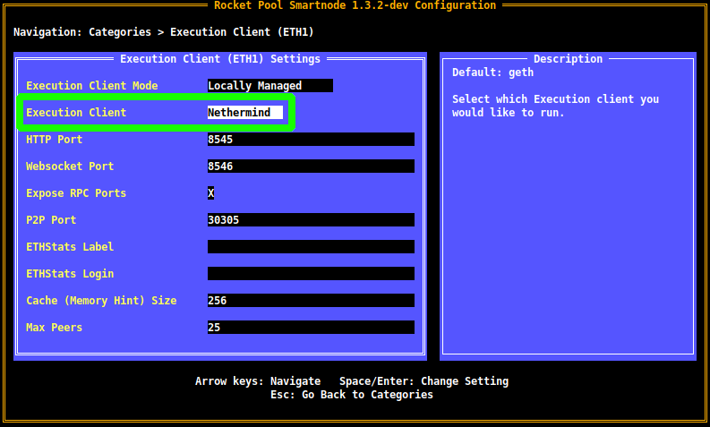
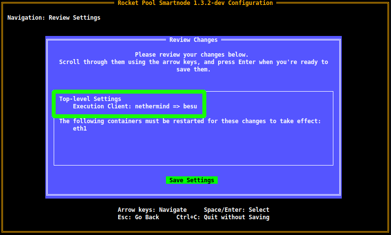
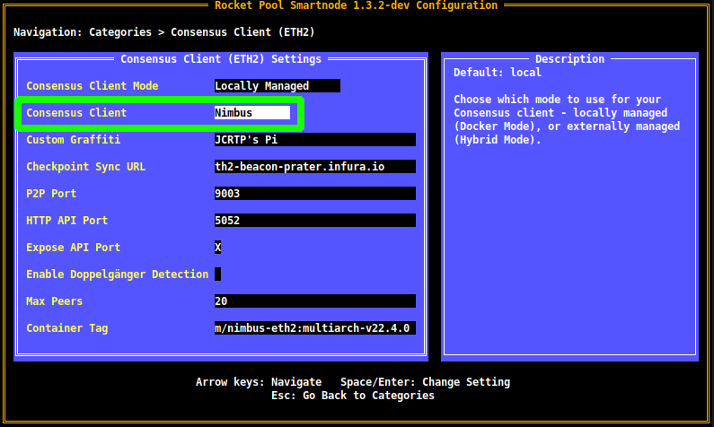
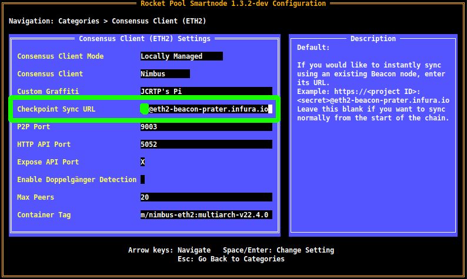
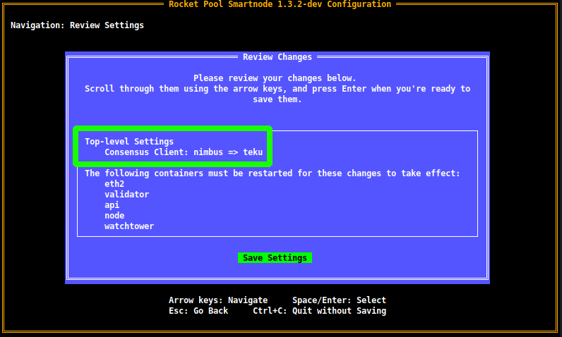

# [BETA] Changing Execution or Consensus Clients

::: danger NOTE
This content only applies to the `v1.3.2` beta of the Smartnode stack.
Mainnet operators using the latest release (`v1.3.1`) can use the [Changing Consensus Clients](#changing-consensus-clients) portion, but the [Changing Execution Clients](#changing-execution-clients) will not be applicable until v1.3.2 is released.
:::

Under normal circumstances, you will likely just select an Execution and Consensus client when you first create your Rocket Pool node and will let them happily run for the life of your Node.
However, there are a few situations where you may want to change your client selection.
Here are a few examples:

- Your client gains a [supermajority](https://clientdiversity.org/) share on the Execution or Beacon chains, and you want to change for the overall health of the network
- A bug causes your client to stop functioning correctly, and you need to get back online quickly to resume validation duties
- You want to try a new feature that a different client offers
- A different client is better suited to your node's hardware (e.g. some clients are better on ARM systems than others)

Luckily, the Smartnode stack makes changing clients extremely easy.
All it takes is a few changes in the Configuration TUI, and some optional extra commands to back up your existing client data before changing clients.


## Changing Execution Clients

Prior to changing your Execution client, it's worth noting the following points:

- Chain data **is not shared** between clients. Your new client will need to resync the Mainnet chain data, which can take some time (though each client supports snap sync, which the Smartnode uses to speed up resyncing).
- By default, the Smartnode will leave your old client's chain data on your drive in case you want to revert back to your old Execution client and pick up where you left off. You may want to **export it to a different location** and delete it to free up space prior to changing clients, since Execution clients can use hundreds of gigabytes. We have steps below on how to do this.
- While your new client is resyncing, most of the Smartnode CLI functions will be offline since they rely on the Execution client. **You should have a fallback Execution client available before doing this to mitigate the downtime on your Smartnode.**

::: warning NOTE
After the Execution and Beacon chains become unified later this year (known as The Merge), light clients such as **Pocket** and **Infura** can *no longer be used by validators*!
After The Merge, your only option for a fallback is to have a second full Execution client running on another machine (or in the cloud) that you own and trust.

The time between now and The Merge is an **excellent time** to switch to a client with a smaller market share for the health of the network, and use Pocket or Infura as a fallback Execution client while they're still available.
:::


### (Optional) Export your Execution Client's Database

The first step in the process is an optional one: if you like, you can export your existing chain data for your current Execution client.
This will let you free up valuable disk space on your node for your new Execution client, and you can keep the old chain data around in case you want to revert back to the old client and pick up where you left off.

To do this, start by **mounting the storage medium you want to export the data to**.
For example, this could be an external hard drive.

::: tip HINT
If you don't know how to mount external devices on Linux, it's easy!
Plug the device into your node, and follow [a guide like this](https://www.addictivetips.com/ubuntu-linux-tips/mount-external-hard-drives-in-linux/) to learn how to mount it.
:::

Once you have it mounted, note its mount path.
For this example, let's assume that we want to store the chain data in a folder called `/mnt/external-drive` which the external device is mounted to.
Replace this with your actual mount path wherever you see it below.

Now, run the following command:

```
rocketpool service export-eth1-data /mnt/external-drive
```

This will check that your target folder is reachable and has enough free space to store the chain data.
The output will look like this:

```
This will export your execution client's chain data to an external directory, such as a portable hard drive.
If your execution client is running, it will be shut down.
Once the export is complete, your execution client will restart automatically.

You have a fallback execution client configured (http://<some address>:8545).
Rocket Pool (and your consensus client) will use that while the main client is offline.

Chain data size:       26 GiB
Target dir free space: 287 GiB
Your target directory has enough space to store the chain data.

NOTE: Once started, this process *will not stop* until the export is complete - even if you exit the command with Ctrl+C.
Please do not exit until it finishes so you can watch its progress.

Are you sure you want to export your execution layer chain data? [y/n]
```

As you can see, the chain data is 26 GB (for the Prater testnet; the Ethereum mainnet will be an order of magnitude larger) and the external folder has 287 GiB free so exporting can continue.

When you're ready, enter `y` here and press `Enter`.
This will stop your Execution client and begin copying its chain data to your target folder.
You will see the progress of each individual file go past the screen as it runs.

::: warning NOTE
It's important that you *do not* exit the terminal while this is running.
If you do, the copy will continue to run in the background but you won't be able to follow its progress!
:::

Once it's finished, it will automatically restart your Execution client container.

**Note that your existing chain data is not deleted from your node after the export is complete!**

::: tip NOTE
If you have existing chain data for your new client and want to import it back into your node, simply run the same steps but use the following command instead:
```
rocketpool service import-eth1-data /mnt/external-drive
```
:::

### Change your Selected Execution Client

To change your selected client, run `rocketpool service config` to enter the configuration UI.
Navigate to the `Execution Client (ETH1)` section, and select the `Execution Client` dropdown:

<center>



</center>

Open the dropdown with `Enter`, use the arrow keys to navigate to your client of choice, and press `Enter` again to confirm the selection.

Note that each client has its own unique options, so you may see some additional settings appear in this screen after you select a different client.
Feel free to explore through them to see how they affect things.

When you're happy with your choice, press `Esc` to return to the main menu, then `Tab` to highlight the `Review Changes and Save` button.
You will be presented with the review screen, which will show your client selection change:

<center>



</center>

Press `Enter` to accept the changes, and you're done!
Your new Execution client will begin syncing immediately.
As usual, you can follow it with `rocketpool service logs eth1`.
**We recommend you do this to verify there are no errors, and that it works properly.**


### (Recommended) Remove your Old Chain Data

This is not a required step, but we **strongly recommend** you remove the chain data from your old client now that you've switched to a new one so you can free up disk space for it.

To do this, simply run the following command:

```
rocketpool service resync-eth1
```

This will delete all of your Execution client data and start it over.

::: tip TIP
Since you just selected a new Execution client, it won't be affected by this - essentially, all it will do is delete your old chain data.
You should do this as soon as possible after switching clients to prevent unnecessary loss of progress on your new client.
:::


## Changing Consensus Clients

Changing Consensus clients is even easier than Execution clients, thanks to [Checkpoint Sync](./config-docker.md#beacon-chain-checkpoint-syncing-with-infura).
This feature lets you immediately sync a new Consensus client with the network, so there's no need to preserve your old chain data.

::: warning WARNING
**Prysm** is currently in the process of adding support for Checkpoint Sync.
It will be enabled in a future version, and we do not recommend you change clients to Prysm until it supports Checkpoint Sync.
:::

Start by using the `rocketpool service config` UI and navigating to the `Consensus Client (ETH2)` section.
Next, select the `Consensus Client` dropdown:

<center>



</center>

Open the dropdown with `Enter`, use the arrow keys to navigate to your client of choice, and press `Enter` again to confirm the selection.

Note that each client has its own unique options, so you may see some additional settings appear in this screen after you select a different client.
Feel free to explore through them to see how they affect things.

Next, verify that you're using a Checkpoint Sync provider:

<center>



</center>

If you don't have a Checkpoint Sync provider configured, [you can easily use Infura to do it for free](./config-docker.md#beacon-chain-checkpoint-syncing-with-infura)!

::: tip NOTE
**This will work even after The Merge** - Checkpoint Syncing from Infura is *not* related to using Infura as an Execution client, and it will continue to be supported.
:::

When you're happy with your choice, press `Esc` to return to the main menu, then `Tab` to highlight the `Review Changes and Save` button.
You will be presented with the review screen, which will show your client selection change:

<center>



</center>

Press `Enter` to accept the changes, and you're done!
Your new Consensus client will begin syncing immediately.
As usual, you can follow it with `rocketpool service logs eth2`.
**We recommend you do this to verify there are no errors, and that it works properly.**