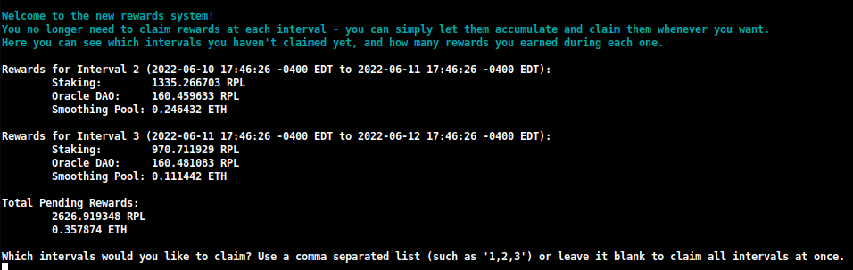
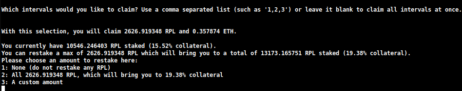
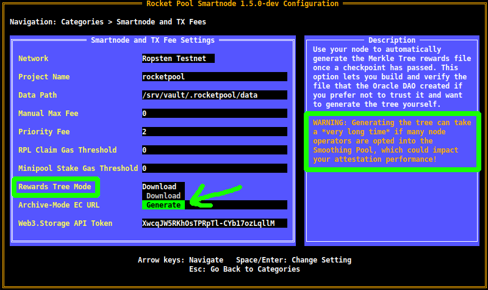

# Intro to the Command Line Interface

As a node operator, the CLI is your primary tool for interacting with Rocket Pool.
You will use it to create new minipools, check on the status of everything, claim periodic RPL rewards, exit and withdraw from your minipools when you're ready, and a host of other activities.

Once you've finished syncing the Execution (ETH1) and Beacon (ETH2) chains, all of the commands will be available for you to use.
In this section, we'll go over a brief tour of some of the more common ones and some other tricks that the CLI can do.


## Learning About the Commands

To list all of the available commands, type:

```
rocketpool help
```

The output will look like this:

```
NAME:
   rocketpool - Rocket Pool CLI

USAGE:
   rocketpool [global options] command [command options] [arguments...]

VERSION:
   1.5.0

AUTHORS:
   David Rugendyke <david@rocketpool.net>
   Jake Pospischil <jake@rocketpool.net>
   Joe Clapis <joe@rocketpool.net>
   Kane Wallmann <kane@rocketpool.net>

COMMANDS:
   auction, a   Manage Rocket Pool RPL auctions
   faucet, f    Access the legacy RPL faucet
   minipool, m  Manage the node's minipools
   network, e   Manage Rocket Pool network parameters
   node, n      Manage the node
   odao, o      Manage the Rocket Pool oracle DAO
   queue, q     Manage the Rocket Pool deposit queue
   service, s   Manage Rocket Pool service
   wallet, w    Manage the node wallet
   help, h      Shows a list of commands or help for one command

GLOBAL OPTIONS:
   --allow-root, -r              Allow rocketpool to be run as the root user
   --config-path path, -c path   Rocket Pool config asset path (default: "~/.rocketpool")
   --daemon-path path, -d path   Interact with a Rocket Pool service daemon at a path on the host OS, running outside of docker
   --maxFee value, -f value      The max fee (including the priority fee) you want a transaction to cost, in gwei (default: 0)
   --maxPrioFee value, -i value  The max priority fee you want a transaction to use, in gwei (default: 0)
   --gasLimit value, -l value    [DEPRECATED] Desired gas limit (default: 0)
   --nonce value                 Use this flag to explicitly specify the nonce that this transaction should use, so it can override an existing 'stuck' transaction
   --debug                       Enable debug printing of API commands
   --secure-session, -s          Some commands may print sensitive information to your terminal. Use this flag when nobody can see your screen to allow sensitive data to be printed without prompting
   --help, -h                    show help
   --version, -v                 print the version

COPYRIGHT:
   (c) 2021 Rocket Pool Pty Ltd
```

## Service Commands 
The service group involves managing the various services the smart node manages for you. 

Here is what the `rocketpool service help` output will show:

```
NAME:
   rocketpool service - Manage Rocket Pool service

USAGE:
   rocketpool service [global options] command [command options] [arguments...]

VERSION:
   1.5.0

COMMANDS:
   install, i                 Install the Rocket Pool service
   config, c                  Configure the Rocket Pool service
   status, u                  View the Rocket Pool service status
   start, s                   Start the Rocket Pool service
   pause, p                   Pause the Rocket Pool service
   stop, o                    Pause the Rocket Pool service (alias of 'rocketpool service pause')
   logs, l                    View the Rocket Pool service logs
   stats, a                   View the Rocket Pool service stats
   compose                    View the Rocket Pool service docker-compose config
   version, v                 View the Rocket Pool service version information
   prune-eth1, n              Shuts down the main ETH1 client and prunes its database, freeing up disk space, then restarts it when it's done.
   install-update-tracker, d  Install the update tracker that provides the available system update count to the metrics dashboard
   get-config-yaml            Generate YAML that shows the current configuration schema, including all of the parameters and their descriptions
   export-eth1-data           Exports the execution client (eth1) chain data to an external folder. Use this if you want to back up your chain data before switching execution clients.
   import-eth1-data           Imports execution client (eth1) chain data from an external folder. Use this if you want to restore the data from an execution client that you previously backed up.
   resync-eth1                Deletes the main ETH1 client's chain data and resyncs it from scratch. Only use this as a last resort!
   resync-eth2                Deletes the ETH2 client's chain data and resyncs it from scratch. Only use this as a last resort!
   terminate, t               Deletes all of the Rocket Pool Docker containers and volumes, including your ETH1 and ETH2 chain data and your Prometheus database (if metrics are enabled). Only use this if you are cleaning up the Smartnode and want to start over!

GLOBAL OPTIONS:
   --compose-file value, -f value  Optional compose files to override the standard Rocket Pool docker-compose.yml; this flag may be defined multiple times
   --help, -h                      show help

```
### `status`

This command shows you the current running status of each of the Docker containers managed by Rocket Pool.
For example, the default Docker install's output looks like this:

```
        Name                       Command              State                                                       Ports                                                     
------------------------------------------------------------------------------------------------------------------------------------------------------------------------------
rocketpool_api          /bin/sleep infinity             Up                                                                                                                    
rocketpool_eth1         sh /setup/start-node.sh         Up      0.0.0.0:30303->30303/tcp,:::30303->30303/tcp, 0.0.0.0:30303->30303/udp,:::30303->30303/udp, 8545/tcp, 8546/tcp
rocketpool_eth2         sh /setup/start-beacon.sh       Up      0.0.0.0:9001->9001/tcp,:::9001->9001/tcp, 0.0.0.0:9001->9001/udp,:::9001->9001/udp                            
rocketpool_node         /go/bin/rocketpool node         Up                                                                                                                    
rocketpool_validator    sh /setup/start-validator.sh    Up                                                                                                                    
rocketpool_watchtower   /go/bin/rocketpool watchtower   Up
```

You can use it to quickly check if any of the Docker containers are having trouble, or to make sure that a `start` or `stop` command worked correctly.


### `start` and `stop`

These two commands you are already familiar with.
They simply start all of the Rocket Pool containers, or stop them.

::: tip
The `pause` command does the same thing as `stop`.
It's just left over as a legacy command from earlier versions of Rocket Pool.
:::


### `logs`

This command is another one you should have already seen.
You can use it to look at the output logs of each Docker container.
This can be useful for troubleshooting or getting a more detailed status report from them.

If you simply do `rocketpool service logs` without any other arguments, it will aggregate all of the logs together and show them to you at once.

If you want to focus on one container's output, you can add an argument to the end to specify the container.
Valid values are `eth1`, `eth2`, `validator`, `api`, `node`, and `watchtower`.


### `stats`

This command shows you some resource stats from each of the containers, which you can use to profile each one's hardware and network consumption.

You might find it useful for monitoring the containers if your system starts running slow or has RAM problems.

Here is some example output:

```
CONTAINER ID   NAME                    CPU %     MEM USAGE / LIMIT     MEM %     NET I/O           BLOCK I/O         PIDS
62314e5a0ecf   rocketpool_api          0.00%     18.89MiB / 62.78GiB   0.03%     50.6kB / 31.1kB   57.4MB / 0B       1
ac629c08c896   rocketpool_eth1         5.44%     18.13GiB / 62.78GiB   28.88%    1.63GB / 1.66GB   24.4GB / 37.7GB   27
4dfc7a2e939b   rocketpool_eth2         97.39%    2.369GiB / 62.78GiB   3.77%     1.79GB / 45MB     333MB / 24.1GB    2
a3c22f54eff0   rocketpool_node         0.00%     12.13MiB / 62.78GiB   0.02%     308kB / 504kB     0B / 0B           15
0d5818868ef6   rocketpool_validator    0.00%     936KiB / 62.78GiB     0.00%     12.1kB / 0B       4.57MB / 0B       2
88bea525fa89   rocketpool_watchtower   0.00%     12.05MiB / 62.78GiB   0.02%     304kB / 503kB     0B / 0B           16
```

::: tip NOTE
The RAM statistic here shows **total allocated memory**, which includes *virtual* memory.
It does not show the raw *resident* memory consumption.

Similarly, the CPU usage shows the total amount of CPU consumption averaged over all of the CPU cores that the container uses.
Here, the CPU for ETH2 shows almost 100% because it is using Nimbus, which is single-threaded.

You may find that a program like `htop` offers better insight into actual resource consumption.
:::


### `config`

This command runs through the configuration interview again.
You can use it if you want to change your selection of Execution (ETH1) or Consensus (ETH2) client, or change some of the parameters that you initially specified when you selected them (such as your validator's graffiti message, the max number of peers to connect to, and so on).

You can call this command at any time, but the changes won't take effect until you call `rocketpool service stop` and `rocketpool service start`.


### `terminate`

This command will shut down the Docker containers, then delete them, delete the Rocket Pool virtual network, and delete the ETH1 and ETH2 chain data volumes.
It essentially removes all of the Rocket Pool items from your Docker setup.
Use it when you want to clean up that portion of the Rocket Pool installation.

::: warning
This will irreversibly remove your chain data, which means you'll need to sync ETH1 and ETH2 again.

This will **not** remove your wallet and password files, your configured settings, or your validator keys.
To remove those, you will need to delete the `~/.rocketpool/data` folder in Docker or Hybrid Mode, or the corresponding directory in Native Mode.
:::


## Node Commands

The `node` group involves operations on your Rocket Pool node.
We'll cover these more in-depth in the next section where we create a minipool, but it may be helpful to see them all at a glance.

Here is what the `rocketpool node help` output will show:

```
NAME:
   rocketpool node - Manage the node

USAGE:
   rocketpool node [global options] command [command options] [arguments...]

VERSION:
   1.5.0

COMMANDS:
   status, s                      Get the node's status
   sync, y                        Get the sync progress of the eth1 and eth2 clients
   register, r                    Register the node with Rocket Pool
   rewards, e                     Get the time and your expected RPL rewards of the next checkpoint
   set-withdrawal-address, w      Set the node's withdrawal address
   confirm-withdrawal-address, f  Confirm the node's pending withdrawal address if it has been set back to the node's address itself
   set-timezone, t                Set the node's timezone location
   swap-rpl, p                    Swap old RPL for new RPL
   stake-rpl, k                   Stake RPL against the node
   claim-rewards, c               Claim available RPL and ETH rewards for any checkpoint you haven't claimed yet
   withdraw-rpl, i                Withdraw RPL staked against the node
   deposit, d                     Make a deposit and create a minipool
   send, n                        Send ETH or tokens from the node account to an address
   set-voting-delegate, sv        Set the address you want to use when voting on Rocket Pool governance proposals, or the address you want to delegate your voting power to.
   clear-voting-delegate, cv      Remove the address you've set for voting on Rocket Pool governance proposals.
   initialize-fee-distributor, z  Create the fee distributor contract for your node, so you can withdraw priority fees and MEV rewards after the merge
   distribute-fees, b             Distribute the priority fee and MEV rewards from your fee distributor to your withdrawal address and the rETH contract (based on your node's average commission)
   join-smoothing-pool, js        Opt your node into the Smoothing Pool
   leave-smoothing-pool, ls       Leave the Smoothing Pool
   sign-message, sm               Sign an arbitrary message using the node wallet's private key

GLOBAL OPTIONS:
   --help, -h  show help
```

Below is a summary of some of the commands you'll tend to need during typical node operation.


### `status`

This command will give you a high-level view of your entire node at a glance.
It includes how much ETH and RPL you have staked, how many minipools you have and their statuses, your RPL collateral ratio, and more.

This is an example of what `rocketpool node status` shows once you have your node registered and some minipools set up:

```
=== Account and Balances ===
The node <node address> has a balance of 1.493392 ETH and 0.000000 RPL.
The node is registered with Rocket Pool with a timezone location of Etc/UTC.

=== Penalty Status ===
The node does not have any penalties for cheating with an invalid fee recipient.

=== DAO Voting ===
The node does not currently have a voting delegate set, and will not be able to vote on Rocket Pool governance proposals.

=== Withdrawal Address ===
The node's withdrawal address has not been changed, so rewards and withdrawals will be sent to the node itself.
Consider changing this to a cold wallet address that you control using the `set-withdrawal-address` command.

=== Fee Distributor and Smoothing Pool ===
The node's fee distributor <fee distributer contract address> has a balance of 0.000000 ETH.
The node is opted into the Smoothing Pool.

=== RPL Stake and Minipools ===
The node has a total stake of 600.000000 RPL and an effective stake of 600.000000 RPL, allowing it to run 5 minipool(s) in total.
This is currently a 54.65% collateral ratio.
The node must keep at least 109.788901 RPL staked to collateralize its minipools and claim RPL rewards.

The node has a total of 1 active minipool(s):
- 1 staking

```


### `sync`

This command will show you the current sync status of your Execution (ETH1) and Consensus (ETH2) clients.
You'll probably use it a lot when you first set the node up, then never need it again (unless you change or reset your clients).

The output of `rocketpool node sync` will look like this:

```
Your Smartnode is currently using the Prater Test Network.

Your eth1 client hasn't synced enough to determine if your eth1 and eth2 clients are on the same network.
To run this safety check, try again later when eth1 has made more sync progress.

Your primary execution client is still syncing (67.12%).
You do not have a fallback execution client enabled.
Your primary consensus client is still syncing (99.94%).
You do not have a fallback consensus client enabled.
```

Note that **Prysm** currently doesn't provide its completion percent - you'll need to look in the `eth2` logs if you use it.


### `stake-rpl`

This command is what you'll use when you want to add more RPL collateral to your node.
Doing so will increase your collateral ratio, which will increase your RPL rewards at each checkpoint (more on this later).
It may allow you to run more minipools or withdraw your rewards for the current checkpoint if your collateral is currently too low.

Unlike the other commands so far, this one is actually *interactive* because it will trigger a transaction - it isn't simply informational.

It will first ask you how much RPL you'd like to stake, with some pre-defined options for convenience or the ability to specify a custom amount:

```
Please choose an amount of RPL to stake:
1: The minimum minipool stake amount (284.477473 RPL)?
2: The maximum effective minipool stake amount (4267.162095 RPL)?
3: Your entire RPL balance (4820.395655 RPL)?
4: A custom amount
```

Once you select an option, you will be shown some information about the suggested gas price and estimated amount to be used, along with a confirmation dialog:

```
Please enter an amount of RPL to stake:
0.00001

Suggested gas price: 1.000000 Gwei
Estimated gas used: 69484 gas
Estimated gas cost: 0.000069 ETH

NOTE: This operation requires multiple transactions.
The actual gas cost may be higher than what is estimated here.
Are you sure you want to stake 0.000010 RPL? You will not be able to unstake this RPL until you exit your validators and close your minipools, or reach over 150% collateral!. [y/n]
```

If you confirm, you will be shown the transaction hash and given a link to [Etherscan](https://etherscan.io) so you can follow its progress:

```
Approving RPL for staking...
Transaction has been submitted with hash <transaction hash>.
You may follow its progress by visiting:
https://goerli.etherscan.io/tx/<transaction hash>

Waiting for the transaction to be mined... **DO NOT EXIT!** This transaction is one of several that must be completed.
```

Most operations only require one transaction, so the CLI will wait until it has been mined and then exit.
However, `stake-rpl` is one of the few commands that requires *two* transactions, so this dialog will appear twice.


### `deposit`

This command will let you deposit ETH and create a new minipool (a new ETH2 validator).
As with `stake-rpl`, this is an interactive command that will perform a transaction.

It will start by asking you how much you want to deposit to the new minipool:

```
Please choose an amount of ETH to deposit:
1: 32 ETH (minipool begins staking immediately)
2: 16 ETH (minipool begins staking after ETH is assigned)
```

(For more information on these options, see the next section on [Creating a Minipool](./create-validator.md)).

Once you select your deposit amount, it will prompt you for your choice of commission rate slippage:

```
The current network node commission rate that your minipool should receive is 20.000000%.
The suggested maximum commission rate slippage for your deposit transaction is 1.000000%.
This will result in your minipool receiving a minimum possible commission rate of 19.000000%.
Do you want to use the suggested maximum commission rate slippage? [y/n]
```

Again, this option will be described in more detail in the next section.

After that, you will be prompted with the expected gas cost for the transaction and one final confirmation dialog.
If you accept, your ETH deposit will be processed and you will create a new minipool (and a corresponding ETH2 validator).


### `claim-rewards`

When your node detects a new rewards checkpoint, it will automatically download the rewards tree file with the information for that interval (if you're using the default of Download Mode - see below for information on generating your own trees instead of downloading them).
You can then review your rewards using the following command:

```
rocketpool node claim-rewards
```

As intervals go by and you accumulate rewards, the output will look like this:

<center>



</center>

Here you can quickly see how many rewards you've earned at each interval, and can decide which ones you want to claim.

You can also specify an amount you want to restake during this claim:

<center>



</center>

This will let you compound your RPL rewards in one transaction, using substantially less gas than you currently needed to use with the legacy claim system.

::: danger WARNING
If you are below 10% RPL collateral *at the time of the snapshot*, you will not be eligible for rewards for that snapshot.
Unlike the current system, where you can simply "top off" before you claim in order to become eligible again, this will be locked in that snapshot forever and **you will never receive rewards for that period**.
You **must** be above 10% collateral at the time of a snapshot in order to receive rewards for that period.
:::

::: tip NOTE
If you prefer to build the rewards checkpoint manually instead of downloading the one created by the Oracle DAO, you can change this setting from `Download` to `Generate` in the TUI:

<center>



</center>

As the tip implies, you will need access to an Execution client archive node to do this.
If your local Execution client is not an archive node, you can specify a separate one (such as Infura or Alchemy) in the `Archive-Mode EC URL` box below it.
This URL will only be used when generating Merkle trees; it will not be used for validation duties.
:::


### `join-smoothing-pool`
```
rocketpool node join-smoothing-pool
```

This will record you as opted-in in the Rocket Pool contracts and automatically change your Validator Client's `fee recipient` from your node's distributor contract to the Smoothing Pool contract.

Note that once you opt in, there is a **28 day cooldown** (one full rewards interval length) until you can opt out.


### `leave-smoothing-pool`
```
rocketpool node leave-smoothing-pool
```

This will opt you out of the Smoothing Pool if you're currently opted in, and have waited at least 28 days after opting in.
Once **the next epoch after the current epoch** is finalized, it will automatically change your node's `fee recipient` from the Smoothing Pool back to your node's distributor contract.
This is to ensure you don't get penalized for front-running the exit process when you see that you have a proposal coming up.


### `initialize-fee-distributor`
To initialize your node's distributor, simply run this new command:

```
rocketpool node initialize-fee-distributor
```

::: warning NOTE
After the Redstone update, you must call this function before you can create any new minipools with `rocketpool node deposit`.
:::


### `distribute-fees`
When your distributor has been initialized, you can claim and distribute its entire balance using the following command:

```
rocketpool node distribute-fees
```

This will send your share of the rewards to your **withdrawal address**.


### `send`

This command lets you send ETH, RPL, or other Rocket Pool-related tokens from the node wallet to a different address.
This might be useful if you want to move your funds on the wallet elsewhere.

The syntax for using the `send` command is like this:

```
rocketpool node send <amount> <token> <address>
```

The arguments are as follows:

- `<amount>` is the amount of the token to send.
- `<token>` is the token to send - this can be `eth`, `rpl`, `fsrpl` (the old legacy RPL token), or `reth`.
- `<address>` is the Ethereum address to send the tokens to.

For example:

```
rocketpool node send 1 eth <my friend's address>
```

would send 1 ETH to my friend.


## Minipool Commands

The `minipool` group involves commands that affect your minipools.
As with the `node` group, we'll cover these more in-depth in the next section but it may be helpful to see them all now.

Here is what the `rocketpool minipool help` output will show:

```
NAME:
   rocketpool minipool - Manage the node's minipools

USAGE:
   rocketpool minipool [global options] command [command options] [arguments...]

VERSION:
   1.5.0

COMMANDS:
   status, s                   Get a list of the node's minipools
   stake, t                    Stake a minipool after the scrub check, moving it from prelaunch to staking.
   refund, r                   Refund ETH belonging to the node from minipools
   exit, e                     Exit staking minipools from the beacon chain
   delegate-upgrade, u         Upgrade a minipool's delegate contract to the latest version
   delegate-rollback, b        Roll a minipool's delegate contract back to its previous version
   set-use-latest-delegate, l  If enabled, the minipool will ignore its current delegate contract and always use whatever the latest delegate is
   find-vanity-address, v      Search for a custom vanity minipool address

GLOBAL OPTIONS:
   --help, -h  show help
```

Below is a summary of the commands that you'll typically use.


### `status`

This command simply provides a summary of each of your minipools.
This includes its current status, the eth1 address of the minipool, the commission on it (called the `node fee`), the public key of the corresponding ETH2 validator, and some other things:

```
$ rocketpool minipool status

1 Staking minipool(s):

--------------------

Address:              <minipool eth1 address>
Status updated:       2021-05-21, 14:05 +0000 UTC
Node fee:             20.000000%
Node deposit:         16.000000 ETH
RP ETH assigned:      2021-05-23, 13:32 +0000 UTC
RP deposit:           16.000000 ETH
Validator pubkey:     <validator eth2 address>
Validator index:      0
Validator seen:       yes
```


### `refund`

This command lets you pull 16 ETH back from a minipool if you deposited 32 ETH to create one, once Rocket Pool was able to contribute 16 ETH from the rETH staking pool.


### `exit`

This command submits a voluntary exit for your validator on the Beacon Chain.
Use this when you want to close a validator and withdraw its final ETH balance.
Note that **this cannot be undone** - once you trigger an exit, the validator will shut down permanently.


## Useful Flags

There are some useful global flags that you can add to some of the above commands, which you may want to take advantage of.


### Setting a Custom Max Fee or Priority Fee (Gas Price)

Starting with [the London ETH1 hardfork](https://coinquora.com/ethereum-london-hard-fork-all-you-need-to-know/) in July of 2021, Ethereum transactions no longer use a single gas price for their transactions.
Instead, modern Ethereum transactions use two values:

- The **max fee**, which describes the absolute maximum gas price you're willing to accept on a transaction
- The **max priority fee**, which describes the maximum amount you're willing to "tip" the miner for including your transaction in a block

::: tip TIP
The way these two values work can be a bit convoluted, so here are some simple examples.

Let's say the current network fee, called the **base fee**, is at 50 gwei.
You submit a transaction with an **80 gwei** max fee, and a priority fee of **2 gwei**.

Because the network's base fee is lower than your max fee, this transaction could get picked up in the current block.
It would cost you **50 gwei** for the base fee and **2 gwei** for the priority fee; even though you set your max fee to 80, **it would only cost you 52 gwei total**.

As another example, say you have that same transaction, but now the network's base fee is **100 gwei**.
Since 100 gwei is larger than your 80 gwei max fee, your transaction **will not** be included in this block.
Instead, it will simply sit in the transaction pool until the base fee is low enough to include it.

Now, let's say the current base fee is **50 gwei** again, and your transaction has a max fee of **80** gwei and a priority fee of **4 gwei**.
It would execute with a total cost of **54 gwei**.
The 4 gwei priority fee would ensure that it was included in front of all of the transactions with a lower priority fee.

If you **really** want the transaction to go through at all costs, you can set the priority fee to be the same as the max fee.
This emulates the legacy gas behavior, so your transaction will use all of the gas you give it - regardless of whether or not the network's base fee is lower than your max fee or not.
:::

By default, Rocket Pool will use an oracle to look at the current transaction pool and suggest a reasonable max fee for any transactions you trigger.
It uses [EtherChain](https://etherchain.org/tools/gasnow) for its primary suggestion oracle, and [Etherscan](https://etherscan.io/gastracker) as a backup.

If you prefer, you can set a custom max fee (in gwei) you'd be willing to pay with the `-f` flag.
You can also set a custom priority fee with the `-i` flag.

To do this, add them after `rocketpool` and before the other command information.

For example, calling `node set-timezone` with this flag would provide the following output:

```
$ rocketpool -f 10 node set-timezone

Would you like to detect your timezone automatically? [y/n]
n

Please enter a timezone to register with in the format 'Country/City':
Australia/Brisbane

You have chosen to register with the timezone 'Australia/Brisbane', is this correct? [y/n]
y

Using the requested max fee of 10.00 gwei (including a max priority fee of 2.00 gwei).
Total cost: 0.0005 to 0.0007 ETH
Are you sure you want to set your timezone? [y/n]
```

This shows that regardless of what max fee the network recoomends, it will use your custom max fee of 10 gwei (and priority fee if you specify it) instead when submitting this transaction.

::: warning NOTE
If you set a manual max fee, we strongly encourage you to use a third-party gas price oracle such as [EtherChain](https://etherchain.org/tools/gasnow) to determine if that fee is high enough for the current network conditions before submitting the transaction.
:::


### Canceling / Overwriting a Stuck Transaction

Sometimes, you might run into a scenario where you sent a transaction to the network but you used a gas price that is far too low for the network conditions, and it will take a prohibitively long time to execute.
Since all of your subsequent transactions will wait until that one goes through, that transaction essentially blocks all of the operations on your Rocket Pool node.
To deal with this situation, we've added a global flag that lets you "cancel" such a transaction by replacing it with something else.

Every Ethereum wallet, including your node wallet, sends transactions sequentially.
Each transaction you send has a number called a `nonce` that identifies where it lives in that sequence.
The very first transaction you send will have a `nonce` of 0, the next one you send will have a `nonce` of 1, and so on.

This overwriting technique involves sending a *new* transaction that uses the same `nonce` as your existing *stuck* transaction, but will ideally include a higher gas price than the stuck one.
This means that the new one will be mined first.
As soon as it's mined into a block, the old one will be discarded from the network as though it was never sent in the first place.

To use this flag, you first need to find the `nonce` of your stuck transaction:

1. Go to an ETH1 block explorer like [https://etherscan.io](https://etherscan.io).
1. Navigate to the address of your wallet, and look at the list of transactions.
1. Go through them, starting with the most recent, until you find the furthest one down the list that has the `Pending` state.
1. Mark the `nonce` of that transaction. That's what you'll need.

Once you have it, simply call any transaction with the CLI using the `--nonce <value> -i 2.2` flags after `rocketpool` and before the rest of the command.

::: warning NOTE
You **must** include the `-i` (priority fee) flag in order to overwrite a previous transaction.
This number must be at least 10% higher than whatever priority fee your old transaction used.
The Smartnode uses a priority fee of 2 gwei by default, so a value of `2.2` is usually sufficient for an override.

If your old transaction used a custom fee (say, 10 gwei), you will need to set it at least 10% higher in the overriding transaction (so in this example, 11 gwei).
:::

As an example, say I submitted a transaction with a `nonce` of 10 and a max fee of 20 gwei, but the current network fee is 100 gwei so my transaction is stuck.
To fix it, I will submit a transaction where I send a small amount of ETH from myself back to myself with a higher max fee (say, 150 gwei) and a higher priority fee.
I'll burn a little gas doing it, but it will unstick the broken transaction:

```
$ rocketpool --nonce 10 -f 150 -i 2.2 node send 0.0001 eth <node wallet address>

Using the requested max fee of 150.00 gwei (including a max priority fee of 2.20 gwei).
Total cost: 0.0032 to 0.0032 ETH
Are you sure you want to send 0.000100 eth to <node wallet address>? This action cannot be undone! [y/n]
```

The Smartnode stack will automatically check to make sure that the `nonce` you have provided is valid (it refers to a pending transaction) before sending it and wasting your gas accidentally.
If not, it will return an error message.
Otherwise, it will go through and provide you with the transaction details so you can monitor it to confirm that it did, in fact, overwrite your old stuck transaction.


That's it for the common CLI commands.
In the next section, we'll walk through how to create a minipool and start validating on the Beacon Chain.
