# Configuring the Smartnode Stack (Docker Mode)

::: danger WARNING
This documentation is currently out of date with the release of Smartnode v1.5.0.

It will be updated shortly.
:::

Running complete Execution layer (ETH1) and Consensus layer (ETH2) clients can be daunting; there are several options to choose from and each of them has a plethora of different settings.
Luckily, the Smartnode is designed to hide all of that complexity so it's quick and easy to configure, while still giving you the freedom to customize everything if you so desire.

In this section, we'll go over the various methods for configuring the Smartnode if you're using the **Docker-based setup** or a **Hybrid setup** where you connect to externally managed Execution or Consensus clients (e.g., clients you manage outside of the Smartnode for solo staking).

::: warning NOTE
If you're using Native mode without Docker, please visit the [Native configuration guide](config-native.md) instead. 
:::

There are three ways to configure it:

- Via the [Wizard UI](#configuring-via-the-wizard) - this is the easiest way. It only asks you a few basic question and uses well-tested defaults for the test. This will be what you are presented with when you run `rocketpool service config` for the first time.
- Via the [Settings Manager UI](#configuring-via-the-settings-manager) - this gives you access to all of the Smartnode's settings so you can customize everything as much as you want.
- Headlessly via the [Command Line](#configuring-via-the-command-line) - this is an option for people who run the Smartnode in a headless (non-interactive) environment and need to configure it automatically.

Choose which mode you'd like to learn more about from the list above, or simply scroll through each option below.


## Configuring via the Wizard

To start the configuration process, run the following command:

```
rocketpool service config
```

This will launch a terminal-based UI that will allow you to quickly and easily configure your node, as well as provide optional fine-grained control over every setting for advanced customization.

::: tip NOTE
If you've already configured the Smartnode, you will instead be greeted with the [Settings Manager](#configuring-the-smartnode-stack-via-the-settings-manager).
You can choose to re-open the Wizard from there if you prefer it, and all of your existing settings will be pre-selected for you.
:::

When you run the config UI for the first time (or if you choose to run the Wizard again later), you will be presented with a screen that looks like this:

<center>

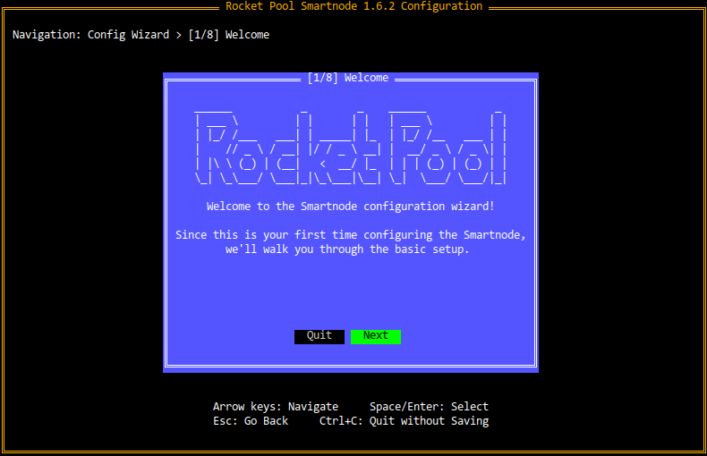

</center>

::: tip TIP
To use the Wizard, **press the `Arrow Keys` (up/down/left/right) to navigate between things such as buttons (choices) or text boxes**.
You can also use `Tab` and `Shift+Tab` if you prefer - it will do the same thing.

For buttons, **the one that's currently selected will be highlighted in green**.
The ones in black are not selected.
In the screenshot above, `Next` is currently selected and `Quit` is not.

**Press `Enter` or `Space` to select a button**, analogous to clicking on it with the mouse.

**Press `Escape` to go back to the previous dialog** if you changed your mind about something.
This will come in handy as you progress through the various Wizard pages.

**Hold `Ctrl` and press `C` at any time to exit the Wizard without saving anything**.

For example, on the screen above, you could press the `left` and `right` arrow keys to move between the `Next` and `Quit` buttons.

Pressing `Enter` while `Next` is selected will proceeed to the next screen.
Pressing `Enter` while `Quit` is selected will quit the Wizard without saving.
::: 

When you're ready to begin, press `Next`.


### Choosing a Network

In the next screen, you will be asked to choose which network you want to use:

<center>


</center>

You can highlight the different choices with the `Up` and `Down` arrow keys (or `Tab` and `Shift+Tab`).
When you change choices, the **Description** box on the right will show you a brief description of each option.
This is true for all choice-based pages in the Wizard, not just the network selection, so you will see this style of page frequently.

If you want to practice running a Rocket Pool node on the Prater test network with fake ETH and RPL you can get for free, select **Prater Testnet**.

If you're ready to create a real Rocket Pool node on Mainnet to earn real rewards, select **Mainnet**.


### Execution Client Setup

The next screen will ask you how you would like to manage your Execution Client:

<center>

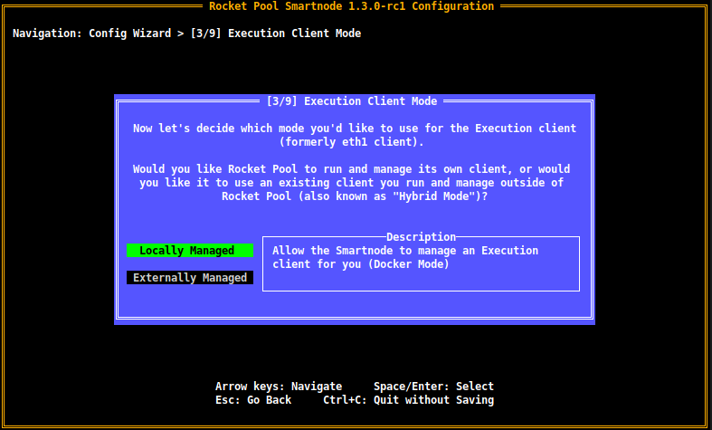

</center>

There are two options here.

**Locally Managed** (formerly called **"Docker Mode"**) is the default choice.
Use it if you don't already have an Execution client and you want the Smartnode to manage one for you.
By choosing this, the Smartnode will add an Execution client as a Docker container to its stack that it can control.
Don't worry, you'll get to choose *which* client you want to run next.

**Externally Managed** (formerly called **"Hybrid Mode"**) is a convenient choice for users that already have an Execution client running elsewhere that they manage manually.
By choosing this, the Smartnode will simply connect to your existing client and will not run one of its own.
For example, users can use this to plug into an Execution client that they currently use for solo staking; that way, they don't need to have two separate copies of an Execution client.

:::warning NOTE
As the Smartnode cannot manage external Execution clients, you will still be responsible for regularly updating yours and diagnosing any issues it may encounter (as you currently do with it today).
:::

Choose which mode you'd like to use for managing your Execution client and follow the steps in the corresponding tab below:

:::::::: tabs
::::::: tab Locally Managed

If you want the Smartnode to manage an Execution client for you, the next screen will ask you to pick a client:

<center>

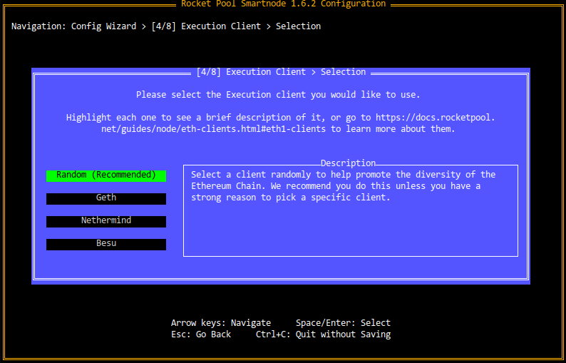

</center>

Please refer to the [Choosing your ETH clients](./eth-clients.md#eth1-clients) section for a description of each option.
Once you've made your choice, click on the appropriate tab below to learn how to configure it:

:::::: tabs
::::: tab Geth

If you choose **Geth**, the Wizard will handle all of the configuration for you.
You can manually adjust some of its parameters at the end of this process, but the defaults that it uses are completely appropriate for node operation.
You can proceed to the next section.


::: warning NOTE
To make sure your Execution client can sync quickly, you may want to **open up the P2P port in your router's port forwarding setup**.
Configure it to forward **port 30303** on both TCP and UDP to your machine's local IP address.
This way, other Execution clients can discover it and communicate with it from the outside.

Each router has a different way of doing this, so **you'll need to check out your router's manual on how to set up port forwarding**.
:::

:::::
::::: tab Infura

If you choose **Infura**, you will be presented with a follow-on screen asking you to enter your Project ID:

<center>


</center>

When you created an Infura account and an `Ethereum` project for it, it will be assigned a unique project ID which is a 32-character hexadecimal string.
Note this is the **Project ID**, *not* the **Secret ID**.
Enter the **Project ID** here, and press `Next`.

:::::
::::: tab Pocket

If you choose **Pocket**, the Wizard will handle all of the configuration for you.
You can manually adjust some of its parameters at the end of this process, but the defaults that it uses are completely appropriate for node operation.
You can proceed to the next section.

:::::
::::::
:::::::
::::::: tab Externally Managed

For an externally managed Execution client, the next screen will prompt you for the URLs of its HTTP-based RPC (web3) API and its Websocket-based RPC API:

<center>

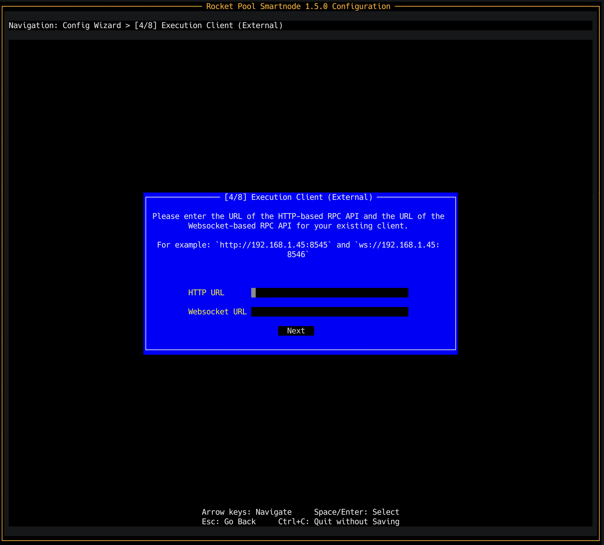

</center>

The Smartnode will use the HTTP URL to communicate with it and perform blockchain activities, such as querying the chain's state and submitting transactions.
**If you don't already have your client's API port enabled and accessible from your Smartnode machine, you will need to set it up now.**
Instructions on this vary from client to client; consult your client's documentation to learn how to set up the HTTP RPC endpoint.

The Websocket URL is only relevant if you are using **Nimbus** as your Consensus client.
If you are using a different client, you can leave it blank.
Otherwise, enter it here.

::: warning NOTE
Because the Smartnode will run in its own Docker container, it will use Docker's internal network.
You won't be able to use hostnames like `localhost` or `127.0.0.1` here; if your Execution client is running on the same machine as the Smartnode, you will need to provide the machine's LAN IP address instead. 
:::

:::::::
::::::::

And with that, your Execution client is all set!


### Fallback Execution Client Setup

The next thing to configure is an optional **fallback** Execution client:

<center>

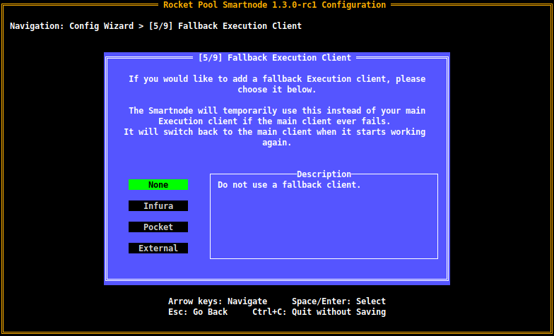

</center>

Think of this like a "spare" Execution client your node can use in case the primary one you selected in the previous step ever goes down for maintenance (which will almost certainly happen at some point).

Choose **None** if you don't want to use a fallback client.
This isn't recommended, but you have the option if you have a reason not to use one.

**Infura** and **Pocket** behave the same way here as they do in regular Execution client operation; they will just stay idle until your primary Execution client fails, at which point they will take over until it's online again.
*Note that if you selected one of these for your primary Execution client earlier, you should choose a different one for your fallback Execution client.*

**External** a good choice if you already have a secondary Execution client that you maintain yourself elsewhere (such as on a second machine, outside of the Smartnode stack) and want to use that as your fallback client.
If this is selected, the Smartnode will simply switch to that if your primary client fails until it resumes operation.

To learn more about configuring these options, click on the appropriate tab below:

:::::: tabs
::::: tab Infura

If you choose **Infura**, you will be presented with a follow-on screen asking you to enter your Project ID:

<center>

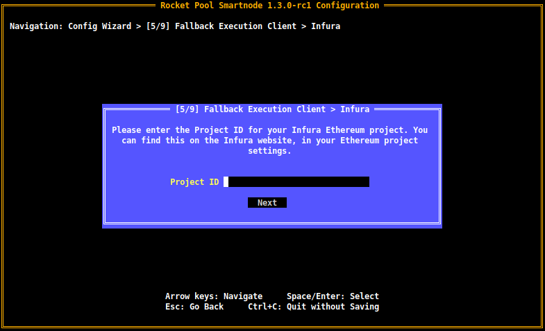

</center>

When you created an Infura account and an `Ethereum` project for it, it will be assigned a unique project ID which is a 32-character hexadecimal string.
Note this is the **Project ID**, *not* the **Secret ID**.
Enter the **Project ID** here, and press `Next`.

:::::
::::: tab Pocket

If you choose **Pocket**, the Wizard will handle all of the configuration for you.
You can manually adjust some of its parameters at the end of this process, but the defaults that it uses are completely appropriate for node operation.
You can proceed to the next section.

:::::
::::: tab External

For an externally managed fallback Execution client, the next screen will prompt you for the URLs of its HTTP-based RPC (web3) API and its Websocket-based RPC API:

<center>

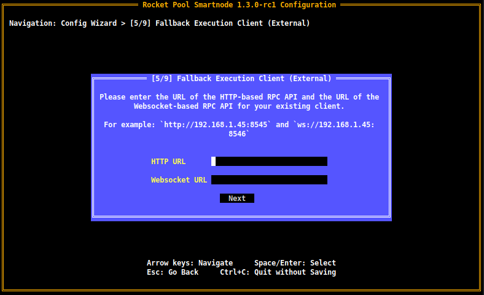

</center>

The Smartnode will use the HTTP URL to communicate with it and perform blockchain activities, such as querying the chain's state and submitting transactions.
**If you don't already have your client's API port enabled and accessible from your Smartnode machine, you will need to set it up now.**
Instructions on this vary from client to client; consult your client's documentation to learn how to set up the HTTP RPC endpoint.

The Websocket URL is only relevant if you are using **Nimbus** as your Consensus client.
If you are using a different client, you can leave it blank.
Otherwise, enter it here.

::: warning NOTE
Because the Smartnode will run in its own Docker container, it will use Docker's internal network.
You won't be able to use hostnames like `localhost` or `127.0.0.1` here; if your fallback Execution client is running on the same machine as the Smartnode, you will need to provide the machine's LAN IP address instead. 
:::

:::::
::::::

When you're happy with your fallback Execution client choices, proceed to the next step.


### Consensus Client Setup

Now that you have an Execution and optional fallback Execution client ready, the next task is to set up the Consensus client.
The first thing to do is determine which management mode you'd like to use for it, just like you did for the Execution client earlier:

<center>

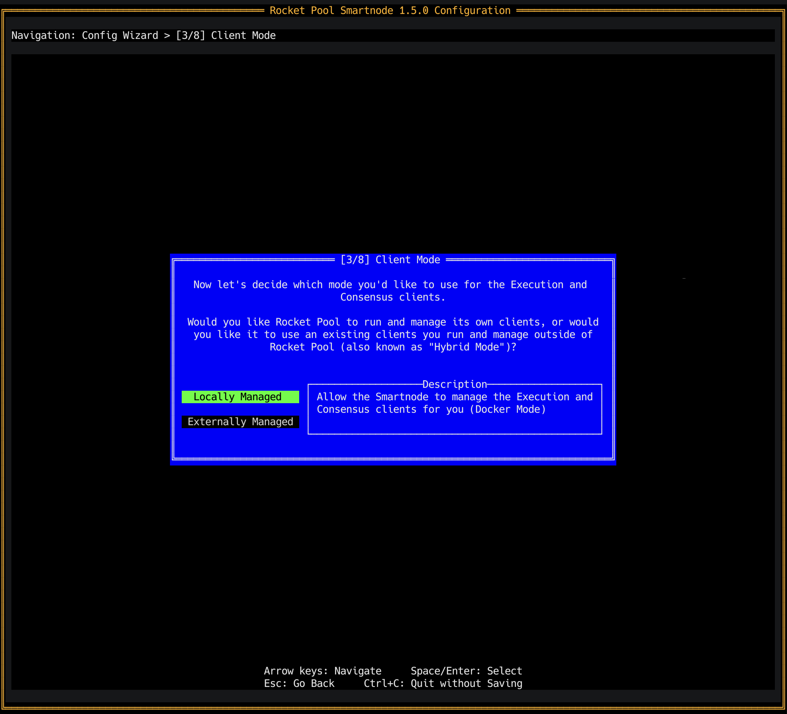

</center>

As with the Execution client management mode, there are two options here.

**Locally Managed** (formerly called **"Docker Mode"**) is the default choice.
Use it if you don't already have a Consensus client and you want the Smartnode to manage one for you.
By choosing this, the Smartnode will add both a **Beacon Node** (the process used to communicate with the Beacon Chain) and a **Validator Client** (the process used by minipools to validate on the Beacon Chain and earn rewards) as Docker containers that it can control to its stack.
Don't worry, you'll get to choose *which* client you want to run next.

**Externally Managed** (formerly called **"Hybrid Mode"**) is a convenient choice for users that already have a Consensus client running elsewhere that they manage manually.
By choosing this, the Smartnode will simply connect to your existing Beacon Node and will not run one of its own.
However, it *will* run its own Validator Client so it can manage its own validator keys.

For example, users can use this to plug into a Beacon Node that they currently use for solo staking; that way, they don't need to have two separate copies of a Beacon Node.

:::warning NOTE
As the Smartnode cannot manage external Consensus clients, you will still be responsible for regularly updating yours and diagnosing any issues it may encounter (as you currently do with it today).
:::

Choose which mode you'd like to use for managing your Consensus client and follow the steps in the corresponding tab below:

::::::: tabs
:::::: tab Locally Managed

If you want the Smartnode to manage a Consensus client for you, the next screen will ask you to pick a client:

<center>

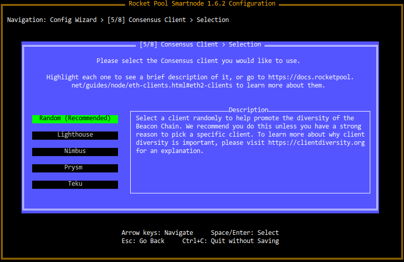

</center>

**The preferred choice** for the overall health and diversity of the network is the **Random (Recommended)** choice, which will randomly choose among one of the four supported Consensus clients for you.

If you would prefer to choose an explicit client (for example, if you're on a Raspberry Pi and know you want to use Nimbus), please refer to the [Choosing your ETH clients](./eth-clients.md#eth2-clients) section for a description of each option so you can make an educated decision.

:::warning NOTE
There are two conditions that will prompt you with warnings based on client selection:

- The selected client is currently [a supermajority client](https://clientdiversity.org/), meaning that an unhealthy majority of validators on the Beacon Chain use it which threatens the stability of the network

- The selected client is **too resource-heavy** for the hardware you're currently using

If either of those cases are true for your chosen client, you will be warned and asked to choose a different client.
You have the option of continuing to use the one you selected, but you must be aware of the risks in doing so.
:::

Once you've made your choice or have been assigned a random client, click on the appropriate tab below to learn how to configure it:

:::: tabs
::: tab Lighthouse

The first option in Lighthouse's configuration will ask about your validator's **graffiti** message:

<center>

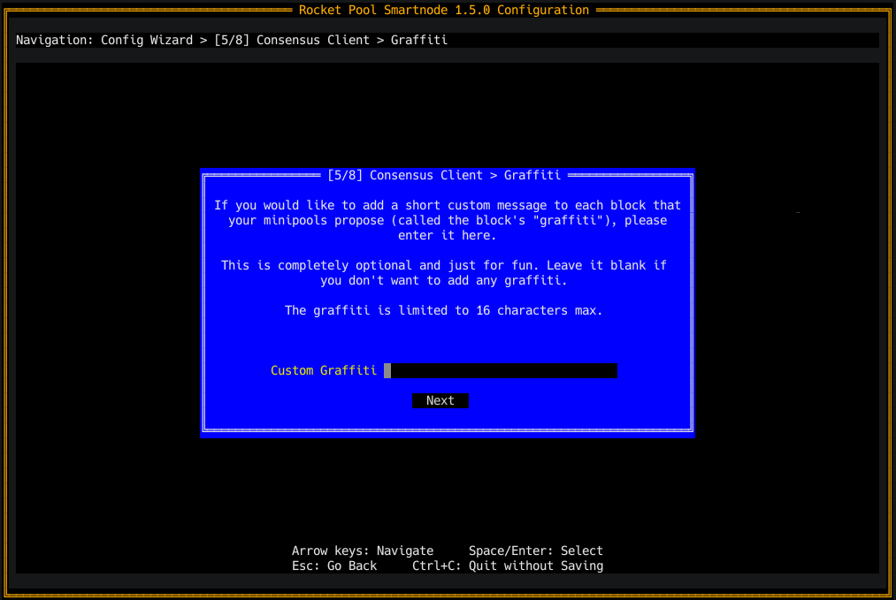

</center>

This is an optional custom message you can attach to any blocks you propose on the Beacon Chain.
The message will be preserved forever, so think of it like a fun little way to leave your mark!

**Note the maximum length of the graffiti is 16 characters.**

If you'd like to see some examples of what validators are using for Graffiti today, [take a look here](https://beaconcha.in/blocks).

Next up is an option to enable or disable **Checkpoint Sync**:

<center>

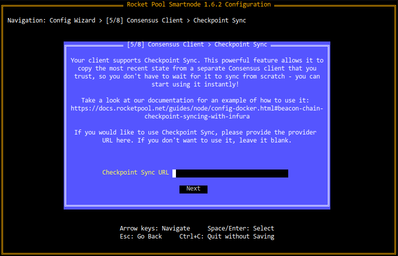

</center>

Lighthouse has the ability to instantly sync to the latest block on the Beacon Chain network by connecting to an existing Beacon Node that you trust.
This is preferred over conventional syncing because it doesn't require any time (whereas conventional syncing can take days) and comes with some security benefits.
Take a look at [their documentation on checkpoint syncing](https://lighthouse-book.sigmaprime.io/checkpoint-sync.html) for more information if you are curious.

You can enter the URL of any Beacon Node that provides access to its REST API here.
One popular option is Infura, which offers this service for free (though it requires you to create an account).

See [the section below on Checkpoint Syncing](#beacon-chain-checkpoint-syncing-with-infura) if you'd like to use it.

The final question will ask if you want to enable Doppelgänger Protection:

<center>

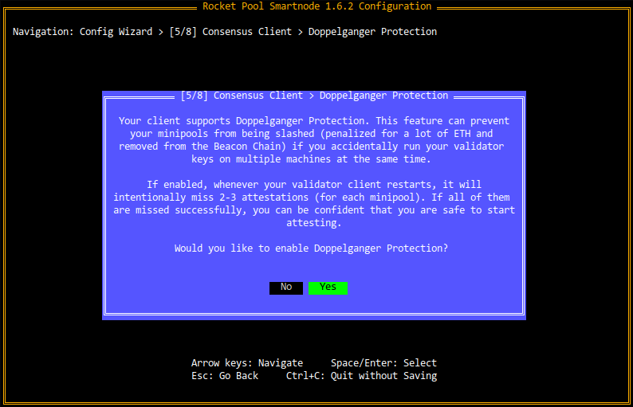

</center>

Lighthouse supports a feature called [Doppelgänger Detection](https://lighthouse-book.sigmaprime.io/validator-doppelganger.html).
In a nutshell, this feature will **intentionally** miss a few attestations after Lighthouse's Validator Client restarts; while doing this, it will listen to see if attestations are still being sent to the network using your validator keys.

Ideally, there would not be any attestations (which means no other machine is running with your validator keys attached).
After its short waiting period, Lighthouse would start validating normally.

*However*, if there *is* another machine running with your validator keys attached, then Lighthouse will immediately shut down and issue an error message in its log files.
The reason for this is that if it were to start attesting as well, then you would start **double attesting** which is a **slashable offense**.
When slashed, your validator would be forcibly exited from the Beacon chain and you would be penalized a significant amount of ETH.

Most of the time, doppelgänger detection will result in nothing but a few missed attestations after a client restart.
In situations where you are moving your validator to a new machine or you are changing to a new Beacon client, however, **doppelgänger detection can prevent you from being slashed by double attesting accidentally**.

Think of it as cheap insurance for your minipools; you'll miss a trivial bit of profit every time you restart, but you can be fairly confident that you won't accidentally run your keys in two places and get slashed for it.

:::
::: tab Nimbus

The first option in Nimbus's configuration will ask about your validator's **graffiti** message:

<center>


</center>

This is an optional custom message you can attach to any blocks you propose on the Beacon Chain.
The message will be preserved forever, so think of it like a fun little way to leave your mark!

**Note the maximum length of the graffiti is 16 characters.**

If you'd like to see some examples of what validators are using for Graffiti today, [take a look here](https://beaconcha.in/blocks).

Next up is an option to enable or disable **Checkpoint Sync**:

<center>


</center>

Nimbus has the ability to instantly sync to the latest block on the Beacon Chain network by connecting to an existing Beacon Node that you trust.
This is preferred over conventional syncing because it doesn't require any time (whereas conventional syncing can take days) and comes with some security benefits.
Take a look at [their documentation on checkpoint syncing](https://nimbus.guide/trusted-node-sync.html) for more information if you are curious.

You can enter the URL of any Beacon Node that provides access to its REST API here.
One popular option is Infura, which offers this service for free (though it requires you to create an account).

See [the section below on Checkpoint Syncing](#beacon-chain-checkpoint-syncing-with-infura) if you'd like to use it.

The final question will ask if you want to enable Doppelgänger Protection:

<center>


</center>

Nimbus supports a feature called [Doppelgänger Protection](https://nimbus.guide/faq.html#why-does-my-validator-miss-two-epochs-of-attestations-after-restarting).
In a nutshell, this feature will **intentionally** miss a few attestations after Nimbus restarts; while doing this, it will listen to see if attestations are still being sent to the network using your validator keys.

Ideally, there would not be any attestations (which means no other machine is running with your validator keys attached).
After its short waiting period, Nimbus would start validating normally.

*However*, if there *is* another machine running with your validator keys attached, then Nimbus will immediately shut down and issue an error message in its log files.
The reason for this is that if it were to start attesting as well, then you would start **double attesting** which is a **slashable offense**.
When slashed, your validator would be forcibly exited from the Beacon chain and you would be penalized a significant amount of ETH.

Most of the time, doppelgänger detection will result in nothing but a few missed attestations after a client restart.
In situations where you are moving your validator to a new machine or you are changing to a new Beacon client, however, **doppelgänger detection can prevent you from being slashed by double attesting accidentally**.

Think of it as cheap insurance for your minipools; you'll miss a trivial bit of profit every time you restart, but you can be fairly confident that you won't accidentally run your keys in two places and get slashed for it.

:::
::: tab Prysm

The first option in Prysm's configuration will ask about your validator's **graffiti** message:

<center>


</center>

This is an optional custom message you can attach to any blocks you propose on the Beacon Chain.
The message will be preserved forever, so think of it like a fun little way to leave your mark!

**Note the maximum length of the graffiti is 16 characters.**

If you'd like to see some examples of what validators are using for Graffiti today, [take a look here](https://beaconcha.in/blocks).

The final question will ask if you want to enable Doppelgänger Protection:

<center>


</center>

Prysm supports a feature called Doppelgänger Protection.
In a nutshell, this feature will **intentionally** miss a few attestations after Prysm's Validator Client restarts; while doing this, it will listen to see if attestations are still being sent to the network using your validator keys.

Ideally, there would not be any attestations (which means no other machine is running with your validator keys attached).
After its short waiting period, Prysm would start validating normally.

*However*, if there *is* another machine running with your validator keys attached, then Prysm will immediately shut down and issue an error message in its log files.
The reason for this is that if it were to start attesting as well, then you would start **double attesting** which is a **slashable offense**.
When slashed, your validator would be forcibly exited from the Beacon chain and you would be penalized a significant amount of ETH.

Most of the time, doppelgänger detection will result in nothing but a few missed attestations after a client restart.
In situations where you are moving your validator to a new machine or you are changing to a new Beacon client, however, **doppelgänger detection can prevent you from being slashed by double attesting accidentally**.

Think of it as cheap insurance for your minipools; you'll miss a trivial bit of profit every time you restart, but you can be fairly confident that you won't accidentally run your keys in two places and get slashed for it.

:::
::: tab Teku

The first option in Teku's configuration will ask about your validator's **graffiti** message:

<center>


</center>

This is an optional custom message you can attach to any blocks you propose on the Beacon Chain.
The message will be preserved forever, so think of it like a fun little way to leave your mark!

**Note the maximum length of the graffiti is 16 characters.**

If you'd like to see some examples of what validators are using for Graffiti today, [take a look here](https://beaconcha.in/blocks).

The final question is an option to enable or disable **Checkpoint Sync**:

<center>


</center>

Teku has the ability to instantly sync to the latest block on the Beacon Chain network by connecting to an existing Beacon Node that you trust.
This is preferred over conventional syncing because it doesn't require any time (whereas conventional syncing can take days) and comes with some security benefits.
Take a look at [their documentation on checkpoint syncing](https://docs.teku.consensys.net/en/latest/HowTo/Get-Started/Checkpoint-Start/) for more information if you are curious.

You can enter the URL of any Beacon Node that provides access to its REST API here.
One popular option is Infura, which offers this service for free (though it requires you to create an account).

See [the section below on Checkpoint Syncing](#beacon-chain-checkpoint-syncing-with-infura) if you'd like to use it.

:::
::::

::: warning NOTE
To make sure your Consensus client can sync quickly, you may want to **open up the P2P port in your router's port forwarding setup**.
Configure it to forward **port 9001** on both TCP and UDP to your machine's local IP address.
This way, other Consensus clients can discover it and communicate with it from the outside.

Each router has a different way of doing this, so **you'll need to check out your router's manual on how to set up port forwarding**.
:::

::::::
:::::: tab Externally Managed

Because each Consensus client has slightly different behavior, the Smartnode needs to know which one you're using externally so it can adapt its own behavior accordingly.
Start by choosing which client you have from the list in the next screen:

<center>

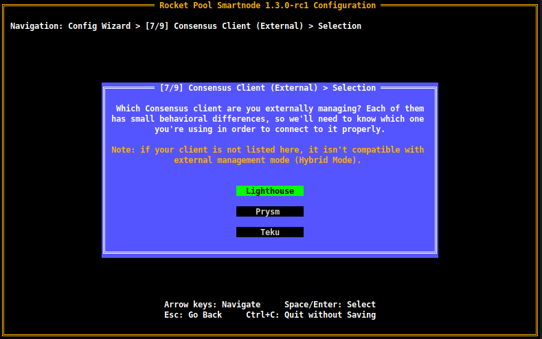

</center>

::: warning NOTE
At this time, **Nimbus** is not compatible with External mode because it cannot run as a standalone Validator Container (VC) yet.
When the client supports this feature, it will be added to the list here.
:::

Select your client from the tabs below to learn how to finish configuring it.

::::: tabs
:::: tab Lighthouse

Start by specifying the URL for your Lighthouse Beacon Node's API:

<center>

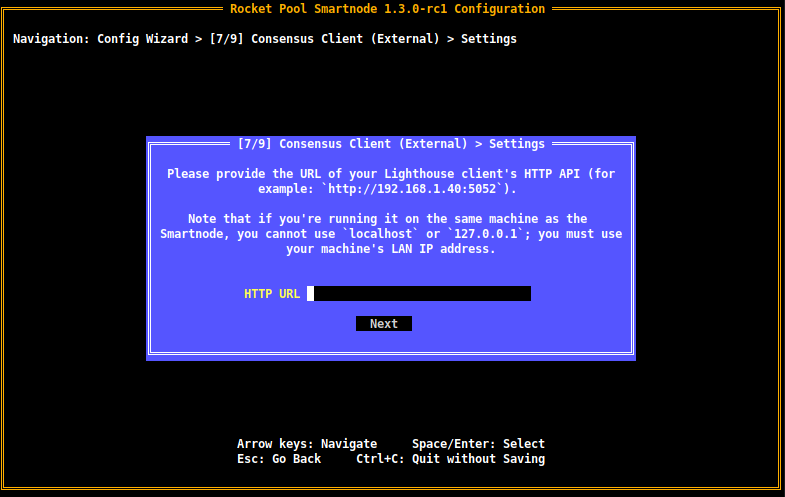

</center>

The Smartnode will use the HTTP URL to communicate with it and perform blockchain activities, such as querying the chain's state and submitting messages.
**If you don't already have the API port enabled and accessible from your Smartnode machine, you will need to set it up now.**
See [Lighthouse's documentation](https://lighthouse-book.sigmaprime.io/api-bn.html) for instructions on how to do this.

::: warning NOTE
Because the Smartnode will run in its own Docker container, it will use Docker's internal network.
You won't be able to use hostnames like `localhost` or `127.0.0.1` here; if your client is running on the same machine as the Smartnode, you will need to provide the machine's LAN IP address instead. 
:::

Next, it will ask about your validator's **graffiti** message:

<center>

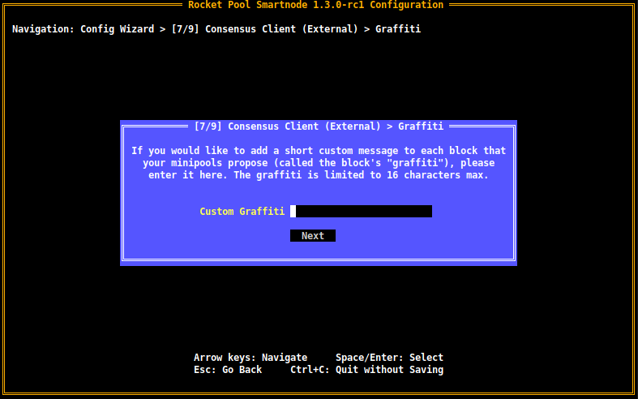

</center>

This is an optional custom message you can attach to any blocks you propose on the Beacon Chain.
The message will be preserved forever, so think of it like a fun little way to leave your mark!

**Note the maximum length of the graffiti is 16 characters.**

If you'd like to see some examples of what validators are using for Graffiti today, [take a look here](https://beaconcha.in/blocks).

The final question will ask if you want to enable Doppelgänger Protection:

<center>

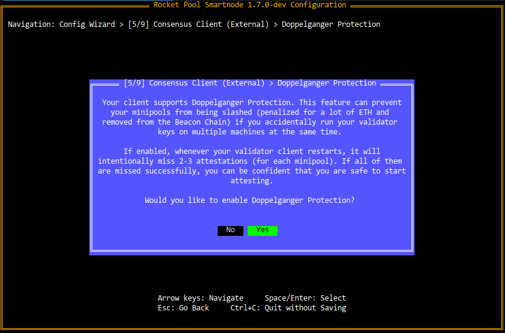

</center>

Lighthouse supports a feature called [Doppelgänger Detection](https://lighthouse-book.sigmaprime.io/validator-doppelganger.html).
In a nutshell, this feature will **intentionally** miss a few attestations after Lighthouse's Validator Client restarts; while doing this, it will listen to see if attestations are still being sent to the network using your validator keys.

Ideally, there would not be any attestations (which means no other machine is running with your validator keys attached).
After its short waiting period, Lighthouse would start validating normally.

*However*, if there *is* another machine running with your validator keys attached, then Lighthouse will immediately shut down and issue an error message in its log files.
The reason for this is that if it were to start attesting as well, then you would start **double attesting** which is a **slashable offense**.
When slashed, your validator would be forcibly exited from the Beacon chain and you would be penalized a significant amount of ETH.

Most of the time, doppelgänger detection will result in nothing but a few missed attestations after a client restart.
In situations where you are moving your validator to a new machine or you are changing to a new Beacon client, however, **doppelgänger detection can prevent you from being slashed by double attesting accidentally**.

Think of it as cheap insurance for your minipools; you'll miss a trivial bit of profit every time you restart, but you can be fairly confident that you won't accidentally run your keys in two places and get slashed for it.

::::
:::: tab Prysm

Start by specifying the URL for your Prysm Beacon Node's API and the URL for its JSON-RPC API:

<center>


</center>

The Smartnode will use the HTTP URL to communicate with it and perform blockchain activities, such as querying the chain's state and submitting messages.
It will prepare its Prysm Validator Client with the JSON-RPC URL so it can communicate with your Beacon Node, as *Prysm's Validator Client currently cannot work over the HTTP API.*

**If you don't already have the API ports enabled and accessible from your Smartnode machine, you will need to set them up now.**
See [Prysm's documentation](https://docs.prylabs.network/docs/prysm-usage/parameters) for instructions on how to do this.
**You will need the `grpc-gateway` *and* the `rpc-host` enabled.**

::: warning NOTE
Because the Smartnode will run in its own Docker container, it will use Docker's internal network.
You won't be able to use hostnames like `localhost` or `127.0.0.1` here; if your client is running on the same machine as the Smartnode, you will need to provide the machine's LAN IP address instead. 
:::

Next, it will ask about your validator's **graffiti** message:

<center>


</center>

This is an optional custom message you can attach to any blocks you propose on the Beacon Chain.
The message will be preserved forever, so think of it like a fun little way to leave your mark!

**Note the maximum length of the graffiti is 16 characters.**

If you'd like to see some examples of what validators are using for Graffiti today, [take a look here](https://beaconcha.in/blocks).

The final question will ask if you want to enable Doppelgänger Protection:

<center>


</center>

Prysm supports a feature called Doppelgänger Protection.
In a nutshell, this feature will **intentionally** miss a few attestations after Prysm's Validator Client restarts; while doing this, it will listen to see if attestations are still being sent to the network using your validator keys.

Ideally, there would not be any attestations (which means no other machine is running with your validator keys attached).
After its short waiting period, Prysm would start validating normally.

*However*, if there *is* another machine running with your validator keys attached, then Prysm will immediately shut down and issue an error message in its log files.
The reason for this is that if it were to start attesting as well, then you would start **double attesting** which is a **slashable offense**.
When slashed, your validator would be forcibly exited from the Beacon chain and you would be penalized a significant amount of ETH.

Most of the time, doppelgänger detection will result in nothing but a few missed attestations after a client restart.
In situations where you are moving your validator to a new machine or you are changing to a new Beacon client, however, **doppelgänger detection can prevent you from being slashed by double attesting accidentally**.

Think of it as cheap insurance for your minipools; you'll miss a trivial bit of profit every time you restart, but you can be fairly confident that you won't accidentally run your keys in two places and get slashed for it.

::::
:::: tab Teku

Start by specifying the URL for your Teku Beacon Node's API:

<center>

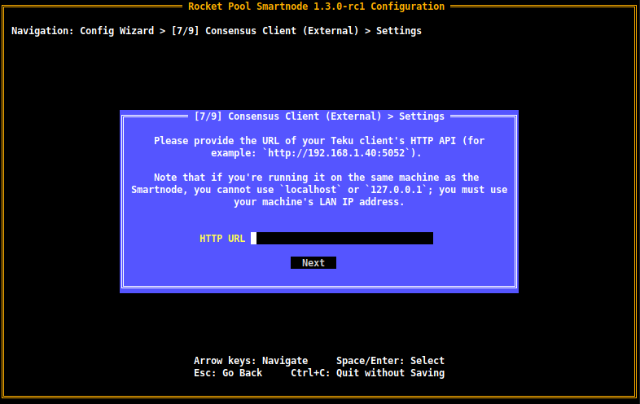

</center>

The Smartnode will use the HTTP URL to communicate with it and perform blockchain activities, such as querying the chain's state and submitting messages.
**If you don't already have the API port enabled and accessible from your Smartnode machine, you will need to set it up now.**
See [Teku's documentation](https://docs.teku.consensys.net/en/latest/Reference/CLI/CLI-Syntax/#rest-api-enabled) for instructions on how to do this.

::: warning NOTE
Because the Smartnode will run in its own Docker container, it will use Docker's internal network.
You won't be able to use hostnames like `localhost` or `127.0.0.1` here; if your client is running on the same machine as the Smartnode, you will need to provide the machine's LAN IP address instead. 
:::

Next, it will ask about your validator's **graffiti** message:

<center>


</center>

This is an optional custom message you can attach to any blocks you propose on the Beacon Chain.
The message will be preserved forever, so think of it like a fun little way to leave your mark!

**Note the maximum length of the graffiti is 16 characters.**

If you'd like to see some examples of what validators are using for Graffiti today, [take a look here](https://beaconcha.in/blocks).

::::
:::::


::::::
:::::::


#### Beacon Chain Checkpoint Syncing with Infura

**Checkpoint syncing** is a very useful technique that some Beacon Chain clients support.
It allows your Beacon client to instantly sync the entire Beacon chain without having to start from the beginning and catch up on every block.
This means instead of taking **days**, your Beacon client can be ready in a matter of **minutes**.
All it needs is access to an existing Beacon client that you trust.

Currently, **Lighthouse**, **Nimbus**, and **Teku** support checkpoint syncing.

You can use any Beacon node that provides access to its HTTP API.
In this example, we will show you how to use the free **Infura** service to do it.
Both the Prater Testnet and Mainnet are supported.

If you don't have an account already, start by heading to [https://infura.io/register](https://infura.io/register) to create one.
You can use the free tier for checkpoint syncing, so all you will need to provide is an email address.

Once you are logged in, head to [the ETH2 project page](https://infura.io/dashboard/eth2):

<center>

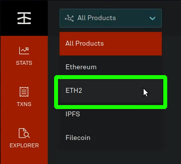

</center>

Create a new project here using the `Create New Project` button.
It can be named anything you want (for example, "RP Checkpoint Sync").

::: warning NOTE
Make sure you have the `ETH2` project selected, because that's what your Consensus client needs!
**This is different from the `Ethereum` project you may have used for your fallback Execution client!**
:::

Now, go to the `ETH2` project and click on the `Settings` button:

<center>

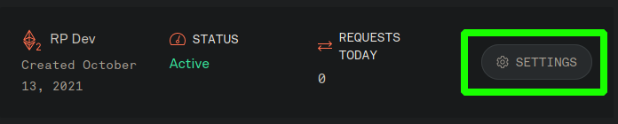

</center>

Here, there is a section called `Keys`.
In this section, first select `Mainnet` or `Prater` from the `Endpoints` dropdown, depending on whether you're using the Prater Testnet or Mainnet.

Next, click on the small clipboard icon to the right of the long `https://...` string:

<center>

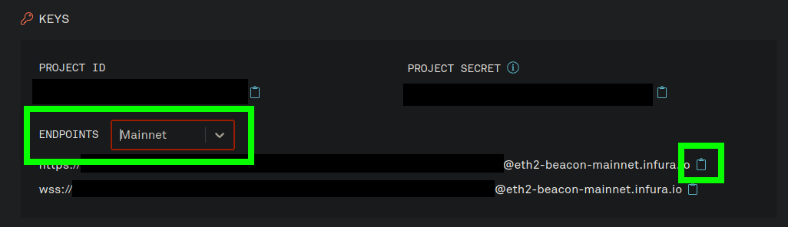

</center>

This is your personal, private access string for Infura's Beacon node.
Clicking on the clipboard icon will copy it to your clipboard.
You can then paste this in the terminal during `rocketpool service config` when it prompts you for a Checkpoint Sync Provider.

After that, your Beacon node will be configured to connect to Infura when it first starts up and instantly pull down the latest state of the chain!


### Metrics Configuration

Rocket Pool comes with the ability to display a detailed dashboard showing metrics about your node's hardware health, system updates, your validator performance, your rewards, information about the overall Rocket Pool network, and more:

<center>


</center>

The next question in the Wizard will ask you if you want to enable this:

<center>

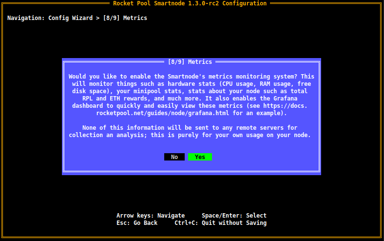

</center>

If you choose to enable it, you will learn more about setting it up and how to use it in the [Setting up the Grafana Dashboard](./grafana.md) section later in the process.

::: warning NOTE
All of the data collected by this system **stays on your machine**.
Rocket Pool does not collect any of the telemetry or send it to a separate service.
It's purely there for you to use so you can monitor your own node!
:::

After this question, you've finished setting up the Smartnode!
You will see the following dialog:

<center>

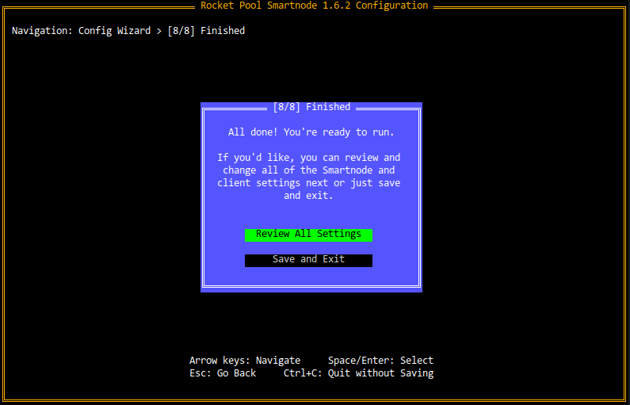

</center>

If you're happy with your setup and are ready to start the Smartnode, click `Save and Exit` here and go to the [Securing your Node](./securing-your-node.md) section next.

If you would like to review all of the settings and customize many additional settings that weren't included in the Wizard, click `Review All Settings` and go to the [next section](#configuring-via-the-settings-manager).


## Configuring via the Settings Manager

If you've already run `rocketpool service config`, instead of being greeted by the Wizard, you will see the **Settings Manager** screen:

<center>

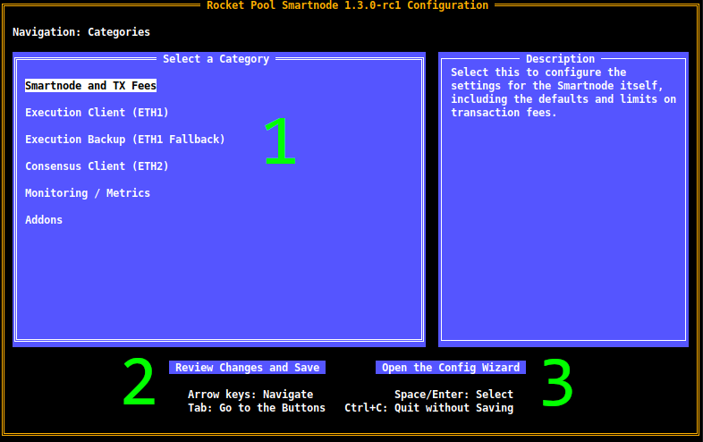

</center>

There are three main features of this screen:

1. The **Category List**, which lets you drill down into the settings for each category of the Smartnode stack
2. The **Review Changes and Save** button, which you can use when you're ready to see what settings you've changed and save the updated configuration
3. The **Open the Config Wizard** button, which will bring you to the [Setup Wizard](#configuring-the-smartnode-stack-via-the-wizard) if you prefer that interface instead

::: tip TIP
To use the Settings Manager, **press the `Arrow Keys` (up/down/left/right) to navigate between options in the home page**.

Press `Tab` to go **between the category list (1) and the buttons (2 and 3)** at the bottom of the screen. 
The button that's currently selected will be **highlighted in green**.

**Press `Enter` or `Space` to select a button**, analogous to clicking on it with the mouse.

**Hold `Ctrl` and press `C` at any time to exit the Settings Manager without saving anything**.
:::

As you scroll through the categories list, each option will have a helpful description appear in the **Description Box** to the right of the screen.
Feel free to explore them; nothing you do will be saved until you go through the Review dialog via the **Review Changes and Save** button, and you can press **Ctrl+C** at any time to exit without saving, so you won't accidentally mess something up by playing with the settings here.


### Configuring the Settings

From the home screen, select any one of the categories with the `Enter` key to view the settings for that category.
For example, here is the screen for the **Smartnode and TX Fees** category:

<center>

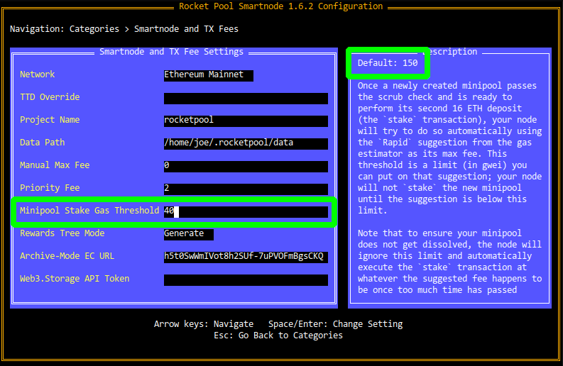

</center>

Use the `Arrow Keys` to move up and down between the settings.
The currently selected one will have a white square at the end of it (if it's a text box or a check box), or will be highlighted in white (if it's a drop down).

Press `Escape` to go back to the home screen of the Settings Manager when you're done.

As you scroll through the settings, each one will show a brief description of what it does in the **Description Box** on the right.
It will also show the **default value** there in case you want to revert it to its stock setting.

In this example, the **RPL Claim Gas Threshold** setting is currently selected (highlighted with a green box on the left-hand side of the screen).
It has been changed to `40`, but you can see that it has a default of `150` in the top-right corner (the top of the **Description Box**).

::: tip TIP
As a reminder, nothing will be saved to disk until you go through the Review dialog via the **Review Changes and Save** button.
You are encouraged to explore all of the settings to learn about them and see what your Smartnode can do!
:::


### The Setting Types and How to Use Them

The settings manager uses the following setting types and UI elements:

#### Text Boxes

Text boxes are used to enter arbitrary strings of text or numbers.
They look like this:

<center>

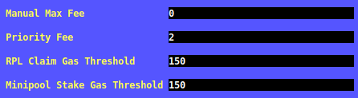

</center>

Enter your desired values into them, then **press `Enter` or use the `Arrow Keys` to navigate to a different setting in order to preserve your changes.**
If you don't, the Settings Manager will assume you're still updating that setting and won't mark it as changed yet.


#### Drop Downs

Drop downs are used to select an option from a list of choices.
They look like this (when they're open):

<center>

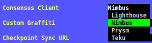

</center>

The **green** item is the one that is currently selected.
Use the `Arrow Keys` to change options - as you do, the **Description Box** on the right will update to tell you more about the currently selected option.
When you're happy with your choice, press `Enter` to choose the selected option and the drop down will close, revealing the option that is currently selected:

<center>

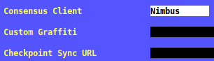

</center>


#### Check Boxes

Check boxes are used for simple Yes/No questions.
They look like this:

<center>


</center>

When they are checked, they will have an `X` in the middle as you see above.
When they are *unchecked*, they will simply be blank like this:

<center>


</center>

To change the setting, simply select it and press `Enter`.


### Saving Changes

When you're happy with your changes and you'd like to review them before saving, press the **Review Changes and Save** button on the home screen.
As a reminder, to get to it, press the `Tab` key.

You will be presented with a view that looks like this:

<center>

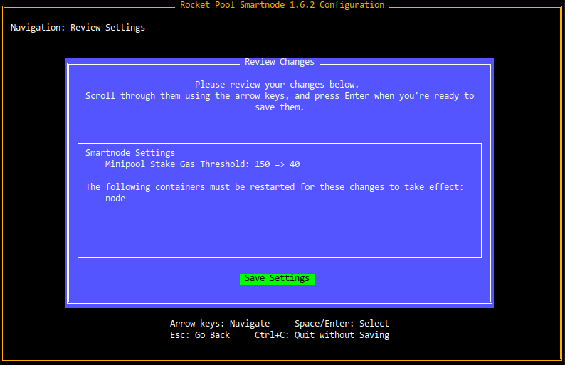

</center>

The **Review Box** here will present all of the settings you've changed, showing the old values and the new ones.
For example, the first line here shows that the **RPL Claim Gas Threshold** used to be `150`, and it's been changed to `40`.

It will also show you which containers are affected by the settings you've modified and will offer to restart them for you after you've saved your changes.

::: tip NOTE
At this point, your changes **still haven't been saved yet**.
If you want to go back and modify something, press `Escape` to return to the home screen.
:::

When you are satisfied with the changes, press `Enter` to save the new configuration to disk.
You will then exit the Terminal UI and be presented with something like this message:

```
Your changes have been saved!
The following containers must be restarted for the changes to take effect:
	rocketpool_watchtower
	rocketpool_validator
	rocketpool_eth2
	rocketpool_node
Would you like to restart them automatically now? [y/n]
```

Press `y` and `Enter` if you want to automatically apply your new configuration changes and restart the affected containers.

Press `n` and `Enter` if you have other things you want to do before restarting them, and will do it manually later.

In either case, your configuration is done!


## Configuring via the Command Line

If you use the Smartnode in a headless environment where you can't interact with the Terminal UI, you can configure your node via the command line instead.

The `rocketpool service config` command accepts, as arguments, every setting that can normally be configured via the Terminal UI.
Run the following command to see a list of them (note that it's quite long):

```
rocketpool service config --help
```

The output will look like this:

```
NAME:
   rocketpool service config - Configure the Rocket Pool service

USAGE:
   rocketpool service config

OPTIONS:
   --executionClientMode value  Choose which mode to use for your Execution client - locally managed (Docker Mode), or externally managed (Hybrid Mode).
                                Type: choice
                                Options: local, external
 (default: "local")
   --executionClient value  Select which Execution client you would like to run.
                            Type: choice
                            Options: geth, infura, pocket
 (default: "geth")
   --useFallbackExecutionClient         Enable this if you would like to specify a fallback Execution client, which will temporarily be used by the Smartnode and your Consensus client if your primary Execution client ever goes offline.
                                        Type: bool

...
```

Each option will have its name, its type, its default value, and (if it's a choice parameter) its options.
Using this text, you can find the option(s) you want to set and specify them via the appropriate arguments.

::: tip NOTE
This command builds on top of your existing configuration, so if you have some settings already saved and just want to modify others, you don't need to repeat them.
It will only update settings that you include as arguments to this command.
:::


## Next Steps

Once you've configured your node just the way you want it, you're ready to secure your operating system to protect your node.
Move on to the [Securing your Node](./securing-your-node.md) section next.
