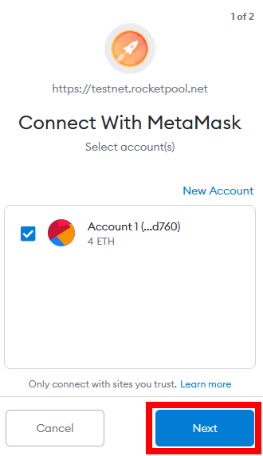
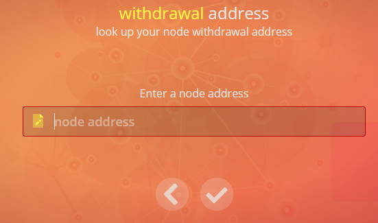
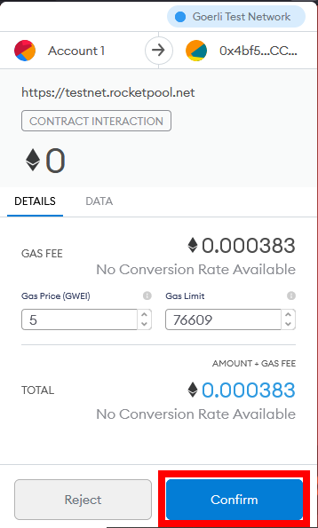
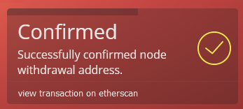

# :mag: Creating a Minipool (ETH2 Validator)

If you're here, then you've succesfully started the Smartnode services, created a wallet, and finished syncing both the ETH1 and ETH2 chains on your respective clients. 
If so, then you are ready to register your node on the Rocket Pool network and create a minipool with an ETH2 validator!
If not, please review the previous sections and return here once you've completed those steps.


## Preparing for Minipool Creation

Before creating a new minipool and ETH2 validator, there are a few steps to take to finish preparing your node.
These only need to be done once though; once you've done them, you can skip to the [Creating a New Minipool](#creating-a-new-minipool) section if you want to create multiple minipools on your node.


### Loading your Node Wallet

Registering your node and standing up a validator both involve submitting transactions to the Ethereum network from your node wallet.
This means **you'll need to have some ETH on it** to pay for the gas costs of those transactions.
You'll also want to provide it with the **RPL token**, because you'll need to stake some of that prior to creating a minipool as collateral.

:::: tabs
::: tab Running on the Prater Test Network
If you're running on the Prater test network, please see the [Practicing with the Test Network](../testnet/overview.md) section to learn how to acquire test ETH.

For test RPL, we have added a similar faucet function directly to the CLI.
Please see the [Getting Test RPL on Goerli](../testnet/overview.md#getting-test-rpl-on-goerli) guide to acquire some.
:::
::: tab Running on the Main Network
We assume that you already have a separate Ethereum-compatible wallet that is holding your ETH and RPL tokens.
Start by transferring some ETH and RPL from your existing wallet to the node wallet.
As a reminder, you can use `rocketpool wallet status` to get the address of the node wallet if you need it.
If you are not sure how to send cryptocurrency from your existing wallet, please consult your wallet's documentation.

::: danger
Sending cryptocurrency across wallets is a non-reversible operation!
If you enter the wrong recipient address, **there is no way to retrieve your tokens**.
We recommend you send a small amount of ETH first as a **test transaction** to verify that you correctly entered the node wallet's address, and then **whitelist** that address in your other wallet if possible to avoid mistyping it.
:::
::::


### Registering your Node with the Network

Once you have ETH and RPL in your wallet, you can register your node with the Rocket Pool network to access all of its features.
To do this, run the following command:

```
rocketpool node register
```

This will prompt you for the timezone you want to register with.
By default, this will detect the timezone from your system clock, but you can change it if you prefer.
Any of the `Country/City` format timezones [listed on this page](https://en.wikipedia.org/wiki/List_of_tz_database_time_zones) should be acceptable.

::: tip NOTE
The timezone is just used for the global map of node operators displayed on the main site.
You don't need to set it to your actual timezone if you have security concerns.
If you prefer to remain anonymous, use a generic option such as `Etc/UTC`.
:::

Once this is complete, you will officially be a member of the Rocket Pool network!


### Setting your Withdrawal Address

Before anything else, it's probably in your best interest to change the **withdrawal address** for your node.
This is the address that all of your RPL checkpoint rewards, your staked RPL, and your Beacon Chain ETH will be sent to when you claim your checkpoint rewards or exit your validator and withdraw from your minipool.

::: warning NOTE
By default, this is set to your node's wallet address.
However, for security reasons, **it's recommended to set this to a different cold wallet that you control, such as a MetaMask address or a hardware wallet.**

This way, if your node wallet is compromised, the attacker doesn't get access to your staked ETH and RPL by forcing you to exit because all of those funds will be sent to your separate cold wallet (which they hopefully do not have).
:::

There are two different ways to do this.
Please read both options below to determine which one applies to you.

:::: tabs
::: tab Method 1
**Use this method if your new withdrawal address can be used to sign transactions via MetaMask.**


1. Run `rocketpool node set-withdrawal-address <your cold wallet address>`. Your new withdrawal address will be marked as "pending". Until you confirm it, **your old withdrawal address will still be used**.
2. To confirm it, you must send a special transaction **from your new withdrawal address** to the minipool contract to verify that you own the withdrawal address.
   1. The easiest way to do this is to navigate to the [Rocket Pool withdrawal address site](https://testnet.rocketpool.net/withdrawal/).
   2. If you haven't already connected Metamask to the Rocket Pool website, do this now. Click the **connect metamask** button in the center of the screen. Metamask will open up a prompt asking you to confirm the connection:
<center>

</center>
      Click **Next**, then click **Confirm** to enable the Rocket Pool website to use your wallet.
   3. Select **Withdrawal Address** from the top menu (or the hamburger menu on the left side if you're on a mobile device).
   4. You will see this prompt: 
<center>

</center>
      Type your **node wallet address** here and click on the **Check Mark button** to continue.
   5. You will be prompted with a question asking if you want to set a new node withdrawal address or confirm a pending one. Select **Confirm**.
   6. Now, there should be a new confirmation dialog in Metamask. Click the Metamask icon to open it and you should see something like this:
<center>

</center>
      Click **Confirm** to send the transaction to the network. This will take some time until it gets mined, but once it does, you will see a confirmation dialog:
<center>

</center>
1. Your new withdrawal address will now be confirmed and activated. You can view this with `rocketpool node status`.
:::

::: tab Method 2

**Use this method only if your withdrawal address *cannot* be used to sign transactions via MetaMask (e.g. Argent or a Smart Contract).**

In this method, you will run:

```
rocketpool node set-withdrawal-address --force <your cold wallet address>
```

You will be offered the chance to send a test transaction before confirming this, to ensure that you have the right address.
If you confirm this command when it prompts you, your new withdrawal address will be set immediately.

::: danger
By doing this, you bypass the safety measure associated with Method 1, which requires you to prove that you own the new address.
If you make a typo here, there is no way to undo it and **your minipool's rewards will essentially be lost forever**.

We **strongly** encourage you to use the test transaction mechanism before confirming this, and if possible, use Method 1 instead.
:::
::::

Once this is done, you will **no longer be able to change your withdrawal address using the `set-withdrawal-address` command**.
To change it, you will need to send a signed transaction to your minipool from the **new** withdrawal address.
The Rocket Pool website has a function to help you do this, though currently only MetaMask is supported.   


### Swapping RPL v1 for RPL v2

In many cases, the RPL that you start with is going to be the legacy RPL token that is no longer used.
Luckily, the CLI offers a function that allows you to easily swap it for the modern RPL token used by the network today.

**Swapping will be done at a 1-to-1 ratio**; if you have 1000 of the RPL v1 token, you can swap it for 1000 of the RPL v2 token.
All you will need to do is pay a small amount of gas for the transaction.

**This swap can be done at any time.**

To do this, run the following command:

```
rocketpool node swap-rpl
```

This will ask you if you want to swap all of the RPL v1 in your node wallet for RPL v2 or specify a custom amount.
When you've made your choice, confirm the transaction and wait for it to be processed and added to the blockchain.

Once the transaction is accepted, you can confirm that it worked with `rocketpool node status`:

```
The node <node address> has a balance of 131.973495 ETH and 1440.000000 RPL.

The node is registered with Rocket Pool with a timezone location of Etc/UTC.

The node has a total stake of 0.000000 RPL and an effective stake of 0.000000 RPL, allowing it to run 0 minipool(s) in total.
The node does not have any minipools yet.
```

You should see your new RPL v2 balance on the top line where it describes how much RPL you currently have.


## Creating a New Minipool

As a reminder, a `minipool` in Rocket Pool terms refers to a unique smart contract instance on the eth1.0 chain that your node manages.
The minipool handles 16 of your ETH, 16 ETH from the rETH staking pool, and merges them together so that it can send 32 ETH to the Beacon Chain deposit contract to create a new eth2.0 validator.
Thus, in order to create a validator using Rocket Pool, you need to **create a minipool**.

::: warning
Creating a minipool means depositing 16 of your own ETH to the Beacon Chain.
These funds **cannot be retrieved** until after the eth1.0 chain has merged with the eth2.0 chain, and withdrawals have been implemented.
By creating the minipool, you are acknowledging that you are effectively locking these funds until that system is in place.
:::


### Staking RPL

Before you can create a minipool, you'll first need to stake some RPL as collateral.
**At a minimum**, you'll need to stake 1.6 ETH worth of RPL which is 10% of your total bond in the node.
The exact amount of RPL will change based on the ETH/RPL price ratio, which is snapshotted on-chain at regular intervals by the Oracle DAO.

There is no maximum to the amount you can stake, though **you will only receive rewards for the first 150%** at each checkpoint - anything above that will go unrewarded.

::: tip NOTE
RPL stake isn't handled on a per-minipool basis.
When you stake RPL, you do it for your **entire node**.
This means you'll only need to handle the total RPL stake for your node if you plan to run multiple minipools.
:::


Run the following command, and the CLI will tell you how much this is (as well as give you a list of options with respect to how much you want to stake):

```
rocketpool node stake-rpl
```

Here is the output:

```
Please choose an amount of RPL to stake:
1: The minimum minipool stake amount (284.477473 RPL)?
2: The maximum effective minipool stake amount (4267.162095 RPL)?
3: Your entire RPL balance (1440.000000 RPL)?
4: A custom amount
```

Select how much you'd like to stake, then confirm the operation.

::: tip NOTE
Note that the gas estimates here will likely be incorrect, because this operation will require two sequential transactions: one to give the minipool contract access to your RPL, and one to perform the staking.
The gas estimator can't calculate the price for the second transaction until the first one is completed.
:::

Once both transactions finish, you can check your staked RPL amount with `rocketpool node status`.
The following portion of the output is what you want to verify:

```
The node has a total stake of 11763.477483 RPL and an effective stake of 11763.477483 RPL, allowing it to run 41 minipool(s) in total.
This is currently a 10.88% collateral ratio.
The node must keep at least 10810.143971 RPL staked to collateralize its minipools and claim RPL rewards.
```

If the `collateral ratio` is 10% or higher, then you have enough staked to create a new minipool.


### Depositing ETH

After everything you've done so far, you are finally ready to deposit your ETH, create a new minipool, and create an ETH2 validator.
This is done with the following command:

```
rocketpool node deposit
```

You will first be prompted to choose how much ETH you want to deposit to your new minipool:

```
Please choose an amount of ETH to deposit:
1: 32 ETH (minipool begins staking immediately)
2: 16 ETH (minipool begins staking after ETH is assigned)
```

If you choose **16 ETH**, you will enter the Rocket Pool minipool queue.
This queue will wait for 16 ETH to become available from the rETH staking pool.
Once it's available, it will be merged with your own 16 ETH, used to create a minipool, and deposited into the Beacon Chain deposit contract to create a new validator.

If you choose **32 ETH**, you will bypass the Rocket Pool minipool queue entirely.
You will immediately create a minipool and a new Beacon Chain validator.
When 16 ETH becomes available from the rETH staking pool and there are no other minipools in the queue that chose the 16 ETH deposit option, then **you will be given 16 ETH back from the rETH staking pool**.
You can then use the `rocketpool minipool refund` command to receive that 16 ETH back to your withdrawal address.

::: tip NOTE
Though depositing 32 ETH lets you bypass the *Rocket Pool queue*, it does **not** bypass the *Beacon Chain queue*.
You still have to wait through the validator queue until your validator is activated on the Beacon Chain.
::: 

Next, you will be prompted about the current network commission rate:

```
The current network node commission rate that your minipool should receive is 20.000000%.
The suggested maximum commission rate slippage for your deposit transaction is 1.000000%.
This will result in your minipool receiving a minimum possible commission rate of 19.000000%.
Do you want to use the suggested maximum commission rate slippage? [y/n]
```

This will tell you what the **current** commission rate is, which is based on how many minipools are in the queue and how much rETH is available in the staking pool, waiting to be staked.
The lowest it can go is 5%, and the highest it can go is 20%.
Once your minipool is created, **its commission rate will be locked until you exit the validator and close the minipool**.

The commission rate chosen is ultimately set when your minipool enters the Rocket Pool queue, which can be a few minutes after you issue the deposit command to the network.
Because of this, it's possible that it might move slightly between the time when you issued the deposit command, and when the minipool is added to the queue.
This prompt asks you how much you are willing to allow the commission to drop by during this period before you would rather just cancel the deposit entirely.

For example: say the CLI claims that the current commission is 20% when you issue the `deposit` command.
It takes 5 minutes for your minipool to be added to the Rocket Pool queue.
In that time, the commission rate falls to 17%.

If you set a slippage of 2%, then the lowest you are willing to let it go down is 18%.
Since 17% is less than 18%, your deposit will be cancelled and your ETH will be refunded to you.
**Note that you will still have to pay some gas fees, even if the transaction is reverted in this way.**

If you set a slippage of 4%, then the lowest you are willing to let it go down is 16%.
Since 17% is greater than 16%, your minipool will be created and added to the queue with a commission rate of 17% for its entire life.

Using this knowledge, answer the prompt by deciding if the suggested slippage rate is acceptable or if you want to change it.

::: danger
After you set your acceptable slippage, the CLI will then check to ensure that your ETH2 client is synced.
If not synced, then it will warn you in large red letters.
A situation may arise where **your ETH2 validator is activated before your ETH2 node finishes syncing**.
If this happens, your validator will be assigned attestation and block proposal duties on the Beacon Chain, but it cannot perform those duties until your ETH2 client is fully synced.

In this situation, **every missed attestation and block proposal will cause you to lose ETH!**
You will continue to slowly leak your ETH until your ETH2 client finishes syncing.

In most cases, **you should cancel the process and wait for your client to sync.**

However, there are situations where the Beacon Chain validator queue is very long, and you believe that your ETH2 client will finish syncing before your validator exits the queue and is activated.
In this case, you may want to do the deposit anyway to save time and begin validating sooner.
If you **understand these risks** and **believe this is the case**, the CLI will let you go ahead with a deposit anyway.
:::

At this point you will be given the typical gas cost estimation:

```
Your eth2 client is synced, you may safely create a minipool.
Suggested gas price: 10.319561 Gwei
Estimated gas used: 1957383 gas
Estimated gas cost: 0.020199 ETH

You are about to deposit 16.000000 ETH to create a minipool with a minimum possible commission rate of 19.000000%.
ARE YOU SURE YOU WANT TO DO THIS? Running a minipool is a long-term commitment, and this action cannot be undone! [y/n]
```

Note that creating a minipool **is an expensive transaction**!
Pay close attention to the total cost and ensure that you accept it.

If you accept, your minipool creation will be triggered.
Once the transaction completes, you will be given the address of your new minipool contract on the eth1 chain.
You can visit this with any block explorer if you'd like.


### Confirming a Successful Stake

Once you've finished your deposit, you can check on the new minipool's status with the `rocketpool minipool status` command.
You will likely see something like this:

```
1 Prelaunch minipool(s):

--------------------

Address:              <your minipool address>
Status updated:       2021-06-21, 01:14 +0000 UTC
Node fee:             20.000000%
Node deposit:         16.000000 ETH
RP ETH assigned:      2021-06-21, 01:14 +0000 UTC
RP deposit:           16.000000 ETH

```

This indicates that your minipool is in the "prelaunch" stage.
The `node deposit` process creates the minipool, but it doesn't stake the 32 ETH to create a new Beacon Chain validator.
First, you must wait for your turn in the Rocket Pool queue so you can pull 16 ETH from the rETH staking pool.
Once this is done, you must wait for the `rocketpool_node` Docker container (or the `rp-node` service if you used the Native setup) to use that to create a new validator.

It may take a few minutes for the `node` process to do this once you exit the Rocket Pool queue.
You can follow its progress by watching the logs with the `rocketpool service logs node` command (or `/srv/rocketpool/node_log.sh` on Native mode setups).

At some point, you should see log messages like this:

```
Jun 21 01:19:48 rp-dev: 2021/06/21 01:19:48 Checking for minipools to launch...
Jun 21 01:19:48 rp-dev: 2021/06/21 01:19:48 1 minipool(s) are ready for staking...
Jun 21 01:19:48 rp-dev: 2021/06/21 01:19:48 Staking minipool <your minipool address>...
```

Followed by lots of logs, including the transaction hash of this operation and a notice about restarting the `rocketpool_validator` Docker container (or the validator process with `/srv/rocketpool/restart-validator.sh` on Native mode setups).
If they complete successfully, then you should see the status of your minipool change from `Prelaunch` to `Staking`:

```
$ rocketpool minipool status

1 Staking minipool(s):

--------------------

Address:              <your minipool address>
Status updated:       2021-06-21, 01:19 +0000 UTC
Node fee:             20.000000%
Node deposit:         16.000000 ETH
RP ETH assigned:      2021-06-21, 01:19 +0000 UTC
RP deposit:           16.000000 ETH
Validator pubkey:     <your eth2 validator address>
Validator index:      0
Validator seen:       no

--------------------
```

Congratulations!
You have officially created a validator with Rocket Pool!

Have a look at the next sections in Monitoring and Maintenance to learn how to watch your validator's performance and health over  time.