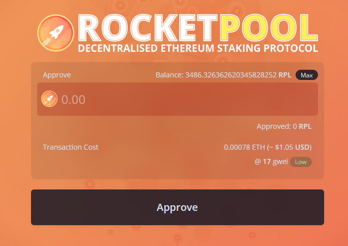
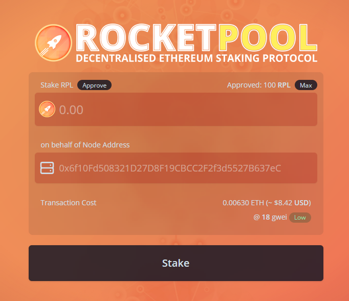

# Creating a New Minipool (Validator)

As a reminder, a `minipool` in Rocket Pool terms refers to a unique smart contract instance on the Execution Layer (ETH1) chain that your node manages.
The minipool handles a portion of your ETH, known as the **bond amount**, and a portion of ETH from the rETH staking pool, known as the **borrowed amount**.
It merges them together to form 32 ETH in total, which is then sent to the Beacon Chain deposit contract to create a new validator.
Thus, in order to create a validator using Rocket Pool, you need to **create a minipool**.


## Choosing a Bond Size

::: warning NOTE
8-ETH bonded minipools are a feature of the [**Atlas**](../atlas/whats-new.md) upgrade and will not be available until Atlas has launched.
::: 

Before creating a minipool, the first step is to choose the amount of ETH you want to bond.
With the Atlas update, Rocket Pool allows bond amounts of either **8 ETH** or **16 ETH**.
This bond represents your literal stake in the game as a validator; if your node is penalized for poor performance or slashed for violating the rules of the protocol, the penalty is taken from your bond.

In addition to your ETH bond, creating a validator also requires **supplemental collateral** in the form of the **RPL token**.
The amount of RPL you need to stake depends on your bond size; the minimum is 10% of your *borrowed* amount of ETH, and the maximum is 150% of your *bonded* amound of ETH.

If choosing **8 ETH**, you stake 8 of your own ETH and "borrow" 24 ETH from the staking pool to complete the validator.
The minimum RPL stake is **2.4 ETH worth of RPL** (10% of 24), and the maximum is **12 ETH worth of RPL** (150% of 8).

If choosing **16 ETH** you stake 16 of your own ETH and borrow 16 ETH from the staking pool to complete the validator.
The minimum RPL stake is **1.6 ETH worth of RPL** (10% of 16), and the maximum is **24 ETH worth of RPL** (150% of 16).


### Rewards

From a profitability perspective (looking *purely* at ETH rewards and ignoring RPL), two 8-ETH bonded minipools with a 14% commission provide *more rewards* to the node operator than even *16-ETH bonded minipools at 20% commission* (which, as of Redstone, is the highest possible reward configuration).
At the same time, they also provide more rewards to the *rETH holders* as well due to the fact that the node operators are more efficiently putting the capital of the rETH holders to work.

Let's walk through a simple example to illustrate.
Say we are a node operator with 16 ETH available to stake (plus the required RPL bond).
Say we've earned 1 ETH of rewards on the Beacon Chain per validator.
Here's how the math works out for a single 16-ETH minipool with a 20% commission, versus two 8-ETH minipools at 14% commission:

```
1x 16 ETH Minipool @ 20%:
Rewards: 1 ETH
Node Share = (16/32) + (16/32 * 0.2)
           = 0.5 + (0.5 * 0.2)
           = 0.5 + 0.1
           = 0.6 ETH

rETH Share = 1 - 0.6
           = 0.4 ETH


2x 8 ETH Minipools @ 14%:
Rewards: 2 ETH
Node Share = ((8/32) + (24/32 * 0.14)) * 2
           = (0.25 + (0.75 * 0.14)) * 2
           = (0.25 + 0.105) * 2
           = 0.71 ETH

rETH Share = 2 - 0.71
           = 1.29 ETH
```

In other words, a node operator will earn **18% more ETH** via two 8-ETH minipools than they would with a single 16-ETH minipool at 20% commission.


## Staking RPL

Before you can create a minipool, you'll first need to stake your RPL collateral.
The minimum and maximum amounts are described above relative to ETH and depending on your desired bond size.
The exact amount of RPL will change based on the ETH/RPL price ratio, which is snapshotted on-chain at regular intervals by the Oracle DAO.

There is no maximum to the amount you can stake, though **you will only receive rewards for the first 150% of your bonded ETH** at each checkpoint - anything above that will go unrewarded.

::: tip NOTE
RPL stake isn't handled on a per-minipool basis.
When you stake RPL, you do it for your **entire node**.
This means you'll only need to handle the total RPL stake for your node if you plan to run multiple minipools.
:::


### Staking via the Website

The easiest and safest way to stake RPL for your node is to use the protocol's **Stake-on-Behalf** feature, which was 
reintroduced with the Atlas upgrade. This way, you can stake RPL for your node while the RPL is still in the wallet 
you used to acquire it. In other words, you **don't need to send RPL to your node's hot wallet** in order to stake it.

#### Whitelisting an address to stake on behalf

You first must whitelist an address to have permission to stake on behalf of your node. This only needs to be performed
once per address you wish to stake from. You can do this via the following Smartnode command:

```bash
rocketpool node add-address-to-stake-rpl-whitelist address-or-ens
```

Where `address-or-ens` is the address or and ENS name that resolves to your desired address. You will be asked to
confirm the whitelist addition and after the transaction is confirmed, you can then navigate to the relevant page below.

#### Staking RPL on behalf of

Select which network you're using from the tabs below to be taken to it:

:::: tabs
::: tab Mainnet
[https://stake.rocketpool.net/stake-behalf](https://stake.rocketpool.net/stake-behalf)
:::
::: tab Prater Testnet
[https://testnet.rocketpool.net/stake-behalf](https://testnet.rocketpool.net/stake-behalf)
:::
::::

Start by connecting your wallet to the website using MetaMask, WalletConnect, or any of the other methods the website supports.
You will then be presented with this dialog:

<center>



</center>

This is a two-step process.
First, enter the amount of RPL you want to stake and click `Approve` - this will **approve** the staking contract to access that much RPL in your wallet, but **no more than that amount**.

::: tip TIP
You can approve more than the amount you intend to stake if you trust the Rocket Pool staking contract, and don't want to perform this extra Approve transaction each time you want to stake more RPL.
:::

Once the RPL is approved, you will see this dialog:

<center>



</center>

Enter the amount of RPL you want to stake in the `Stake RPL` box, and enter your node's address in the `on behalf of Node Address` box.
**Make sure you have the correct node address before doing this!**
If you need to confirm your node's address, you can quickly retrieve it via the CLI using the `rocketpool node status` command.

When you've entered that information, press the `Stake` button and approve the transaction.
It will be sent to the Ethereum network, and once included in a block, you're all set!

If you run `rocketpool node status`, you should see your staked RPL appear under the `=== RPL Stake and Minipools ===` section.

#### Removing an address from the stake whitelist

If you ever want to remove an address from your stake-on-behalf whitelist, you may do so with the following Smartnode command:

```bash
rocketpool node remove-address-from-stake-rpl-whitelist address-or-ens
```

Where `address-or-ens` is the address or and ENS name resolving to the address you want to remove from the whitelist.

### Staking via the Node CLI

If you cannot (or do not want to) use the website to stake your RPL, you can also stake it via the node's CLI directly.

First, transfer your RPL from the wallet you acquired it with to your node's address.

::: danger WARNING
**Please do this carefully and ensure you are sending the RPL to your node's address - transfers on Ethereum cannot be undone!**
**Sending RPL to the wrong address will result in the loss of your RPL.**

Use the `rocketpool node status` command to verify your node's address if you aren't sure what it is.
:::

Run the following command:

```
rocketpool node stake-rpl
```

Here is the output:

```
Please choose an amount of RPL to stake:
1: The minimum minipool stake amount for an 8-ETH minipool (100.794306 RPL)?
2: The maximum minipool stake amount for an 8-ETH minipool (503.971527 RPL)?
3: The minimum minipool stake amount for a 16-ETH minipool (67.196204 RPL)?
4: The maximum minipool stake amount for a 16-ETH minipool (1007.943054 RPL)?
5: Your entire RPL balance (1440.000000 RPL)?
6: A custom amount
```

Select how much you'd like to stake, then confirm the operation.

The first time you run this command, it will involve two transactions - one to **approve** the Rocket Pool staking contract to access your RPL, and one to **stake** your RPL with it.
Subsequent runs will only require the **stake** transaction, since the token has already been approved. 

Once both transactions finish, you can check your staked RPL amount with `rocketpool node status`.
The following portion of the output is what you want to verify:

```
The node has a total stake of 300.000000 RPL and an effective stake of 300.000000 RPL.
This is currently 29.76% of its borrowed ETH and 89.29% of its bonded ETH.
It must keep at least 100.794305 RPL staked to claim RPL rewards (10% of borrowed ETH).
It can earn rewards on up to 503.971526 RPL (150% of bonded ETH).

The node has enough RPL staked to make 1 more 8-ETH minipools (or 2 more 16-ETH minipools).
```

This will show you how many minipools you can make of each bond size based on your RPL collateral.


## (Optional) Finding a Custom Vanity Address for your Minipool

By default, when you create a new minipool, Rocket Pool will generate a random unique address for it.
However, the Smartnode provides the ability to search for a custom **vanity address** for the minipool.

A vanity address is one where you personally pick the characters that the address starts with.
This is a purely cosmetic exercise and will not have any practical impact on your minipool's operation.
As Ethereum addresses are in hexadecimal, any of the following characters are legal:

```
0 1 2 3 4 5 6 7 8 9 a b c d e f
```

As a few examples, you could make your minipool's address start with a bunch of zeros (`0x000000...`), `0x600d` (hex for "good") or `0xa77e57ed` (hex for "attested", a fitting prefix for a minipool).

To find such a vanity address, you will need to **search for it**.
This searching process involves picking a number, applying it as a "salt" to the hashing algorithm, and comparing the results against what you're looking for.
The results are effectively random (though any given salt always produces the same result), so the only way to find an address with the prefix you want is to try lots and lots of them until you find a salt that works.

If you would like a custom vanity address to use for your minipool when you create it, you can use the following command to search for one:

```
rocketpool minipool find-vanity-address
```

This will prompt you for the prefix you want to search for, and ask which type of deposit you will be doing (a 16 ETH or a 32 ETH deposit - see below for more info on these types).
Once you enter that information, it will begin trying lots and lots of salts until it finds one that produces your desired prefix!

Here is a complete example of the process:

```
$ rocketpool minipool find-vanity-address

Please specify the address prefix you would like to search for (must start with 0x):
0xa77e57

Running with 12 threads.
Found on thread 3: salt 0x5cd7fb = 0xA77E57c892C9e98B0B81289e4AfdA62fb59c5DDD
Finished in 1.91145873s
```

In this case, we searched for `0xa77e57` as the prefix and found the salt `0x5cd7fb` which could generate it.
In the next step, when we create a minipool, we can specify this salt as an optional argument to create the new minipool at the address associated with the salt (`0xA77E57c892C9e98B0B81289e4AfdA62fb59c5DDD` as shown above).

In general, each additional character you search for will multiply the search time by about 16.
Because of this, **we recommend you only look for prefixes of 7 or 8 characters max unless you have a very powerful machine with many CPU cores**.
Otherwise, it might take prohibitively long to find a salt that produces the prefix you want.

For example, an AMD 5600x with 6 cores (12 threads) at 4.8 GHz can search about 3.2 million salts per second.
On average, it will take a few seconds to find a 6-character prefix, a few minutes to find a 7-character prefix, and a few hours to find an 8-character prefix.

::: tip NOTE
The salt that gets generated is specific to the following variables:
- The network you're using (either the Prater Testnet or Mainnet)
- The node address
- The bond amount
- The salt

If you change any of those variables, the minipool address for a given salt will change as well.
:::

For more advanced usage (such as searching for a different node address or changing how many CPU cores are used for searching), take a look at the help text with `rocketpool minipool find-vanity-address --help`.


## Depositing ETH and Creating a Minipool

::: tip TIP
If the market value of rETH is higher than its ETH backing (i.e., rETH is at a premium on the market), there is an opportunity to arbitrage the difference when creating a minipool.
The value of the arbitrage is equal to the amount of protocol ETH in the minipool times the premium (minus a small amount of gas).
E.g., if making a minipool when there's a 2.5% premium: `16 ETH * .025 = 0.4 ETH`.
In other words, you could receive 0.4 ETH back during these conditions just for creating a minipool!

If you're interested in taking advantage of this opportunity, consider using the community-developed [rocketarb](https://github.com/xrchz/rocketarb/blob/main/README.md) tool to capture the profit of the MEV rETH arbitrage opportunity that launching your minipool creates.

To learn more about rocketarb, feel free to inquire about it on the [RP discord server](https://discord.gg/rocketpool).
:::

After everything you've done so far, you are finally ready to deposit your ETH, create a new minipool, and create an ETH2 validator.
This is done with the following command:

```
rocketpool node deposit
```

::: tip NOTE
If you want to use a salt for a vanity address that you found using the process above, run the following command instead:

```
rocketpool node deposit --salt <your salt, e.g. 0x1234abcd>
```
:::

You will first see a note that depositing a new minipool will **automatically distribute** any balance in your node's [fee distributor](./fee-distrib-sp.md) contract (used to capture MEV rewards if you're not opted into the [Smoothing Pool](./fee-distrib-sp.md#the-smoothing-pool)):

```
Your eth2 client is on the correct network.

NOTE: by creating a new minipool, your node will automatically claim and distribute any balance you have in your fee distributor contract. If you don't want to claim your balance at this time, you should not create a new minipool.
Would you like to continue? [y/n]
```

If you already have minipools and a balance in your fee distributor, you may decide not to create another minipool if distributing this balance causes a taxable event in your jurisdiction.

Assuming you want to continue, the next question will ask what you want your bond size to be:

```
Please choose an amount of ETH to deposit:
1: 8 ETH
2: 16 ETH
```

After that you'll be notified of your commission rate for the new minipool, and a note on whether or not your node's [credit balance](./credit.md) can be used to cover the cost of the minipool bond for you:

```
Your minipool will use the current fixed commission rate of 14.00%.
You currently have 8.00 ETH in your credit balance.
This deposit will use 8.000000 ETH from your credit balance and will not require any ETH from your node.
```

You will next be prompted with the network's current gas costs recommendations; confirm your gas price selection and follow the rest of the prompts. 

```
Your consensus client is synced, you may safely create a minipool.
+============== Suggested Gas Prices ==============+
| Avg Wait Time |  Max Fee  |    Total Gas Cost    |
| 15 Seconds    | 15 gwei   | 0.0244 to 0.0366 ETH |
| 1 Minute      | 10 gwei   | 0.0157 to 0.0235 ETH |
| 3 Minutes     | 7 gwei    | 0.0100 to 0.0150 ETH |
| >10 Minutes   | 6 gwei    | 0.0080 to 0.0120 ETH |
+==================================================+

These prices include a maximum priority fee of 2.00 gwei.
Please enter your max fee (including the priority fee) or leave blank for the default of 10 gwei:


Using a max fee of 10.00 gwei and a priority fee of 2.00 gwei.
You are about to deposit 8.000000 ETH to create a minipool with a minimum possible commission rate of 14.000000%.
ARE YOU SURE YOU WANT TO DO THIS? Exiting this minipool and retrieving your capital cannot be done until:
- Your minipool has been *active* on the Beacon Chain for 256 epochs (approx. 27 hours)
- The Shapella upgrade of the Ethereum network has been deployed
- The Atlas upgrade of the Rocket Pool protocol has been deployed
- Your minipool has been upgraded to use the Atlas delegate
 [y/n]
y

Creating minipool...
Transaction has been submitted with hash <transaction hash>.
You may follow its progress by visiting:
<link to transaction>

Waiting for the transaction to be included in a block... you may wait here for it, or press CTRL+C to exit and return to the terminal.

The node deposit of 8.000000 ETH was made successfully!
Your new minipool's address is: <new minipool address>
The validator pubkey is: <new validator public key>

Your minipool is now in Initialized status.
Once the remaining ETH has been assigned to your minipool from the staking pool, it will move to Prelaunch status.
After that, it will move to Staking status once 1h0m0s have passed.
You can watch its progress using `rocketpool service logs node`.
```

Note that creating a minipool **is an expensive transaction**!
Pay close attention to the total cost and ensure that you accept it.

If you accept, your minipool creation will be triggered.
Once the transaction completes, you will be given the address of your new minipool contract on the eth1 chain and its corresponding validator public key on the Beacon Chain.
You can visit these with any block explorers if you'd like.


## Confirming a Successful Stake

Upon creation, your minipool will be put into the `initialized` state.
It will remain here until it's your turn in the Rocket Pool queue to be given 16 ETH from the staking pool so you can stake your new validator on the Beacon Chain.

Once this happens, your minipool will move into the `prelaunch` state for a certain period of time (currently 12 hours).
Your 16 ETH deposit will be transferred to be Beacon Chain, and the Oracle DAO [will verify that it is all correct](https://github.com/rocket-pool/rocketpool-research/blob/master/Reports/withdrawal-creds-exploit.md).
During this time, you can observe the validator by looking up its validator pubkey with a Beacon Chain explorer such as [https://beaconcha.in](https://beaconcha.in) (or [https://prater.beaconcha.in](https://prater.beaconcha.in) for the Prater Testnet).

You can check on the new minipool's status with the `rocketpool minipool status` command.
For example, when it has moved into `prelaunch`, you will likely see something like this:

```
1 Prelaunch minipool(s):

--------------------

Address:              <your minipool address>
Penalties:             0
Status updated:        2023-03-31, 04:51 +0000 UTC
Node fee:              14.000000%
Node deposit:          8.000000 ETH
RP ETH assigned:       2023-03-31, 04:51 +0000 UTC
RP deposit:            24.000000 ETH
Minipool Balance (EL): 31.000000 ETH
Your portion:          7.000000 ETH
Available refund:      0.000000 ETH
Total EL rewards:      7.000000 ETH
Validator pubkey:      <your validator public key>
Validator index:       0
Validator seen:        no
Use latest delegate:   no
Delegate address:      <your delegate address>
Rollback delegate:     <none>
Effective delegate:    <your delegate address>


0 finalized minipool(s):


```

After this prelaunch period, your minipool will enter `staking` status and send the additional 16 ETH from the staking pool to the deposit contract.
This will be done by the `rocketpool_node` Docker container (or the `rp-node` service if you used the Native setup) - if, for some reason, you are taking abnormally long to enter `staking` status, looking at the logs for this container / service will likely tell you what's wrong.
You can check these logs with the `rocketpool service logs node` command (or `/srv/rocketpool/node_log.sh` on Native mode setups).

Running `rocketpool minipool status` will then show something like this:

```
$ rocketpool minipool status

1 Staking minipool(s):

--------------------

Address:              <your validator address>
Penalties:             0
RP ETH assigned:       2023-03-31, 05:53 +0000 UTC
Node fee:              14.000000%
Node deposit:          8.000000 ETH
RP ETH assigned:       2023-03-31, 04:51 +0000 UTC
RP deposit:            24.000000 ETH
Minipool Balance (EL): 0.000000 ETH
Your portion:          0.000000 ETH
Available refund:      0.000000 ETH
Total EL rewards:      0.000000 ETH
Validator pubkey:     <your validator public key>
Validator index:      <your validator index number>
Validator active:     yes
Validator balance:    32.018460 ETH
Expected rewards:     16.010614 ETH
Use latest delegate:  no
Delegate address:     <your delegate address>
Rollback delegate:    <none>
Effective delegate:   <your delegate address> 


0 finalized minipool(s):

```

Once the Beacon Chain accepts both of the deposits (one from you and one from the staking pool), your validator will enter the Beacon Chain queue where it will wait for its turn to become activated and start staking.

At this point, you're done!
Congratulations!
You have officially created a validator with Rocket Pool!

Have a look at the next sections in Monitoring and Maintenance to learn how to watch your validator's performance and health over time.


## Creating Multiple Minipools

Conveniently, your Rocket Pool node is capable of hosting as many minipools as you want.
You **do not** need to create a new node for each minipool.

If you would like to make a second (or third, or fourth...) minipool for your node, all you need to do is run `rocketpool node deposit` again.
Note that you may need to stake more RPL first to maintain an overall collateral level of at least 10% of your *borrowed* ETH before you do this.
Also, you won't be able to reuse an old vanity address salt - you'll need to search for another unique one for each of your minipools.


## Next Steps

Now that you have a minipool up and running, the next steps will walk you through how to monitor the health of your node, check for and apply updates, and maintain it throughout its life.

**Please read through the `Monitoring and Maintenance` section next to learn more about these topics.**
