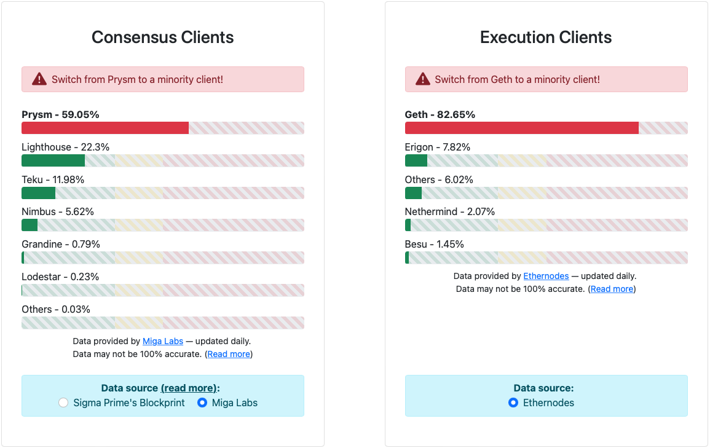

# Choosing your ETH Clients

Rocket Pool's Smartnode installer can transform your machine into a full Ethereum node, as it requires both Execution and Consensus clients in order to operate properly.

The terms ETH1/ETH2 have been deprecated.
The chains will be referred to as the **Execution Layer (ETH1)** and the **Beacon Chain or Consensus Layer (ETH2)** in the rest of these guides.

If you already have Execution and Consensus clients up and running on a separate machine (for example, if you're already solo-staking), then skip this section and move onto the [Configuring a Hybrid Rocket Pool Node with External Clients](./install-modes.md#the-hybrid-configuration-with-external-clients) section.

Otherwise, read on to learn more about your choices for Execution and Consensus clients.

::: warning NOTE
As of March 2023, the distribution of clients on the Beacon Chain looks roughly like this:

*Data obtained from [https://clientdiversity.org](https://clientdiversity.org)*

The overwhelming majority of node operators are currently using Geth as an Execution Client and either Prysm or Lighthouse as a Consensus Client.
In the interest of supporting the health of the Execution Layer (formerly ETH1) and the Beacon Chain (formerly ETH2), we currently recommend that you consider using different clients.
Here are some relevant articles about why an even client diversity is crucial to the health of the network if you would like to learn more:

[https://clientdiversity.org/#why](https://clientdiversity.org/#why)

[https://blog.ethereum.org/2020/08/21/validated-why-client-diversity-matters/](https://blog.ethereum.org/2020/08/21/validated-why-client-diversity-matters/)

[https://our.status.im/the-importance-of-client-diversity/](https://our.status.im/the-importance-of-client-diversity/)

[https://medium.com/prysmatic-labs/eth2-mainnet-incident-retrospective-f0338814340c](https://medium.com/prysmatic-labs/eth2-mainnet-incident-retrospective-f0338814340c)
:::

For users that would like to get up and running quickly, the Smartnode installer provides a `Random Client` option which may be the best choice.
For users that have a specific client they'd like to use in mind, we provide the ability to easily choose one during Rocket Pool's installation.
The options below help to describe each client so you can make an informed decision if you'd like to specify which one you want.

## Execution Clients

Rocket Pool supports three different Execution clients: **Geth**, **Besu**, and **Nethermind**.

Running an Execution client involves storing a copy of the Execution layer blockchain on your machine.
It interacts via peer-to-peer communications with other EC nodes to record and verify new blocks and transactions.
A full Execution client is **required** to run a validator now that the Execution and Consensus layers have merged.

### Geth

[Geth](https://geth.ethereum.org/) (formally named `Go Ethereum`) is one of the three original implementations (along with C++ and Python) of the Ethereum protocol.
It is written in Go, fully open source and licensed under the GNU LGPL v3.

Geth is the oldest and most widely-used Execution Client around the world.
It has a reputation for being very stable and reliable.

It is multithreaded, meaning it can take advantage of your entire CPU.
Its RAM usage is configurable, down to a **minimum of about 4 GB for Mainnet**.
This makes it viable for low-power systems and high-power systems alike.

::: warning NOTE
Geth requires **offline pruning** of its database periodically: its database will grow over time and gradually consume all of your free disk space unless you prune it when your disk runs low on free space.
The frequency you need to prune will depend on your SSD's size.

For more information on pruning Geth, view the [Pruning the Execution Client](./pruning.md) page.
:::

### Besu
Hyperledger [Besu](https://besu.hyperledger.org/en/stable/) is an open-source Ethereum client developed under the Apache 2.0 license and written in [Java](https://en.wikipedia.org/wiki/Java_%28programming_language%29).
Besu's most exciting features is its use of [Bonsai Tries](https://consensys.net/blog/news/bonsai-tries-a-big-update-for-small-state-storage-in-hyperledger-besu/) for state storage. In addition to their better performance characterstics, Bonsai Tries give Besu two interesting advantages over the other clients:

1. Besu does *not* need to be pruned at all; it is effectively maintenance-free in that respect
2. Besu is able to revisit any past block in the blockchain, though it does this by rewinding each block so reaching blocks from long ago may take some time.

Besu currently recommends at least **16 GB of RAM**, though it is possible to run successfully with 8 GB.

### Nethermind

[Nethermind](https://nethermind.io/nethermind-client/) is written in [.NET Core](https://en.wikipedia.org/wiki/.NET).
It boasts the fastest sync speed of the Execution clients and has a rich set of configuration options.
It is designed with node operators in mind and has many features that they will find helpful.

Like Geth, Nethermind requires periodic pruning of its database.
Unlike Geth, however, Nethermind's database can [be pruned while it stays online](https://medium.com/nethermind-eth/netherminds-full-pruning-is-here-cutting-the-gordian-knot-5e3450f02de9).
This means you do not need to turn your client off and rely on a fallback in order to prune.
However, Nethermind's online pruning process is quite resource intensive so users running low-power nodes may see some performance degradation during the process.

Nethermind requires **at least 16GB of RAM**, though more is preferable.

::: tip NOTE
Nethermind requires periodic pruning of its database periodically: its database will grow over time and gradually consume all of your free disk space unless you prune it when your disk runs low on free space.
The frequency you need to prune will depend on your SSD's size.

Unlike Geth, however, Nethermind **remains online** while it is pruning.
This makes it a compelling choice for nodes because they won't have any down time during pruning.

For more information on pruning Nethermind, view the [Pruning the Execution Client](./pruning.md) page.
:::

### Client Comparison Table

| Client     | Type  | CPU Usage | Minimum RAM Usage | Sync Time |
| ---------- | ----- | --------- | ----------------- | --------- |
| Geth       | Full  | Moderate  | 4 GB              | Moderate  |
| Besu       | Full  | Moderate  | 6 GB              | Slow      |
| Nethermind | Full  | Moderate  | 16 GB             | Fast      |

## Consensus Clients

Rocket Pool's installer is proud to support five currently available Consensus clients: **Lighthouse**, **Lodestar**, **Nimbus**, **Prysm**, and **Teku**.

Each of these is a **full client**, meaning you will contribute to the decentralization of the Consensus network regardless of which client you choose.

All five clients are quite low-risk, low-maintenance, and will generate practically identical total rewards from validation.
They differ slightly in terms of resource requirements and features, but you cannot go wrong with any of them.

By default, the Rocket Pool installer will offer to select a random consensus client for you.
This will help contribute to the overall **diversity of the network**.
This is important from a security perspective: if one client is used by a majority of nodes and suffers from a severe bug or attack, it might cause all of those nodes to fail and thus threaten the entire Beacon Chain's stability.

### Lighthouse

[Lighthouse](https://lighthouse.sigmaprime.io/) is an open-source Ethereum 2.0 maintained by [Sigma Prime](https://sigmaprime.io/).
It implements the [Ethereum 2.0 specification](https://github.com/ethereum/consensus-specs) as defined by the Ethereum Foundation Research team.

Lighthouse is a cutting-edge distributed systems project implementing technologies at the forefront of blockchain research; including proof-of-stake consensus, parallel transaction execution and state separation (sharding).

Lighthouse has no official affiliation with the Ethereum Foundation and will continue to follow its guidance as long it is remains in the best interest of the Ethereum protocol and community surrounding it.

Lighthouse is implemented in [Rust](https://www.rust-lang.org/) and will maintain a focus on security and efficiency.

### Lodestar

[Lodestar](https://lodestar.chainsafe.io/) is the fifth open-source Ethereum consensus client maintained by [ChainSafe Systems](https://chainsafe.io/). Our flagship product is our production-capable beacon chain and validator client for Ethereum consensus. Our software and tooling is uniquely situated as the go-to for researchers and developers for rapid prototyping and browser usage. Millions of developers around the world are familiar with Typescript, and Lodestar's high-quality codebases are excellent introductions to the Ethereum world.

Lodestar has also been a leader in light client research, standardization, and implementation of Ethereum light clients. We strive to work with other client implementers, researchers and developers to demonstrate the importance of having browsers utilize trustless data directly from the blockchain.

Lodestar's niche is in its implementation language, [Typescript](https://www.typescriptlang.org/).

### Nimbus

[Nimbus](https://nimbus.team/) is a client implementation for both Ethereum 2.0 and Ethereum 1.0 that strives to be as lightweight as possible in terms of resources used.
This allows it to perform well on embedded systems and resource-restricted devices.

However, resource-restricted hardware is not the only thing Nimbus is good for.
Its low resource consumption makes it easy to run Nimbus together with other workloads on your server (this is especially valuable for stakers looking to lower the cost of their server instances).

Nimbus is written in [Nim](https://nim-lang.org/) and maintained by the [Status.im team](https://status.im/about/).

### Prysm

The [Prysm](https://docs.prylabs.network/docs/getting-started/#what-is-prysm) project is a full-featured implementation for the Ethereum 2.0 network written entirely in the [Go programming language](https://golang.org/).

Created by [Prysmatic Labs](https://prysmaticlabs.com/), Prysm implements the official [Ethereum 2.0 specification](https://github.com/ethereum/eth2.0-specs), which is the product of an ongoing collective research and development effort by various teams across the Ethereum ecosystem including the [Ethereum Foundation](https://ethereum.org/).

### Teku

[Teku](https://docs.teku.consensys.net/en/stable/) (formerly known as Artemis) is a [Java](https://en.wikipedia.org/wiki/Java_%28programming_language%29)-based Ethereum 2.0 client designed & built to meet institutional needs and security requirements.
PegaSys is an arm of [ConsenSys](https://consensys.net/) dedicated to building enterprise-ready clients and tools for interacting with the core Ethereum platform.

Teku is Apache 2.0 licensed and written in Java, a language notable for its maturity & ubiquity.

### Client Comparison Table

| Client     | CPU Usage | Minimum RAM Usage | Sync Time                    |
|------------| --------- | ----------------- | ---------------------------- |
| Lighthouse | Moderate  | 2 GB              | Instant with checkpoint sync |
| Lodestar   | Moderate  | 4 GB              | Instant with checkpoint sync |
| Nimbus     | Low       | 0.75 GB           | Instant with checkpoint sync |
| Prysm      | Moderate  | 2 GB              | Instant with checkpoint sync |
| Teku       | Moderate  | 4 GB              | Instant with checkpoint sync |
