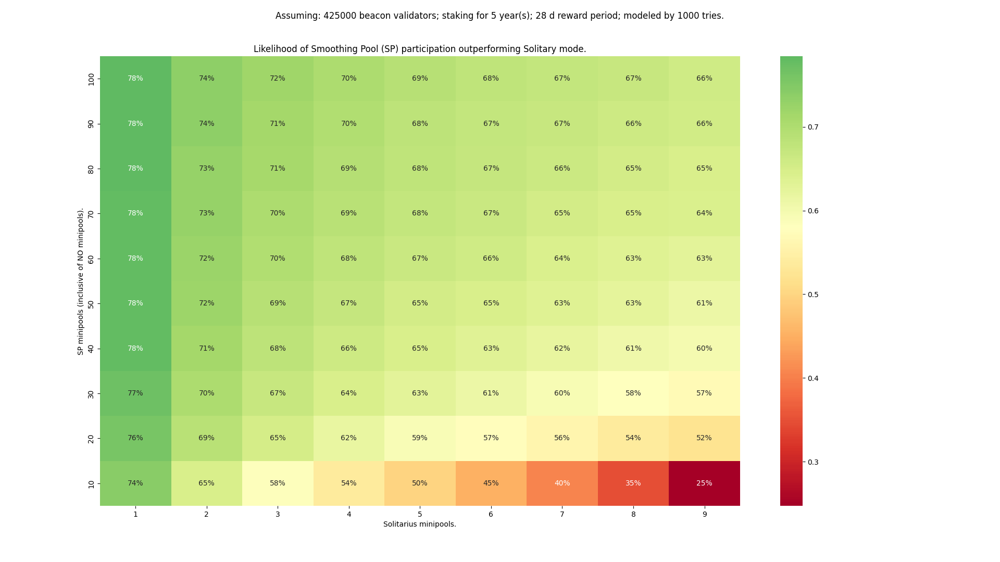

# Fee Distributors and the Smoothing Pool

Now that [the Merge](https://ethereum.org/en/upgrades/merge/) has passed, node operators receive **priority fees** (**tips**) from the transactions they include in any blocks that they propose to the Ethereum chain.
These fees come from and stay on the Execution layer.

Unlike most validation rewards which are locked on the Consensus layer (until withdrawals are enabled), these fees are *immediately liquid*.
In general, priority fees provide almost as much ETH to you as Beacon Chain rewards do, so they are a very nice benefit of the Merge.

::: tip NOTE
As a quick reminder here's a breakdown of the different types of rewards and which layer they're provided on:
- Consensus Layer (locked until withdrawals): attestations, block proposals, sync committees, slashing reports
- Execution Layer (liquid): priority fees and MEV (discussed in the next section) from block proposals
:::


## Fee Recipients

When you propose a block on the Ethereum chain, the protocol needs to know where to send the tips from each transaction included in your block.
It can't send them to your validator's address, because that's on the Consensus layer - not the Execution layer.
It can't send them to your minipool address, because it has to work for solo stakers too and solo stakers don't have an address on the Execution layer attached to their validators the way Rocket Pool does.

Instead, the way it works is fairly straightforward: when Rocket Pool starts up your Validator Client, it passes in an argument called the **fee recipient**.
The fee recipient is simply an address on the Execution layer where you want the tips to go.

Rocket Pool is designed to fairly distribute these rewards between you and the rETH pool stakers, the same way it fairly distributes your Beacon chain rewards: half (25% in the case of an 8ETH minipool) of any priority fees your minipool validators earn will go to you (plus the average commission of all of your minipools), and the other half (75% in the case of an 8ETH minipool) will go to the pool stakers (minus your average commission).

To that end, the Smartnode will automatically set your node's `fee recipient` to either of these special contracts:
- Your node's own personal **Fee Distributor** (the default)
- The **Smoothing Pool** (opt-in)

In brief, the **Fee Distributor** is a unique contract attached to your node that collects and fairly splits your priority fees between you and the rETH stakers.
It's like your own personal vault for priority fees.
Anyone (including you) can distribute its balance at any time to ensure that the rewards are always available to rETH stakers.

The **Smoothing Pool** is a special opt-in contract that allows all participating node operators to aggregate and pool their priority fees together, and distributes them evenly among the participants during each Rocket Pool rewards interval (currently every 28 days) and the rETH pool stakers.
This is a very compelling feature for node operators that don't want to worry about the luck factor involved in getting block proposals with high priority fees, and would rather have a nice, regular, consistent set of monthly earnings.

We'll cover both of these below so you understand the difference and whether or not you want to join the Smoothing Pool.


## Your Fee Distributor

Your Fee Distributor is a unique contract on the Execution Layer that's **specific to your node**.
It will hold all of the priority fees you've earned over time, and it contains the logic required to fairly split and distribute them to the rETH pool stakers and your withdrawal address.
This distribution process **can be called by anyone** (including rETH stakers), and can be done **at any time**.
It does not have a time limit before rewards expire.

The address for your node's Fee Distributor is **deterministically based on your node address**.
That means it is known ahead of time, before the Fee Distributor is even created.

New Rocket Pool nodes will automatically create (initialize) their node's Fee Distributor contract upon registration.
Nodes that were created before the Redstone upgrade will need to do this process manually.
This only needs to be run once.

One interesting ramification of this is that your Distributor's address may start accruing a balance **before** you've initialized your Fee Distributor contract.
This is okay, because your Distributor will gain access to all of this existing balance as soon as you initialize it.

**By default, your node will use its Fee Distributor as the fee recipient for your validators.**


### Viewing its Address and Balance
You can view your fee distributor's address and balance as part of:

```
rocketpool node status
```

The output will look like this:

<center>


</center>


### Initializing the Fee Distributor

To initialize your node's distributor, simply run this new command:

```
rocketpool node initialize-fee-distributor
```

::: warning NOTE
If you created your node before the Redstone update, you must call this function once before you can create any new minipools with `rocketpool node deposit`.
:::

When your distributor has been initialized, you can claim and distribute its entire balance using the following command:

```
rocketpool node distribute-fees
```

This will send your share of the rewards to your **withdrawal address**.

::: warning NOTE ON TAXABLE EVENTS
Whenever you create a new minipool, Rocket Pool will automatically call `distribute-fees`.
This is to ensure that whatever fees you had accumulated are distributed using your node's average commission, which could change when you create the new minipool.

Also, note that anyone can call `distribute-fees` on your fee distributor (to prevent you from holding rETH rewards hostage).
You may have a taxable event whenever this method is called.

Please keep these conditions in mind when deciding whether or not to use the Smoothing Pool (discussed below).
:::


## The Smoothing Pool

The **Smoothing Pool** is a unique opt-in feature of the Rocket Pool network that is available to our node operators.
Essentially, it becomes the fee recipient for every node operator that opts into it and collectively accumulates the priority fees from blocks proposed by those node operators into one large pool. During a Rocket Pool rewards checkpoint (the same ones used to distribute RPL rewards), the total ETH balance of the pool is distributed fairly to the pool stakers and the node operators that opted into it.

In essence, the Smoothing Pool is a way to effectively eliminate the randomness associated with being selected for block proposals.
If you've ever had a streak of bad luck and gone months without a proposal, or if your block proposals only have low priority fees, you may find the Smoothing Pool quite exciting.

To make the math easy to understand, community member Ken Smith has put together a [massive analysis](https://raw.githubusercontent.com/htimsk/SPanalysis/main/report/Analysis%20of%20the%20Smoothing%20Pool.pdf) comparing the profitability of the Smoothing Pool and the Fee Distributor, which is summarized nicely with this chart:

<center>



</center>

In short, as long as the Smoothing Pool has more minipools than you do, it's more likely that you'll come out ahead by joining it. You can view how many nodes and minipools are opted in using community member Peteris's excellent [Rocketscan website](https://rocketscan.io/smoothingpool).


### The Rules

The Smoothing Pool uses the following rules:

- During a Rocket Pool rewards checkpoint when the Smoothing Pool's balance is distributed, the contract's total ETH balance is split in two.
  - rETH stakers receive half, minus the **average commission** of all opted-in node operators.
  - The remainder goes to the node operators that opted in.

- Opting into the Smoothing Pool is done on a **node level**. If you opt in, all of your minipools are opted in.

- Anyone can opt in at any time. They must wait a full rewards interval (3 days on Prater, 28 days on Mainnet) before opting out to prevent gaming the system.
  - Once opted out, they must wait another full interval to opt back in.

- The Smoothing Pool calculates the "share" of each minipool (portion of the pool's ETH for the interval) owned by each node opted in.
  - The share is a function of your minipool's performance during the interval (calculated by looking at how many attestations you sent on the Beacon Chain, and how many you missed), and your minipool's commission rate.

- Your node's total share is the sum of your minipool shares.

- Your node's total share is scaled by the amount of time you were opted in.
  - If you were opted in for the full interval, you receive your full share.
  - If you were opted in for 30% of an interval, you receive 30% of your full share.

If you are interested in the complete technical details of Smoothing Pool rewards calculation, please review the [full specification here](https://github.com/rocket-pool/rocketpool-research/blob/master/Merkle%20Rewards%20System/rewards-calculation-spec.md#smoothing-pool-rewards). 


### Joining and Leaving the Smoothing Pool

To opt into the Smoothing Pool, run the following command:

```
rocketpool node join-smoothing-pool
```

This will record you as opted-in in the Rocket Pool contracts and automatically change your Validator Client's `fee recipient` from your node's distributor contract to the Smoothing Pool contract.

To leave the pool, run this command:

```
rocketpool node leave-smoothing-pool
```

This will record you as opted-out in the Rocket Pool contracts, and once a small delay has passed, will automatically change your Validator Client's `fee recipient` from the Smoothing Pool contract back to your node's Fee Distributor contract.


### Claiming Rewards from the Smoothing Pool

Rewards from the Smoothing Pool are bundled together with RPL at the end of each rewards interval using the Redstone rewards system.
Claiming them is as simple as running:

```
rocketpool node claim-rewards
```

If opted into the Smoothing Pool, you will notice that the amount of ETH you receive for each interval is more than zero:

```
Welcome to the new rewards system!
You no longer need to claim rewards at each interval - you can simply let them accumulate and claim them whenever you want.
Here you can see which intervals you haven't claimed yet, and how many rewards you earned during each one.

Rewards for Interval 0 (2022-08-04 01:35:39 -0400 EDT to 2022-09-01 01:35:39 -0400 EDT):
	Staking:        50.820133 RPL
	Smoothing Pool: 0.000000 ETH

Rewards for Interval 1 (2022-09-01 01:35:39 -0400 EDT to 2022-09-29 01:35:39 -0400 EDT):
	Staking:        40.668885 RPL
	Smoothing Pool: 0.096200 ETH

Total Pending Rewards:
	91.489018 RPL
	0.096200 ETH

Which intervals would you like to claim? Use a comma separated list (such as '1,2,3') or leave it blank to claim all intervals at once.
```

Note that the Smoothing Pool rewards in Interval 1 here indicate that the node was opted in during that interval and received rewards accordingly.

We'll cover more about claiming RPL and Smoothing Pool rewards later in the guide, in the [Claiming Rewards](./rewards.md) section.


## Next Steps

Once you've decided on whether or not you want to join the Smoothing Pool, take a look at the next section on MEV and MEV rewards.
