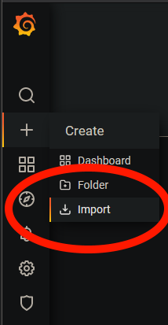
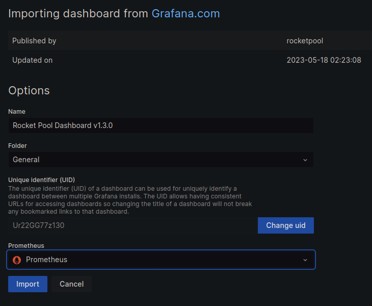
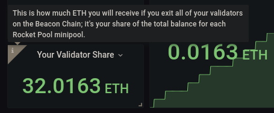
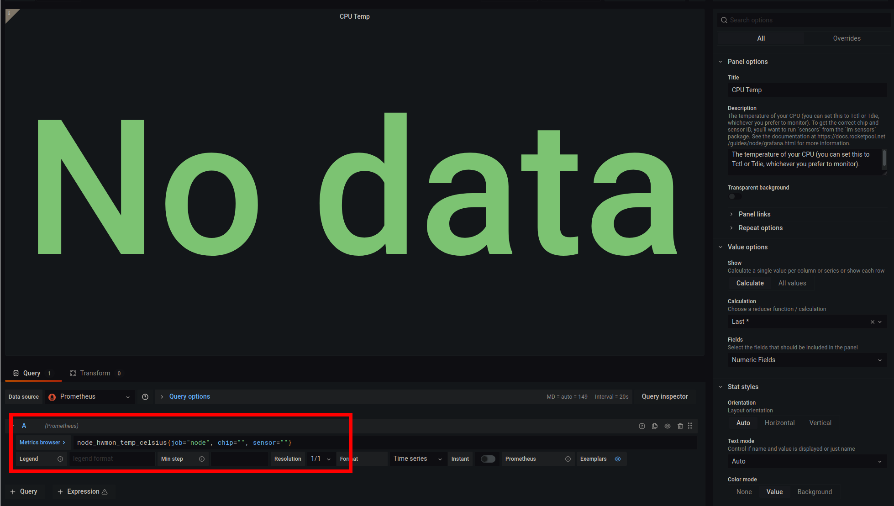
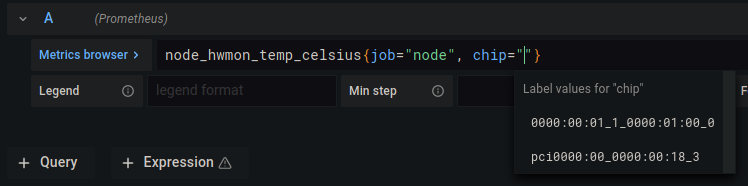
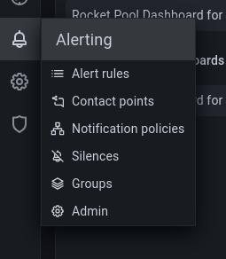
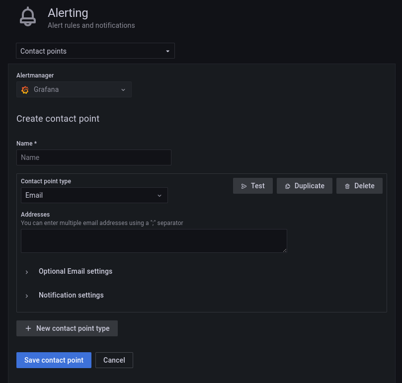

# Setting up the Grafana Dashboard

::: warning NOTE
The Smartnode metrics and dashboard are still **experimental**.
If you encounter issues while setting them up using the guides below, please report them to the Rocket Pool team on the official Discord server.

Also, note that the Smartnode's metrics collector and Grafana dashboard are *entirely optional*.
You do not need to set them up to successfully run the Smartnode stack.
:::

Now that you have your node up and running, you'll probably want to have a convenient way to monitor everything about it at a glance to make sure it's functioning correctly (and what kind of earnings it's generating for you).

There are many tools out there that do this job.
One of the most popular is called [Grafana](https://grafana.com/) - an easy-to-use, general-purpose dashboard system that you can access with a browser.

Rocket Pool comes out-of-the-box with support for Grafana and its dependencies; it even comes with a pre-built dashboard for each of the Consensus (ETH2) clients.
For example, here is a snapshot of what the dashboard for Nimbus looks like:


The pre-built dashboard was based on many rounds of feedback from the Rocket Pool community during the beta tests and the final Prater testnet.
It includes the following information all in a convenient format:

- **Top left:** some important statistics about your machine's health and performance, and any pending system updates
- **Top right:** the activity and performance of your validators on the Beacon Chain
- **Bottom left:** details about the entire Rocket Pool network, for reference
- **Bottom right:** details about your staking rewards, both ETH and RPL

In this guide, we'll show you how to enable Rocket Pool's metrics system so you can use this dashboard - or even build your own!


## Overview of the Rocket Pool Metrics Stack

Starting with Smartnode v1.0.0-RC6, the Smartnode comes with an optional supplement to the traditional stack.
It uses the following capabilities:

- [Prometheus](https://prometheus.io/) - a data collection, storage, and reporting system that captures all of the metrics you see above (any many more) and stores them, so they can be looked at over time
- The Prometheus [Node Exporter](https://github.com/prometheus/node_exporter) - a service that collects information about your machine's health (such as CPU usage, RAM usage, free disk space and swap space, etc.) and reports it to Prometheus
- Grafana, the tool that exposes Prometheus's data through a convenient website hosted on your node
- An optional custom set of scripts that will report any available Operating System updates to Prometheus, so you know if your system needs to be patched

The default configuration will create Docker containers with all of these services that live alongside the rest of the Smartnode's Docker containers.
It will open up a port on your node machine for Grafana, so you can access its dashboard from any machine on your local network with a browser.

::: warning NOTE
This guide assumes you don't have a Prometheus and Grafana setup already in use, and need to create one from scratch.
If you already have an existing setup, you can derive the necessary information for attaching the relevant metrics to your Prometheus instance using the Native mode guides below.
:::


## Enabling the Metrics Server

::::::: tabs
:::::: tab Setup for Docker Mode
Enabling metrics in Docker mode is the easiest of all.

Start by running the Smartnode configuration command again:

```
rocketpool service config
```

You will see the following question at the end:

```
Would you like to enable Rocket Pool's metrics dashboard? [y/n]
```

Enter `y`, to enable the Prometheus, Node Exporter, and Grafana Docker containers for you.
It will also modify your Consensus (ETH2) and Validator clients so they expose their own metrics to Prometheus.

For those who prefer to fine-tune their port settings, the interview will ask you if you'd like to change any of the ports used for the above services.
Note that all of these ports are restricted to Docker's internal network with the exception of the Grafana port - that will be opened on your machine (so you can access it via a browser from other machines, such as your desktop or phone) so you may want to change that if the default port conflicts with something you already have.

::::: warning NOTE
If you have UFW enabled as referenced in the [Securing your Node](./securing-your-node.md) section, you will need to open a few ports in order for outside machines to access Grafana, and to allow local connections between the Node Exporter and Prometheus.

First run:

```shell
docker inspect rocketpool_monitor-net | grep -Po "(?<=\"Subnet\": \")[0-9./]+"
```

This will return an ip in CIDR notation that looks like `172.23.0.0/16`.

Then run the following, but replace `172.23.0.0/16` with the output of the previous command:

```shell
sudo ufw allow from 172.23.0.0/16 to any port 9103 comment "Allow prometheus access to node-exporter"
```

You can then open the firewall to allow external devices access to your Grafana dashboard.
:::: tabs

::: tab Local Network
Use this if you want to access Grafana from any machine inside your local network, but deny access everywhere else.
This will be the most common use case.

Please check whether your local network uses the `192.168.1.xxx` structure first.
You may have to change the command below to match your local network's configuration if it uses a different address structure (e.g. `192.168.99.xxx`).
```shell
# This assumes your local IP structure is 192.168.1.xxx
sudo ufw allow from 192.168.1.0/24 proto tcp to any port 3100 comment 'Allow grafana from local network'
```
:::

::: tab Local Subnet
Use this if your Rocket Pool node is not connected to the same subnet as the device from which you are viewing Grafana. This may happen when your node is connected directly to your ISP's modem and the device you use to view Grafana is connected to a secondary router.

Please check whether your local network uses the `192.168.1.xxx` structure first.
You may have to change the command below to match your local network's configuration if it uses a different address structure (e.g. `192.168.99.xxx`).

```shell
# To allow any devices in the broader subnet
# for example allowing 192.168.2.20 to access
# grafana on 192.168.1.20
sudo ufw allow from 192.168.1.0/16 proto tcp to any port 3100 comment 'Allow grafana from local subnets'
```
:::

::: tab Anywhere
This will let you access Grafana from anywhere.
If you want to access it from outside your local network, you will still need to forward the Grafana port (default 3100) in your router settings.
```shell
# Allow any IP to connect to Grafana
sudo ufw allow 3100/tcp comment 'Allow grafana from anywhere'
```

:::

::::

:::::

After you reconfigure the Smartnode to enable / disable metrics, you'll have to run the following commands for the changes to take effect:

```
rocketpool service stop

rocketpool service start
```

The Operating System and Rocket Pool update tracker is **not installed by default** for maximum flexibility, but the process is simple.
If you would like to install it so your dashboard shows you how many updates are available for your system, you can do it with this command:

```
rocketpool service install-update-tracker
```

Under the hood, this will install a service that hooks into your Operating System's package manager, periodically checks for updates, and sends that information to Prometheus.
This service is different for every Operating System, but it has been confirmed to work on the following:

- Ubuntu 20.04+
- Debian 9 and 10
- CentOS 7 and 8
- Fedora 34

::: warning NOTE
Enabling the service automatically is incompatible with SELinux.
If your system has SELinux enabled by default (as is the case with CentOS and Fedora), the installation command will get you *most of the way there* but will also give you instructions on how to finish the process manually at the end.
:::

During this check, it will also compare your installed Rocket Pool Smartnode version with the latest release, and inform you if there's a new release available.

If you enabled the update tracker, then the last step is to restart the Node Exporter with the following command:

```
docker restart rocketpool_exporter
```

After that, you should be all set.
::::::

:::::: tab Setup for Hybrid Mode

*Coming soon!*

::::::

:::::: tab Setup for Native Mode

*Coming soon!*

::::::
:::::::


## Setting up Grafana

Now that the metrics server is ready, you can access it with any browser on your local network.

Refer to the tabs below for your Smartnode installation mode.

::::: tabs
:::: tab Setup for Docker Mode

Navigate to the following URL, substituting the variables with your setup as necessary:
```
http://<your node IP>:<grafana port>
```

For example, if you node's IP was `192.168.1.5` and you used the default Grafana port of `3100`, then you would go to this URL in your browser:

```
http://192.168.1.5:3100
```

You will see a login screen like this:


The default Grafana information is:

```
Username: admin
Password: admin
```

You will then be prompted to change the default password for the `admin` account.
Pick something strong and don't forget it!

::: tip Tip
If you lose the admin password, you can reset it using the following command on your node:

```shell
docker exec -it rocketpool_grafana grafana-cli admin reset-admin-password admin
```

You will be able to log into Grafana using the default `admin` credentials once again, and then you will be prompted to change the password for the `admin` account.
:::

Thanks to community member **tedsteen**'s work, Grafana will automatically connect to your Prometheus instance so it has access to the metrics that it collects.
All you need to do is grab the dashboard!

::::

:::: tab Setup for Hybrid Mode

*Coming soon!*

::::

:::: tab Setup for Native Mode

*Coming soon!*

::::
:::::


## Importing the Rocket Pool Dashboard

Now that you have Grafana attached to Prometheus, you can import the standard dashboard (or build your own using the metrics that it provides, if you are familiar with that process).

Start by going to the **Create** menu (the plus icon on the right-side bar) and click on **Import**:



When prompted for the URL, select the option from the below list based on which Consensus (ETH2) client you are using:

- Lighthouse: [https://grafana.com/grafana/dashboards/14883](https://grafana.com/grafana/dashboards/14883)
- Nimbus: [https://grafana.com/grafana/dashboards/14884](https://grafana.com/grafana/dashboards/14884)
- Prysm: [https://grafana.com/grafana/dashboards/14885](https://grafana.com/grafana/dashboards/14885)
- Teku: [https://grafana.com/grafana/dashboards/14886](https://grafana.com/grafana/dashboards/14886)

::: tip Tip
If you don't remember which client you have, you can check quickly by running `rocketpool service version` on your node.
:::

Enter one of the URLs above into the **Import via grafana.com** box and press the **Load** button.
You will be prompted with some information about the dashboard here, such as its name and where you'd like to store it (the default **General** folder is fine unless you use a lot of dashboards and want to organize them).

Under the **Prometheus** drop-down at the bottom, you should only have a single option labeled **Prometheus (default)**.
Select this option.

Your screen should look like this (using Lighthouse as an example):



If yours matches, click the **Import** button and you will be immediately taken to your new dashboard.

At first glance, you should see lots of information about your node and your validators.
Each box comes with a handy tooltip on the top left corner (the `i` icon) that you can hover over to learn more about it.
For example, here is the tooltip for the **Your Validator Share** box:





However, we aren't done setting things up yet - there is still a little more configuration to do.

::: warning NOTE
Some of the boxes (notably the APR ones) calculate their values by comparing today's value with yesterday's value.
Until the metrics server has been running for more than a day, these will say **N/A** or **No data**.

This is normal!

Just wait a day until it has enough data to calculate its values correctly.
:::


## Tailoring the Hardware Monitor to your System

Now that the dashboard is up, you might notice that a few boxes are empty such as **SSD Latency** and **Network Usage**.
We have to tailor the dashboard to your specific hardware so it knows how to capture these things.


### CPU Temp

To update your CPU temperature gauge, click the title of the **CPU Temp** box and select **Edit** from the drop down.
Your screen will now look something like this:





This is Grafana's edit mode, where you can change what is displayed and how it looks.
We're interested in the query box highlighted in red, to the right of the **Metrics browser** button.

By default, that box has this in it:

```
node_hwmon_temp_celsius{job="node", chip="", sensor=""}
```

There are two fields in this text that are currently blank: `chip` and `sensor`.
These are unique to each machine, so you'll have to fill them in based on what your machine provides.

To do this, follow these steps:

1. Remove the `, sensor=""` portion so it ends with `chip=""}`. For clarity, the whole thing should now be `node_hwmon_temp_celsius{job="node", chip=""}`.
2. Put your cursor in-between the quote marks of `chip=""` and press `Ctrl+Spacebar`. This will bring up an auto-complete box with the available options, which looks like this:





3. Select the option that corresponds to your system's CPU.
4. Once that's selected, add `, sensor=""` back into the string. Place your cursor in-between the quote marks of `sensor=""` and press `Ctrl+Spacebar` to get another auto-complete menu. Select the sensor you want to monitor.

::: tip Tip
If you don't know which `chip` or `sensor` is correct, you'll have to try all of them until you find the one that looks right. To help with this, install the `lm-sensors` package (for example, `sudo apt install lm-sensors` on Debian / Ubuntu) and run the `sensors -u` command to provide what sensors your computer has. You can try to correlate a chip ID from Grafana's list with what you see here based on their names and IDs.

For example, this is one of the outputs of our `sensors -u` command:
```
k10temp-pci-00c3
Tctl:
  temp1_input: 33.500
Tdie:
  temp2_input: 33.500
```

In our case, the corresponding chip in Grafana is `pci0000:00_0000:00:18_3` and the corresponding sensor is `temp1`.
:::

Once you're happy with your selections, click the blue **Apply** button in the top right corner of the screen to save the settings.

::: warning NOTE
Not all system expose CPU temperature info - notably virtual machines or cloud-based systems.
If yours doesn't have anything in the auto-complete field for `chip`, this is probably the case and you won't be able to monitor your CPU temperature.
:::


### SSD Latency

The **SSD Latency** chart tracks how long it takes for read/write operations to take.
This is helpful in gauging how fast your SSD is, so you know if it becomes a bottleneck if your validator suffers from poor performance.
To update the SSD you want to track in the chart, click on the **SSD Latency** title and select **Edit**.

This chart has two query fields (two textboxes) with four `device=""` portions in total.
You'll need to update all four of these fields with the device you want to track.

Simply place your cursor in-between the quote marks and press `Ctrl+Spacebar` to get Grafana's auto-complete list, and select the correct option from there for each of the `device=""` portions.
**You want to start from the leftmost empty setting first, or the auto-complete list may not appear.**

::: tip Tip
If you don't know which device to track, run the following command:

```
lsblk
```

This will output a tree showing your device and partition list, for example:

```
NAME        MAJ:MIN RM   SIZE RO TYPE MOUNTPOINT
...
loop25        7:25   0   132K  1 loop /snap/gtk2-common-themes/9
loop26        7:26   0  65,1M  1 loop /snap/gtk-common-themes/1515
nvme0n1     259:0    0 238,5G  0 disk
├─nvme0n1p1 259:1    0   512M  0 part /boot/efi
├─nvme0n1p2 259:2    0 150,1G  0 part /
├─nvme0n1p3 259:3    0  87,4G  0 part
└─nvme0n1p4 259:4    0   527M  0 part
```

If you didn't change Docker's default location to a different drive during your Smartnode installation, then the disk you want to track will be the one that your Operating System is installed on.
Look in the `MOUNTPOINT` column for an entry simply labeled `/`, then follow that back up to its parent device (the one with `disk` in the `TYPE` column).

Typically this will be `sda` for SATA drives or `nvme0n1` for NVMe drives.

If you *did* change Docker's default location to a different drive, or if you're running a hybrid / native setup, you should be able to use the same technique of "following the mount point" to determine which device your chain data resides on.
:::

Once you're happy with your selections, click the blue **Apply** button in the top right corner of the screen to save the settings.


### Network Usage

This chart tracks how much data you're sending and receiving over a particular network connection.
As you might expect, the dashboard needs to know which network you want it to track.

To change it, click on the **Network Usage** title and select **Edit**.

This chart has two query fields with two `device=""` portions in total.
You'll need to update these with the network you want to track.

Place your cursor in-between the quote marks and press `Ctrl+Spacebar` to get Grafana's auto-complete list, and select the correct option from there for each of the `device=""` portions.

::: tip Tip
If you don't know which device to track, run the following command:

```
route
```

The output will look something like this:

```
Kernel IP routing table
Destination     Gateway         Genmask         Flags Metric Ref    Use Iface
default         192.168.1.1     0.0.0.0         UG    100    0        0 eth0
192.168.1.0     0.0.0.0         255.255.255.0   U     0      0        0 eth0
192.168.1.1     0.0.0.0         255.255.255.255 UH    100    0        0 eth0
```

Look at the `Destination` column for the row with the value if `default`.
Follow that row all the way to the `Iface` column.
The device listed there is the one you want to use - in this example, `eth0`.
:::

Once you're happy with your selections, click the blue **Apply** button in the top right corner of the screen to save the settings.


### Total Net I/O

This tracks the total amount of data you've sent and received.
You might find it useful to watch if, for example, your ISP limits you to a certain amount of data per month.

The setup is identical to the **Network Usage** box above, so simply follow those instructions for this box too.


### OS Disk Space Used

This keeps tabs on how full your Operating System disk is getting, so you know when it's time to clean up (and if your chain data lives on the same drive, time to [prune Geth or Nethermind](./pruning.md)).

The steps are the same as the **SSD Latency** box above, so simply follow those instructions for this box too.
As a reminder, you want the drive that houses the partition which has `/` in the `MOUNTPOINT` column for this one because that will be your Operating System drive.


### Disk 2 Space Used

This is an optional field that tracks the free space of a second disk on your system.
It is aimed at people that keep their Operating System and chain data on separate drives.

Setting it up is the same as the **SSD Latency** box above, but instead of looking at which partition has `/` in the `MOUNTPOINT` column, you want to look for the one that has whatever your 2nd drive's mount point is.
Use the disk associated with that partition.


## Customizing the Dashboard

While the standard dashboard tries to do a good job capturing everything you'd want to see at a glance, it's quite easy to customize a Grafana dashboard however you want.
You can add new graphs, change the way graphs look, move things around, and much more!

Take a look at [Grafana's Tutorials](https://grafana.com/tutorials/) page to learn how to play with it and set it up to your liking.

## Customizing the Metrics Stack

The tools used in the Rocket Pool Metrics Stack offer a wide array of configuration options beyond what is included in the default Rocket Pool installation. This section includes configuration examples for different use cases.

In general, [Grafana configuration options](https://grafana.com/docs/grafana/latest/administration/configuration/) should be passed through using environment variables in `override/grafana.yml`. Any config option can be converted to an environment variable using the following syntax:

```
GF_<SectionName>_<KeyName>
```

### Grafana SMTP Settings for Sending Emails

To send emails from Grafana, e.g. for alerts or to invite other users, SMTP settings need to be configured in the Rocket Pool Metrics Stack.
See the [Grafana SMTP configuration](https://grafana.com/docs/grafana/latest/administration/configuration/#smtp) page for reference.

Open `~/.rocketpool/override/grafana.yml` in a text editor.
Add an `environment` section below the `x-rp-comment: Add your customizations below this line` line, replacing the values below with those for your SMTP provider.
If using Gmail and [2-Step Verification](https://support.google.com/accounts/answer/185839) is enabled, create an [App Password](https://support.google.com/mail/answer/185833?hl=en) for this service.
```yaml
version: "3.7"
services:
  grafana:
    x-rp-comment: Add your customizations below this line
    environment:
      ## SMTP settings start, replace values with those of your SMTP provider
      - GF_SMTP_ENABLED=true
      - GF_SMTP_HOST=mail.example.com:<port>  # Gmail users should use smtp.gmail.com:587
      - GF_SMTP_USER=admin@example.com
      - GF_SMTP_PASSWORD=password
      - GF_SMTP_FROM_ADDRESS=admin@example.com
      - GF_SMTP_FROM_NAME="Rocketpool Grafana Admin"
      ## SMTP server settings end
```

After making these modifications, **run the following to apply the changes**:

```
docker stop rocketpool_grafana

rocketpool service start
```

To test the SMTP settings, go to the **Alerting** menu and click **Contact points**.

<center>



</center>

Click **New contact point** and select **Email** as the Contact point type.
Enter an email address in the **Addresses** section and click **Test**.

<center>



</center>

Check to see that the test email was received.
Click **Save contact point*** when finished.
