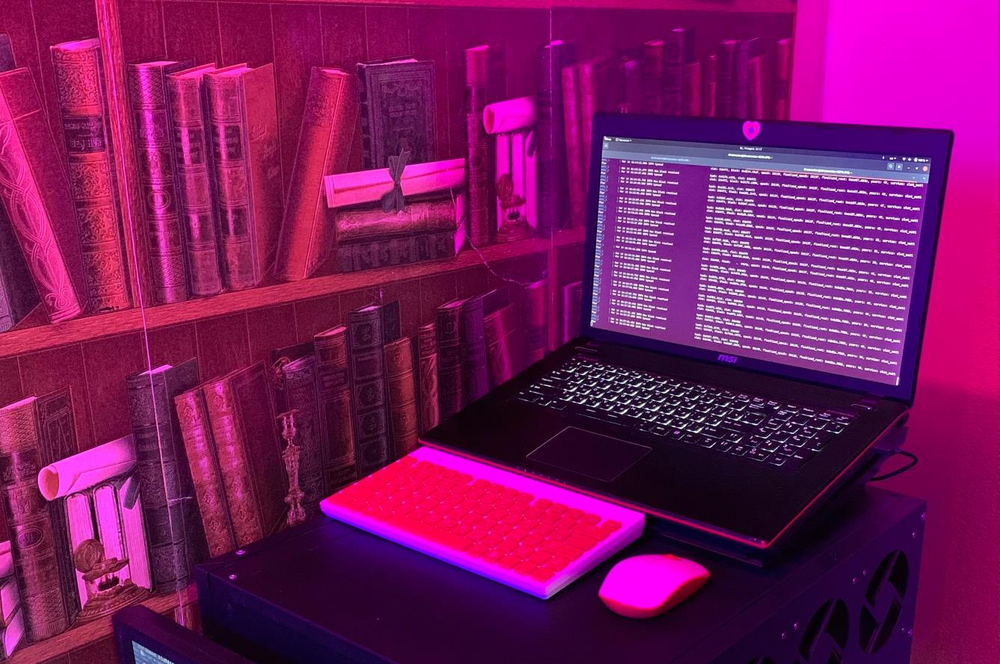
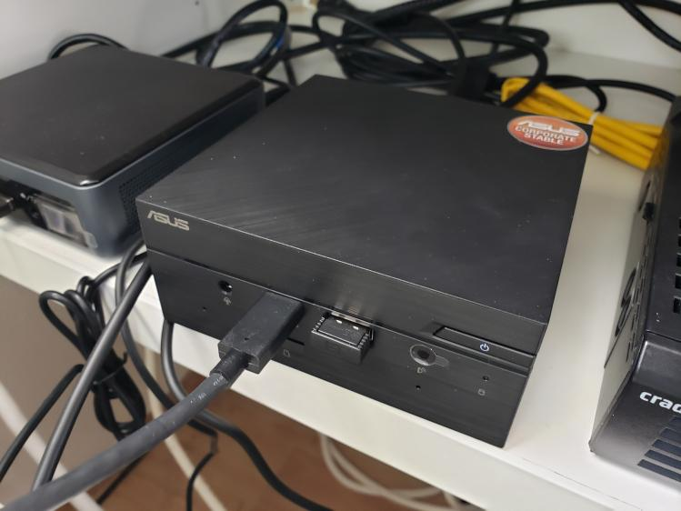
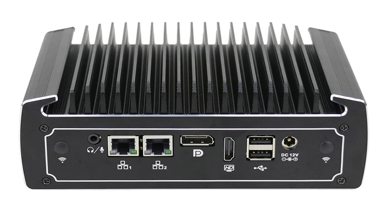

# :computer: Selecting Staking Hardware

So! You've decided that you want to run your own Rocket Pool node at home. You want to pick the hardware, you want to set it up, and you want to have complete control over everything that happens to it. You're determined to help maximize the decentralization of the Ethereum ecosystem while being as secure as you can possibly be. Outstanding!

But where do you start? How do you pick a computer that's right for you? There are dozens of guides with conflicting suggestions out there, or vague parts lists that ask you to fill in the blanks. Rather than add another one of those guides to the community, we've decided to go a slightly different route. Here, we've collected and listed a few of the staking setups that members of the Rocket Pool community have decided to share. We've tried to include a very diverse set of options so you can fully appreciate just how flexible the hardware for running a Rocket Pool node can be. We've included complete PC's and servers, small NUCs and mini-PCs, and even a Raspberry Pi in our list! We've also asked the users to describe what they like about their setups to help you understand the pros and cons of each one.

Take a look at some of Rocket Pool's staking setups below; hopefully you'll find some inspiration for your own node! 

## Full Servers and PCs

PCs and servers come in all shapes and sizes, and all manners of cost and performance. They are known for their modularity and flexibility - each component is customizable and swappable, from the motherboard to the memory. With countless options available, it can be overwhelming to settle on the right ones for you. In this section, we'll showcase a few of the varied builds that Rocket Pool's community has created for themselves.

### Xer0's Server

Discord user **Xer0** is among the many stakers that opted to go with a conventional PC form factor for their staking machine. They wanted to build a rig that would last for years and years to come with minimal maintenance and upgrading required, while still offering complete customization of every component. To that end, Xer0 devised and built a full ATX server - much like a traditional desktop PC, but targeted exclusively at staking on Ethereum. Their setup includes a six-core Xeon Bronze 3204 (1.9 GHz), 8 DDR4 slots, and an M.2 slot... though since this is essentially a home server build, the exact components are completely up to the end user.

Xer0's setup:
- Motherboard: [Supermicro X11SPI-TF](https://www.newegg.com/supermicro-mbd-x11spi-tf-o-intel-xeon-scalable-processors-single-socket-p-supported-cpu-tdp-suppor/p/1B4-005W-00153) ($440)
- CPU: [Xeon Bronze 3204](https://www.amazon.com/Intel-BX806954216-Bronze-1-9GHz-FC-LGA14B/dp/B07RTBMWVJ) ($248)
- RAM: [NEMIX 2x32GB DDR4 ECC 2933MHz](https://www.amazon.com/2x32GB-DDR4-2933-PC4-23400-Registered-Memory/dp/B07V1YG2VV) ($359)
- SSD: [Sabrent 2TB Rocket M.2 2280 SSD](https://www.newegg.com/sabrent-rocket-2tb/p/14R-00X6-00007) ($250)
- Case: [SilverStone HTPC ATX GD07B](https://www.amazon.com/dp/B007X8TQW0) ($172)
- PSU: [EVGA SuperNova 650 G3, 80+ Gold](https://www.newegg.com/evga-supernova-g3-series-220-g3-0650-y1-650w/p/N82E16817438094) ($111)
- Cooler: [Nuctua NH-D9 DX-3647 4U](https://www.amazon.com/Noctua-NH-D9-DX-3647-4U-Premium/dp/B07DPQJH5J) ($100)
- **Total: $1680**

Here are Xer0's comments on why they chose this setup:

*Obviously there is no need to build a monstrosity for simply staking on the Ethereum network, but I do have a few reasons why I built something like this.*
 
1. *Now I believe that 1 or more validators in the future will be worth much more than what we are seeing right now, so I wanted to buy something that will be able to support the network for at least the next 10-20 years without a hiccup.*
1. *By creating a machine that has at this many cores I've also given myself a lot more headroom to the point of I could run an L2 aggregator on top of this without any problems (regarding hardware) and anything else that I'd want to run on a server.* :)
1. *I like building computers, and so I built it…*
1. *With a server build, It gives me a lot more flexibility with hardware and features that most computers don't have natively.*
1. *A bit of future proof (just in-case)* :wink:

### Darcius's Shelf Rig

Rocket Pool's founder David Rugendyke (known on Discord as **darcius**) spent a long time perfecting his node. After some debate, he built a Mini-ITX that's small and portable, but still packs an enormous amount of processing power. His rig includes an 8-core Ryzen 7 5800x (3.8 GHz), two DDR4 slots, and two M.2 slots for NVMe SSDs. It is truly one of the most high-performance rigs of the Rocket Pool nodes, but with good reason: darcius runs a special type of Rocket Pool node called an Oracle Node, which relays information from the Beacon chain back to the ETH1 chain about all of the Rocket Pool validators. With thousands of Rocket Pool minipools active to watch, that job takes a lot of horsepower... but his shelf rig is easily up to the task.

Darcius's setup:
- Motherboard: [MSI MPG B550I Mini-ITX AMD](https://www.newegg.com/msi-mpg-b550i-gaming-edge-wifi/p/N82E16813144323) ($200)
- CPU: [AMD Ryzen 7 5800x](https://www.newegg.com/amd-ryzen-7-5800x/p/N82E16819113665) ($490)
- RAM: [Corsair Vengeance RGB Pro 2x16GB DDR4 3600MHz](https://www.newegg.com/p/0RN-00P8-000A5) ($390)
- SSD: [Samsung 970 EVO Plus 2TB M.2 2280 NVMe SSD](https://www.newegg.com/samsung-970-evo-plus-2tb/p/N82E16820147744) ($315)
- Case: [SilverStone SST-SG13B Mini-ITX](https://www.amazon.com/SilverStone-Technology-Mini-ITX-Computer-SST-SG13WB-USA/dp/B07MNC3JCB) ($52)
- PSU: [SilverStone Strider Platinum 550W](https://www.newegg.com/silverstone-strider-platinum-series-ps-st55f-pt-550w/p/N82E16817256154) ($140)
- **Total: $1587**

### Yorick's microATX Build

Veteran hardware enthusiast **YorickDowne** has a lot of experience building and maintaining servers. Using that knowledge, he has settled on a flexible microATX setup. His machine is considerably smaller than a typical PC, but still manages to fit in server-grade technology that maximizes resilience and uptime - key metrics when running a Rocket Pool node. He has recommendations for both Intel and AMD setups, which you can find [on his website](https://eth2-docker.net/docs/Support/Recommendations/#resources-hardware). The Intel version uses a quad core i3-9100F (3.6 GHz) or a Xeon CPU, and the AMD version suggests any Ryzen CPU that supports ECC memory. For both configurations, he suggests 16 GB of ECC RAM, and a 1 TB NVMe SSD.

Yorick's Setup:
- Motherboard: [SuperMicro X11SCL-F-O](https://www.newegg.com/supermicro-mbd-x11scl-f-o-8th-generation-intel-core-i3-pentium-celeron-processor-intel-xeon-pro/p/N82E16813183671) ($200)
- CPU: [Intel i3-9100F](https://www.newegg.com/intel-core-i3-9th-gen-core-i3-9100f/p/N82E16819118072) ($150)
- RAM: [Samsung 1x16GB DDR4 ECC UDIMM 2400MHz](https://www.newegg.com/samsung-16gb-288-pin-ddr4-sdram/p/1WK-002G-00080) ($100)
- SSD: [Samsung 970 EVO Plus 1TB M.2 2280 NVMe SSD](https://www.newegg.com/samsung-970-evo-plus-1tb/p/N82E16820147743?Item=N82E16820147743) ($165)
- Case: [SilverStone Micro ATX HTPC Case ML04B-USA](https://www.amazon.com/Silverstone-Technology-Aluminum-Center-ML04B-USA/dp/B07PD8CL7P/) ($110)
- PSU: Any (example: [Seasonic PRIME Fanless PX-500 Platinum 500W](https://www.newegg.com/seasonic-prime-fanless-px-500-500w/p/N82E16817151234)) ($161)
- Case fans: Any
- **Total: About $886**

Here are Yorick's comments on why he chose this setup:
- *It is at the same or lower cost as some NUCs*
- *It has ECC RAM, which means that if memory fails - which it does now and then - I will know, because the system will tell me. I do not have to run memtest87 for 4-5 days to figure out whether my problem with instability is even memory-related. I protect my time fiercely so I can spend it bloviating on Discord instead of troubleshooting hardware*
- *It has IPMI, which is remote management via Ethernet/browser of the entire machine, including UEFI and power-cycle. I should be allowed to go on extended vacation and still have full remote access.*
- *If I want redundant storage so eventual SSD failure is a non-event, I can do that*
- *It allows for great flexibility in build choices. I can choose however much RAM and compute I want; I can choose to run a NAS with virtualization tech like TrueNAS Scale and run the node on there alongside some other home-servery stuff.*

### Drez's Laptop

Sometimes, shelling out for new hardware just doesn't make sense. In Discord user **Drez**'s case, runnning a Rocket Pool node is one of those times. Drez happened to have a spare laptop lying around, and they turned it into a node with ease. Their machine comes with a quad core i7-4710HQ (2.5 GHz), two DDR3 slots, and a 2.5" SATA slot. Being a laptop, it also comes with its own battery (which offsets the need for a UPS). They added some additional upgrades over time, giving the laptop even more power for extra peace of mind.

Drez's setup:
- Laptop: [MSI GE70 2PE Apache Pro](https://www.msi.com/Laptop/GE70-2PE-Apache-Pro/Specification) ($1800)
- RAM: 2x8GB DDR3 1333Mhz (Included)
- SSD: [Samsung 860 EVO 1TB 2.5" SATA](https://www.amazon.com/Samsung-Inch-Internal-MZ-76E1T0B-AM/dp/B078DPCY3T) ($110)
- **Total: $1910**

Here are Drez's comments on why they chose this setup:

*Main reason i am gonna stake on this laptop is because i already had spare one and dont need to spend extra money on new server. I like its mobility, compactness, built-in screen for easy monitoring. In case of overheating i bought a laptop cooling pad and spare CPU cooler just in case, i also recommend to change thermal compound paste especially if your gonna run on an older machine*

## NUCs (Next Unit of Computing) and Mini-PCs

Running a Rocket Pool node doesn't necessarily require a complete build-it-yourself desktop. In fact, one of the most popular setups among stakers is the illustrious NUC. A NUC (Next Unit of Computing) is essentially a small, self-contained computer that is designed around very low power usage and maximum efficiency. NUCs are great for most stakers that only run a few validators because of their low maintenance, low monthly running costs, and ease of setup. Unlike PCs, NUCs come preassembled in a case; all you need to do is add some RAM, add an SSD, and you're up and running! Below are a few examples of NUC setups that some Rocket Pool veterans use and recommend. 

### Ken's NUC8i5BEK

The NUC8i5BEK is one of Intel's own NUCs with an 8th-generation processor. Released in 2018, this model comes with a quad core i5-8259U CPU (2.30 GHz), two DDR4 slots, an M.2 slot for SSDs, and USB 3.1 ports. It normally draws about 20 watts, but Discord user **Ken** has been able to optimize it down to 9 watts during normal validation. It is more than capable of handling any ETH1 and any ETH2 client, making it an excellent choice for a lightweight, efficient node machine.

Ken's Setup:
- Base: [Intel NUC8i5BEK](https://www.amazon.com/Intel-NUC-Mainstream-Kit-NUC8i5BEK/dp/B07GX67SBM) ($349)
- RAM: [Dell Memory Upgrade - 1x16GB DDR4 SODIMM 3200MHz](https://www.dell.com/en-us/shop/dell-memory-upgrade-16gb-1rx8-ddr4-sodimm-3200mhz/apd/ab371022/memory) ($112)
- SSD: [ADATA XPG S7 Series 2TB M.2 2280 NVMe SSD](https://www.amazon.com/XPG-S7-Gen3x4-Solid-State/dp/B08BDZQJP5) ($230)
- Fanless Case (optional): [AKASA Turing Fanless case](https://www.amazon.com/Akasa-Compact-fanless-Generation-NUC45-M1B/dp/B07RTBF1SY) ($134)
- **Total: $691 to $825**

Here are Ken's comments on why he chose this setup:

*Small size and footprint, power supply is a brink on the power cord (like a laptop), single-board computer, x86 architecture, low purchase price point, low power consumption (~10W), 3-year warranty, and an active manufacture product line (intel). 8th generations are plenty fast and at a lower price point than the latest generation chips. I upgraded to a fan-less (passively cooled) case so the NUC is absolutely silent (0 db) as I’m leaving it my home office (a stock NUC is near silent already). Plus no mechanical wear on the fan bearings. Resale or re-purpose value if I decide to retire this hardware platform as my RP node - NUC’s make a great workstation computer.*

### GreyWizard's NUC10i7FNH

The NUC10i7FNH is another one of Intel's own NUCs. This one sports a 10th-generation processor, and was released in 2019. It comes with a six core i7-10710U CPU (1.10 GHz, boosts to 4.7 GHz), two DDR4 slots, an M.2 slot and a 2.5" slot for SSDs, and USB 3.1 ports. It draws about 20 watts of power. It is an incredibly powerful machine, given its power consumption and size. Discord user **GreyWizard** uses this NUC for his node - the extra power gives him peace of mind knowing that no matter what the future of the Ethereum 2.0 chain holds, his machine will be able to handle it.

GreyWizard's Setup:
- Base: [Intel BXNUC10I7FNH1](https://www.newegg.com/intel-bxnuc10i7fnh1/p/N82E16856102227) ($445)
- RAM: 2x [Samsung M471A4G43MB1 32GB DDR4 SODIMM 2666 MHz](https://www.newegg.com/samsung-32gb-260-pin-ddr4-so-dimm/p/0RM-002H-00156) ($154 ea.)
- SSD: [Samsung 970 EVO Plus 2TB M.2 2280 NVMe SSD](https://www.newegg.com/samsung-970-evo-plus-2tb/p/N82E16820147744) ($315)
- **Total: $1068**

Here are GreyWizard's comments on why he chose this setup:

*I went with the i7 NUC mostly because it felt like the best combination of outstanding performance relative to overall size and overhead. I also looked at other options like building a Micro ATX-sized machine. After pricing one with the specs I was looking for, this Intel NUC ended up being about the same price, and the form factor is really tough to beat. I like having the extra headroom for performance/peace of mind, and I acknowledge that this is almost certainly way overkill. I consider staking as a serious investment and I don't want to worry if my hardware will be sufficient.*

*Tips for other people considering this as an option...*
- *The NUC does run pretty warm, similar temps to a laptop. If you worry about CPU temp and you want something powerful, then you should look at small desktop setups like Micro ATX.*
- *You will want to make sure there is plenty of room around your NUC for airflow. Plan to clean the area regularly to prevent dust buildup.*
- *Make sure to check compatibility for your RAM cards. The different NUCs support varying degrees of total RAM, RAM speeds, etc.*
- *If you go with the NUC, I'd suggest you give yourself room to grow when selecting RAM... For example, spend a bit extra and get a single 32gb RAM card rather than 2x16 so you can expand later if you want (assuming your NUC will support 64gb in this example)*
- *Feel free to reach out to me on Discord if you would like to discuss.*

### Actioncj17's PN50

The ASUS PN50 is a mini-PC, which shares a lot in common with Intel's NUC family. It has a very small form factor but has all the components and features of a full PC. It comes with your choice of AMD CPU so you can balance between performance and cost (up to an 8-core Ryzen R7-4700U at 2.0 GHz), two DDR4 slots, an M.2 slot and a 2.5" slot for SSDs, and USB 3.1 ports. It also comes with a 90 watt power supply, though in practice it doesn't require that much power while acting as a Rocket Pool node. Discord user **actioncj17** has tried several different setups, but prefers the PN50 over everything... though they happily admit that it's overkill for running a Rocket Pool node.

Actioncj17's Setup:
- Base: [ASUS PN50 4700u](https://www.newegg.com/asus-pn50-bbr066md/p/N82E16856110206) ($583)
- RAM: [HyperX Impact 2x16GB DDR4 SODIMM 3200MHz](https://www.newegg.com/hyperx-32gb-260-pin-ddr4-so-dimm/p/N82E16820104836) ($220)
- SSD: [Samsung 970 EVO Plus 2TB M.2 2280 NVMe SSD](https://www.newegg.com/samsung-970-evo-plus-2tb/p/N82E16820147744) ($315)
- **Total: $1118**

Here are actioncj17's comments on why they chose this setup:

*My answer to why I chose the Asus PN50 is quite simple. I wanted to see how badass AMD's Ryzen 7 4700U was. Let’s just say I’m not disappointed. I actually started with the Intel NUC10FNK. I put 32gb of ram and 1tb 970 evo plus nvme m.2 in the nuc and it blazes. I have no complaints with the nuc and it works fine but I get more out of my PN50. I’d say both setups are overkill for staking on Rocketpool but a little future proofing doesn’t hurt. They both have small footprints and the nuc is actually much quieter since it is fanless. All in all the PN50 is a better bang for your buck if you can get your hands on one.*

### Moralcompass's Mini-PC

Discord user **moralcompass** went a similar route to actioncj17 by selecting a mini-PC, but their preference is for an Intel CPU. They use a mini PC that sports a quad core i5 8250U (1.6 GHz, boost up to 3.4 GHz), one DDR4 slot, an M.2 slot and a 2.5" slot for SSDs, and USB 3.0 ports. Moralcompass claims that it only pulls about 10 watts from the wall, which demonstrates that mini PCs like this are very efficient. The interesting thing about this choice is that it is completely passively cooled - no fans to be found! While there are many variations of fanless mini PCs, moralcompass found one that worked for them and has stuck with it.

Moralcompass's Setup:
- Base: [Partaker Fanless Mini PC - i5 8250U](https://www.aliexpress.com/item/1005001867740130.html?spm=a2g0s.9042311.0.0.66e94c4d0ORiVh) ($387 to $790 depending on your discounts)
- RAM: [Crucial 1x32GB DDR4 SODIMM 2666MHz](https://www.newegg.com/crucial-32gb-260-pin-ddr4-so-dimm/p/N82E16820156239) ($153)
- SSD: [Silicon Power 1TB M.2 2280 NVMe SSD](https://www.amazon.com/Silicon-Power-Gen3x4-000MB-SU001TBP34A80M28AB/dp/B07L6GF81L) ($115)
- **Total: $655 to $1058**, depending on discounts

Here are moralcompass's comments on why they chose this setup:
- *No moving parts, no noise.*
- *Dual intel NIC (in case I decide to repurpose this as my router one day)*
- *NVME + SATA slots (prefer NVME for speed and options with higher TBW endurance. SATA gives option of HDD or SSD. I avoided M.SATA interfaces because these SSDs seem to be turning legacy)*
- *USB and serial ports available for graceful shutdown signal from UPS*

## Jcrtp's Raspberry Pi

This is certainly the most controversial option on the hardware example list. Raspberry Pi's are credit-card sized "single board computers" that include a CPU and RAM built directly onto the board. They are also quite cheap, with the most powerful model only costing $80. While they were originally intended as a simple option to help teach young students how to program, the hardware hacking community has become enamored with these capabile little computers and have employed them in hundreds of use cases... including staking! It comes with a quad core ARM64 processor at 1.5 GHz (overclockable to 2.1 GHz), up to 8 GB of DDR4 RAM, and only draws 5 to 8 watts during use.

Despite the general consensus in the Ethereum space that Raspberry Pi's should not be used for staking, Discord user **jcrtp** is confident that his configuration can handle the load of being a Rocket Pool node ([click here for his guide](https://github.com/jclapis/rp-pi-guide/blob/main/Overview.md)). This makes it the cheapest and lowest power option currently available, but offers the least amount of overhead or flexibility if the future of Ethereum staking demands higher performance. 

Jcrtp's Setup:
- Base: [Raspberry Pi 4B 8GB Basic Kit](https://www.amazon.com/CanaKit-Raspberry-Basic-Kit-8GB/dp/B08DJ9MLHV/ref=sr_1_2?dchild=1&keywords=raspberry+pi+4b+8gb&qid=1616386386&sr=8-2) ($90)
- MicroSD Card: [Samsung EVO Select 32GB U1 MB-ME32GA/AM](https://www.amazon.com/Samsung-MicroSDHC-Adapter-MB-ME32GA-AM/dp/B06XWN9Q99) ($7)
- Case: [3D Printed from Thingiverse](https://www.thingiverse.com/thing:3793664) ($2)
- Fan: [Scythe Mini Kaze 2 40mm Fan](https://www.amazon.com/Scythe-Mini-Quiet-3500RPM-Single/dp/B07ZHMTRK6) ($7)
- SSD: [Samsung T5 1TB Portable SSD](https://www.amazon.com/Samsung-T5-Portable-SSD-MU-PA1T0B/dp/B073H552FJ) ($120)
- **Total: $226**

Here are jcrtp's comments on why he chose this setup:

*I think of staking as the antithesis to PoW mining. Proof-of-stake offers the same, if not better, security as proof-of-work but prides itself on requiring much, much fewer computational resources. My goal is to take this to the extreme, and run my Rocket Pool node with the lowest possible power consumption without sacrificing the security of the network. After experimenting for a few months, I've found a configuration for the Raspberry Pi that can accomplish both of these goals. Sure, you can get down to 10 watts with a NUC and have more headroom... but that's not the point. Having an $80, 5-watt machine contribute to the security of Ethereum as well as a $10,000 rack-mount server just makes me happy.*