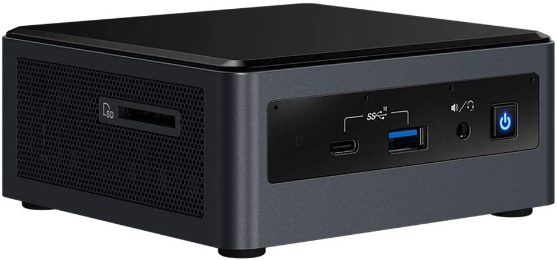

# :computer: Selecting Staking Hardware

TBD. This guide is for people that want to run a node at home (so no VPS). It is meant to capture some various options for node hardware based on my survey of the RP Discord server. Each option here comes from one user ("advocate"). For each one, I'm collecting the complete hardware laydown, the motivation for why the advocate selected it, and pros and cons.

## Full Server or PC

Running a Rocket Pool node 

### Xer0's Server

### Darcius's Shelf Rig

### Yorick's Mini / Micro ATX Build

## NUCs (Next Unit of Computing) and Mini PCs

Running a Rocket Pool node doesn't necessarily require a complete build-it-yourself desktop. In fact, one of the most popular setups among stakers is the illustrious NUC. A NUC (Next Unit of Computing) is essentially a small, self-contained computer that is designed around very low power usage and maximum efficiency. NUCs are great for most stakers that only run a few validators because of their low maintenance, low monthly running costs, and ease of setup. Below are a few examples of NUC setups that some Rocket Pool veterans use and recommend. 

### Ken's NUC8i5BEK

The NUC8i5BEK is one of Intel's own NUCs with an 8th-generation processor. Released in 2018, this model comes with a quad core i5-8259U CPU (2.30 GHz), two DDR4 slots, an M.2 slot for SSDs, and USB 3.1 ports. It normally draws about 20 watts, but Discord user Ken has been able to optimize it down to 9 watts during normal validation. It is more than capable of handling any ETH1 and any ETH2 client, making it an excellent choice for a lightweight, efficient node machine.

Ken's Setup:

- Base: [Intel NUC8i5BEK](https://www.amazon.com/Intel-NUC-Mainstream-Kit-NUC8i5BEK/dp/B07GX67SBM) ($349)
- RAM: [Dell Memory Upgrade - 1x16GB DDR4 SODIMM 3200MHz](https://www.dell.com/en-us/shop/dell-memory-upgrade-16gb-1rx8-ddr4-sodimm-3200mhz/apd/ab371022/memory) ($112)
- SSD: [ADATA XPG S7 Series 2TB M.2 2280 NVMe SSD](https://www.amazon.com/XPG-S7-Gen3x4-Solid-State/dp/B08BDZQJP5) ($230)
- Fanless Case (optional): [AKASA Turing Fanless case](https://www.amazon.com/Akasa-Compact-fanless-Generation-NUC45-M1B/dp/B07RTBF1SY) ($134)
- **Total: $691 to $825**

Here are Ken's comments on why he chose this setup:

*Small size and footprint, power supply is a brink on the power cord (like a laptop), single-board computer, x86 architecture, low purchase price point, low power consumption (~10W), 3-year warranty, and an active manufacture product line (intel). 8th generations are plenty fast and at a lower price point than the latest generation chips. I upgraded to a fan-less (passively cooled) case so the NUC is absolutely silent (0 db) as I’m leaving it my home office (a stock NUC is near silent already). Plus no mechanical wear on the fan bearings. Resale or re-purpose value if I decide to retire this hardware platform as my RP node - NUC’s make a great workstation computer.*

### GreyWizard's NUC10i7FNH

The NUC10i7FNH is another one of Intel's own NUCs. This one sports a 10th-generation processor, and was released in 2019. It comes with a six core i7-10710U CPU (1.10 GHz, boosts to 4.7 GHz), two DDR4 slots, an M.2 slot and a 2.5" slot for SSDs, and USB 3.1 ports. It draws about 20 watts of power. It is an incredibly powerful machine, given its power consumption and size. Discord user GreyWizard uses this NUC for his node - the extra power gives him peace of mind knowing that no matter what the future of the Ethereum 2.0 chain holds, his machine will be able to handle it.

GreyWizard's Setup:

- Base: [Intel BXNUC10I7FNH1](https://www.newegg.com/intel-bxnuc10i7fnh1/p/N82E16856102227) ($445)
- RAM: 2x [Samsung M471A4G43MB1 32GB DDR4 SODIMM 2666 MHz](https://www.newegg.com/samsung-32gb-260-pin-ddr4-so-dimm/p/0RM-002H-00156) ($154 ea.)
- SSD: [Samsung 970 EVO Plus 2TB M.2 2280 NVMe SSD](https://www.newegg.com/samsung-970-evo-plus-2tb/p/N82E16820147744) ($315)
- **Total: $1068**

### Actioncj17's PN50

The ASUS PN50 is a mini PC, which shares a lot in common with Intel's NUC family. It has a very small form factor but has all the components and features of a full PC. It comes with an 8-core Ryzen R7-4700U (2.0 GHz), two DDR4 slots, an M.2 slot and a 2.5" slot for SSDs, and USB 3.1 ports. It also comes with a 90 watt power supply, though in practice it doesn't require that much power while acting as a Rocket Pool node. Discord user actioncj17 has tried several different setups, but prefers the PN50 over everything... though they happily admit that it's overkill for running a Rocket Pool node.

Actioncj17's Setup:
- Base: [ASUS PN50 4700u](https://www.newegg.com/asus-pn50-bbr066md/p/N82E16856110206) ($583)
- RAM: [HyperX Impact 2x16GB DDR4 SODIMM 3200MHz](https://www.newegg.com/hyperx-32gb-260-pin-ddr4-so-dimm/p/N82E16820104836) ($220)
- SSD: [Samsung 970 EVO Plus 2TB M.2 2280 NVMe SSD](https://www.newegg.com/samsung-970-evo-plus-2tb/p/N82E16820147744) ($315)
- **Total: $1118**

Here are actioncj17's comments on why they chose this setup:

*My answer to why I chose the Asus PN50 is quite simple. I wanted to see how badass AMD's Ryzen 7 4700U was. Let’s just say I’m not disappointed. I actually started with the Intel NUC10FNK. I put 32gb of ram and 1tb 970 evo plus nvme m.2 in the nuc and it blazes. I have no complaints with the nuc and it works fine but I get more out of my PN50. I’d say both setups are overkill for staking on Rocketpool but a little future proofing doesn’t hurt. They both have small footprints and the nuc is actually much quieter since it is fanless. All in all the PN50 is a better bang for your buck if you can get your hands on one.*

### Moralcompass's Mini PC

## Raspberry Pi!

### Me!