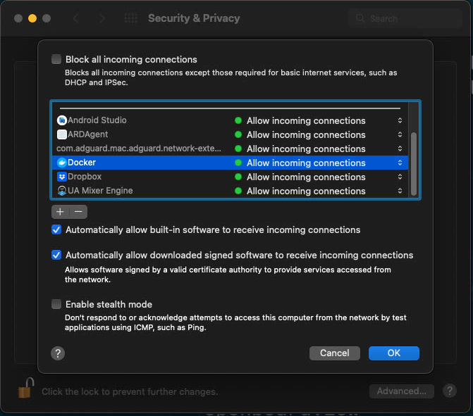

# Preparing a Mac

Before installing Rocket Pool, there are a few checks you should do to make sure your system is compatible and will work correctly.

::: danger
We strongly encourage you to create a dedicated machine for running a Rocket Pool node.
Running a node on a general-use machine, such as your daily work desktop, presents extra security risks that may compromise your wallet and result in the theft of your coins.

**For maximum safety, please build a new machine that is dedicated exclusively to running a node.**
:::


## System Requirements

Below is a brief description of the software and hardware requirements that a Rocket Pool node requires.
This guide assumes that you already have your machine physically built, and the operating system installed.


### Supported Operating Systems

Rocket Pool recommends you use the latest version of macOS for your hardware.

### macOS Support

You will need to install the following pre-requisites:

```Docker Desktop``` by [downloading the binary](https://www.docker.com/products/docker-desktop) installer from the website and dragging it to your Applications folder.

```XCode Command Line Tools``` can be downloaded by opening up the Terminal application (located in /Applications/Utilties) and executing the following command:

```
xcode-select --install
```

We highly recommend using [Homebrew](https://brew.sh) as your package manager for Mac. It allows you to install packages easily using the ```brew``` command.

For example, to install ```wget``` using Homebrew execute the following command in the Terminal:

```
brew install wget
```

Please ensure your Firewall (Settings -> Security & Privacy -> Firewall) is turned on and Docker Desktop is added to the list of applications allowing incoming connections.




### Hardware Requirements

The hardware requirements for a node depend largely on which Execution (ETH1) and Consensus (ETH2) clients you decide to run.
As shown in [the hardware guide](./hardware.md), there is a wide range of possible configurations that work well.
However, for the sake of completeness, we have assembled the following hardware profiles:


#### Low-Power Full Node
- CPU: Quad-core 1.6+ GHz
- RAM: 8 GB DDR4 2400 MHz
- SSD: 1 TB*, 15k Read IOPS, 5k Write IOPS**
- Network: 10+ Mbps, 1.5+ TB monthly data cap
- ETH1: Geth (in low-cache mode), Infura, Pocket
- ETH2: Nimbus, Prysm


#### Typical Full Node
- CPU: Quad-core, 2.6+ GHz
- RAM: 16 GB DDR4 3200 MHz
- SSD: 1 TB*, 15k Read IOPS, 5k Write IOPS**
- Network: 25+ Mbps, 1.5+ TB monthly data cap
- ETH1: Any
- ETH2: Any


*\* Note that for mainnet, at the time of this article, 1 TB is sufficient but **2 TB is recommended**.
The eth1 blockchain [grows quickly](https://ycharts.com/indicators/ethereum_chain_full_sync_data_size), so 2 TB will offer better future-proofing.
The larger your storage, the longer you can go between needing to reclaim space by pruning.*

### Installing and Using SSH

SSH should already be installed with macOS.

### Pre-installation System Checks

Before installing Rocket Pool, please review the following checklist:

- Your system is fully built, powers on, and can boot into the operating system.
- You will not do any other activity on the system, such as browsing the Internet, checking email, or playing games.
- You have a macOS operating system installed.
- Your user account has root / administrator privileges.
- You have an SSD that meets the performance requirements.
- Your SSD is mounted on your file system.
- You have at least 800 GB of space free for the initial ETH1 and ETH2 syncing process.
- If your ISP caps your data, it is more than 1.5 TB per month.

If you have checked and confirmed all of these items, then you are ready to install Rocket Pool and begin running a node!
Move on to the [Choosing your ETH Clients](../eth-clients.md) section.
