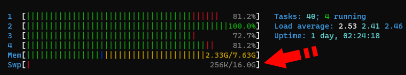

# Preparing a PC, Mini-PC, or NUC

Before installing Rocket Pool, there are a few checks you should do to make sure your system is compatible and will work correctly.

::: danger
We strongly encourage you to create a dedicated machine for running a Rocket Pool node.
Running a node on a general-use machine, such as your daily work desktop or a gaming rig, presents extra security risks that may compromise your wallet and result in the theft of your coins.

**For maximum safety, please build a new machine that is dedicated exclusively to running a node.**
:::


## System Requirements

Below is a brief description of the software and hardware requirements that a Rocket Pool node requires.
This guide assumes that you already have your machine physically built, and the operating system installed.


### Supported Operating Systems

Rocket Pool's Smartnode client currently supports **Linux** and **macOS** systems.

At this time, **Windows** can be used to remotely manage a remote Linux or Mac machine, but the Smartnode itself cannot currently run on a Windows system. However, Rocket Pool *can* be run on a Linux [virtual machine](https://en.wikipedia.org/wiki/System_virtual_machine) hosted by a Windows machine.
This setup is not recommended over simply installing Linux as the host operating system, but it does work if necessary.
Note that it will require extra resource overhead, and comes with its own set of security risks, so we do not advise using this setup when staking real Ether on the main network.

Rocket Pool is natively compatible with **AMD64 (x64)** and **arm64 (aarch64)** CPU architectures.
For other architectures, you will need to compile the smartnode clients from source.

Note that the user must have **root / Administrator** access (or **sudo** privileges) to install the Smartnode.


#### Linux Support

There are many variants of the Linux OS (called distributions, or **distros** for short). While you can run Rocket Pool from any modern distro, Rocket Pool's installer can automatically install the entire stack on [Ubuntu](https://ubuntu.com/about), [Debian](https://www.debian.org/intro/why_debian), [CentOS](https://www.centos.org/about/), and [Fedora](https://docs.fedoraproject.org/en-US/project/).

::: warning NOTE
If you plan to use Ubuntu, we strongly recommend using an **LTS** release such as 20.04.
These releases are actively maintained for longer periods of time, which helps with the security and stability of your node.
:::

For installation on other distros, the Smartnode installer will not be able to automatically install some system dependencies (such as `docker-compose`).
Some manual steps will be required during installation.

For `arm64` systems, the Smartnode installer only natively supports Debian and Debian-based distros such as Ubuntu.
For other distros, manual steps will be required during installation.


### Hardware Requirements

The hardware requirements for a node depend largely on which Execution and Consensus clients you decide to run.
As shown in [the hardware guide](./hardware.md), there is a wide range of possible configurations that work well.
However, for the sake of completeness, we have assembled the following hardware profiles:


#### Low-Power Full Node
- CPU: Quad-core 1.6+ GHz
- RAM: 8 GB DDR4 2400 MHz
- SSD: 2 TB, 15k Read IOPS, 5k Write IOPS*
- Network: 10+ Mbps, 1.5+ TB monthly data cap
- Execution Client: Geth (in low-cache mode)
- Consensus Client: Nimbus


#### Typical Full Node
- CPU: Quad-core, 2.6+ GHz
- RAM: 16 GB DDR4 3200 MHz
- SSD: 2 TB, 15k Read IOPS, 5k Write IOPS*
- Network: 25+ Mbps, 1.5+ TB monthly data cap
- Execution Client: Any
- Consensus Client: Any

*\* If you are unsure if your disk meets these performance requirements, `fio` is a good way to test them.
See [here](https://arstech.net/how-to-measure-disk-performance-iops-with-fio-in-linux/) for Linux instructions, and [here](https://www.nivas.hr/blog/2017/09/19/measuring-disk-io-performance-macos/) for MacOS instructions.*


## Installing the Operating System

If you're using macOS, it's highly likely that you already have the Operating System installed and can skip this step.

If you're installing Linux from scratch, each of the distributions listed above come with helpful and detailed tutorials for installing the Operating System from scratch.
As an example though, we will walk you through the process of installing and preparing **Debian Server**.
Debian is a good choice for node operation because it focuses on **maximum stability and reliability** - both of which are highly desirable for node machines that must be running 24/7.

[Here is a good step-by-step guide](https://itslinuxfoss.com/debian-11-bullseye-guide/) with screenshots that shows you how to install Debian on your node machine from scratch. 

::: tip
We have a few helpful amendments to the guide linked above, which you may want to follow:

- When prompted to set up a **root password**, we recommend leaving it **blank**. This will disable the `root` account and instead install the `sudo` package, allowing your user to perform root operations by re-entering its password to elevate its permissions. This is analogous to the way Ubuntu Linux is set up, which may be more familiar to users.
- In the **Software selection** screen towards the end, you may not want to have a desktop GUI installed.
  - Desktop GUIs are largely unnecessary for a node; they add extra overhead and most of the time will not be used since you'll be remote controlling it via the terminal anyway, so we prefer to **uncheck GNOME** here.
  - If you *do* want a desktop UI on your node, we recommend you **uncheck GNOME and check XFCE** instead, as it's lighter on system resources.
  - Uncheck **web server**, but leave **SSH server** and **standard system utilities** checked.
:::


### Installing `sudo`

Rocket Pool's installer requires the `sudo` program to acquire all of its dependencies.
If you left the **root user password blank** in the previous step, you will already have this.
If not, please install it now by running the following commands:

```
apt update
```

```
apt install sudo
```

```
usermod -aG sudo $USER
```

Then restart the machine.
You should now be able to run commands via `sudo` such as `sudo apt update`. 


### Using SSH

Once the server is installed and you're able to log in, you need to get its IP address.
An easy way to do this is with `ifconfig` which is built into the 'net-tools' package:

```
sudo apt update
```
```
sudo apt install net-tools
```
```
sudo ifconfig
```

You may see several entries here, but the one you want to look for is going to look something like this:

```
eth0: flags=4163<UP,BROADCAST,RUNNING,MULTICAST>  mtu 1500
      inet 192.168.1.8  netmask 255.255.255.0  broadcast 192.168.1.255
      inet6 fe80::96f2:bf29:e269:1097  prefixlen 64  scopeid 0x20<link>
      ether <mac address>  txqueuelen 1000  (Ethernet)
      ...
```

The flags should say `UP,BROADCAST,RUNNING,MULTICAST`.
The `inet` value (here `192.168.1.8`) is your machine's local IP address.

Next, install SSH:

```
sudo apt install openssh-server
```

::: tip NOTE
If you had the **SSH server** box checked during Debian's installation, you should already have this installed so this command won't do anything.
:::

Once this is done, you can log into the machine's terminal remotely from your laptop or desktop using `ssh`.

If you aren't familiar with `ssh`, take a look at the [Intro to Secure Shell](../ssh.md) guide.

::: warning NOTE
At this point, you should *strongly consider* configuring your router to make your node's IP address **static**.
This means that your node will have the same IP address forever, so you can always SSH into it using that IP address.
Otherwise, it's possible that your node's IP could change at some point, and the above SSH command will no longer work.
You'll have to enter your router's configuration to find out what your node's new IP address is.

Each router is different, so you will need to consult your router's documentation to learn how to assign a static IP address.
:::


## Setting up Swap Space

In most cases, if you choose your Execution (ETH1) and Consensus (ETH2) clients and your instance type carefully, you should not run out of RAM.
Then again, it never hurts to add a little more.
What we're going to do now is add what's called **swap space**.
Essentially, it means we're going to use the SSD as "backup RAM" in case something goes horribly, horribly wrong and your server runs out of regular RAM.
The SSD isn't nearly as fast as the regular RAM, so if it hits the swap space it will slow things down, but it won't completely crash and break everything.
Think of this as extra insurance that you'll (most likely) never need.


### Creating a Swap File

The first step is to make a new file that will act as your swap space.
Decide how much you want to use - a reasonable start would be 8 GB, so you have 8 GB of normal RAM and 8 GB of "backup RAM" for a total of 16 GB.
To be super safe, you can make it 24 GB so your system has 8 GB of normal RAM and 24 GB of "backup RAM" for a total of 32 GB, but this is probably overkill.
Luckily, since your SSD has 1 or 2 TB of space, allocating 8 to 24 GB for a swapfile is negligible.

For the sake of this walkthrough, let's pick a nice middleground - say, 16 GB of swap space for a total RAM of 24 GB.
Just substitute whatever number you want in as we go.

Enter this, which will create a new file called `/swapfile` and fill it with 16 GB of zeros.
To change the amount, just change the number in `count=16` to whatever you want. **Note that this is going to take a long time, but that's ok.**
```
sudo dd if=/dev/zero of=/swapfile bs=1G count=16 status=progress
```

Next, set the permissions so only the root user can read or write to it (for security):
```
sudo chmod 600 /swapfile
```

Now, mark it as a swap file:
```
sudo mkswap /swapfile
```

Next, enable it:
```
sudo swapon /swapfile
```

Finally, add it to the mount table so it automatically loads when your server reboots:
```
sudo nano /etc/fstab
```

Add a new line at the end that looks like this:
```
/swapfile                            none            swap    sw              0       0
```

Press `Ctrl+O` and `Enter` to save, then `Ctrl+X` and `Enter` to exit.

To verify that it's active, run these commands:
```
sudo apt install htop
htop
```

Your output should look like this at the top:


If the second number in the last row labeled `Swp` (the one after the `/`) is non-zero, then you're all set.
For example, if it shows `0K / 16.0G` then your swap space was activated successfully.
If it shows `0K / 0K` then it did not work and you'll have to confirm that you entered the previous steps properly.

Press `q` or `F10` to quit out of `htop` and get back to the terminal.


### Configuring Swappiness and Cache Pressure

By default, Linux will eagerly use a lot of swap space to take some of the pressure off of the system's RAM.
We don't want that. We want it to use all of the RAM up to the very last second before relying on SWAP.
The next step is to change what's called the "swappiness" of the system, which is basically how eager it is to use the swap space.
There is a lot of debate about what value to set this to, but we've found a value of 6 works well enough.

We also want to turn down the "cache pressure", which dictates how quickly the server will delete a cache of its filesystem.
Since we're going to have a lot of spare RAM with our setup, we can make this "10" which will leave the cache in memory for a while, reducing disk I/O.

To set these, run these commands:
```
sudo sysctl vm.swappiness=6
sudo sysctl vm.vfs_cache_pressure=10
```

Now, put them into the `sysctl.conf` file so they are reapplied after a reboot:
```
sudo nano /etc/sysctl.conf
```

Add these two lines to the end:
```
vm.swappiness=6
vm.vfs_cache_pressure=10
```

Then save and exit like you've done before (`Ctrl+O`, `Ctrl+X`).


### Pre-installation System Checks

Before installing Rocket Pool, please review the following checklist:

- Your system is fully built, powers on, and can boot into the operating system.
- You will not do any other activity on the system, such as browsing the Internet, checking email, or playing games.
- You have a Linux or macOS operating system installed.
- Your user account has root / Administrator privileges.
- You have an SSD that meets the performance requirements.
- Your SSD is mounted on your file system.
- You have at least 1.2 TB of disk space free for the initial Execution and Consensus syncing process.
- If your ISP caps your data, it is more than 2 TB per month.

If you have checked and confirmed all of these items, then you are ready to install Rocket Pool and begin running a node!
Move on to the [Choosing your ETH Clients](../eth-clients.md) section.
