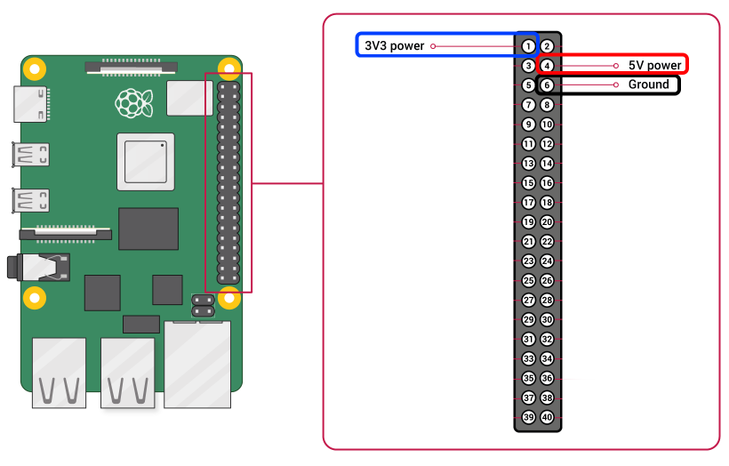
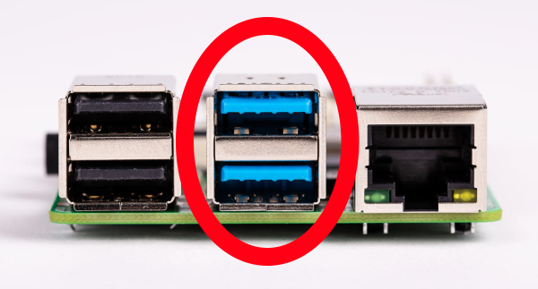

# :cd: Preparing a Raspberry Pi

This guide will walk you through how run a Rocket Pool node using a Raspberry Pi.
While this is not typically recommended in most staking guides, we recognize that it is attractive because it is a much more affordable option than standing up an entire PC.
To that end, we've worked hard to tweak and optimize a whole host of settings and have determined a configuration that seems to work well. 

This setup will run **a full ETH1 node** and **a full ETH2 node** on the Pi, making your system contribute to the health of the Etherum network while simultaneously acting as a Rocket Pool node operator.

---
**:bulb: NOTE: This setup works well with the current implementations of eth1 and eth2.
It's possible that after the merge of the eth1 chain and the beacon chain, a full node may be more computationally demanding.
While we have been advised that this is unlikely, there is a chance that the Raspberry Pi may not be able to run a full node post-merge.
Please factor this into your decision before settling on it as a node platform.**

---


## Preliminary Setup

To run a Rocket Pool node on a Raspberry Pi, you'll need to first have a working Raspberry Pi. 
If you already have one up and running - great! You can skip down to the [Mounting the SSD](#mounting-the-ssd) section.
Just make sure you have **a fan attached** before you go.
If you're starting from scratch, then read on.


### What You'll Need

These are the recommended components that you'll need to buy in order to run Rocket Pool on a Pi:
- A **Raspberry Pi 4 Model B**, the **8 GB model**
  - Note: while you *can* use a 4 GB with this setup, we strongly recommend you go with an 8 GB for peace of mind... it's really not much more expensive.
- A **USB-C power supply** for the Pi. You want one that provides **at least 3 amps**.
- A **MicroSD card**. It doesn't have to be big, 16 GB is plenty and they're pretty cheap now... but it should be at least a **Class 10 (U1)**.
- A **MicroSD to USB** adapter for your PC. This is needed so you can install the Operating System onto the card before loading it into the Pi.
  If your PC already has an SD port, then you don't need to pick up a new one.
- Some **heatsinks**. You're going to be running the Pi under heavy load 24/7, and it's going to get hot.
  Heatsinks will help so it doesn't throttle itself. You ideally want a set of 3: one for the CPU, one for the RAM, and one for the USB controller.
  [Here is a good example of a nice set](https://www.canakit.com/raspberry-pi-4-heat-sinks.html).
- A **case**. There are two ways to go here: with a fan, and fanless.
  - With a fan:
    - A 40mm **fan**. Same as the above, the goal is to keep things cool while running your Rocket Pool node.
    - A **case with a fan mount** to tie it all together.
      You could also get a case with integrated fans [like this one](https://www.amazon.com/Raspberry-Armor-Metal-Aluminium-Heatsink/dp/B07VWM4J4L) so you don't have to buy the fans separately.
  - Without a fan:
    - A **fanless case** that acts as one giant heatsink, like [this one](https://www.amazon.com/Akasa-RA08-M1B-Raspberry-case-Aluminium/dp/B081VYVNTX).
      This is a nice option since it's silent, but your Pi **will** get quite hot - especially during the initial blockchain sync process.
      Credit to Discord user Ken for pointing us in this direction!
  - As a general rule, we recommend going **with a fan** because we're going to be overclocking the Pi significantly.


You can get a lot of this stuff bundled together for convenience - for example, [Canakit offers a kit](https://www.amazon.com/CanaKit-Raspberry-8GB-Starter-Kit/dp/B08956GVXN) with many components included.
However, you might be able to get it all cheaper if you get the parts separately (and if you have the equipment, you can [3D print your own Pi case](https://www.thingiverse.com/thing:3793664).)

Other components you'll need:
- A **USB 3.0+ Solid State Drive**. The general recommendation is for a **2 TB drive**, but if it isn't in your budget, a **1 TB drive** is acceptable for now.
  - The [Samsung T5](https://www.amazon.com/Samsung-T5-Portable-SSD-MU-PA2T0B/dp/B073H4GPLQ) is an excellent example of one that is known to work well.
  - :warning: Using a SATA SSD with a SATA-to-USB adapter is **not recommended** because of [problems like this](https://www.raspberrypi.org/forums/viewtopic.php?f=28&t=245931).
    If you go this route, we've included a performance test you can use to check if it will work or not in the [Testing the SSD's Performance](#testing-the-ssd-s-performance) section.
- An **ethernet cable** for internet access. It should be at least **Cat 5e** rated.
  - Running a node over Wi-Fi is **not recommended**, but if you have no other option, you can do it instead of using an ethernet cable.
- A **UPS** to act as a power source if you ever lose electricity.
  The Pi really doesn't draw much power, so even a small UPS will last for a while, but generally the bigger, the better. Go with as big of a UPS as you can afford.
  Also, we recommend you **attach your modem, router, and other network equipment** to it as well - not much point keeping your Pi alive if your router dies.

Depending on your location, sales, your choice of SSD and UPS, and how many of these things you already have, you're probably going to end up spending **around $200 to $500 USD** for a complete setup.


### Making the Fan Run More Quietly

When you get the fan, by default you're probably going to be instructed to connect it to the 5v GPIO pin, as shown in the picture below.
The fan will have a connector with two holes; the black one should go to GND (pin 6), and the red one should go to +5v (pin 4).


However, in our experience, this makes the fan run very loud and fast which isn't really necessary.
If you want to make it more quiet while still running cool, try connecting it to the 3.3v pin (Pin 1, the blue one) instead of the 5v pin.
This means that on your fan, the black point will go to GND (pin 6) still, but now the red point will go to +3.3v (pin 1).

If your fan has a connector where the two holes are side by side and you can't split them apart, you can put [some jumpers like this](https://www.amazon.com/GenBasic-Female-Solderless-Breadboard-Prototyping/dp/B077N7J6C4) in between it and the GPIO pins on the Pi.


### Installing the Operating System

There are a few varieties of Linux OS that support the Raspberry Pi.
For this guide, we're going to stick to **Ubuntu 20.04**.
Ubuntu is a tried-and-true OS that's used around the world, and 20.04 is (at the time of this writing) the latest of the Long Term Support (LTS) versions, which means it will keep getting security patches for a very long time.
If you'd rather stick with a different flavor of Linux like Raspbian, feel free to follow the existing installation guides for that - just keep in mind that this guide is built for Ubuntu, so not all of the instructions may match your OS.

The fine folks at Canonical have written up [a wonderful guide on how to install the Ubuntu Server image onto a Pi](https://ubuntu.com/tutorials/how-to-install-ubuntu-on-your-raspberry-pi#1-overview). 

Follow **steps 1 through 4** of the guide above for the Server setup.
For the Operating System image, you want to select `Ubuntu Server 20.04.2 LTS (RPi 3/4/400) 64-bit server OS with long-term support for arm64 architectures`.

If you decide that you want a desktop UI (so you can use a mouse and have windows to drag around), you'll need to follow step 5 as well.
We suggest that you don't do this and just stick with the server image, because the desktop UI will add some additional overhead and processing work onto your Pi with relatively little benefit.
However, if you're determined to run a desktop, then we recommend choosing the Xubuntu option.
It's pretty lightweight on resources and very user friendly.

Once that's complete, you're ready to start preparing Ubuntu to run a Rocket Pool node.
You can use the local terminal on it, or you can SSH in from your desktop / laptop as the installation guide suggests.
The process will be the same either way, so do whatever's most convenient for you.


## Mounting the SSD

As you may have gathered, after following the above installation instructions, the core OS will be running off of the microSD card.
That's not nearly large enough or fast enough to hold all of the ETH1 and ETH2 blockchain data, which is where the SSD comes in.
To use it, we have to set it up with a file system and mount it to the Pi.


### Connecting the SSD to the USB 3.0 Ports

Start by plugging your SSD into one of the Pi's USB 3.0 ports. These are the **blue** ports, not the black ones:



The black ones are slow USB 2.0 ports; they're only good for accessories like mice and keyboards.
If you have your keyboard plugged into the blue ports, take it out and plug it into the black ones now.


### Formatting the SSD and Creating a New Partition

---
**:warning: WARNING: This process is going to erase everything on your SSD.
If you already have a partition with stuff on it, SKIP THIS STEP because you're about to delete it all!
If you've never used this SSD before and it's totally empty, then follow this step.**

---

Run this command to find the location of your disk in the device table:

```
$ sudo lshw -C disk
  *-disk
       description: SCSI Disk
       product: Portable SSD T5
       vendor: Samsung
       physical id: 0.0.0
       bus info: scsi@0:0.0.0
       logical name: /dev/sda
       ...
```

The important thing you need is the `logical name: /dev/sda` portion, or rather, the **`/dev/sda`** part of it.
We're going to call this the **device location** of your SSD.
For this guide, we'll just use `/dev/sda` as the device location - yours will probably be the same, but substitute it with whatever that command shows for the rest of the instructions.

Now that we know the device location, let's format it and make a new partition on it so we can actually use it.
Again, **these commands will delete whatever's already on the disk!**

Create a new partition table:
```
$ sudo parted -s /dev/sda mklabel gpt unit GB mkpart primary ext4 0 100%
```

Format the new partition with the `ext4` file system:
```
$ sudo mkfs -t ext4 /dev/sda1
```

Add a label to it (you don't have to do this, but it's fun):
```
$ sudo e2label /dev/sda1 "Rocket Drive"
```

Confirm that this worked by running the command below, which should show output like what you see here:
```
$ sudo blkid
...
/dev/sda1: LABEL="Rocket Drive" UUID="1ade40fd-1ea4-4c6e-99ea-ebb804d86266" TYPE="ext4" PARTLABEL="primary" PARTUUID="288bf76b-792c-4e6a-a049-cb6a4d23abc0"
```

If you see all of that, then you're good. Grab the `UUID="..."` output and put it somewhere temporarily, because you're going to need it in a minute.


### Optimizing the New Partition
Next, let's tune the new filesystem a little to optimize it for validator activity.

By default, ext4 will reserve 5% of its space for system processes.
Since we don't need that on the SSD because it just stores the ETH1 and ETH2 chain data, we can disable it:
```
$ sudo tune2fs -m 0 /dev/sda1
```


### Mounting and Enabling Automount

In order to use the drive, you have to mount it to the file system.
Create a new mount point anywhere you like (we'll use `/mnt/rpdata` here as an example, feel free to use that):
```
$ sudo mkdir /mnt/rpdata
```

Now, mount the new SSD partition to that folder:
```
$ sudo mount /dev/sda1 /mnt/rpdata
```

After this, the folder `/mnt/rpdata` will point to the SSD, so anything you write to that folder will live on the SSD.
This is where we're going to store the chain data for ETH1 and ETH2.

Now, let's add it to the mounting table so it automatically mounts on startup.
Remember the `UUID` from the `blkid` command you used earlier?
This is where it will come in handy.
```
$ sudo nano /etc/fstab
```

This will open up an interactive file editor, which will look like this to start:
```
LABEL=writable  /        ext4   defaults        0 0
LABEL=system-boot       /boot/firmware  vfat    defaults        0       1
```

Use the arrow keys to go down to the bottom line, and add this line to the end:
```
LABEL=writable  /        ext4   defaults        0 0
LABEL=system-boot       /boot/firmware  vfat    defaults        0       1
UUID=1ade40fd-1ea4-4c6e-99ea-ebb804d86266       /mnt/rpdata     ext4    defaults        0       0
```

Replace the value in `UUID=...` with the one from your disk, then press `Ctrl+O` and `Enter` to save, then `Ctrl+X` and `Enter` to exit.
Now the SSD will be automatically mounted when you reboot. Nice!


### Testing the SSD's Performance

Before going any further, you should test your SSD's read/write speed and how many I/O requests it can handle per second (IOPS).
If your SSD is too slow, then it won't work well for a Rocket Pool node and you're going to end up losing money over time.

To test it, we're going to use a program called `fio`. Install it like this:
```
$ sudo apt install fio
```

Next, move to your SSD's mount point:
```
$ cd /mnt/rpdata
```

Now, run this command to test the SSD performance:
```
$ sudo fio --randrepeat=1 --ioengine=libaio --direct=1 --gtod_reduce=1 --name=test --filename=test --bs=4k --iodepth=64 --size=4G --readwrite=randrw --rwmixread=75
```

The output should look like this:
```
test: (g=0): rw=randrw, bs=(R) 4096B-4096B, (W) 4096B-4096B, (T) 4096B-4096B, ioengine=libaio, iodepth=64
fio-3.16
Starting 1 process
test: Laying out IO file (1 file / 4096MiB)
Jobs: 1 (f=1): [m(1)][100.0%][r=63.9MiB/s,w=20.8MiB/s][r=16.4k,w=5329 IOPS][eta 00m:00s]
test: (groupid=0, jobs=1): err= 0: pid=205075: Mon Feb 15 04:06:35 2021
  read: IOPS=15.7k, BW=61.5MiB/s (64.5MB/s)(3070MiB/49937msec)
   bw (  KiB/s): min=53288, max=66784, per=99.94%, avg=62912.34, stdev=2254.36, samples=99
   iops        : min=13322, max=16696, avg=15728.08, stdev=563.59, samples=99
  write: IOPS=5259, BW=20.5MiB/s (21.5MB/s)(1026MiB/49937msec); 0 zone resets
...
```

What you care about are the lines starting with `read:` and `write:` under the `test:` line.
- Your **read** should have IOPS of at least **15k** and bandwidth (BW) of at least **60 MiB/s**.
- Your **write** should have IOPS of at least **5000** and bandwidth of at least **20 MiB/s**.

Those are the specs from the Samsung T5 that we use, which work very well.
We have also tested a slower SSD with read IOPS of 5k and write IOPS of 1k, and it has a very hard time keeping up with the ETH2 chain.
If you use an SSD slower than the specs above, just be prepared that you might see a lot of missed attestations.
If yours meets or exceeds them, then you're all set and can move on.

---
**:bulb: Note:
If your SSD doesn't meet the above specs but it should, you might be able to fix it with a firmware update.
For example, this has been experienced by the Rocket Pool community with the Samsung T7.
Two of them fresh out of the box only showed 3.5K read IOPS and 1.2K write IOPS.
After applying all available firmware updates, the performance was back up to the numbers shown in the above example.
Check with your manufacturer's support website for the latest firmware and make sure your drive is up to date - you may have to update the firmware multiple times until there are no more updates left.**

---

Last but not least, remove the test file you just made:
```
$ sudo rm /mnt/rpdata/test
```

## Setting up Swap Space

The Pi has 8 GB (or 4 GB if you went that route) of RAM.
For our configuration, that will be plenty.
Then again, it never hurts to add a little more.
What we're going to do now is add what's called **swap space**.
Essentially, it means we're going to use the SSD as "backup RAM" in case something goes horribly, horribly wrong and the Pi runs out of regular RAM.
The SSD isn't nearly as fast as the regular RAM, so if it hits the swap space it will slow things down, but it won't completely crash and break everything.
Think of this as extra insurance that you'll (most likely) never need.


### Creating a Swap File

The first step is to make a new file that will act as your swap space.
Decide how much you want to use - a reasonable start would be 8 GB, so you have 8 GB of normal RAM and 8 GB of "backup RAM" for a total of 16 GB.
To be super safe, you can make it 24 GB so your system has 8 GB of normal RAM and 24 GB of "backup RAM" for a total of 32 GB, but this is probably overkill. 
Luckily, since your SSD has 1 or 2 TB of space, allocating 8 to 24 GB for a swapfile is negligible.

For the sake of this walkthrough, let's pick a nice middleground - say, 16 GB of swap space for a total RAM of 24 GB.
Just substitute whatever number you want in as we go.

Enter this, which will create a new file called `/mnt/rpdata/swapfile` and fill it with 16 GB of zeros.
To change the amount, just change the number in `count=16` to whatever you want. **Note that this is going to take a long time, but that's ok.**
```
$ sudo dd if=/dev/zero of=/mnt/rpdata/swapfile bs=1G count=16 status=progress
```

Next, set the permissions so only the root user can read or write to it (for security):
```
$ sudo chmod 600 /mnt/rpdata/swapfile
```

Now, mark it as a swap file:
```
$ sudo mkswap /mnt/rpdata/swapfile
```

Next, enable it:
```
$ sudo swapon /mnt/rpdata/swapfile
```

Finally, add it to the mount table so it automatically loads when your Pi reboots:
```
$ sudo nano /etc/fstab
```

Add a new line at the end that looks like this:
```
LABEL=writable  /        ext4   defaults        0 0
LABEL=system-boot       /boot/firmware  vfat    defaults        0       1
UUID=1ade40fd-1ea4-4c6e-99ea-ebb804d86266       /mnt/rpdata     ext4    defaults        0       0
/mnt/rpdata/swapfile                            none            swap    sw              0       0
```

Press `Ctrl+O` and `Enter` to save, then `Ctrl+X` and `Enter` to exit.

To verify that it's active, run these commands:
```
$ sudo apt install htop
$ htop
```

Your output should look like this at the top:


If you see a non-zero number in the last row labeled `Swp`, then you're all set.

Press `q` or `F10` to quit out of `htop` and get back to the terminal.


### Configuring Swappiness and Cache Pressure

By default, Linux will eagerly use a lot of swap space to take some of the pressure off of the system's RAM.
We don't want that. We want it to use all of the RAM up to the very last second before relying on SWAP.
The next step is to change what's called the "swappiness" of the system, which is basically how eager it is to use the swap space.
There is a lot of debate about what value to set this to, but we've found a value of 6 works well enough.

We also want to turn down the "cache pressure", which dictates how quickly the Pi will delete a cache of its filesystem.
Since we're going to have a lot of spare RAM with our setup, we can make this "10" which will leave the cache in memory for a while, reducing disk I/O.

To set these, run these commands:
```
$ sudo sysctl vm.swappiness=6
$ sudo sysctl vm.vfs_cache_pressure=10
```

Now, put them into the `sysctl.conf` file so they are reapplied after a reboot:
```
$ sudo nano /etc/sysctl.conf
```

Add these two lines to the end:
```
vm.swappiness=6
vm.vfs_cache_pressure=10
```

Then save and exit like you've done before (`Ctrl+O`, `Ctrl+X`).

And with that, your Pi is up and running and ready to run Rocket Pool!
Move on to the [Choosing your ETH Clients](../eth-clients) section.
