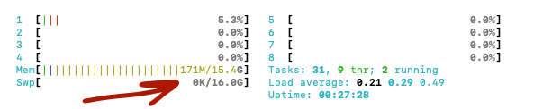

# Preparing a Rock 5

This guide will walk you through how run a Rocket Pool node using a [Radxa Rock 5B](https://wiki.radxa.com/Rock5), which is an ARM device derived from the Raspberry Pi architecture but [boosted](https://emteria.com/blog/radxa-rock-5#:~:text=Rock%205%20Model%20B%20or,the%2040%2Dpin%20GPIO%20connector). The Rock 5 has been popularized for ETH staking by the [The Daily Gwei](https://www.youtube.com/watch?v=_Nj11uljR3g) , [Marceu](https://twitter.com/marceaueth/status/1597251242194980866) and [EtherumOnArm](https://twitter.com/EthereumOnARM/status/1597889744821944320). You can watch the recording of [Diego Losada](https://www.youtube.com/watch?v=lPjsXJX6skI)'s great workshop at DevCon 6.

This guide itself is derived from the [Raspberry Pi setup](prepare-pi.md) guide. There are a lot of similarities between setting up a Raspberry Pi and Rock 5B, but there are also some differences.

Unlike the Raspberry Pi, Rock 5B is powerful enough to compete with NUC and PC setups, while being more affordable overall. Under $400 for a full setup.

<blockquote class="twitter-tweet"><p lang="en" dir="ltr">You can run a full/archive/staking <a href="https://twitter.com/hashtag/Ethereum?src=hash&amp;ref_src=twsrc%5Etfw">#Ethereum</a> node for &lt;$400. Break down: <br><br>✔️<a href="https://twitter.com/theradxa?ref_src=twsrc%5Etfw">@theradxa</a> Rock 5B board (16 GB): $189 <br>✔️Acrylic case with passive heatsink: $13 <br>✔️Crucial P2 NVMe SSD 2TB: $140<br>✔️MicroSD: $8<br>✔️Ethernet cable: $6 <br>✔️Power supply: $9<br><br>✅Total cost: ~$365<br><br>Some links👇 <a href="https://t.co/bwom18NbiT">pic.twitter.com/bwom18NbiT</a></p>&mdash; Ethereum on ARM 🦇🔊🐼👉👈🐼 (@EthereumOnARM) <a href="https://twitter.com/EthereumOnARM/status/1597889744821944320?ref_src=twsrc%5Etfw">November 30, 2022</a></blockquote> <script async src="https://platform.twitter.com/widgets.js" charset="utf-8"></script>


This setup will run **a full Execution node** and **a full Consensus node** , making your system contribute to the health of the Ethereum network while simultaneously acting as a Rocket Pool node operator.

# Prebuilt Hardware

If you want to save time on ordering parts, assembling and software install, you can [order Proteus](https://twitter.com/jcrtp_eth/status/1606550470407118848?s=20&t=TQBB4tG__VjjslDYlGqnNQ) - a pre-built Rock5B box created by [Mercadian Systems](https://github.com/mercadian).

If you go this route, you can skip straight to the [Securing your Node](../securing-your-node.md) section.

# DIY Hardware Assembly
## Preliminary Setup

To run a Rocket Pool node on a Rock 5, you'll need to first have a working Rock 5.
If you already have one up and running - great! You can skip down to the [Mounting the SSD](#mounting-the-ssd) section. If you're starting from scratch, then read on.

### What You'll Need

These are the recommended components that you'll need to buy in order to run Rocket Pool on a Rock 5:

- A **Rock 5B**, the **16 GB model**. You can order it online [here](https://ameridroid.com/products/rock5-model-b?variant=39918166573090) or [here](https://shop.allnetchina.cn/products/rock5-model-b?variant=39514839515238)
- A **USB-C power supply** for the Rock 5. You want one that provides **at least 3 amps**. For example [this one](https://shop.allnetchina.cn/products/radxa-power-pd-30w?variant=39929851904102) or [this one](https://www.amazon.com/dp/B07VT554J1)
- A **MicroSD card**. It doesn't have to be big, 16 GB is plenty and they're pretty cheap now... but it should be at least a **Class 10 (U1)** such as [this Samsung](https://www.amazon.com/Samsung-Micro-Memory-Adapter-MB-MC64GA/dp/B073S49S8M) or [this SanDisk](https://www.amazon.com/SanDisk-Ultra-microSDHC-Memory-Adapter/dp/B08GY9NYRM).
- A **MicroSD to USB** adapter for your PC. This is needed so you can install the Operating System onto the card before loading it into the Pi.
  If your PC already has an SD port, then you don't need to pick up a new one.
- **Cooling enclosure** to keep the computer from overheating under constant heavy load.
  - One option is Acrylic protector with heatsinks like [this one](https://shop.allnetchina.cn/products/rock5-b-acrylic-protector?variant=39877626396774) .
  - Or a fanless case that acts as one giant heatsink, like [this one](https://ameridroid.com/collections/rock5-model-b/products/rock-5b-metal-case).

Other components you'll need:

- A **2TB Solid State Drive**
  - Either an external **USB 3.0+ Solid State Drive**, such as:
    - The [Samsung T5](https://www.amazon.com/Samsung-T5-Portable-SSD-MU-PA2T0B/dp/B073H4GPLQ) which is known to work well.
    - Or the newer [Samsung T7](https://www.amazon.com/dp/B0874Y5XFG/ref=twister_B0B79D1NQ6?_encoding=UTF8&psc=1) model.
  - Or an **internal SSD Drive**, such as:
    - The [Crucial P3](https://www.amazon.com/Crucial-PCIe-NAND-NVMe-3500MB-dp-B0B25MJ1YT/dp/B0B25MJ1YT/?th=1)
    - Or the [SK hynix Gold P31](https://www.amazon.com/dp/B099RHVB42)
- An **ethernet cable** for internet access. It should be at least **Cat 5e** rated.
  - Running a node over Wi-Fi is **not recommended**, but if you have no other option, you can do it instead of using an ethernet cable.
- A **UPS** to act as a power source if you ever lose electricity.
  The Rock 5 really doesn't draw much power, so even a small UPS will last for a while, but generally the bigger, the better. Go with as big of a UPS as you can afford.
  Also, we recommend you **attach your modem, router, and other network equipment** to it as well - not much point keeping your Rock 5 alive if your router dies.

Depending on your location, sales, your choice of SSD and UPS, and how many of these things you already have, you're probably going to end up spending **around $400 to $500 USD** for a complete setup.

### Installing the Operating System

There are a few varieties of Linux OS that support the Rock 5.
For this guide, we're going to stick to **Ubuntu 20.04**.
Ubuntu is a tried-and-true OS that's used around the world, and 20.04 is (at the time of this writing) the latest of the Long Term Support (LTS) versions, which means it will keep getting security patches for a very long time.

The Radxa team provides an [official page](https://wiki.radxa.com/Rock5/downloads) with OS images including [Ubuntu image](https://github.com/radxa/debos-radxa/releases/download/20221031-1045/rock-5b-ubuntu-focal-server-arm64-20221031-1328-gpt.img.xz). Follow the [MicroSD Image Flash Guide](https://wiki.radxa.com/Rock5/install/microSD) to prepare an Ubuntu system boot image.

You can alternatively use an eMMC module instead of a Micro SD Card for system boot image. eMMC cards are more expensive but generally more performant and reliable. Radxa provides [eMMC Image Flash Guides](https://wiki.radxa.com/Rock5/install).

Since we are only going to be using the Micro SD or eMMC image for system boot and all other heavy read/write operations will be on the SSD drive, it is not that important whether you pick a Micro SD or an eMMC card.

Once the Micro SD (or eMMC) system boot card is plugged in the Rock 5, you can connect the computer to the power and turn it on. A bright green LED light on the board should come on.

Next, follow the [Ubuntu setup guide](https://wiki.radxa.com/Rock5/linux/ubuntu).

We recommend using the **ssh** option to securely connect to the Rock 5 to avoid the hassle of hooking up a monitor and a keyboard to the tiny single board computer (SBC).

If you aren't familiar with `ssh`, take a look at the [Intro to Secure Shell](../ssh.md) guide.

**Be sure to change the root password** as instructed by the Radxa install guide.

Once that's complete, you're ready to start preparing Ubuntu to run a Rocket Pool node.

::: warning NOTE
At this point, you should _strongly consider_ configuring your router to make your Pi's IP address **static**.
This means that your computer will have the same IP address forever, so you can always SSH into it using that IP address.

Otherwise, it's possible that your Pi's IP could change at some point, and the above SSH command will no longer work.

Generally the Rock 5 is available with a defaul host name of `rock-5`. You can try pinging the Rock 5 from the command line of your everyday PC connected on the same local area network (LAN) as the Rock 5. If that works, you will be able to see the Rock 5 IP address.

```bash
ping rock-5b
PING rock-5b.lan (192.168.86.23): 56 data bytes
64 bytes from 192.168.86.23: icmp_seq=0 ttl=64 time=2.997 ms
64 bytes from 192.168.86.23: icmp_seq=1 ttl=64 time=4.773 ms
^C
--- rock-5b.lan ping statistics ---
2 packets transmitted, 2 packets received, 0.0% packet loss
```

If that fails, you will have to enter your router's configuration to find out what your computer's new IP address is.

Each router is different, so you will need to consult your router's documentation to learn how to assign a static IP address.
:::

## Mounting the SSD

As you may have gathered, after following the above installation instructions, the core OS will be running off of the microSD card.
That's not nearly large enough or fast enough to hold all of the Execution and Consensus blockchain data, which is where the SSD comes in.
To use it, we have to set it up with a file system and mount it to the computer.

### Connecting the SSD to the USB 3.0 Ports

Start by plugging your SSD into one of Rock's USB 3.0 ports. These are the **blue** ports, not the black ones:


The black ones are slow USB 2.0 ports; they're only good for accessories like mice and keyboards.
If you have your keyboard plugged into the blue ports, take it out and plug it into the black ones now.

### Formatting the SSD and Creating a New Partition

::: warning
This process is going to erase everything on your SSD.
If you already have a partition with stuff on it, SKIP THIS STEP because you're about to delete it all!
If you've never used this SSD before and it's totally empty, then follow this step.
:::

Run this command to find the location of your disk in the device table:

```bash
lsblk -o UUID,NAME,FSTYPE,SIZE,MOUNTPOINT,LABEL,MODEL
UUID                                 NAME        FSTYPE  SIZE MOUNTPOINT LABEL  MODEL
                                     sda                 1.8T                   PSSD_T7
3CEE-4EAE                            └─sda1      exfat   1.8T            T7
                                     mtdblock0            16M
                                     mmcblk0            29.8G
C6EA-F413                            ├─mmcblk0p1 vfat    512M /boot      boot
67ad0e7b-3914-48d6-97c2-c48e5e0e405b └─mmcblk0p2 ext4   29.3G /          rootfs
```

The important thing you need is the `NAME: sda` portion, which corresponds to a **`/dev/sda`** logical OS device name. We're going to call this the **device location** of your SSD.

For this guide, we'll just use `/dev/sda` as the device location - yours will probably be the same, but substitute it with whatever that command shows for the rest of the instructions.

Now that we know the device location, let's format it and make a new partition on it so we can actually use it.
Again, **these commands will delete whatever's already on the disk!**

Create a new partition table:

```bash
sudo parted -s /dev/sda mklabel gpt unit GB mkpart primary ext4 0 100%
```

Format the new partition with the `ext4` file system:

```bash
sudo mkfs -t ext4 /dev/sda1
```

Add a label to it (you don't have to do this, but it's fun):

```bash
sudo e2label /dev/sda1 "Rocket Drive"
```

Confirm that this worked by running the command below, which should show output like what you see here:

```bash
sudo blkid
...
/dev/sda1: LABEL="Rocket Drive" UUID="1ade40fd-1ea4-4c6e-99ea-ebb804d86266" TYPE="ext4" PARTLABEL="primary" PARTUUID="288bf76b-792c-4e6a-a049-cb6a4d23abc0"
```

If you see all of that, then you're good. Grab the `UUID="..."` output and put it somewhere temporarily, because you're going to need it in a minute.

### Optimizing the New Partition

Next, let's tune the new filesystem a little to optimize it for validator activity.

By default, ext4 will reserve 5% of its space for system processes.
Since we don't need that on the SSD because it just stores the Execution (ETH1) and Consensus (ETH2) chain data, we can disable it:

```bash
sudo tune2fs -m 0 /dev/sda1
```

### Mounting and Enabling Automount

In order to use the drive, you have to mount it to the file system.
Create a new mount point anywhere you like (we'll use `/mnt/rpdata` here as an example, feel free to use that):

```bash
sudo mkdir /mnt/rpdata
```

Now, mount the new SSD partition to that folder:

```bash
sudo mount /dev/sda1 /mnt/rpdata
```

After this, the folder `/mnt/rpdata` will point to the SSD, so anything you write to that folder will live on the SSD.
This is where we're going to store the chain data for Execution (ETH1) and Consensus (ETH2).

Now, let's add it to the mounting table so it automatically mounts on startup.
Remember the `UUID` from the `blkid` command you used earlier?
This is where it will come in handy.

```bash
sudo nano /etc/fstab
```

This will open up an interactive file editor, which will look like this to start:

```
LABEL=writable  /        ext4   defaults        0 0
LABEL=system-boot       /boot/firmware  vfat    defaults        0       1
```

Use the arrow keys to go down to the bottom line, and add this line to the end:

```
LABEL=writable  /        ext4   defaults        0 0
LABEL=system-boot       /boot/firmware  vfat    defaults        0       1
UUID=1ade40fd-1ea4-4c6e-99ea-ebb804d86266       /mnt/rpdata     ext4    defaults        0       0
```

Replace the value in `UUID=...` with the one from your disk, then press `Ctrl+O` and `Enter` to save, then `Ctrl+X` and `Enter` to exit.
Now the SSD will be automatically mounted when you reboot. Nice!

### Testing the SSD's Performance

Before going any further, you should test your SSD's read/write speed and how many I/O requests it can handle per second (IOPS).
If your SSD is too slow, then it won't work well for a Rocket Pool node and you're going to end up losing money over time.

To test it, we're going to use a program called `fio`. Install it like this:

```bash
sudo apt install fio
```

Next, move to your SSD's mount point:

```bash
cd /mnt/rpdata
```

::: warning
Do not skip the step above before running the next performance test command! Otherwise the test will be performed on your slow Micro SD card and will block for a very long time.
:::

Now, run the following command to test the SSD performance. It should finish in about a minute:

```bash
sudo fio --randrepeat=1 --ioengine=libaio --direct=1 --gtod_reduce=1 --name=test --filename=test --bs=4k --iodepth=64 --size=4G --readwrite=randrw --rwmixread=75
```

The output should look like this:

```
test: (g=0): rw=randrw, bs=(R) 4096B-4096B, (W) 4096B-4096B, (T) 4096B-4096B, ioengine=libaio, iodepth=64
fio-3.16
Starting 1 process
test: Laying out IO file (1 file / 4096MiB)
Jobs: 1 (f=1): [m(1)][100.0%][r=63.9MiB/s,w=20.8MiB/s][r=16.4k,w=5329 IOPS][eta 00m:00s]
test: (groupid=0, jobs=1): err= 0: pid=205075: Mon Feb 15 04:06:35 2021
  read: IOPS=15.7k, BW=61.5MiB/s (64.5MB/s)(3070MiB/49937msec)
   bw (  KiB/s): min=53288, max=66784, per=99.94%, avg=62912.34, stdev=2254.36, samples=99
   iops        : min=13322, max=16696, avg=15728.08, stdev=563.59, samples=99
  write: IOPS=5259, BW=20.5MiB/s (21.5MB/s)(1026MiB/49937msec); 0 zone resets
...
```

What you care about are the lines starting with `read:` and `write:` under the `test:` line.

- Your **read** should have IOPS of at least **15k** and bandwidth (BW) of at least **60 MiB/s**.
- Your **write** should have IOPS of at least **5000** and bandwidth of at least **20 MiB/s**.

Those are the specs from the Samsung T5 that we use, which work very well.
We have also tested a slower SSD with read IOPS of 5k and write IOPS of 1k, and it has a very hard time keeping up with the ETH2 chain.
If you use an SSD slower than the specs above, just be prepared that you might see a lot of missed attestations.
If yours meets or exceeds them, then you're all set and can move on.

::: tip NOTE
If your SSD doesn't meet the above specs but it should, you might be able to fix it with a firmware update.
For example, this has been experienced by the Rocket Pool community with the Samsung T7.
Two of them fresh out of the box only showed 3.5K read IOPS and 1.2K write IOPS.
After applying all available firmware updates, the performance was back up to the numbers shown in the above example.
Check with your manufacturer's support website for the latest firmware and make sure your drive is up to date - you may have to update the firmware multiple times until there are no more updates left.
:::

Last but not least, remove the test file you just made:

```bash
sudo rm /mnt/rpdata/test
```

## Setting up Swap Space

Your Rock 5B should have 16GB of RAM.
For our configuration, that will be plenty.
The models with 4GB and 8GB are not recommended for our goal. If you really want the extra savings, consider the [Raspberry Pi](prepare-pi.md) option.

What we're going to do now is add what's called **swap space**.
Essentially, it means we're going to use the SSD as "backup RAM" in case something goes horribly, horribly wrong and the Pi runs out of regular RAM.
The SSD isn't nearly as fast as the regular RAM, so if it hits the swap space it will slow things down, but it won't completely crash and break everything.
Think of this as extra insurance that you'll (most likely) never need.

### Creating a Swap File

The first step is to make a new file that will act as your swap space.
To be safe, you can make it 16 GB so your system has 16 GB of normal RAM and 24 GB of "backup RAM" for a total of 32 GB, but this is probably overkill.
Luckily, since your SSD has 1 or 2 TB of space, allocating 16 GB for a swapfile is negligible.

Enter this, which will create a new file called `/mnt/rpdata/swapfile` and fill it with 16 GB of zeros.
To change the amount, just change the number in `count=16` to whatever swap file size in GB you want. **Note that this is going to take a long time, but that's ok.**

```bash
sudo dd if=/dev/zero of=/mnt/rpdata/swapfile bs=1G count=16 status=progress
```

Next, set the permissions so only the root user can read or write to it (for security):

```bash
sudo chmod 600 /mnt/rpdata/swapfile
```

Now, mark it as a swap file:

```
sudo mkswap /mnt/rpdata/swapfile
```

Next, enable it:

```
sudo swapon /mnt/rpdata/swapfile
```

Finally, add it to the mount table so it automatically loads when your Pi reboots:

```
sudo nano /etc/fstab
```

Add a new line at the end so that the file looks like this:

```
LABEL=writable  /        ext4   defaults        0 0
LABEL=system-boot       /boot/firmware  vfat    defaults        0       1
UUID=1ade40fd-1ea4-4c6e-99ea-ebb804d86266       /mnt/rpdata     ext4    defaults        0       0
/mnt/rpdata/swapfile                            none            swap    sw              0       0
```

Press `Ctrl+O` and `Enter` to save, then `Ctrl+X` and `Enter` to exit.

To verify that it's active, run these commands:

```
sudo apt install htop
htop
```

Your output should look like this at the top:


If the second number in the last row labeled `Swp` (the one after the `/`) is non-zero, then you're all set.
For example, if it shows `0K / 16.0G` then your swap space was activated successfully.
If it shows `0K / 0K` then it did not work and you'll have to confirm that you entered the previous steps properly.

Press `q` or `F10` to quit out of `htop` and get back to the terminal.

### Configuring Swappiness and Cache Pressure

By default, Linux will eagerly use a lot of swap space to take some of the pressure off of the system's RAM.
We don't want that. We want it to use all of the RAM up to the very last second before relying on SWAP.
The next step is to change what's called the "swappiness" of the system, which is basically how eager it is to use the swap space.
There is a lot of debate about what value to set this to, but we've found a value of 6 works well enough.

We also want to turn down the "cache pressure", which dictates how quickly the Pi will delete a cache of its filesystem.
Since we're going to have a lot of spare RAM with our setup, we can make this "10" which will leave the cache in memory for a while, reducing disk I/O.

To set these, run these commands:

```
sudo sysctl vm.swappiness=6
sudo sysctl vm.vfs_cache_pressure=10
```

Now, put them into the `sysctl.conf` file so they are reapplied after a reboot:

```
sudo nano /etc/sysctl.conf
```

Add these two lines to the end:

```
vm.swappiness=6
vm.vfs_cache_pressure=10
```

Then save and exit like you've done before (`Ctrl+O`, `Ctrl+X`).

## Optimizing CPU Performance

ARM systems like Rock5B are mainly built for low energy consumption devices such as mobile phones. By default the Rock5B is configured for energy saving mode. However since your validator node will not be running on batteries as a mobile device does most of the time, you can switch to performance mode.

This optimization will help minimize any potential missed or delayed attestations.

To run this optimization, you can either download [this script](https://github.com/mercadian/radxa-debos/blob/04a43e3fa5a8533a0f7f89afcad4c89390cf851a/rootfs/scripts/optimize_rock.sh) provided by Mercadian or manually execute the steps below:

```bash
# Set the CPU governor to performance so the CPU always runs with the max core speeds
echo 'GOVERNOR="performance"' | sudo tee -a /etc/default/cpufrequtils

# Create the service for setting the DMC governor to performance on startup
sudo tee -a /etc/systemd/system/dmc-governor.service >/dev/null <<EOF
[Unit]
Description=Sets the DMC (memory controller) governor to "performance"
After=default.target
[Service]
Type=oneshot
ExecStart=/bin/sh -c 'echo "performance" > /sys/class/devfreq/dmc/governor'
[Install]
WantedBy=default.target
EOF

sudo systemctl enable dmc-governor.service

 ```

## Next Steps

And with that, your Rock 5 is up and running and ready to run Rocket Pool!
Move on to the [Choosing your ETH Clients](../eth-clients.md) section.
