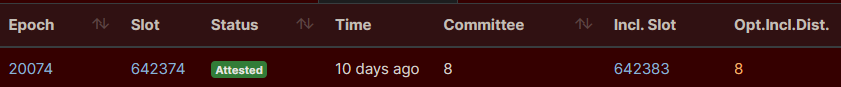

# Preparing a Rock 5B

This guide will walk you through how run a Rocket Pool node using a [Radxa Rock 5B](https://wiki.radxa.com/Rock5), which is an ARM device derived from the Raspberry Pi architecture but [boosted](https://emteria.com/blog/radxa-rock-5#:~:text=Rock%205%20Model%20B%20or,the%2040%2Dpin%20GPIO%20connector). The Rock 5 has been popularized for ETH staking by the [The Daily Gwei](https://www.youtube.com/watch?v=_Nj11uljR3g) , [Marceu](https://twitter.com/marceaueth/status/1597251242194980866) and [EtherumOnArm](https://twitter.com/EthereumOnARM/status/1597889744821944320). You can watch the recording of [Diego Losada](https://www.youtube.com/watch?v=lPjsXJX6skI)'s great workshop at DevCon 6.

This guide itself is derived from the [Raspberry Pi setup](prepare-pi.md) guide. There are a lot of similarities between setting up a Raspberry Pi and Rock 5B, but there are also some differences.

Unlike the Raspberry Pi, Rock 5B is powerful enough to compete with NUC and PC setups, while being more affordable overall. Under $400 for a full setup.

[https://twitter.com/EthereumOnARM/status/1597889744821944320/photo/1]

<blockquote class="twitter-tweet"><p lang="en" dir="ltr">You can run a full/archive/staking <a href="https://twitter.com/hashtag/Ethereum?src=hash&amp;ref_src=twsrc%5Etfw">#Ethereum</a> node for &lt;$400. Break down: <br><br>✔️<a href="https://twitter.com/theradxa?ref_src=twsrc%5Etfw">@theradxa</a> Rock 5B board (16 GB): $189 <br>✔️Acrylic case with passive heatsink: $13 <br>✔️Crucial P2 NVMe SSD 2TB: $140<br>✔️MicroSD: $8<br>✔️Ethernet cable: $6 <br>✔️Power supply: $9<br><br>✅Total cost: ~$365<br><br>Some links👇 <a href="https://t.co/bwom18NbiT">pic.twitter.com/bwom18NbiT</a></p>&mdash; Ethereum on ARM 🦇🔊🐼👉👈🐼 (@EthereumOnARM) <a href="https://twitter.com/EthereumOnARM/status/1597889744821944320?ref_src=twsrc%5Etfw">November 30, 2022</a></blockquote> <script async src="https://platform.twitter.com/widgets.js" charset="utf-8"></script>

This setup will run **a full Execution node** and **a full Consensus node** , making your system contribute to the health of the Ethereum network while simultaneously acting as a Rocket Pool node operator.

## Preliminary Setup

To run a Rocket Pool node on a Rock 5, you'll need to first have a working Rock 5.
If you already have one up and running - great! You can skip down to the [Mounting the SSD](#mounting-the-ssd) section. If you're starting from scratch, then read on.

### What You'll Need

These are the recommended components that you'll need to buy in order to run Rocket Pool on a Rock 5:

- A **Rock 5B**, the **16 GB model**. You can order it online [here](https://ameridroid.com/products/rock5-model-b?variant=39918166573090) or [here](https://shop.allnetchina.cn/products/rock5-model-b?variant=39514839515238)
- A **USB-C power supply** for the Rock 5. You want one that provides **at least 3 amps**. For example [this one](https://shop.allnetchina.cn/products/radxa-power-pd-30w?variant=39929851904102) or [this one](https://www.amazon.com/dp/B07VT554J1)
- A **MicroSD card**. It doesn't have to be big, 16 GB is plenty and they're pretty cheap now... but it should be at least a **Class 10 (U1)** such as [this Samsung](https://www.amazon.com/Samsung-Micro-Memory-Adapter-MB-MC64GA/dp/B073S49S8M) or [this SanDisk](https://www.amazon.com/SanDisk-Ultra-microSDHC-Memory-Adapter/dp/B08GY9NYRM).
- A **MicroSD to USB** adapter for your PC. This is needed so you can install the Operating System onto the card before loading it into the Pi.
  If your PC already has an SD port, then you don't need to pick up a new one.
- **Cooling enclosure** to keep the computer from overheating under constant heavy load.
  - One option is Acrylic protector with heatsinks like [this one](https://shop.allnetchina.cn/products/rock5-b-acrylic-protector?variant=39877626396774) .
  - Or a fanless case that acts as one giant heatsink, like [this one](https://ameridroid.com/collections/rock5-model-b/products/rock-5b-metal-case).

Other components you'll need:

- A **2TB Solid State Drive**
  - Either an external **USB 3.0+ Solid State Drive**, such as:
    - The [Samsung T5](https://www.amazon.com/Samsung-T5-Portable-SSD-MU-PA2T0B/dp/B073H4GPLQ) which is known to work well.
    - Or the newer [Samsung T7](https://www.amazon.com/dp/B0874Y5XFG/ref=twister_B0B79D1NQ6?_encoding=UTF8&psc=1) model.
  - Or an **internal SSD Drive**, such as:
    - The [Crucial P3](https://www.amazon.com/Crucial-PCIe-NAND-NVMe-3500MB-dp-B0B25MJ1YT/dp/B0B25MJ1YT/?th=1)
    - Or the [SK hynix Gold P31](https://www.amazon.com/dp/B099RHVB42)
- An **ethernet cable** for internet access. It should be at least **Cat 5e** rated.
  - Running a node over Wi-Fi is **not recommended**, but if you have no other option, you can do it instead of using an ethernet cable.
- A **UPS** to act as a power source if you ever lose electricity.
  The Rock 5 really doesn't draw much power, so even a small UPS will last for a while, but generally the bigger, the better. Go with as big of a UPS as you can afford.
  Also, we recommend you **attach your modem, router, and other network equipment** to it as well - not much point keeping your Rock 5 alive if your router dies.

Depending on your location, sales, your choice of SSD and UPS, and how many of these things you already have, you're probably going to end up spending **around $400 to $500 USD** for a complete setup.

### Installing the Operating System

There are a few varieties of Linux OS that support the Rock 5.
For this guide, we're going to stick to **Ubuntu 20.04**.
Ubuntu is a tried-and-true OS that's used around the world, and 20.04 is (at the time of this writing) the latest of the Long Term Support (LTS) versions, which means it will keep getting security patches for a very long time.

The Radxa team provides an [official page](https://wiki.radxa.com/Rock5/downloads) with OS images including [Ubuntu image](https://github.com/radxa/debos-radxa/releases/download/20221031-1045/rock-5b-ubuntu-focal-server-arm64-20221031-1328-gpt.img.xz) and a great [installation guide](https://wiki.radxa.com/Rock5/linux/ubuntu).

We recommend using the **ssh** option to securely connect to the Rock 5 to avoid the hassle of hooking up a monitor and a keyboard to the tiny single board computer (SBC).

**Be sure to change the root password** as instructed by the Radxa install guide.

Once that's complete, you're ready to start preparing Ubuntu to run a Rocket Pool node.

If you aren't familiar with `ssh`, take a look at the [Intro to Secure Shell](../ssh.md) guide.

::: warning NOTE
At this point, you should _strongly consider_ configuring your router to make your Pi's IP address **static**.
This means that your computer will have the same IP address forever, so you can always SSH into it using that IP address.

Otherwise, it's possible that your Pi's IP could change at some point, and the above SSH command will no longer work.

Generally the Rock 5 is available with a defaul host name of `rock-5`. You can try pinging the Rock 5 from the command line of your everyday PC connected on the same local area network (LAN) as the Rock 5. If that works, you will be able to see the Rock 5 IP address.

```bash
$ping rock-5b
PING rock-5b.lan (192.168.86.23): 56 data bytes
64 bytes from 192.168.86.23: icmp_seq=0 ttl=64 time=2.997 ms
64 bytes from 192.168.86.23: icmp_seq=1 ttl=64 time=4.773 ms
^C
--- rock-5b.lan ping statistics ---
2 packets transmitted, 2 packets received, 0.0% packet loss
```

If that fails, you will have to enter your router's configuration to find out what your computer's new IP address is.

Each router is different, so you will need to consult your router's documentation to learn how to assign a static IP address.
:::

## Mounting the SSD

As you may have gathered, after following the above installation instructions, the core OS will be running off of the microSD card.
That's not nearly large enough or fast enough to hold all of the Execution and Consensus blockchain data, which is where the SSD comes in.
To use it, we have to set it up with a file system and mount it to the Pi.

### Connecting the SSD to the USB 3.0 Ports

Start by plugging your SSD into one of the Pi's USB 3.0 ports. These are the **blue** ports, not the black ones:


The black ones are slow USB 2.0 ports; they're only good for accessories like mice and keyboards.
If you have your keyboard plugged into the blue ports, take it out and plug it into the black ones now.

### Formatting the SSD and Creating a New Partition

::: warning
This process is going to erase everything on your SSD.
If you already have a partition with stuff on it, SKIP THIS STEP because you're about to delete it all!
If you've never used this SSD before and it's totally empty, then follow this step.
:::

Run this command to find the location of your disk in the device table:

```bash
$lsblk -o UUID,NAME,FSTYPE,SIZE,MOUNTPOINT,LABEL,MODEL
UUID                                 NAME        FSTYPE  SIZE MOUNTPOINT LABEL  MODEL
                                     sda                 1.8T                   PSSD_T7
3CEE-4EAE                            └─sda1      exfat   1.8T            T7
                                     mtdblock0            16M
                                     mmcblk0            29.8G
C6EA-F413                            ├─mmcblk0p1 vfat    512M /boot      boot
67ad0e7b-3914-48d6-97c2-c48e5e0e405b └─mmcblk0p2 ext4   29.3G /          rootfs
```

The important thing you need is the `logical name: /dev/sda` portion, or rather, the **`/dev/sda`** part of it.
We're going to call this the **device location** of your SSD.
For this guide, we'll just use `/dev/sda` as the device location - yours will probably be the same, but substitute it with whatever that command shows for the rest of the instructions.

Now that we know the device location, let's format it and make a new partition on it so we can actually use it.
Again, **these commands will delete whatever's already on the disk!**

Create a new partition table:

```
sudo parted -s /dev/sda mklabel gpt unit GB mkpart primary ext4 0 100%
```

Format the new partition with the `ext4` file system:

```
sudo mkfs -t ext4 /dev/sda1
```

Add a label to it (you don't have to do this, but it's fun):

```
sudo e2label /dev/sda1 "Rocket Drive"
```

Confirm that this worked by running the command below, which should show output like what you see here:

```
sudo blkid
...
/dev/sda1: LABEL="Rocket Drive" UUID="1ade40fd-1ea4-4c6e-99ea-ebb804d86266" TYPE="ext4" PARTLABEL="primary" PARTUUID="288bf76b-792c-4e6a-a049-cb6a4d23abc0"
```

If you see all of that, then you're good. Grab the `UUID="..."` output and put it somewhere temporarily, because you're going to need it in a minute.

### Optimizing the New Partition

Next, let's tune the new filesystem a little to optimize it for validator activity.

By default, ext4 will reserve 5% of its space for system processes.
Since we don't need that on the SSD because it just stores the Execution (ETH1) and Consensus (ETH2) chain data, we can disable it:

```
sudo tune2fs -m 0 /dev/sda1
```

### Mounting and Enabling Automount

In order to use the drive, you have to mount it to the file system.
Create a new mount point anywhere you like (we'll use `/mnt/rpdata` here as an example, feel free to use that):

```
sudo mkdir /mnt/rpdata
```

Now, mount the new SSD partition to that folder:

```
sudo mount /dev/sda1 /mnt/rpdata
```

After this, the folder `/mnt/rpdata` will point to the SSD, so anything you write to that folder will live on the SSD.
This is where we're going to store the chain data for Execution (ETH1) and Consensus (ETH2).

Now, let's add it to the mounting table so it automatically mounts on startup.
Remember the `UUID` from the `blkid` command you used earlier?
This is where it will come in handy.

```
sudo nano /etc/fstab
```

This will open up an interactive file editor, which will look like this to start:

```
LABEL=writable  /        ext4   defaults        0 0
LABEL=system-boot       /boot/firmware  vfat    defaults        0       1
```

Use the arrow keys to go down to the bottom line, and add this line to the end:

```
LABEL=writable  /        ext4   defaults        0 0
LABEL=system-boot       /boot/firmware  vfat    defaults        0       1
UUID=1ade40fd-1ea4-4c6e-99ea-ebb804d86266       /mnt/rpdata     ext4    defaults        0       0
```

Replace the value in `UUID=...` with the one from your disk, then press `Ctrl+O` and `Enter` to save, then `Ctrl+X` and `Enter` to exit.
Now the SSD will be automatically mounted when you reboot. Nice!

### Testing the SSD's Performance

Before going any further, you should test your SSD's read/write speed and how many I/O requests it can handle per second (IOPS).
If your SSD is too slow, then it won't work well for a Rocket Pool node and you're going to end up losing money over time.

To test it, we're going to use a program called `fio`. Install it like this:

```
sudo apt install fio
```

Next, move to your SSD's mount point:

```
cd /mnt/rpdata
```

Now, run this command to test the SSD performance:

```
sudo fio --randrepeat=1 --ioengine=libaio --direct=1 --gtod_reduce=1 --name=test --filename=test --bs=4k --iodepth=64 --size=4G --readwrite=randrw --rwmixread=75
```

The output should look like this:

```
test: (g=0): rw=randrw, bs=(R) 4096B-4096B, (W) 4096B-4096B, (T) 4096B-4096B, ioengine=libaio, iodepth=64
fio-3.16
Starting 1 process
test: Laying out IO file (1 file / 4096MiB)
Jobs: 1 (f=1): [m(1)][100.0%][r=63.9MiB/s,w=20.8MiB/s][r=16.4k,w=5329 IOPS][eta 00m:00s]
test: (groupid=0, jobs=1): err= 0: pid=205075: Mon Feb 15 04:06:35 2021
  read: IOPS=15.7k, BW=61.5MiB/s (64.5MB/s)(3070MiB/49937msec)
   bw (  KiB/s): min=53288, max=66784, per=99.94%, avg=62912.34, stdev=2254.36, samples=99
   iops        : min=13322, max=16696, avg=15728.08, stdev=563.59, samples=99
  write: IOPS=5259, BW=20.5MiB/s (21.5MB/s)(1026MiB/49937msec); 0 zone resets
...
```

What you care about are the lines starting with `read:` and `write:` under the `test:` line.

- Your **read** should have IOPS of at least **15k** and bandwidth (BW) of at least **60 MiB/s**.
- Your **write** should have IOPS of at least **5000** and bandwidth of at least **20 MiB/s**.

Those are the specs from the Samsung T5 that we use, which work very well.
We have also tested a slower SSD with read IOPS of 5k and write IOPS of 1k, and it has a very hard time keeping up with the ETH2 chain.
If you use an SSD slower than the specs above, just be prepared that you might see a lot of missed attestations.
If yours meets or exceeds them, then you're all set and can move on.

::: tip NOTE
If your SSD doesn't meet the above specs but it should, you might be able to fix it with a firmware update.
For example, this has been experienced by the Rocket Pool community with the Samsung T7.
Two of them fresh out of the box only showed 3.5K read IOPS and 1.2K write IOPS.
After applying all available firmware updates, the performance was back up to the numbers shown in the above example.
Check with your manufacturer's support website for the latest firmware and make sure your drive is up to date - you may have to update the firmware multiple times until there are no more updates left.
:::

Last but not least, remove the test file you just made:

```
sudo rm /mnt/rpdata/test
```

## Setting up Swap Space

The Pi has 8 GB (or 4 GB if you went that route) of RAM.
For our configuration, that will be plenty.
Then again, it never hurts to add a little more.
What we're going to do now is add what's called **swap space**.
Essentially, it means we're going to use the SSD as "backup RAM" in case something goes horribly, horribly wrong and the Pi runs out of regular RAM.
The SSD isn't nearly as fast as the regular RAM, so if it hits the swap space it will slow things down, but it won't completely crash and break everything.
Think of this as extra insurance that you'll (most likely) never need.

### Creating a Swap File

The first step is to make a new file that will act as your swap space.
Decide how much you want to use - a reasonable start would be 8 GB, so you have 8 GB of normal RAM and 8 GB of "backup RAM" for a total of 16 GB.
To be super safe, you can make it 24 GB so your system has 8 GB of normal RAM and 24 GB of "backup RAM" for a total of 32 GB, but this is probably overkill.
Luckily, since your SSD has 1 or 2 TB of space, allocating 8 to 24 GB for a swapfile is negligible.

For the sake of this walkthrough, let's pick a nice middleground - say, 16 GB of swap space for a total RAM of 24 GB.
Just substitute whatever number you want in as we go.

Enter this, which will create a new file called `/mnt/rpdata/swapfile` and fill it with 16 GB of zeros.
To change the amount, just change the number in `count=16` to whatever you want. **Note that this is going to take a long time, but that's ok.**

```
sudo dd if=/dev/zero of=/mnt/rpdata/swapfile bs=1G count=16 status=progress
```

Next, set the permissions so only the root user can read or write to it (for security):

```
sudo chmod 600 /mnt/rpdata/swapfile
```

Now, mark it as a swap file:

```
sudo mkswap /mnt/rpdata/swapfile
```

Next, enable it:

```
sudo swapon /mnt/rpdata/swapfile
```

Finally, add it to the mount table so it automatically loads when your Pi reboots:

```
sudo nano /etc/fstab
```

Add a new line at the end so that the file looks like this:

```
LABEL=writable  /        ext4   defaults        0 0
LABEL=system-boot       /boot/firmware  vfat    defaults        0       1
UUID=1ade40fd-1ea4-4c6e-99ea-ebb804d86266       /mnt/rpdata     ext4    defaults        0       0
/mnt/rpdata/swapfile                            none            swap    sw              0       0
```

Press `Ctrl+O` and `Enter` to save, then `Ctrl+X` and `Enter` to exit.

To verify that it's active, run these commands:

```
sudo apt install htop
htop
```

Your output should look like this at the top:


If the second number in the last row labeled `Swp` (the one after the `/`) is non-zero, then you're all set.
For example, if it shows `0K / 16.0G` then your swap space was activated successfully.
If it shows `0K / 0K` then it did not work and you'll have to confirm that you entered the previous steps properly.

Press `q` or `F10` to quit out of `htop` and get back to the terminal.

### Configuring Swappiness and Cache Pressure

By default, Linux will eagerly use a lot of swap space to take some of the pressure off of the system's RAM.
We don't want that. We want it to use all of the RAM up to the very last second before relying on SWAP.
The next step is to change what's called the "swappiness" of the system, which is basically how eager it is to use the swap space.
There is a lot of debate about what value to set this to, but we've found a value of 6 works well enough.

We also want to turn down the "cache pressure", which dictates how quickly the Pi will delete a cache of its filesystem.
Since we're going to have a lot of spare RAM with our setup, we can make this "10" which will leave the cache in memory for a while, reducing disk I/O.

To set these, run these commands:

```
sudo sysctl vm.swappiness=6
sudo sysctl vm.vfs_cache_pressure=10
```

Now, put them into the `sysctl.conf` file so they are reapplied after a reboot:

```
sudo nano /etc/sysctl.conf
```

Add these two lines to the end:

```
vm.swappiness=6
vm.vfs_cache_pressure=10
```

Then save and exit like you've done before (`Ctrl+O`, `Ctrl+X`).

## Overclocking the Pi

By default, the 1.5 GHz processor that the Pi comes with is a pretty capable little device.
For the most part, you should be able to validate with it just fine.
However, we have noticed that on rare occasions, your validator client gets stuck working on some things and it just doesn't have enough horsepower to keep up with your validator's attestation duties.
When that happens, you'll see something like this on the [beaconcha.in explorer](https://beaconcha.in) (described in more detail in the [Monitoring your Node's Performance](../performance.md) guide later on):



That inclusion distance of 8 means that it took a really long time to send that attestation, and you will be slightly penalized for being late.
Ideally, all of them should be 0.
Though rare, these do occur when running at stock settings.

There is a way to mitigate these, however: overclocking.
Overclocking is by far the easiest way to get some extra performance out of your Pi's CPU and prevent those nasty high inclusion distances.
Frankly, the default CPU clock of 1.5 GHz is really underpowered.
You can speed it up quite a bit via overclocking, and depending on how far you take it, you can do it quite safely too.

Overclocking the Pi is very simple - it just involves changing some numbers in a text file.
There are two numbers that matter: the first is the **core clock**, which directly determines how fast the ARM CPU runs.
The second is **overvoltage**, which determines the voltage that gets fed into the ARM CPU.
Higher speeds generally require higher voltage, but the Pi's CPU can handle quite a bit of extra voltage without any appreciable damage.
It might wear out a little faster, but we're still talking on the order of years and the Pi 5 will be out by then, so no real harm done!

Rather, the real concern with overvoltage is that **higher voltages lead to higher temperatures**.
This section will help you see how hot your Pi gets under a heavy load, so you don't push it too far.

::: warning
While overclocking at the levels we're going to do is pretty safe and reliable, you are at the mercy of what's called the "silicon lottery".
Every CPU is slightly different in microscopic ways, and some of them can simply overclock better than others.
If you overclock too far / too hard, then your system may become **unstable**.
Unstable Pis suffer from all kinds of consequences, from constant restarts to completely freezing.
**In the worst case, you could corrupt your microSD card and have to reinstall everything from scratch!**

**By following the guidance here, you have to accept the fact that you're running that risk.**
If that's not worth it for you, then skip the rest of this section.
:::

## Benchmarking the Stock Configuration

Before overclocking, your should profile what your Pi is capable of in its stock, off-the-shelf configuration.
There are three key things to look at:

1. **Performance** (how fast your Pi calculates things)
2. **Temperature** under load (how hot it gets)
3. **Stability** (how long it runs before crashing)

We're going to get stats on all three of them as we go.

### Performance

For measuring performance, you can use LINPACK.
We'll build it from source.

```
cd ~
sudo apt install gcc
wget http://www.netlib.org/benchmark/linpackc.new -O linpack.c
...
cc -O3 -o linpack linpack.c -lm
...
sudo mv linpack /usr/local/bin
rm linpack.c
```

Now run it like this:

```
linpack
Enter array size (q to quit) [200]:
```

Just press `enter` to leave it at the default of 200, and let it run.
When it's done, the output will look like this:

```
Memory required:  315K.


LINPACK benchmark, Double precision.
Machine precision:  15 digits.
Array size 200 X 200.
Average rolled and unrolled performance:

    Reps Time(s) DGEFA   DGESL  OVERHEAD    KFLOPS
----------------------------------------------------
     512   0.70  85.64%   3.76%  10.60%  1120802.516
    1024   1.40  85.70%   3.74%  10.56%  1120134.749
    2048   2.81  85.71%   3.73%  10.56%  1120441.752
    4096   5.62  85.69%   3.74%  10.57%  1120114.452
    8192  11.23  85.67%   3.74%  10.59%  1120277.186
```

What you need to look at is the last row, in the `KFLOPS` column.
This number (1120277.186 in the above example) represents your computing performance.
It doesn't mean anything by itself, but it gives us a good baseline to compare the overclocked performance to.
Let's call this the **stock KFLOPS**.

### Temperature

Next, let's stress the Pi out and watch its temperature under heavy load.
First, install this package, which will provide a tool called `vcgencmd` that can print details about the Pi:

```
sudo apt install libraspberrypi-bin
```

Once this is installed, reboot the Pi (this is necessary for some new permission to get applied).
Next, install a program called **stressberry**.
This will be our benchmarking tool.
Install it like this:

```
sudo apt install stress python3-pip
pip3 install stressberry
source ~/.profile
```

::: tip NOTE
If stressberry throws an error about not being able to read temperature information or not being able to open the `vchiq` instance, you can fix it with the following command:

```
sudo usermod -aG video $USER
```

Then log out and back in, restart your SSH session, or restart the machine and try again.
:::

Next, run it like this:

```
stressberry-run -n "Stock" -d 300 -i 60 -c 4 stock.out
```

This will run a new stress test named "Stock" for 300 seconds (5 minutes) with 60 seconds of cooldown before and after the test, on all 4 cores of the Pi.
You can play with these timings if you want it to run longer or have more of a cooldown, but this works as a quick-and-dirty stress test for me.
The results will get saved to a file named `stock.out`.

During the main phase of the test, the output will look like this:

```
Current temperature: 41.3°C - Frequency: 1500MHz
Current temperature: 41.3°C - Frequency: 1500MHz
Current temperature: 41.8°C - Frequency: 1500MHz
Current temperature: 40.9°C - Frequency: 1500MHz
Current temperature: 41.8°C - Frequency: 1500MHz
```

This basically tells you how hot the Pi will get.
At 85­°C, the Pi will actually start to throttle itself and bring the clock speed down so it doesn't overheat.
Luckily, because you added a heatsink and a fan, you shouldn't get anywhere close to this!
That being said, we generally try to keep the temperatures below 65°C for the sake of the system's overall health.

If you want to monitor the system temperature during normal validating operations, you can do this with `vcgencmd`:

```
vcgencmd measure_temp
temp=34.0'C
```

### Stability

Testing the stability of an overclock involves answering these three questions:

- Does the Pi turn on and get to a login promp / start the SSH server?
- Does it randomly freeze or restart during normal operations?
- Does it randomly freeze or restart during heavy load?

For an overclock to be truly stable, the answers must be **yes, no, and no**.
There are a few ways to test this, but the easiest at this point is to just run `stressberry` for a really long time.
How long is entirely up to you - the longer it goes, the more sure you can be that the system is stable.
Some people just run the 5 minute test above and call that good if it survives; others run it for a half hour; others run it for 8 hours or even more.
How long to run it is a personal decision you'll have to make based on your own risk tolerance.

To change the runtime, just modify the `-d` parameter with the number of seconds you want the test to run.
For example, if you decided a half-hour is the way to go, you could do `-d 1800`.

## Your First Overclock - 1800 MHz (Light)

The first overclock we're going to do is relatively "light" and reliable, but still provides a nice boost in compute power.
We're going to go from the stock 1500 MHz up to 1800 MHz - a 20% speedup!

Open this file:

```
sudo nano /boot/firmware/usercfg.txt
```

Add these two lines to the end:

```
arm_freq=1800
over_voltage=3
```

Then save the file and reboot.

These settings will increase the CPU clock by 20%, and it will also raise the CPU voltage from 0.88v to 0.93v (each `over_voltage` setting increases it by 0.025v).
This setting should be attainable by any Pi 4B, so your system should restart and provide a login prompt or SSH access in just a few moments.
If it doesn't, and your Pi stops responding or enters a boot loop, you'll have to reset it - read the next section for that.

### Resetting After an Unstable Overclock

If your Pi stops responding, or keeps restarting over and over, then you need to lower the overclock.
To do that, follow these steps:

1. Turn the Pi off.
2. Pull the microSD card out.
3. Plug the card into another Linux computer with a microSD adapter.
   \*NOTE: This **has to be** another Linux computer. It won't work if you plug it into a Windows machine, because Windows can't read the `ext4` filesystem the SD card uses!\*\*
4. Mount the card on the other computer.
5. Open `<SD mount point>/boot/firmware/usercfg.txt`.
6. Lower the `arm_freq` value, or increase the `over_voltage` value. _NOTE: **do not go any higher than over_voltage=6.** Higher values aren't supported by the Pi's warranty, and they run the risk of degrading the CPU faster than you might be comfortable with._
7. Unmount the SD card and remove it.
8. Plug the card back into the Pi and turn it on.

If the Pi works, then great! Continue below.
If not, repeat the whole process with even more conservative settings.
In the worst case you can just remove the `arm_freq` and `over_voltage` lines entirely to return it to stock settings.

### Testing 1800 MHz

Once you're logged in, run `linpack` again to test the new performance.
Here's an example from our test Pi:

```
linpack
Enter array size (q to quit) [200]:
...
    Reps Time(s) DGEFA   DGESL  OVERHEAD    KFLOPS
----------------------------------------------------
     512   0.59  85.72%   3.75%  10.53%  1338253.832
    1024   1.18  85.72%   3.75%  10.53%  1337667.003
    2048   2.35  85.72%   3.75%  10.53%  1337682.272
    4096   4.70  85.73%   3.75%  10.53%  1337902.437
    8192   9.40  85.71%   3.76%  10.53%  1337302.722
   16384  18.80  85.72%   3.75%  10.52%  1337238.504
```

Again, grab the `KFLOPS` column in the last row.
To compare it to the stock configuration, simply divide the two numbers:
`1337238.504 / 1120277.186 = 1.193668`

Alright! That's a 19.4% boost in performance, which is to be expected since we're running 20% faster.
Now let's check the temperatures with the new clock speed and voltage settings:

```
stressberry-run -n "1800_ov3" -d 300 -i 60 -c 4 1800_ov3.out
```

You should see output like this:

```
Current temperature: 47.2°C - Frequency: 1800MHz
Current temperature: 48.7°C - Frequency: 1800MHz
Current temperature: 47.7°C - Frequency: 1800MHz
Current temperature: 47.7°C - Frequency: 1800MHz
Current temperature: 47.7°C - Frequency: 1800MHz
```

Not bad, about 6° hotter than the stock settings but still well below the threshold where we'd personally stop.

You can run a longer stability test here if you're comfortable, or you can press on to take things even higher.

## Going to 2000 MHz (Medium)

The next milestone will be 2000 MHz. This represents a 33.3% boost in clock speed, which is pretty significant.
Most people consider this to be a great balance between performance and stability, so they stop the process here.

Our recommendation for this level is to start with these settings:

```
arm_freq=2000
over_voltage=5
```

This will boost the core voltage to 1.005v.
Try this out with the `linpack` and `stressberry` tests.
If it survives them, then you're all set. If it freezes or randomly restarts, then you should increase the voltage:

```
arm_freq=2000
over_voltage=6
```

That puts the core voltage at 1.03v, which is as high as you can go before voiding the warranty.
That usually works for most Pis.
If it doesn't, instead of increasing the voltage further, **you should lower your clock speed and try again.**

For reference, here are the numbers from our 2000 run:

```
linpack
Enter array size (q to quit) [200]:
...
    Reps Time(s) DGEFA   DGESL  OVERHEAD    KFLOPS
----------------------------------------------------
     512   0.53  85.76%   3.73%  10.51%  1482043.543
    1024   1.06  85.74%   3.73%  10.53%  1481743.724
    2048   2.12  85.74%   3.72%  10.54%  1482835.055
    4096   4.24  85.73%   3.74%  10.53%  1482189.202
    8192   8.48  85.74%   3.73%  10.53%  1482560.117
   16384  16.96  85.74%   3.73%  10.53%  1482441.146
```

That's a 32.3% speedup which is in-line with what we'd expect. Not bad!

Here are our temperatures:

```
Current temperature: 54.0°C - Frequency: 2000MHz
Current temperature: 54.5°C - Frequency: 2000MHz
Current temperature: 54.0°C - Frequency: 2000MHz
Current temperature: 54.5°C - Frequency: 2000MHz
Current temperature: 55.5°C - Frequency: 2000MHz
```

An increase of 7 more degrees, but still under our threshold of 65°C.

## Going to 2100 MHz (Heavy)

The next step represents a solid **40% speedup** over the stock configuration.

**NOTE: Not all Pi's are capable of doing this while staying at `over_voltage=6`.
Try it, and if it breaks, go back to 2000 MHz.**

The configuration will look like this:

```
arm_freq=2100
over_voltage=6
```

For reference, here are our results:

```
linpack
Enter array size (q to quit) [200]:
...
    Reps Time(s) DGEFA   DGESL  OVERHEAD    KFLOPS
----------------------------------------------------
     512   0.50  85.68%   3.76%  10.56%  1560952.508
    1024   1.01  85.68%   3.76%  10.56%  1554858.509
    2048   2.01  85.70%   3.74%  10.56%  1561524.482
    4096   4.03  85.72%   3.73%  10.55%  1560152.447
    8192   8.06  85.72%   3.73%  10.54%  1561078.999
   16384  16.11  85.73%   3.73%  10.54%  1561448.736
```

That's a 39.4% speedup!

Here are our temperatures:

```
Current temperature: 59.4°C - Frequency: 2100MHz
Current temperature: 58.9°C - Frequency: 2100MHz
Current temperature: 58.4°C - Frequency: 2100MHz
Current temperature: 59.4°C - Frequency: 2100MHz
Current temperature: 58.9°C - Frequency: 2100MHz
```

Just shy of 60°C, so there's plenty of room.

## Going to 2250 MHz (Extreme)

This is the setting we run our Pi's at, which has been stable for over a year at the time of writing.
Still, **users are cautioned in overclocking this high** - ensure you do thorough stability tests and have plenty of thermal headroom before attempting to make this your node's production configuration!

Our configuration is:

```
arm_freq=2250
over_voltage=10
```

Here are our results:

```
    Reps Time(s) DGEFA   DGESL  OVERHEAD    KFLOPS
----------------------------------------------------
    1024   0.95  85.69%   3.85%  10.47%  1650081.294
    2048   1.91  85.64%   3.91%  10.45%  1646779.068
    4096   3.84  85.41%   4.15%  10.44%  1637706.598
    8192   7.75  85.50%   4.03%  10.46%  1620589.096
   16384  15.34  85.43%   4.13%  10.44%  1638067.854
```

That's 46% faster than the stock configuration!

OV10 is as the stock firmware will let the Pi go, and 2250 MHz is the fastest we could reliably run in production.

The temperatures in the stress test get this high:

```
Current temperature: 70.6°C - Frequency: 2251MHz
Current temperature: 71.1°C - Frequency: 2251MHz
Current temperature: 71.1°C - Frequency: 2251MHz
Current temperature: 71.1°C - Frequency: 2251MHz
Current temperature: 71.1°C - Frequency: 2251MHz
```

But during actual validation, they tend to stay below 60C which is acceptable for us.

## Next Steps

And with that, your Pi is up and running and ready to run Rocket Pool!
Move on to the [Choosing your ETH Clients](../eth-clients.md) section.
