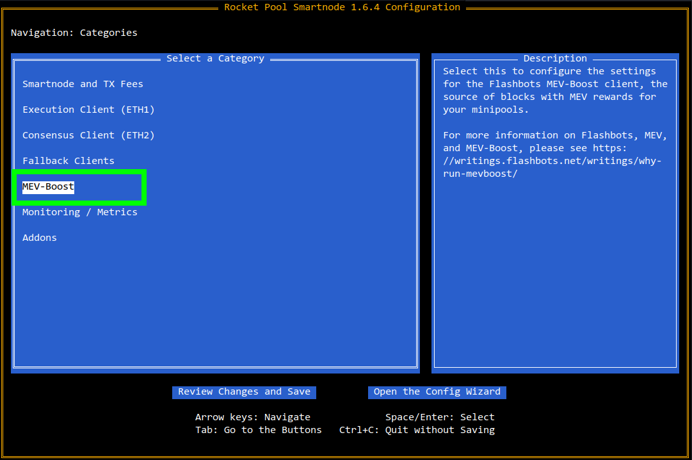
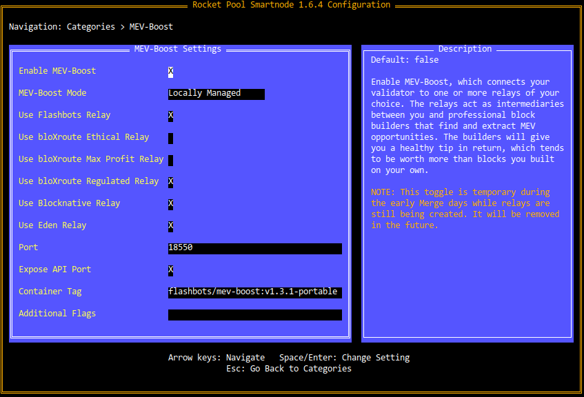

# MEV, MEV-Boost, and MEV Rewards

In the previous section, you learned about how node operators earn priority fees.
Priority fees are a great boost to a node operator's income, but they aren't the *only* form of liquid reward available to you on the Execution layer.
There is a supplemental form of rewards available, known as **MEV rewards**.

::: tip NOTE
As a quick reminder here's a breakdown of the different types of rewards and which layer they're provided on:
- Consensus Layer (locked until withdrawals): attestations, block proposals, sync committees, slashing reports
- Execution Layer (liquid): priority fees and MEV from block proposals
:::


## What is MEV

When your validator creates a block, it usually does so with a very simple algorithm: keep track of a list of pending transactions, bundle as many as them into the block you're building as possible (prioritizing so the ones with the highest tips come first), and submit that block to the chain.

However, Ethereum network users have discovered an interesting side-effect of being able to see the publicly available pool of pending transactions (known as the **mempool**).
Having this knowledge allows them to employ clever and sophisticated algorithms to modify the ordering of those transactions, and in some cases, introduce *new* transactions between them.
These two techniques combined can be used to extract additional ETH from a block proposal.

This extra ETH is known as **Maximal Extractable Value**, or MEV for short.

In general, there are two "flavors" of MEV:
- MEV that comes from "benign" sources, such as being the first to arbitrage between exchanges after a large buy or sell
- MEV that comes at the cost of the Ethereum users, by front-running their transactions and profiting from the user's resulting slippage (see [Sandwich Attacks](https://trustwallet.com/blog/how-to-protect-yourself-from-sandwich-attacks) for more information on this technique)


## Block Builders and Relays

Finding MEV opportunities is not an easy thing; state-of-the-art opportunity finders, known as **searchers**, require immensely powerful computers and employ complex AI algorithms to quickly identify and extract MEV.
Searchers then take these opportunities and provide them to **block builders** - entities that aggregate these bundles of opportunities together to form a complete Ethereum block (which can be the searchers themselves or other parties).

The hardware and software requirements for running a profitable searcher prevent most node operators from using them (or at least using them *competitively*), and thus prevent them from finding their own MEV opportunities to capitalize on.
Luckily, simply *finding* MEV opportunities is only half of the equation.

Every Epoch (6.4 minutes, or 32 slots), the Beacon Chain randomly selects a validator from the entire list of active validators to propose a block that will fit in one of the slots for in that Epoch.
This list can be seen for the next upcoming Epoch, which means everyone can see which validators are assigned to each slot a few minutes in advance.

Some [clever entities](https://docs.flashbots.net/) have leveraged this advance knowledge to essentially construct a kind of "marketplace" of sorts.
In this marketplace, validators can register themselves when they have upcoming block proposals and block builders can submit bids for blocks they'd like the validators to propose.
These bids always give the priority fees from each transaction in the block to the proposer, and they *also* offer a supplemental tip to the proposer that comes from the MEV the builder was able to extract for themselves. 

The validators can then examine these bids, determine which one ultimately provides the most profit, and propose that block instead of building their own.

This "marketplace" where block builders interact with validators is known as a **relay**.
Different relays have different rules (such as which of the aforementioned "flavors" of MEV they permit from block builders, and whether or not they comply with certain government sanction regulations), but ultimately they all serve this same marketplace function.

Rocket Pool currently offers its node operators access to **six different relays**:

| Name | Regulation | MEV Types |
| - | - | - |
| [Flashbots](https://boost.flashbots.net/) | Complies with OFAC Sanctions* | All types |
| [bloXroute Max Profit](https://docs.bloxroute.com/apis/mev-solution/mev-relay-for-validators) | Unregulated | All types |
| [bloXroute Ethical](https://docs.bloxroute.com/apis/mev-solution/mev-relay-for-validators) | Unregulated | "Benign" (no front-running or sandwiching) |
| [bloXroute Regulated](https://docs.bloxroute.com/apis/mev-solution/mev-relay-for-validators) | Complies with OFAC Sanctions* | All types |
| [Blocknative](https://docs.blocknative.com/) | Complies with OFAC Sanctions* | All types |
| [Eden Network](https://v2.docs.edennetwork.io/eden-relay/overview) | Complies with OFAC Sanctions* | All types |

::: warning NOTE
*Relays that comply with OFAC sanctions follow the blacklist of addresses that the United States Office of Foreign Assets Control (OFAC) maintains.
We **strongly encourage** you to read more about the OFAC sanctions, network censorship, and make a carefully-informed decision about whether or not you believe you should comply with those sanctions and which relays you are comfortable using.

More information can be found in articles such as these:
- [https://home.treasury.gov/news/press-releases/jy0916](https://home.treasury.gov/news/press-releases/jy0916)
- [https://www.coindesk.com/tech/2022/08/23/as-censorship-on-ethereum-begins-could-this-open-sourced-code-help-counter-it/](https://www.coindesk.com/tech/2022/08/23/as-censorship-on-ethereum-begins-could-this-open-sourced-code-help-counter-it/)
- [https://blog.bitmex.com/ofac-sanctions-ethereum-pos-some-technical-nuances/](https://blog.bitmex.com/ofac-sanctions-ethereum-pos-some-technical-nuances/)
- [https://www.paradigm.xyz/2022/09/base-layer-neutrality](https://www.paradigm.xyz/2022/09/base-layer-neutrality)
:::

If you're interested in exploring the relative market share and average tips per block from each of the relays, take a look at [https://www.mevboost.org/](https://www.mevboost.org/).
This site captures many metrics about the various MEV relays so you can better understand the popularity and returns of the relays.


## MEV-Boost

There are many relays out there, and having your node automatically register and maintain contact with each of them can be a burdensome task.
Luckily, the engineers at Flashbots produced and maintain a program explicitly designed to handle this relay management known as [MEV-Boost](https://boost.flashbots.net/).

MEV-Boost is a simple program: you tell it which relays you want to use and tell your Consensus client how to reach it, and it takes care of all of the registration, bidding, blind signing, and proposal management in conjunction with your Consensus client.
It lets you passively participate in this builder-proposer-marketplace, and thus earn extra rewards with zero effort on your part.

MEV-Boost is [open source](https://github.com/flashbots/mev-boost) and has been [audited](https://github.com/flashbots/mev-boost/blob/main/docs/audit-20220620.md).

Below is a good visual depiction of how the entire MEV ecosystem functions, and where MEV-Boost fits in:


<center>

*Image courtesy of Flashbots*

</center>

The Rocket Pool Smartnode comes with MEV-Boost directly bundled in by default, enabling our **Docker Mode** and **Hybrid Mode** node operators to seamlessly take advantage of it.
**Native Mode** users will need to set it up manually.


## Rocket Pool and MEV

Because Rocket Pool validators are partially funded by the rETH stakers, the protocol requires that MEV rewards (as well as priority fees) be **shared with the rETH stakers** (minus the node operator's commission, of course).
Node operators are not permitted to pocket the entire MEV reward for themselves when proposing with a Rocket Pool validator.

To that end, MEV-Boost is a critical component of the Rocket Pool network for several reasons:
- It provides easy access to the network of MEV relays
- It ensures that the node operator isn't building their own blocks; this is important to ensure that a node operator isn't running their own searcher and stealing MEV without sharing it with the rETH stakers
- It increases the overall returns for the rETH stakers, which keeps the protocol competitive with other, more centralized staking providers

The second point here is important: Rocket Pool as a protocol will ultimately rely on a [Trusted Block Builder](https://github.com/rocket-pool/rocketpool-research/blob/master/Post%20Merge/Security.md#option-2-trusted-block-builders) (or more accurately, a Trusted Relay) design to ensure that rETH stakers always receive their fair share of MEV rewards and priority fees.

Each of the relays listed above currently act in this role.

We are taking a three-phase approach towards tranistioning to the Trusted Block Builder design:


### Phase 1: Opt-In

In phase 1, MEV-Boost is provided to all node operators as an **opt-in** configuration.
Node operators are encouraged to use it because it improves rETH's returns and thus keeps the protocol competitive, but are not required to use it.
Node operators can elect to use **one or more** of the trusted relays listed above but cannot use a custom (untrusted) relay.

This is the **current** phase.


### Phase 2: Opt-Out

In phase 2, MEV-Boost is enabled by default for all node operators.
Node operators can elect to use **one or more** of the trusted relays listed above but cannot use a custom (untrusted) relay.
Node operators that choose to opt-out of MEV-boost must do so explicitly before starting the Smartnode.

This phase is estimated to begin in **October 2022**.


### Phase 3: Required

In phase 3, MEV-Boost is no longer optional; it will be required for all node operators.
Node operators **must** elect to use **one or more** of the trusted relays listed above but cannot use a custom (untrusted) relay.

There is currently **no scheduled date** for this phase.


## Configuring MEV-Boost in the Smartnode

To learn how to configure MEV-Boost, please select which mode you are using below.

:::::: tabs
::::: tab Docker Mode
Configuring MEV-Boost is easy with the Smartnode's configuration TUI.
Start by running `rocketpool service config` and navigate to the `MEV-Boost` option:

<center>



</center>

Check the box labeled `Enable MEV-Boost` to enable it.

Once enabled, The screen will look like this (as of Smartnode v1.6.4):

<center>



</center>

Check the box labeled `Enable MEV-Boost` to enable it.

Below is a description of each option and how to use them.

- The `MEV-Boost Mode` box lets you toggle between a MEV-Boost instance that Rocket Pool manages, and an external one that you manage on your own. This is meant for advanced users that already have MEV-Boost set up and simply want to use it instead of having Rocket Pool run a second copy. Regular Docker Mode users should just leave this set to `Locally Managed`.

- Each of the `Relay` check boxes lets you specify which relays you want to use. **You can enable multiple relays here, you don't need to limit your selection to only one!** Please see the descriptions of each relay above for more information on them.
  - If you don't care about OFAC sanctions or MEV type, **simply check all of the boxes**.
  - If you want to ensure compliaces with the OFAC sactions, you should select **Flashbots, bloxRoute Regulated, Blocknative, and Eden.**
  - If you specifically want to avoid relays that comply with the OFAC sanctions, you should select **bloxRoute Max Profit** and/or **bloxRoute Ethical** depending on how you feel about Sandwich Attacks.
  - *In a future Smartnode update, we'll replace these explicit relay choices with these profiles instead for simplicity.*

- The `Port` box is not important for Docker mode users.
- The `Expose API Port` box is not important for Docker mode users.
- The `Container Tag` box is useful to manually upgrade the version of MEV-Boost that the Smartnode runs if Flashbots releases a new high-priority version you want to use before a Smartnode update with it is released.
- The `Additional Flags` box is used if you want to add supplemental config flags or parameters directly to the MEV-Boost container. Normally, it will not be useful.

Once you've enabled MEV-Boost and enabled the relays you'd like to do, simply save and exit.
The Smartnode will restart the relevant containers for you, and automatically set it all up for you.

See below for instructions on how to check that it's working as expected. 
:::::

::::: tab Hybrid Mode
Configuring MEV-Boost is easy with the Smartnode's configuration TUI.
Start by running `rocketpool service config` and navigate to the `MEV-Boost` option:

<center>


</center>

Check the box labeled `Enable MEV-Boost` to enable it.

Once enabled, The screen will look like this (as of Smartnode v1.6.4):

<center>


</center>

Check the box labeled `Enable MEV-Boost` to enable it.

Below is a description of each option and how to use them.

- The `MEV-Boost Mode` box lets you toggle between a MEV-Boost instance that Rocket Pool manages, and an external one that you manage on your own. Some users prefer to let Rocket Pool manage its own instance of MEV-Boost and connect their externally-managed Beacon Nodes to it. In this case, `Locally Managed` is the best option. If you already run your own MEV-Boost instance and simply want to let Rocket Pool's VC use it (i.e. by enabling blinded block signing), simply leave this on `Externally Managed`. **You don't need to take any further action after this.**

::: warning NOTE
If you run your own MEV-Boost instance, you **must** only register with the trusted relays listed above. If your Rocket Pool validator proposes a block that was sent via an untrusted relay, the Oracle DAO will **flag you for cheating** and possibly stealing MEV from the rETH stakers. This will result in [a penalty](https://github.com/rocket-pool/rocketpool-research/blob/master/Penalties/penalty-system.md) on your minipool!
:::

- If you decided to use a `Locally Managed` instance of MEV-Boost, each of the `Relay` check boxes underneath it will let you specify which relays you want to use. **You can enable multiple relays here, you don't need to limit your selection to only one!** Please see the descriptions of each relay above for more information on them.
  - If you don't care about OFAC sanctions or MEV type, **simply check all of the boxes**.
  - If you want to ensure compliaces with the OFAC sactions, you should select **Flashbots, bloxRoute Regulated, Blocknative, and Eden.**
  - If you specifically want to avoid relays that comply with the OFAC sanctions, you should select **bloxRoute Max Profit** and/or **bloxRoute Ethical** depending on how you feel about Sandwich Attacks.
  - *In a future Smartnode update, we'll replace these explicit relay choices with these profiles instead for simplicity.*

- The `Port` box determines which port MEV-Boost will listen for incoming connections from your Beacon Node on. If you need to change it because of a port conflict within your node, you can do it here.
- The `Expose API Port` box **should be checked** so that your externally-managed BN can communicate with the MEV-Boost instance Rocket Pool will manage.
- The `Container Tag` box is useful to manually upgrade the version of MEV-Boost that the Smartnode runs if Flashbots releases a new high-priority version you want to use before a Smartnode update with it is released.
- The `Additional Flags` box is used if you want to add supplemental config flags or parameters directly to the MEV-Boost container. Normally, it will not be useful.

Once you've enabled MEV-Boost and enabled the relays you'd like to do, simply save and exit.
If you're using a `Locally Managed` instance and have the `Expose API Port` box checked, you can then configure your Beacon Node to connect to it at `http://localhost:18550`.
Please refer to [Flashbots' documentation](https://github.com/flashbots/mev-boost/wiki/Testing) to learn how to enable MEV-Boost on your externally-managed Beacon Node.

::: tip NOTE
Note that you **may need to permit this in your UFW configuration** if you have the firewall enabled.
:::

See below for instructions on how to check that it's working as expected. 
:::::

::::: tab Native Mode
::: tip NOTE
If you are using any consensus client other than Teku, then you have already [installed and configured MEV](./native.md#installing-mev-boost) when setting up your node. In this case, you can skip the additional Teku-only configuration steps described below.
:::

::: danger WARNING
When configuring your node's MEV-Boost relays, you **must** only register with the trusted relays listed above. If your Rocket Pool validator proposes a block that was sent via an untrusted relay, the Oracle DAO will **flag you for cheating** and possibly stealing MEV from the rETH stakers. This will result in [a penalty](https://github.com/rocket-pool/rocketpool-research/blob/master/Penalties/penalty-system.md) on your minipool!
:::

If you are running the Teku consensus client, then completing the configuration of MEV-Boost for Teku requires creating a separate configuration file that includes your node's fee distributor address as described in the next section.

<b>Completing the MEV-Boost Configuration for Teku</b>

You can determine your node's fee address by executing the command ```rp node status```. If you [opted into the smoothing pool](./fee-distrib-sp.md#the-smoothing-pool), the displayed fee address is the [Deposit Pool's contract address](../../overview/contracts-integrations.md#deposit-pool-contract-version-history). Otherwise, the command displays a unique fee distributor address for your node. (If the status indicates that you haven't set up your node's fee distributor address yet, you can do so using the ```rp node initialize-fee-distributor``` command. For more information, see [Node commands](../node/cli-intro.md#node-commands).)

::: danger WARNING
Because Teku uses a custom configuration file, you must assume full responsibility for ensuring the fee recipient is always set to the correct address in the file.

Please read the [penalty specification](https://github.com/rocket-pool/rocketpool-research/blob/master/Penalties/penalty-system.md) to understand what it must be set to given your configuration, and when you can safely change it from one value to another.

Failure to do so could result in your minipools being penalized!
:::

You're now ready to create the Teku proposer configuration file:
```shell
sudo nano /etc/teku/proposerConfig.json
```
Define the contents of the file to enable MEV by default:
```json
{
  "default_config": {
    "fee_recipient": "<address>",
    "builder": {
      "enabled": true
    }
  }
}
```
where `<address>` is the fee address you obtained from the `rp node status` command earlier (without the angle brackets).
For example:
```json
{
  "default_config": {
    "fee_recipient": "0x2cac916b2A963Bf162f076C0a8a4a8200BCFBfb4",
    "builder": {
      "enabled": true
    }
  }
}
```
After saving the file, update its owner:
```shell
sudo chown mevboost:mevboost /etc/teku/proposerConfig.json
```

Now, update the service files for both your Teku consensus client and validator client to enable MEV-Boost.
To update the consensus client service configuration:
```shell
sudo nano /etc/systemd/system/teku-bn.service
```
Include the following arguments in the consensus client's `ExecStart` command:
```
--validators-builder-registration-default-enabled=true \
--builder-endpoint=http://127.0.0.1:18550
``` 
For example:
```
ExecStart=/srv/teku/bin/teku \
  --network=mainnet \
  --data-path=/srv/teku/teku_data \
  --p2p-port=9001 \
  --rest-api-enabled \
  --rest-api-port=5052 \
  --eth1-deposit-contract-max-request-size=150 \
  --ee-endpoint=http://localhost:8551 \
  --ee-jwt-secret-file="/secrets/jwtsecret" \
  --validators-builder-registration-default-enabled=true \
  --builder-endpoint=http://127.0.0.1:18550 \
  --validators-proposer-default-fee-recipient=${FEE_RECIPIENT}
```
To update the validator client configuration:
```shell
sudo nano /etc/systemd/system/teku-vc.service
```
Include the following arguments in the validator client's `ExecStart` command:
```
--validators-builder-registration-default-enabled=true \
--validators-proposer-config="/etc/teku/proposerConfig.json"
```
For example:
```
ExecStart=/srv/teku/bin/teku validator-client \
  --network=mainnet \
  --validator-keys=/srv/rocketpool/data/validators/teku/keys:/srv/rocketpool/data/validators/teku/passwords \
  --beacon-node-api-endpoint="http://localhost:5052" \
  --validators-graffiti="RP Teku" \
  --log-destination=CONSOLE \
  --data-base-path=/srv/rocketpool \
  --validators-builder-registration-default-enabled=true \
  --validators-proposer-config="/etc/teku/proposerConfig.json" \
  --validators-proposer-default-fee-recipient=${FEE_RECIPIENT}
```
Finally, you must reload and restart the consensus and validator client services:
```shell
sudo systemctl daemon-reload
sudo systemctl restart teku-bn teku-vc
```
You have now finished configuring MEV-Boost for Teku.
:::::
::::::


## Checking MEV-Boost's Logs

To check on MEV-Boost's logs, run the following command (for Docker Mode users and Hybrid users with a locally-managed container):

```
rocketpool service logs mev-boost
```

The output will show you which relays you've enabled, their connection status, and begin listening for traffic from your Beacon Node:

```
mev-boost_1      | time="2022-09-28T22:02:06Z" level=info msg="mev-boost v1.3.1" module=cli
mev-boost_1      | time="2022-09-28T22:02:06Z" level=info msg="Using genesis fork version: 0x00000000" module=cli
mev-boost_1      | time="2022-09-28T22:02:06Z" level=info msg="using 4 relays" module=cli relays="[{0xac6e77dfe25ecd6110b8e780608cce0dab71fdd5ebea22a16c0205200f2f8e2e3ad3b71d3499c54ad14d6c21b41a37ae https://0xac6e77dfe25ecd6110b8e780608cce0dab71fdd5ebea22a16c0205200f2f8e2e3ad3b71d3499c54ad14d6c21b41a37ae@boost-relay.flashbots.net?id=rocketpool} {0xb0b07cd0abef743db4260b0ed50619cf6ad4d82064cb4fbec9d3ec530f7c5e6793d9f286c4e082c0244ffb9f2658fe88 https://0xb0b07cd0abef743db4260b0ed50619cf6ad4d82064cb4fbec9d3ec530f7c5e6793d9f286c4e082c0244ffb9f2658fe88@bloxroute.regulated.blxrbdn.com?id=rocketpool} {0x9000009807ed12c1f08bf4e81c6da3ba8e3fc3d953898ce0102433094e5f22f21102ec057841fcb81978ed1ea0fa8246 https://0x9000009807ed12c1f08bf4e81c6da3ba8e3fc3d953898ce0102433094e5f22f21102ec057841fcb81978ed1ea0fa8246@builder-relay-mainnet.blocknative.com?id=rocketpool} {0xb3ee7afcf27f1f1259ac1787876318c6584ee353097a50ed84f51a1f21a323b3736f271a895c7ce918c038e4265918be https://0xb3ee7afcf27f1f1259ac1787876318c6584ee353097a50ed84f51a1f21a323b3736f271a895c7ce918c038e4265918be@relay.edennetwork.io?id=rocketpool}]"
mev-boost_1      | time="2022-09-28T22:02:06Z" level=info msg="Checking relay" module=service relay="https://0xac6e77dfe25ecd6110b8e780608cce0dab71fdd5ebea22a16c0205200f2f8e2e3ad3b71d3499c54ad14d6c21b41a37ae@boost-relay.flashbots.net?id=rocketpool"
mev-boost_1      | time="2022-09-28T22:02:06Z" level=info msg="Checking relay" module=service relay="https://0xb0b07cd0abef743db4260b0ed50619cf6ad4d82064cb4fbec9d3ec530f7c5e6793d9f286c4e082c0244ffb9f2658fe88@bloxroute.regulated.blxrbdn.com?id=rocketpool"
mev-boost_1      | time="2022-09-28T22:02:07Z" level=info msg="Checking relay" module=service relay="https://0x9000009807ed12c1f08bf4e81c6da3ba8e3fc3d953898ce0102433094e5f22f21102ec057841fcb81978ed1ea0fa8246@builder-relay-mainnet.blocknative.com?id=rocketpool"
mev-boost_1      | time="2022-09-28T22:02:07Z" level=info msg="Checking relay" module=service relay="https://0xb3ee7afcf27f1f1259ac1787876318c6584ee353097a50ed84f51a1f21a323b3736f271a895c7ce918c038e4265918be@relay.edennetwork.io?id=rocketpool"
mev-boost_1      | time="2022-09-28T22:02:07Z" level=info msg="listening on 0.0.0.0:18550" module=cli
```

This indicates that it's running properly.

If you have validators already up and running, you will see messages like this every few minutes in the logs:

```
mev-boost_1      | time="2022-09-28T21:40:48Z" level=info msg="http: GET /eth/v1/builder/status 200" duration=0.147305645 method=GET module=service path=/eth/v1/builder/status status=200
mev-boost_1      | time="2022-09-28T21:40:48Z" level=info msg="http: POST /eth/v1/builder/validators 200" duration=0.052895118 method=POST module=service path=/eth/v1/builder/validators status=200
```

This indicates that your Beacon node was able to properly connect to it and register its validators, indicating that your node is now actively engaging with the MEV relays and is ready to receive blocks from block builders!


## Next Steps

Now that MEV-Boost has been set up, you're ready to create a new minipool and start validating on the Ethereum network!
Read the next section to walk through this process.