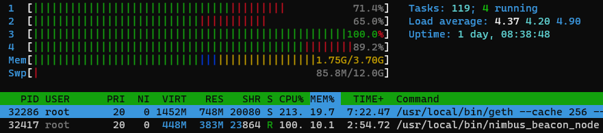
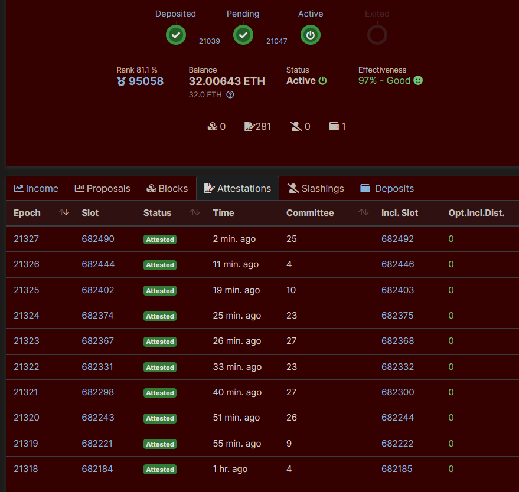
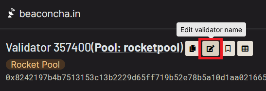
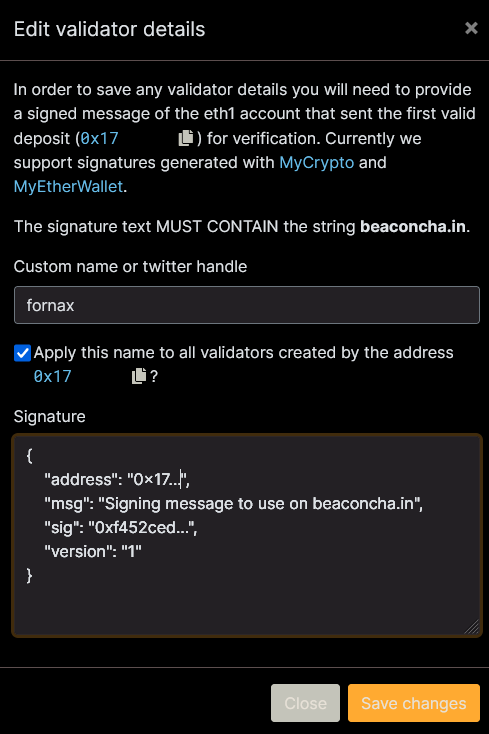
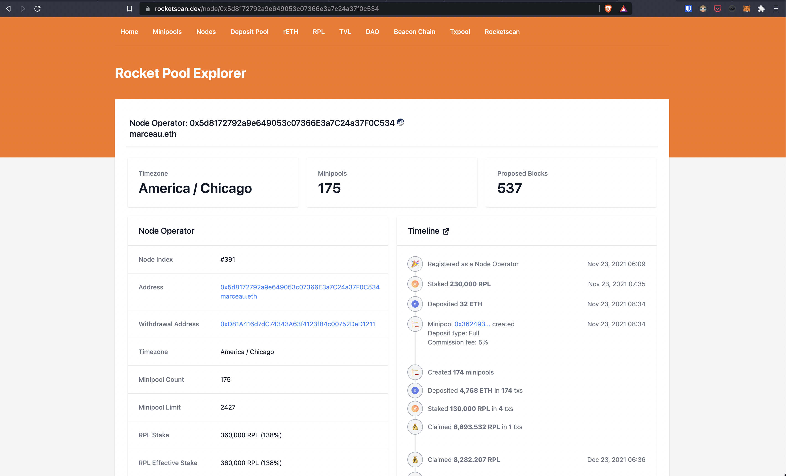

# Monitoring your Node's Performance

Now that your node is up and running and you have one or more minipools attached, you'll need to keep an eye on everything to make sure it's running smoothly.

You can track your machine either:

1. Directly by tapping into your machine metrics
2. Indirectly through the use of third party tools

It is recommended to use a combination of both depending on your needs.

## Directly Tracking your Machine's Status

With respect to your machine's status, there are a few useful metrics you'll probably want to keep an eye on:

- CPU Usage
- Free RAM remaining
- Swap space usage (if you enabled it)
- Remaining free disk space
- Network I/O (if your ISP imposes a data cap)

::: tip NOTE
The sections below show you some ways to monitor things, but they require you to be logged into the terminal of your machine.
There is a better, much more convenient and much nicer-looking method that uses a web dashboard.
See [Setting up the Grafana Dashboard](grafana.md) section
but keep in mind that it is still under development and considered experimental!
:::

### CPU, RAM, and Swap

The first three can be easily viewed with the `htop` program.
This will give you a nice live view into your system resources, as shown by this screenshot from a Raspberry Pi:

```
htop
```



On the top display with the bars, the numbered bars each refer to a CPU core's current usage.

`Mem` shows you how much RAM you're currently using (in this screenshot, 1.75 GB) and how much you have total (3.70 GB).

`Swp` shows you how much swap space you're using (85.8 MB) and how much you have total (12.0 GB).

On the bottom table, each row represents a process.
Your Execution (ETH1) and Consensus (ETH2) clients will likely be on top (in this case, Geth and Nimbus) which you can see in the rightmost column labeled `Command`.

The `RES` column shows you how much RAM each process is taking - in this screenshot, Geth is taking 748 MB and Nimbus is taking 383 MB.

The `CPU%` column shows you how much CPU power each process is consuming.
100% represents a single core, so if it's over 100%, that means it's using a lot from multiple cores (like Geth is here, with 213%).

### Remaining Free Disk Space

Keeping an eye on how much disk space you have free is easy to do with the following command:

```
df -h
```

This will provide output similar to the following example:

```
Filesystem        Size  Used Avail Use% Mounted on
...
/dev/mmcblk0p2     30G   12G   16G  43% /
...
/dev/sda1         1.8T  852G  981G  47% /mnt/rpdata
...
```

For conventional setups where you have one drive that stores both your Operating System and your Execution (ETH1) and Consensus (ETH2) chain data, you just need to look at the entry that has `/` in the `Mounted on` column.
This represents your main disk.
If that ever looks like it's running out of space (say, 80% used or so), then you need to start thinking about doing some cleanup.
For example, if you're running Geth, you may want to look at [how to prune it](./pruning.md) to clear up some space.

For setups that store the Execution (ETH1) and Consensus (ETH2) chain data on a separate drive (such as the Raspberry Pi, which the above example comes from), you'll want to look at the row that has your chain data folder in the `Mounted on` column as well.
In this example we mounted an external SSD to `/mnt/rpdata`, so we'll have to keep an eye on it to make sure it doesn't grow too large either.

### Network I/O and Data Usage

If you want to track how much network I/O your system uses over time, you can install a nice utility called `vnstat`.
Here's an example of installing it on a Ubuntu / Debian system:

```
sudo apt install vnstat
```

To run it, do this (assuming `eth0` is the name of the network interface you use for your Internet connection):

```
vnstat -i eth0
```

This won't work right away because it needs time to collect data about your system, but as the days and weeks pass, it will end up looking like this:

```
$ vnstat -i eth0
Database updated: 2021-06-28 22:00:00

   eth0 since 2021-01-29

          rx:  3.33 TiB      tx:  4.25 TiB      total:  7.58 TiB

   monthly
                     rx      |     tx      |    total    |   avg. rate
     ------------------------+-------------+-------------+---------------
       2021-05    550.19 GiB |  855.34 GiB |    1.37 TiB |    4.51 Mbit/s
       2021-06    498.13 GiB |  784.43 GiB |    1.25 TiB |    4.57 Mbit/s
     ------------------------+-------------+-------------+---------------
     estimated    535.31 GiB |  842.97 GiB |    1.35 TiB |

   daily
                     rx      |     tx      |    total    |   avg. rate
     ------------------------+-------------+-------------+---------------
     yesterday     18.35 GiB |   32.00 GiB |   50.36 GiB |    5.01 Mbit/s
         today     18.26 GiB |   30.52 GiB |   48.78 GiB |    5.29 Mbit/s
     ------------------------+-------------+-------------+---------------
     estimated     19.92 GiB |   33.30 GiB |   53.22 GiB |
```

This will let you keep tabs on your total network usage, which might be helpful if your ISP imposes a data cap.

Note that most modern systems more commonly use other network interfaces like eno0 and enp0s31f6 and not eth0.
If you need to check your network interface, run the following command:

```shell
ls /sys/class/net
```

Ethernet (hard-wire) devices usually start with `e`, such as the examples above.
Wireless devices usually start with `w`.

## Third-Party Performance Monitoring

The best monitoring uses a Swiss-cheese model: every tool has holes, but if you stack them on top of each-other there is less of a chance anything falls through and catches you by surprise.

Please note that these third-party tools are used by the Rocket Pool community, but are not officially endorsed or supported by the Rocket Pool team.
If you have a tool suggestion, or are a tool owner, you are very welcome to add a pull request with details on your tool.

### Beaconcha.in Website: Using the Beacon Chain as a Metric Source

The [Beaconcha.in](https://beaconcha.in) block explorer website and app provide a way to track your validator's performance by looking at it's on-chain activity.
They also have the option to receive [email notifications](https://beaconcha.in/user/notifications) for significant events like downtime.
Navigate to their site, and enter the public key for your validator in the search box on the top of the screen.

::: tip
If you forgot your validator's public key, you can easily retrieve it with the command `rocketpool minipool status`.
:::

If everything is set up right, you should see something like this:


::: tip NOTE
The above link is for the **mainnet** version of Beaconcha.in.
If you're running on the Prater Testnet, use [this link instead](https://prater.beaconcha.in)!
:::

This is a record of all of the Beacon Chain activity for your validator.
You can use it to check your validator's balance on the Beacon Chain to watch it grow over time and calculate your APY.

You can also use it to quickly gauge if your validator is alive and running correctly.
If it is, all of the attestations should say `Attested` for their **Status**, and ideally all of the **Opt. Incl. Dist.** should be 0 (though an occasional 1 or 2 is fine).

If there are lots of blocks that say `Missed` on them, then your validator is not working properly.
You should check the logs of the `eth1`, `eth2`, and `validator` services with `rocketpool service logs ...` if you're using Docker or Hybrid mode (or the corresponding log scripts if you're using Native mode) to look for problems.

**You should pin this tab or create a bookmark with it so you can quickly jump to it and check the status of your validator.**

#### Using Beaconcha.in to Monitor Multiple Minipools

Beaconcha.in has a [dashboard view](https://beaconcha.in/dashboard) that allows you to monitor multiple validators or minipools at once.
Simply add your validator indices one at a time. If you have a lot of minipools, you can run:

```shell
rocketpool minipool status | grep Validator.index | awk -F " " '{print $3}' | paste -s -d, -
```

to get a comma-separated list, and place it in the URL bar like so: `https://beaconcha.in/dashboard?validators=123456,123457`

### Beaconcha.in App: Validator Overview and Push Notifications

The Beaconcha.in website is a great way to view metrics and set up email alerts.
Their mobile app has a more "at-a-glance" nature.
It also features a push notification service that includes some useful alerts like:

1. Notifications of issues like missed attestations
2. Notifications of Rocket Pool reward rounds
3. Over/under-collateralisation of the RPL on your node

Note that the app has a free version, and paid options with convenience features like homescreen widgets.

### Renaming your Validators on Beaconcha.in

The Beaconcha.in website has a feature that allows users to rename their validators, making them easier to identify/search.

To be able to use this feature you need to sign a message using your node wallet's private key, in order to prove you're the person who controls that validator.

The Smartnode v1.5.1 includes the ability to sign messages with your node wallets's private key by using the command `rocketpool node sign-message`, then providing the message that you want to sign.
It must contain the term 'beaconcha.in' to be used to rename your validators.

```bash
rocketpool node sign-message

Please enter the message you want to sign: (EIP-191 personal_sign)
Signing a message to use on beaconcha.in

Signed Message:

{
    "address": "0x8046c795489c6068883be04e723a011e5ca556a4",
    "msg": "Signing a message to use on beaconcha.in",
    "sig": "0x2ea26499f48ece2e91b79fabf726ea0b5830f48f93ed6fec9f7f1475cb06b96446519ce8c6114429f7b66c55851ea41e45b8854de505f67fc966b3b235fe29a01c",
    "version": "1"
}
```

Open your validator page on Beaconcha.in and click on the `Edit validator name` button.



Copy the result from the sign-message command and paste it in the "Signature" field.
Fill your desired nickname and click the `Save changes`button.



### Uptimerobot: Port-scanning for Uptime

The [Uptimerobot](https://uptimerobot.com/) service is a simple service that scans an IP address for an open port.
If your machine becomes unavailable on the port you specified, Uptimerobot can send you a notification that there is an issue.
The service was a wide variety of notification options including email, push notification, SMS, phone call, and webhooks.

The setup screen looks something like this:


The IP to monitor is the external IP of your node, which you can find by logging into your node by `ssh` or physically, and opening [icanhazip.com](https://icanhazip.com/) in a browser or running the following command in your terminal:

```shell
curl icanhazip.com
```

The port to monitor depends on your node setup; users running the typical Smartnode installation will likely have forwarded ports 30303 and 9001 for the Execution and Consensus clients respectively, so these are good choices for uptime monitoring.

### Rocketpool Metrics Dashboards

There are community-lead initiatives to provide an overview of your node performance, as well as the Rocket Pool network as a whole.

One minimalist tool is [rocketscan.io](https://rocketscan.io/) made by a community member.
It features detailed network and node metrics, including a timeline of your node activity.



### Scripting with Pushover (advanced)

The [Pushover](https://pushover.net/) service allows you to send yourself push notifications.

::: warning NOTE
This is an advanced activity to undertake.
It can be helpful if you are familiar with shell scripting, but is not recommended if you are not comfortable in a shell environment.
:::

To get started with Pushover:

1. Create an account at [pushover.net](https://pushover.net/)
1. [Create an API token](https://pushover.net/apps/build)
1. Install the Pushover mobile app and/or browser extenion
1. Call the Pushover API for any action you care about

Calling the Pushover API to send you a push notification is done through a `curl` call structured as such:

```shell
PUSHOVER_USER=
PUSHOVER_TOKEN=
MESSAGE_TITLE=
MESSAGE_CONTENT=
curl -f -X POST -d "token=$PUSHOVER_TOKEN&user=$PUSHOVER_USER&title=$MESSAGE_TITLE&message=$MESSAGE_CONTENT&url=&priority=0" https://api.pushover.net/1/messages.json
```

#### Example: Push Notification on Updates Available

If you set up automatic updates using the `unattended-upgrades` and `update-nofifier` packages, you may want to receive a push notification when there are updates available for your node.
A potential way to do this is to create a script in `~/update-notifier.sh` and to trigger it daily at 9:00 using `crontab`.

To do this, first create the script by running:

```shell
nano ~/update-notifier.sh
```

Then paste the following script:

```shell
#!/bin/bash

PUSHOVER_USER=
PUSHOVER_TOKEN=
NODE_ADDRESS="$(rocketpool node status | grep -Po "(?<=The node )(0x[A-Za-z0-9]{40})")"
EXPLORER_URL=https://beaconcha.in/validators/eth1deposits?q=
#EXPLORER_URL=https://rocketscan.io/node/
#EXPLORER_URL=https://www.rp-metrics-dashboard.com/dashboard/MAINNET/
NOTIFICATION_URL="$EXPLORER_URL$NODE_ADDRESS"

# Check if the update-notifier file is showing updates available
if cat /var/lib/update-notifier/updates-available | grep -Pq '^(?!0)[0-9]* updates can be applied'; then


   MESSAGE_TITLE="⚠️ Rocket Pool node system updates available"
   MESSAGE_CONTENT="$( cat /var/lib/update-notifier/updates-available | grep -P '^(?!0)[0-9]* updates can be applied' )"

else

   MESSAGE_TITLE="✅ Rocket Pool node system up to date"
   MESSAGE_CONTENT="No system updates available"

fi

curl -f -X POST -d "token=$PUSHOVER_TOKEN&user=$PUSHOVER_USER&title=$MESSAGE_TITLE&message=$MESSAGE_CONTENT&url=$NOTIFICATION_URL&priority=0" https://api.pushover.net/1/messages.json

```

Next, run the following command to mark the script as executable:

```shell
chmod u+x ~/update-notifier.sh
```

Now run the following command to open your crontab:

```shell
crontab -e
```

Then use the arrow keys to scroll down, and add the line `* 9 * * * ~/update-notifier.sh` so the file looks like this:

```shell
# Edit this file to introduce tasks to be run by cron.
#
# Each task to run has to be defined through a single line
# indicating with different fields when the task will be run
# and what command to run for the task
#
# To define the time you can provide concrete values for
# minute (m), hour (h), day of month (dom), month (mon),
# and day of week (dow) or use '*' in these fields (for 'any').
#
# Notice that tasks will be started based on the cron's system
# daemon's notion of time and timezones.
#
# Output of the crontab jobs (including errors) is sent through
# email to the user the crontab file belongs to (unless redirected).
#
# For example, you can run a backup of all your user accounts
# at 5 a.m every week with:
# 0 5 * * 1 tar -zcf /var/backups/home.tgz /home/
#
# For more information see the manual pages of crontab(5) and cron(8)
#
# m h  dom mon dow   command

# This like triggers at 9 AM local time
# to configure your own times, refer to https://crontab.guru/
0 9 * * * ~/update-notifier.sh
```

The press `control+x` to exit and press `Y` when asked whether you want to save your changes.

You should now receive a notification at 09:00 local time if you have updates.
You can manually run the script by typing this in your terminal:

```shell
~/update-notifier.sh
```

#### Example: Get Notified when your APC UPS Daemon Activates

Some home stakers are using an Uninterruptible power supply with the `apcupsd` utility to make sure their node shuts down gracefully if their power goes out.

The `apcupsd` utility uses the `apccontrol` script to manage its logic, thus it is possible to monitor the activity of this daemon by editing the `/etc/apcupsd/apccontrol` file.
To do this, run:

```shell
sudo nano /etc/apcupsd/apccontrol
```

Then at the top of the line add the following code so the file looks like this:

```shell
PUSHOVER_USER=
PUSHOVER_TOKEN=
MESSAGE_TITLE="UPS Daemon called"
MESSAGE_CONTENT="called with: $1"
curl -f -X POST -d "token=$PUSHOVER_TOKEN&user=$PUSHOVER_USER&title=$MESSAGE_TITLE&message=$MESSAGE_CONTENT&url=&priority=0" https://api.pushover.net/1/messages.json

#
# Copyright (C) 1999-2002 Riccardo Facchetti <riccardo@master.oasi.gpa.it>
#
# platforms/apccontrol.  Generated from apccontrol.in by configure.
```

This will send you a push notification whenever your UPS daemon takes action, includion periodic "self test" functionality.
