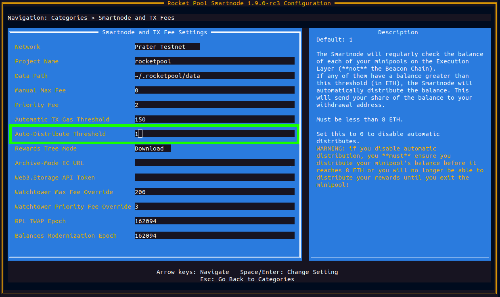

# Distributing Skimmed Rewards

The ETH rewards you receive for running a validator for Ethereum are routinely sent to your minipools in a process referred to as "skimming".
The frequency of skims depends on the number of activate validators on the Beacon Chain. At the time of writing the number of validators is around
500,000 which results in a skim occurring approximately every 2-3 days.

Skimmed rewards will accrue in each of your minipools until you "distribute" them. This process distributes the skimmed rewards between you, as the node operator, and rETH holders
based on your commission rate and ratio of supplied and provided ETH.

::: warning NOTE
In order to access your minipool's balance, you will need to upgrade to the [Atlas delegate](./minipools/delegates.md) first.
The old Redstone delegate cannot be used to distribute the minipool's balance.
:::


## Automatic Distribution

By default, the Smartnode is configured to automatically distribute your minipools when their balance reaches **1 ETH**. This
threshold can be configured in the TUI by following the steps below.

Run:

```
rocketpool service config
```

Navigate to the setting `Smartnode and TX Fee Settings > Auto Distribute Threshold` shown below.



Changing this setting will adjust the threshold at which the Smartnode will automatically distribute your minipools.
Setting the parameter to 0 will disable automatic distributions.

::: warning WARNING
If you decide to disable automatic distribution, it is important that you still perform a manual distribution on a regular 
basis. Read the [manual distribution section](#manual-distribution) that follows on how to do this.

After a long period of time your skimmed rewards may exceed 8 ETH. If this situation occurs you will no longer be able
to distribute them and will need to exit your validator to access your accrued rewards.

Rocket Pool features a failsafe design which allows anyone, after a long waiting period, to distribute your minipool when
its balance exceeds 8 ETH. To protect your capital, the Smartnode monitors this situation and will automatically exit
your minipool if it occurs.
:::


## Manual Distribution

If you have disabled the automatic distribution of skimmed rewards, you will need to routinely distribute them yourself
with the following process.

If your minipool has less than 8 ETH in it, you can distribute your rewards using the following command:

```
rocketpool minipool distribute-balance
```

This will show you the minipools you have that are eligible for distribution, how much ETH they have, and how much ETH you (the node operator) will receive:

```
WARNING: The following minipools are using an old delegate and cannot have their rewards safely distributed:
	0x7E5703fdA638CD86c316B9EbAF76927fF695ADC5
	0x7E5704aD2a63eb90880426Dcd4a3811246dF3cB0
	0x7E5705c149D11efc951fFc20349D7A96bc6b819C
	0x7E570625cE8F586c90ACa7fe8792EeAA79751778

Please upgrade the delegate for these minipools using `rocketpool minipool delegate-upgrade` in order to distribute their ETH balances.

Please select a minipool to distribute the balance of:
1: All available minipools
2: 0x7E5700bcd65B1770bA68abB288D3f53814d376aC (0.112307 ETH available, 0.031200 ETH goes to you plus a refund of 0.024419 ETH)
3: 0x7E570195026dC29f4B2DfF08B56c3b5D0FF988Ef (0.070754 ETH available, 0.000481 ETH goes to you plus a refund of 0.069399 ETH)
4: 0x7e5702a2cE66B5B35E59B9Ac00eEAAa547881e40 (0.122064 ETH available, 0.070187 ETH goes to you plus a refund of 0.000000 ETH)
5: 0x7E5700c82E38434C6c72890bb82f5B5305f4328a (0.102739 ETH available, 0.000000 ETH goes to you plus a refund of 0.000000 ETH)
6: 0xffCAB546539b55756b1F85678f229dd707328A2F (0.070989 ETH available, 0.025201 ETH goes to you plus a refund of 0.000000 ETH)
```

Any minipools using the original launch delegate will be mentioned at the start, letting you know that you cannot call `distribute-balance` on them until you upgrade their delegates.
This delegate was written before skimmed withdrawals were specified and, as such, do not feature a way to distribute skimmed rewards.

Note that for eligible minipools, you are also shown the **refund amount**.
This is an amount owed directly to you (for example, because you had a balance in your minipool prior to [migrating from a 16-ETH bond down to an 8-ETH bond](./leb-migration.md) or you [converted a solo validator into a minipool](../node/solo-staker-migration.md) with existing rewards).
It will not be shared with the rETH holders.

::: tip NOTE
You might be wondering why the amount going to the node operator (0.031200 ETH) appears lower than you might expect in this case.
That's because in this example, we used an 8-ETH bonded minipool (an LEB8) instead of a 16-ETH bonded minipool!
Read [**our guide on 8-ETH bonded minipools**](lebs.md) if you'd like to learn more about them.
:::

Enter the number of the minipool that you want to distribute.
You will be prompted with the gas price chart as usual, and asked to confirm your decision.
Once you have, your minipool's balance will be distributed:

```
Using a max fee of 2.00 gwei and a priority fee of 2.00 gwei.
Are you sure you want to distribute the ETH balance of 1 minipools? [y/n]
y

Distributing balance of minipool 0x7E5700bcd65B1770bA68abB288D3f53814d376aC...
Transaction has been submitted with hash 0xb883eab903d9688b40d291c5c2030084f9bce19135837ebf96a5c1e8871cfbf9.
Waiting for the transaction to be included in a block... you may wait here for it, or press CTRL+C to exit and return to the terminal.

Successfully distributed the ETH balance of minipool 0x7E5700bcd65B1770bA68abB288D3f53814d376aC.
```

As you can see [from the transaction](https://zhejiang.beaconcha.in/tx/b883eab903d9688b40d291c5c2030084f9bce19135837ebf96a5c1e8871cfbf9), this provided the node's withdrawal address with the node's share of the rewards (plus the refund amount) and returned the rest to the staking pool.
