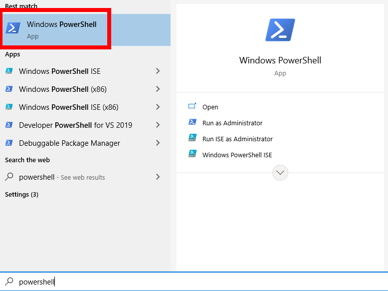

# Intro to Secure Shell (SSH)

In general, there are two ways to access your node machine: **locally**, and **remotely**.

- **Locally** refers to sitting down at the physical node and using a monitor and keyboard connected directly to it.
- **Remotely** refers to connecting to the node using a different computer (say, a laptop or desktop) over a network and interacting with it from there.

Most of the time, node operators prefer the flexibility of working on their node **remotely**.

The Smartnode currently doesn't have a GUI (Graphical User Interface), only a CLI (Command Line Interface), which means interacting with it is done entirely by typing commands into a command-line terminal.
As such, interacting with it remotely requires some way to access your node's terminal from a different machine.
In this section, we'll provide a brief introduction to the most popular way of doing this: **SSH**.

:::: tabs
::: tab Using a Windows Machine

There are a few different ways to use SSH from a Windows machine.

The simplest is to use **Powershell**, which is a powerful command terminal that comes built into modern versions of Windows.
Powershell has SSH included, so you can use it right away without installing any supplemental programs.

You can find it by opening the Start menu and typing `Powershell` into the search bar; there will be several options, but option you want is simply called `Windows Powershell`:

<center>



</center>

This will open up a terminal with a blue background.
You can use `ssh` from here - see below for instructions on how to do that.

Another popular tool is called [PuTTY](https://www.chiark.greenend.org.uk/~sgtatham/putty/latest.html).
PuTTY is a special program that includes a terminal dedicated for SSH usage, but it also comes with a convenient GUI for doing things like changing configurations, saving settings to a "profile", and keeping a list of machines you can easily connect to by selecting from a list.

Instead of using `ssh` as you would with the other tools, PuTTY will do this for you automatically - all you need to provide are the username and password.
For information on how to use PuTTY, take a look at [this great tutorial](https://tonyteaches.tech/putty-ssh-windows-tutorial/).

:::
::: tab Using a Linux or macOS Machine

Using SSH from a Linux or macOS machine is trivial; if you're already using one of these, then you've likely already interacted with the terminal at some point.
SSH is built directly into the terminal; use it by running the `ssh` command. By default, SSH will allow you to connect to your node's primary user account.
:::
::::

Here's how you would connect to your node using SSH.

::: warning NOTE
Run the following command from your laptop or desktop, **not from your node itself**!
:::

```sh
ssh username@node-ip-address
```

Say, for example, that your node's username is `staker` and your node's IP address is `192.168.1.10`.
You would connect to it with the following command:

```sh
ssh staker@192.168.1.10
```

The first time you do this, you will see a message presenting the public key that your node is using - if you are familiar with how to verify this key, you can do so now.
Otherwise, if you trust that you have the correct node IP address in your `ssh` command, you can just say `yes` to accept it.
You only need to do this once. 

The client will then prompt you for your user's password; once you enter that, you're in!
You will be greeted with a welcome message, some details about your machine, and a new prompt.

At this point, everything you type in the terminal **is executed remotely on your node machine** - it's as if you were logged directly into the node machine and typing on it with a locally-attached keyboard!

You'll need to SSH into the terminal periodically for updates and maintenance.
It can be inconvenient to remember how to log in to your node, so it may be helpful to shorten this command by creating a memorable alias - a custom "shortcut" command.

::: warning NOTE
If you do this, be sure to create the alias on the **client machine**, **not** on the node!
If your terminal is still connected to the node, first run `exit` at the command prompt (or simply open a new terminal window).
:::

In this example, we'll create an alias called `ethnode` which will replace the SSH command.
Assuming, as before, that your node's username is `staker` and your node's IP address is `192.168.1.10`, create the alias with the following command:

```sh
echo "alias ethnode='ssh staker@192.168.1.10'" >> ~/.bash_aliases
```

Reload the alias list to make your current terminal window aware of the new alias:
```sh
source ~/.bash_aliases
```

Now, you can connect to the node using the alias you just created instead of the longer command that involves specifying the node's IP address:

```sh
ethnode
```
