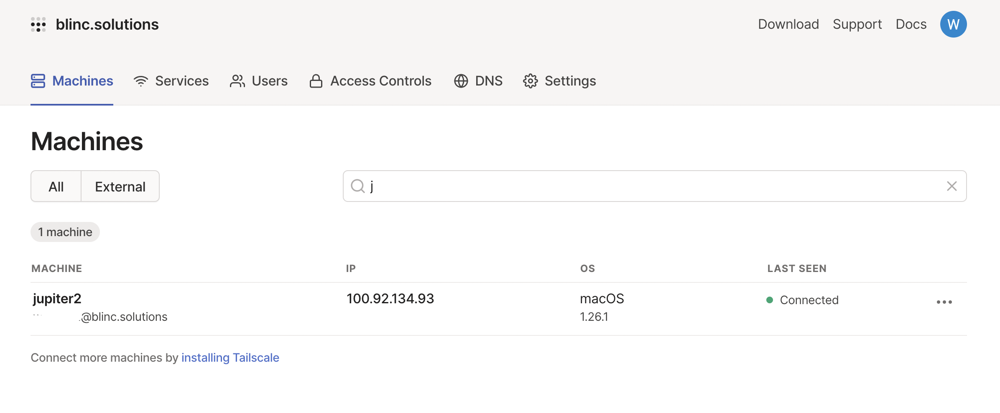
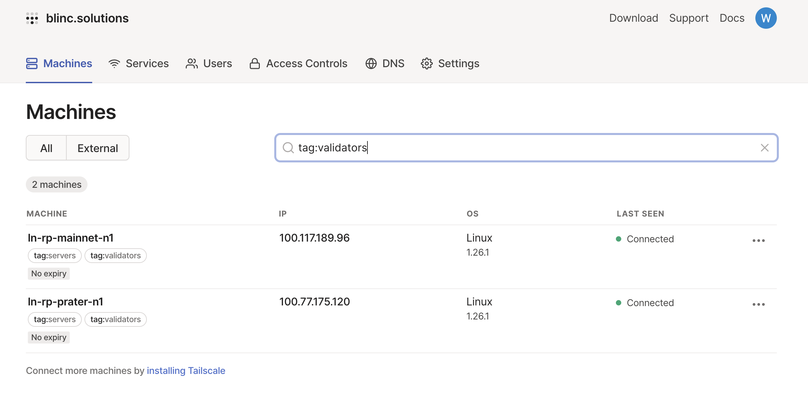

# Configuring a Tailscale VPN Server

::: tip NOTE
This is **optional.**
You only need to consider this section if you run a node at home and would like to connect to it from outside of your home network.
:::

If you would like to log into your home network remotely, such as while on vacation or on a business trip, the most common route is to use a **Virtual Private Network** server.
This will allow you to connect to your node via SSH **and** monitor your Graphana dashboard from anywhere in the world, all without exposing your SSH port to the internet. 

Many Rocket Pool node operators use [Tailscale]((https://tailscale.com/blog/how-tailscale-works/)) as their VPN server of choice for this.
Tailscale is an open source P2P VPN tunnel and hosted endpoint discovery service.
It takes care of authentication, publication, and the NAT traversal required to establish an end-to-end encrypted path between your machine and your node without sending any sensitive traffic to a centralized server.
It is a very powerful tool.

We will briefly cover a basic configuration of it, but feel free to [review their documentation](https://tailscale.com/kb/start/) for more details.


## Setting Tailscale Up

First, create a free [Tailscale account](https://tailscale.com/).
Tailscale requires the use of an SSO identity provider such as Google, GitHub, Okta, Microsoft, etc.
For details, visit [their SSO Page](https://tailscale.com/kb/1013/sso-providers/).

It is recommended that you enable 2FA (Two Factor Authentication) on whichever identity provider you choose for added security.

Next, follow [their onboarding guide](https://tailscale.com/kb/1017/install/) to install Tailscale on your **client** - the machine you want to connect to your network with.
For example, this could be a laptop or your phone.
**Note that it is *not* your Rocket Pool node!** 

Once completed you should see your computer as 'connected' on the [Tailscale dashboard](https://login.tailscale.com/admin/machines).

<center>



</center>

Now, install Tailscale on your **Rocket Pool node**.
You can find instructions for this on their website; for example, here are the [installation instructions for Ubuntu](https://tailscale.com/kb/1039/install-ubuntu-2004/).

::: warning NOTE
If you have UFW configured, you will also want to follow the [UFW Configuration Instructions](https://tailscale.com/kb/1077/secure-server-ubuntu-18-04/)).
:::

First, add Tailscale’s package signing key and repository **on your Rocket Pool node**:

```shell
curl -fsSL https://pkgs.tailscale.com/stable/ubuntu/focal.noarmor.gpg | sudo tee /usr/share/keyrings/tailscale-archive-keyring.gpg >/dev/null
curl -fsSL https://pkgs.tailscale.com/stable/ubuntu/focal.tailscale-keyring.list | sudo tee /etc/apt/sources.list.d/tailscale.list
```

Now, install Tailscale **on your Rocket Pool node**:

```shell
sudo apt-get update
sudo apt-get install tailscale
```

Finally, authenticate and connect your machine to your Tailscale network **on your Rocket Pool node**:

```shell
sudo tailscale up
```

You’re connected!
You can find your Tailscale IPv4 address by running:

```shell
tailscale ip -4
```

You should now see your node machine added to the on the [Tailscale dashboard](https://login.tailscale.com/admin/machines).
You may also change the name of the **node machine** through the dashboard, e.g. to `rocketnode`.



It is suggested to [disable key expiry](https://tailscale.com/kb/1028/key-expiry) for the node machine to prevent the need to periodically re-authenticate.

::: tip Note
If you would like to access your node using a memorable hostname such as rocketnode, you can do so by enabling MagicDNS in the Tailscale settings.
:::

You should now be able to `exit` the SSH session to your node on your client, and SSH into your node again through Tailscale using `ssh your.user@rocketnode`.

::: warning NOTE
If you modified the SSH port of the **node machine** in `/etc/ssh/sshd_config` when you first configured it, use `ssh your.user@rocketnode -p <your port>` instead.

For example, if you assigned SSH to port 1234, you would do:
```
ssh your.user@rocketnode -p 1234
```
:::

You can now also visit `http://rocketnode:3100` in your web browser to access your Grafana dashboard from your **client**.

If you have UFW configured, you can now add a rule to accept any incoming SSH connections over Tailscale.

::: danger WARNING
The following steps will modify your firewall rules.
**You must have at least 2 SSH sessions open to your node machine before proceeding - one for modifying the configuration and testing it afterwards, and one that will stay logged in as a backup in case your changes break SSH so you can revert them!
:::

**Run these commands on the node machine.**

Allow access to all incoming ssh connections over Talscale.

```shell
sudo ufw allow in on tailscale0
```

You may also remove access to the SSH port adding from the [enabling a firewall](securing-your-node.md#essential-enable-a-firewall) steps to competely lock down your node.
Note that you **will not** be able to login from the local network as tailscale will become the only way to login.
Only run the following command if you are okay with this.

```shell
sudo ufw delete "22/tcp"
```

Once you’ve set up firewall rules to restrict all non-Tailscale connections, restart UFW and SSH:

```shell
sudo ufw reload
sudo service ssh restart
```

Now, confirm that everything is working as expected.
`exit` from one of your current SSH sessions (**but remember to keep the second one open as a backup**).

Next, connect to the **node machine** via SSH using the Tailscale IP address:

```shell
ssh your.user@rocketnode
```

If it works, you did everything right and can now safely log into your home network while abroad!

::: tip TIP
If you've previously port forwarded your node's SSH port in your router, you can now remove it.
:::
