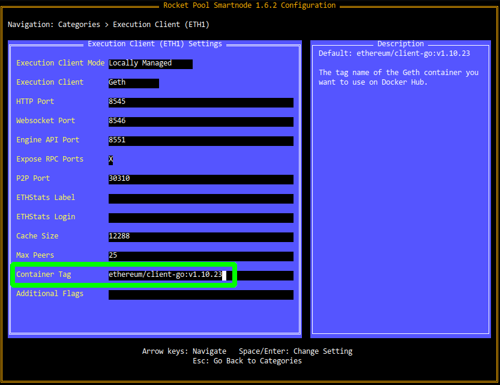
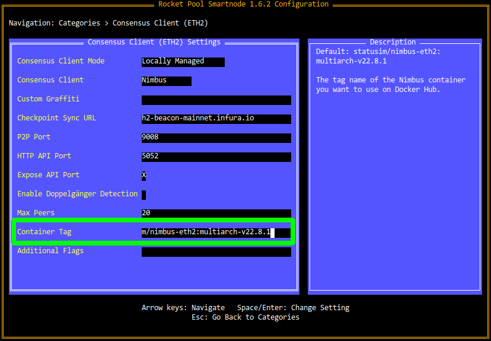

# Checking for Updates

One of the responsibilities of a node operator is making sure your system is up to date with the latest security patches.
Automatic updates are convenient but can interfere with your node operation, so it may be preferable to run them manually.
In either case, **you must make sure that your machine is regularly patched!**


::: tip NOTE
Most of the time, updating will not require your system to be down for more than a few minutes.
You might be concerned that such downtime will negatively affect your Beacon Chain balance.
Rest assured, the penalty for being offline for such a short period of time is **completely negligible**.

Each attestation you miss will penalize you for slightly less than the amount you'd earn from a successful attestation.
As a rule of thumb, if you're offline for an hour, you will earn it all back after being online for an hour again.

Also note that there is **absolutely no chance** that you will be *slashed* by going offline for a short time.
Slashing only occurs if you attack the network, and going offline for maintenance does not count as attacking the network.

**Please keep your systems up to date - don't worry about the downtime penalties!**
:::

## Updating your Operating System

You should frequently check your Operating System's package manager or update service to ensure that quickly apply any new important security patches.
The exact instructions vary for each Operating System and can be found with your system's documentation, but here are a few examples.

:::: tabs
::: tab Ubuntu
In a terminal, type the following:

```
sudo apt update
```

This will access the package servers and check to see if any of your installed packages have new versions available.
If updates are available, the output will look like this:

```
Fetched 3974 kB in 2s (1641 kB/s)                                 
Reading package lists... Done
Building dependency tree       
Reading state information... Done
12 packages can be upgraded. Run 'apt list --upgradable' to see them.
```

You can install the updates with the following command:

```
sudo apt dist-upgrade
```

This will show you the list of packages that are about to be updated, and if the total installation size is large enough, it will show you the size and prompt you to confirm that you accept:

```
12 upgraded, 0 newly installed, 0 to remove and 0 not upgraded.
Need to get 51.3 MB of archives.
After this operation, 52.2 kB of additional disk space will be used.
Do you want to continue? [Y/n]
```

Ensure that you have enough space available to do this, then press `y` and `Enter` to begin the update process.

Once the progress bar is finished and you're dropped back into the terminal prompt, run the following command to clean up any old versions of packages that were just replaced:

```
sudo apt autoremove
```

Next, check if your system needs to be rebooted:

```
cat /var/run/reboot-required
```

If the above command prints `*** System restart required ***`, then you should restart your machine to finish applying the updates when you are able:

```
sudo reboot
```

Rocket Pool will gracefully shut down and automatically start back up with the system once it reboots.

:::

::: tab macOS
To update the OS packages, use the UI to select `Apple -> Software Update`.

To udate packages themselves, the easiest way is via `homebrew` in the terminal:

```
brew update && brew upgrade
```
:::
::::


## Updating the Smartnode Stack

Occasionally, Rocket Pool will release a new version of the Smartnode stack.
Updates can contain new versions of the CLI or the Rocket Pool Docker containers, as well as new versions of the Execution and Consensus clients.

The most consistent way to find out about new releases is to subscribe to the Rocket Pool Discord server; they will always be posted in the Releases channel and you will receive a notification.

::: warning NOTE
Note that running `apt update` will not update the node software.
This must be done manually using the steps below.
:::

::: tip TIP
When you have completed the Smartnode upgrade, the Grafana dashboard will still indicate there is still an update available.
It will automatically clear within a day when the system next auto-checks for updates.

If you want to clear it immediately after the update, simply run:
```sudo apt update```
:::

The steps to upgrade depend on which mode your node uses. Select from the options below:

:::::: tabs
::::: tab Linux (Docker or Hybrid Mode)

Stop the Rocket Pool services:
```
rocketpool service stop
```

Download the new Smartnode CLI:

For `x64` systems (most normal machines):

```
wget https://github.com/rocket-pool/smartnode-install/releases/latest/download/rocketpool-cli-linux-amd64 -O ~/bin/rocketpool
```

For `arm64` systems (like the Raspberry Pi):

```
wget https://github.com/rocket-pool/smartnode-install/releases/latest/download/rocketpool-cli-linux-arm64 -O ~/bin/rocketpool
```

Now run the install command:

```
rocketpool service install -d
```

The `-d` flag tells it to ignore system dependencies like Docker, since you already have them.

If you'd like to see what's changed, open the Settings Manager - the Review Page will show you what's new:

```
rocketpool service config
```

When you're done, start Rocket Pool up again:

```
rocketpool service start
```

Finally, check the version to make sure the CLI and Smartnode stack are both up to date:

```
rocketpool service version

Your Smartnode is currently using the Prater Test Network.

Rocket Pool client version: 1.5.0
Rocket Pool service version: 1.5.0
Selected Eth 1.0 client: Geth (Locally managed)
        Image: ethereum/client-go:v1.10.21
Selected Eth 2.0 client: Lighthouse (Locally managed)
        Image: rocketpool/lighthouse:mevboost-5ee3bc5
```

Both the client and service should match the new release version.

:::::
::::: tab Linux (Native Mode)

::: warning NOTE
This will only update the Smartnode stack itself - it **will not** update your Execution or Consensus clients.
You will have to do this manually (see the next section below).
:::

Stop the Rocket Pool services:
```
sudo systemctl stop rp-node rp-watchtower
```

Download the new Smartnode CLI and back up the old CLI and daemon binaries if you need to bring them back:

For `x64` systems (most normal machines):

```
sudo mv /usr/local/bin/rocketpool /usr/local/bin/rocketpool_bak

sudo mv /usr/local/bin/rocketpoold /usr/local/bin/rocketpoold_bak

sudo wget https://github.com/rocket-pool/smartnode-install/releases/latest/download/rocketpool-cli-linux-amd64 -O /usr/local/bin/rocketpool

sudo wget https://github.com/rocket-pool/smartnode-install/releases/latest/download/rocketpool-daemon-linux-amd64 -O /usr/local/bin/rocketpoold

sudo chmod +x /usr/local/bin/rocketpool /usr/local/bin/rocketpoold
```

For `arm64` systems (like the Raspberry Pi):

```
sudo mv /usr/local/bin/rocketpool /usr/local/bin/rocketpool_bak

sudo mv /usr/local/bin/rocketpoold /usr/local/bin/rocketpoold_bak

sudo wget https://github.com/rocket-pool/smartnode-install/releases/latest/download/rocketpool-cli-linux-arm64 -O /usr/local/bin/rocketpool

sudo wget https://github.com/rocket-pool/smartnode-install/releases/latest/download/rocketpool-daemon-linux-arm64 -O /usr/local/bin/rocketpoold

sudo chmod +x /usr/local/bin/rocketpool /usr/local/bin/rocketpoold
```

If you'd like to see what's changed, open the Settings Manager - the Review Page will show you what's new:

```
rp service config
```

When you're done, start Rocket Pool up again:

```
sudo systemctl start rp-node rp-watchtower
```

Finally, check the version to make sure the CLI and Smartnode stack are both up to date:

```
rocketpool service version

Rocket Pool client version: 1.0.0-rc3
Rocket Pool service version: 1.0.0-rc3
Selected Eth 1.0 client: Geth (rocketpool/client-go:v1.10.4)
Selected Eth 2.0 client: Nimbus (statusim/nimbus:v1.4.0)
```

Both the client and service should match the new release version.

:::::
::::: tab macOS (Docker or Hybrid Mode)

Stop the Rocket Pool services:
```
rocketpool service stop
```

Download the new Smartnode CLI:

For `x64` systems (most Macs):
```shell
wget https://github.com/rocket-pool/smartnode-install/releases/latest/download/rocketpool-cli-darwin-amd64 -O /usr/local/bin/rocketpool
```

For `arm64` systems, such as the Mac mini with M1:
```shell
wget https://github.com/rocket-pool/smartnode-install/releases/latest/download/rocketpool-cli-darwin-arm64 -O /opt/homebrew/bin/rocketpool
```

Now run the install command:

```
rocketpool service install -d
```

The `-d` flag tells it to ignore system dependencies like Docker, since you already have them.

If you'd like to see what's changed, open the Settings Manager - the Review Page will show you what's new:

```
rocketpool service config
```

When you're done, start Rocket Pool up again:

```
rocketpool service start
```

Finally, check the version to make sure the CLI and Smartnode stack are both up to date:

```
rocketpool service version

Rocket Pool client version: 1.0.0-rc3
Rocket Pool service version: 1.0.0-rc3
Selected Eth 1.0 client: Geth (rocketpool/client-go:v1.10.4)
Selected Eth 2.0 client: Nimbus (statusim/nimbus:v1.4.0)
```

Both the client and service should match the new release version.

:::::
::::::


## Manually Updating the Execution or Consensus Client

Each new release of the Smartnode stack will come with updated references to the latest compatible versions to the Execution and Consensus Docker containers.
In some cases, however, you might want to upgrade one of those clients *before* waiting for a new Smartnode stack release.
This section will show you how to do just that.

:::: tabs
::: tab Docker Mode
Updating to new client versions is easy in Docker mode.

Start by opening the Settings Manager:

```
rocketpool service config
```

To change the Execution client version, go to the **Execution Client (ETH1)** category.
Modify the **Container Tag** setting:

<center>



</center>

To change the Consensus client version, go to the **Consensus Client (ETH2)** category.
Modify the **Container Tag** setting:

<center>



</center>

::: warning NOTE
This process is slightly different for **Prysm**, because the Smartnode stack needs to use the *DEBUG* images that Prysm provides instead of the normally versioned ones.
For help upgrading Prysm manually, please visit the `smart-nodes` channel in the Rocket Pool Discord.
:::

When you're happy with your changes, save and exit as usual.
The Smartnode will offer to restart all of the affected containers automatically.

::: tab Native Mode
First, shut down your Execution client, Beacon Node, and/or Validator client service depending on what you'd like to update.
For example, shutting down Geth:

```
sudo systemctl stop geth
```

Next, download the latest binary release from the vendor of your client (or build it from source) and replace the old binary with the new one.
We recommend you **move the old binary to a backup location** instead of overwriting it, just in case the new client has problems.

Finally, start the client service again - for example, starting Geth:

```
sudo systemctl start geth
```

You should follow the log scripts closely after the upgrade to ensure that the new client works as expected.
:::
::::
