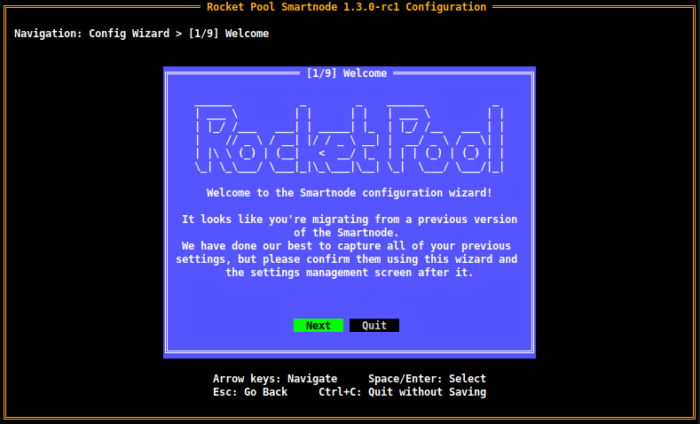
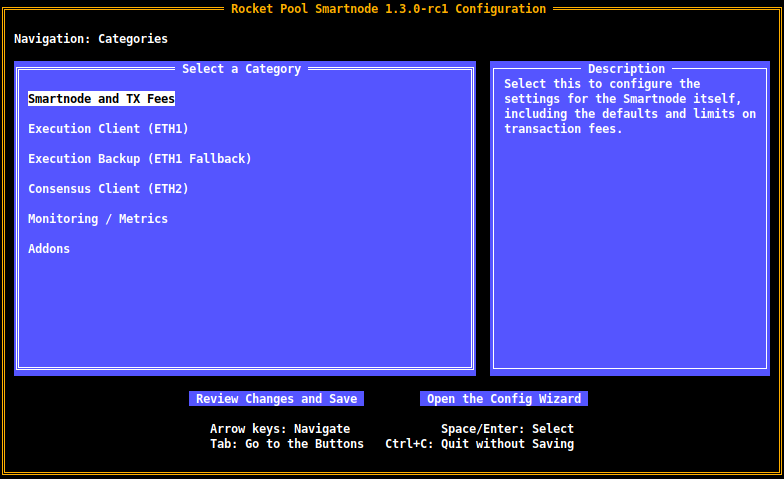

# Upgrading to Smartnode v1.3.x

Version 1.3.0 of the Smartnode stack brings some important changes that users should be aware of.
They are designed to significantly improve your node operator experience and address many of the features that our users have requested since Rocket Pool's launch.

In this guide, we'll walk you through the process of migrating from an older version of the Smartnode from an older version to v1.3.x and beyond.


## Configuration File Changes

v1.3.0 introduces some significant changes in the way the Smartnode's configuration is managed.
If you've manually modified the Smartnode configuration before, you should be aware of the following changes:

- The `config.yml` file has been removed. All of its information is now baked directly into the Smartnode stack, so users can no longer accidentally modify the file in a way that prevented the Smartnode from working properly.
  - All of the user-configurable parameters that were previously part of it are now settings in the new `service config` Terminal UI.

- The `settings.yml` file has been replaced with a new file called `user-settings.yml`. This contains all of your settings for every user-configurable portion of the Smartnode.
  - This file is **not meant to be modified directly**. Modification should be done through the new `service config` Terminal UI instead.

- The `chains` folder has been removed. The scripts for launching the Execution Client (ETH1), the Beacon Node, and the Validator Client now reside in the `scripts` folder.

- The `docker-compose` YAML files have been removed. Each container now gets its own file in the `templates` folder. Upon `rocketpool service start`, these templates are filled out with your settings and put into the `runtime` folder automatically.
  - Modifying the templates or runtime files is not recommended. Instead, fill in your container customizations using the **override** files for each container in the `override` folder. These files will overwrite the Docker files in `runtime`, so you are free to customize them as you see fit.
  - The files in `override` **will persist upon Smartnode upgrades and reinstallation** so you only need to create them once.
  - If you are interested in modifying the `docker-compose` files via this override mechanic, please see <LINK>


## Installing the New Version

Installing the new version should feel very familiar.

Start by stopping the services and downloading the new CLI as usual:

:::::: tabs
::::: tab Docker or Hybrid Mode

Stop the Rocket Pool services:
```
rocketpool service stop
```

Download the new Smartnode CLI for your system (choose from the tabs below):
:::: tabs
::: tab Linux x64
For `x64` systems (most normal machines):

```shell
wget https://github.com/rocket-pool/smartnode-install/releases/latest/download/rocketpool-cli-linux-amd64 -O ~/bin/rocketpool
```
:::
::: tab Linux arm64
For `arm64` systems (like the Raspberry Pi):

```shell
wget https://github.com/rocket-pool/smartnode-install/releases/latest/download/rocketpool-cli-linux-arm64 -O ~/bin/rocketpool
```
:::
::: tab macOS x64
For `x64` systems (most Macs):
```shell
curl -L https://github.com/rocket-pool/smartnode-install/releases/latest/download/rocketpool-cli-darwin-amd64 > /usr/local/bin/rocketpool
```
:::
::: tab macOS arm64
For `arm64` systems, such as the Mac mini with M1:
```shell
curl -L https://github.com/rocket-pool/smartnode-install/releases/latest/download/rocketpool-cli-darwin-arm64 > /usr/local/bin/rocketpool
```
:::
:::: tabs

Now run the install command:

```
rocketpool service install -d
```


The `-d` flag tells it to ignore system dependencies like Docker, since you already have them.

:::tip NOTE
As of v1.3.0, you **no longer have to specify which network you want to install for!**
The new Smartnode will know which network you're already using, and it will let you change your network dynamically using the new Terminal UI. 
:::

:::::
::::: tab Native Mode

::: warning NOTE
This will only update the Smartnode stack itself - it **will not** update your ETH1 and ETH2 clients.
You will have to do this manually (see [the manual update guide](./updates.md#manually-updating-the-eth1-or-eth2-client) to learn how to do it).
:::

Stop the Rocket Pool services:
```
sudo systemctl stop rp-node rp-watchtower
```

Download the new Smartnode CLI and daemon binaries:

:::: tabs
::: tab Linux x64
For `x64` systems (most normal machines):

```shell
sudo wget https://github.com/rocket-pool/smartnode-install/releases/latest/download/rocketpool-cli-linux-amd64 -O /usr/local/bin/rocketpool

sudo wget https://github.com/rocket-pool/smartnode-install/releases/latest/download/rocketpool-daemon-linux-amd64 -O /usr/local/bin/rocketpoold
```
:::
::: tab Linux arm64
For `arm64` systems (like the Raspberry Pi):

```shell
sudo wget https://github.com/rocket-pool/smartnode-install/releases/latest/download/rocketpool-cli-linux-arm64 -O /usr/local/bin/rocketpool

sudo wget https://github.com/rocket-pool/smartnode-install/releases/latest/download/rocketpool-daemon-linux-arm64 -O /usr/local/bin/rocketpoold
```
:::
::: tab macOS x64
For `x64` systems (most Macs):
```shell
curl -L https://github.com/rocket-pool/smartnode-install/releases/latest/download/rocketpool-cli-darwin-amd64 > /usr/local/bin/rocketpool

curl -L https://github.com/rocket-pool/smartnode-install/releases/latest/download/rocketpool-daemon-darwin-amd64 > /usr/local/bin/rocketpoold
```
:::
::: tab macOS arm64
For `arm64` systems, such as the Mac mini with M1:
```shell
curl -L https://github.com/rocket-pool/smartnode-install/releases/latest/download/rocketpool-cli-darwin-arm64 > /usr/local/bin/rocketpool

curl -L https://github.com/rocket-pool/smartnode-install/releases/latest/download/rocketpool-daemon-darwin-arm64 > /usr/local/bin/rocketpoold
```
:::
:::: tabs

:::tip NOTE
As of v1.3.0, `config.yml` has been removed.
**You no longer need to download the installer package and extract it.**
:::

Next, create a backup folder called `old_config_backup` in your Smartnode directory and move your old configuration files into it (`config.yml` and `settings.yml`).
The Smartnode will use these to migrate your settings to the new system.

For example, if you followed the Native setup guide and your Smartnode directory is `/srv/rocketpool`:

```shell
cd /srv/rocketpool
mkdir old_config_backup
mv config.yml old_config_backup
mv settings.yml old_config_backup
```

Now, modify the service definition files for `rp-node`:

```shell
sudo nano /etc/systemd/system/rp-node.service
```

Replace the `ExecStart` line with the following:

```
ExecStart=/home/ubuntu20/bin/rocketpoold --settings /srv/rocketpool/user-settings.yml node
```

Note that the `--config` flag has been removed, and `--settings` now points to `user-settings.yml`.
**Don't worry that this file doesn't exist yet; it will be generated automatically in the next step.**

::: warning NOTE
If you are an Oracle DAO member, you *must* repeat the above process for the `rp-watchtower` service as well.
:::

Finally, reload the service definitions:

```shell
sudo systemctl daemon-reload
```

:::::
::::::

After the installation, all of your old configuration files will be moved to a folder named `old_config_backup` in your Smartnode directory (by default `~/.rocketpool/old_config_backup`).
You can find them there if you ever need to refer to them for any reason.

**If you are looking for instructions on reverting to v1.2.4 from this backup, please scroll to the [Reverting to Your Previous Configuration](#reverting-to-your-previous-configuration) section at the end of this page.**


## Configuring the Smartnode with the Terminal UI

Now that you have the new CLI and package installed, all of your previous settings have been preserved and migrated to the new system.
In the next step, you should run `rocketpool service config`.
This will look quite different compared to previous versions of this function; v1.3.0 introduces the **Terminal UI**: a terminal-based dynamic user interface for configuring your Smartnode.

You must run it before starting the Docker containers after the migration process to view the configuration, verify that all of your changes were migrated successfully, and update any other settings that you desire.

When you first run it, you will be prompted with this greeting screen (if you were using **Docker or Hybrid mode**):

<center>



</center>

:::tip NOTE
**Native Mode users** will see this screen with slightly different wording, which states the Smartnode is operating in Native mode.
:::

The TUI will begin with **the Wizard**, which allows you to quickly and easily change the most important parameters of the Smartnode (such as client mode and selection).

**All of your previous settings should already be highlighted as you traverse through each page of the wizard so you don't have to remember what your previous configuration was off the top of your head.**

:::warning NOTE
**For a detailed walkthrough of this Wizard, please visit the following pages:**

- For **Docker Mode**, please visit [the new Docker configuration guide](./config-docker.md).

- **Hybrid Mode** users: Hybrid Mode is now a **first-class feature** of the Smartnode and configuring it is *much* easier than it used to be. Please visit [the new Docker configuration guide](./config-docker.md) and follow it. When you are prompted to choose an Execution client mode and Consensus client mode, choose **Externally Managed** for them accordingly.

- For **Native Mode**, please visit [the new Native configuration guide](./config-native.md).
:::

Navigate through this wizard and confirm that all of your settings are correct.

Once you are done, you will have the option of **reviewing all of the settings before saving** if you desire.
This includes settings that the Wizard didn't cover, such as the **RPL claim gas threshold** or your **max number of Geth peers** as examples.

The **main settings screen**, which you should also look at to confirm your previous settings, will look like this (for Docker and Hybrid mode users):

<center>



</center>

:::tip NOTE
**Native Mode users** will see a slightly different screen that is unique to Native mode and only presents the settings that are relevant for it.
:::

Feel free to explore this new UI and adjust any settings you see fit.
Use the `Arrow Keys` to navigate, and press `Enter` to enter a category or confirm any changes to a setting that you make.

Press `Esc` when you're finished editing a category to return to this home screen.

When you're ready to save your changes and start the Smartnode stack, simply press `Tab` to move down to the buttons at the bottom of the screen, select `Review Changes and Save` (by making it green via the arrow keys).
Press `Enter` to be brought to the **Review Page**, where you can see everything you've changed since the last time you ran `rocketpool service config`.

Confirm all of your change are present, and then press `Enter` again to save them.
The screen will show you which containers need to be restarted for the changes to apply, though since you're migrating, you've already turned the containers off and they will all be restarted anyway.


## Starting the Smartnode Stack

Once you've saved your configuration, the terminal will ask if you want to restart the containers automatically (unless you're using Native mode).
If you do not / cannot allow them to start automatically, you can start them up manually with the following commands:

:::: tabs
::: tab Docker or Hybrid Mode
```
rocketpool service start
```
:::
::: tab Native Mode
```shell
sudo systemctl start rp-node rp-watchtower
```
:::
::::

Once they're up, you can verify that everything is working as intended.

Use the `rocketpool service version` command to check that you have the correct version of the Smartnode and client containers:

```
$ rocketpool service version

Your Smartnode is currently using the Prater Test Network.

Rocket Pool client version: 1.3.0-rc1
Rocket Pool service version: 1.3.0-rc1
Selected Eth 1.0 client: Geth (Locally managed)
	Image: ethereum/client-go:v1.10.16
Selected Eth 2.0 client: Nimbus (Locally managed)
	Image: statusim/nimbus-eth2:multiarch-v22.3.0
```

Use the `rocketpool service logs eth1` and `rocketpool service logs eth2` commands to watch the logs for your Execution client (formerly ETH1 client) and your Consensus client (formerly ETH2 client).
Look out for any errors and [please visit our Discord server for help](https://discord.com/invite/rocketpool) if you encounter them.


## Reverting to your Previous Configuration

If, for any reason, you need to revert back to v1.2.4 of the Smartnode stack, don't worry!
All of your old configuration files have been preserved in a backup directory and can easily be retrieved to restore your previous setup.

Select which mode you use from the tabs below and follow the instructions.

:::::: tabs
::::: tab Docker or Hybrid Mode
Start by replacing the CLI with the v1.2.4 CLI for your system:

:::: tabs
::: tab Linux x64
For `x64` systems (most normal machines):

```shell
wget https://github.com/rocket-pool/smartnode-install/releases/download/v1.2.4/rocketpool-cli-linux-amd64 -O ~/bin/rocketpool
```
:::
::: tab Linux arm64
For `arm64` systems (like the Raspberry Pi):

```shell
wget https://github.com/rocket-pool/smartnode-install/releases/download/v1.2.4/rocketpool-cli-linux-arm64 -O ~/bin/rocketpool
```
:::
::: tab macOS x64
For `x64` systems (most Macs):
```shell
curl -L https://github.com/rocket-pool/smartnode-install/releases/download/v1.2.4/rocketpool-cli-darwin-amd64 > /usr/local/bin/rocketpool
```
:::
::: tab macOS arm64
For `arm64` systems, such as the Mac mini with M1:
```shell
curl -L https://github.com/rocket-pool/smartnode-install/releases/download/v1.2.4/rocketpool-cli-darwin-arm64 > /usr/local/bin/rocketpool
```
:::
:::: tabs

Next, copy all of your old configuration files from the `old_config_backup` folder back into the Smartnode's folder:

```shell
cd ~/.rocketpool
cp -r old_config_backup/*
```

Now, all you need to do is restart the Docker containers:

```
rocketpool service start
```

Done! Your old configuration is back.

:::::
::::: tab Native Mode
Stop the Rocket Pool services:
```
sudo systemctl stop rp-node rp-watchtower
```

Download the Smartnode CLI and daemon binaries for v1.2.4:

:::: tabs
::: tab Linux x64
For `x64` systems (most normal machines):

```shell
sudo wget https://github.com/rocket-pool/smartnode-install/releases/download/v1.2.4/rocketpool-cli-linux-amd64 -O /usr/local/bin/rocketpool

sudo wget https://github.com/rocket-pool/smartnode-install/releases/download/v1.2.4/rocketpool-daemon-linux-amd64 -O /usr/local/bin/rocketpoold
```
:::
::: tab Linux arm64
For `arm64` systems (like the Raspberry Pi):

```shell
sudo wget https://github.com/rocket-pool/smartnode-install/releases/download/v1.2.4/rocketpool-cli-linux-arm64 -O /usr/local/bin/rocketpool

sudo wget https://github.com/rocket-pool/smartnode-install/releases/download/v1.2.4rocketpool-daemon-linux-arm64 -O /usr/local/bin/rocketpoold
```
:::
::: tab macOS x64
For `x64` systems (most Macs):
```shell
curl -L https://github.com/rocket-pool/smartnode-install/releases/download/v1.2.4/rocketpool-cli-darwin-amd64 > /usr/local/bin/rocketpool

curl -L https://github.com/rocket-pool/smartnode-install/releases/download/v1.2.4/rocketpool-daemon-darwin-amd64 > /usr/local/bin/rocketpoold
```
:::
::: tab macOS arm64
For `arm64` systems, such as the Mac mini with M1:
```shell
curl -L https://github.com/rocket-pool/smartnode-install/releases/download/v1.2.4/rocketpool-cli-darwin-arm64 > /usr/local/bin/rocketpool

curl -L https://github.com/rocket-pool/smartnode-install/releases/download/v1.2.4/rocketpool-daemon-darwin-arm64 > /usr/local/bin/rocketpoold
```
:::
:::: tabs

Copy the previous settings files back into your Smartnode directory:

```shell
cd /srv/rocketpool
cp old_config_backup *
```

Now, revert the service definition files for `rp-node`:

```shell
sudo nano /etc/systemd/system/rp-node.service
```

Replace the `ExecStart` line with the following:

```
ExecStart=/usr/local/bin/rocketpoold --config /srv/rocketpool/config.yml --settings /srv/rocketpool/settings.yml node
```

::: warning NOTE
If you are an Oracle DAO member, you *must* repeat the above process for the `rp-watchtower` service as well.
:::

Finally, reload the service definitions and restart the services:

```shell
sudo systemctl daemon-reload

sudo systemctl start rp-node rp-watchtower
```

Done! Your old configuration is back.

:::::
::::::