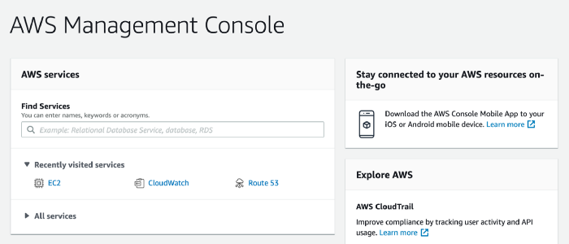
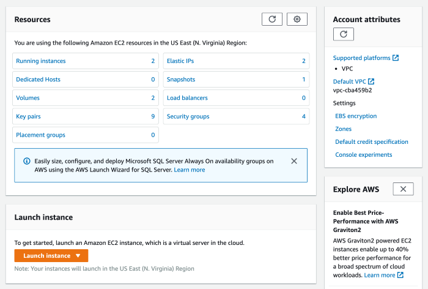
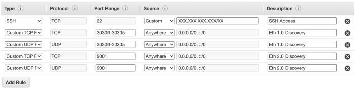

# Preparing the Operating System

As described in the previous section, there are many different VPS and cloud providers.
Writing guides for all of them would be somewhat impractical, but in this section we'll go over a typical workflow for preparing a virtual machine hosted on [Amazon Web Services](https://aws.amazon.com/).
Specifically, we'll cover how to select the appropriate virtual hardware configuration and how to prepare the Operating System for Rocket Pool.  
You should be able to extrapolate how to apply these steps to any provider once you've become familiar with their ecosystem.


## Creating an EC2 Virtual Machine 

The first step is to [create an AWS account](https://portal.aws.amazon.com/billing/signup) if you don't already have one.
Follow the instructions provided in that link or log in with an existing account, and you will eventually make it to your management console dashboard:

<center>



</center>

Next, click on the drop-down at the top right of the screen to select the geographic reason you want your server to physically reside in.
Servers cannot be moved between regions once they're created, so you want to ensure you're happy with the currently selected option before actually creating the server.

Now, click **Services** in the toolbar.
Go to the **Compute** section and select **EC2**.
Your dashboard should change to a view similar to this:

<center>



</center>

Click the orange **Launch Instance** button and select **Launch Instance** from the list of options to create a new machine.
You will be presented with a marketplace of Amazon Machine Images.
Each of these represents a specific snapshot of a machine with a pre-installed Operating System and some other useful software components.

For a Rocket Pool node, we recommend you use the **Ubuntu Server 20.04 LTS (HVM)** image.

Next, you will have to choose an **Instance Type**.
This determines what virtual hardware resources your machine will have available.

At the time of writing, these are what the different options offer:

| Instance | vCPU | CPU Credits / hour | Mem (GiB) | Storage | Network Performance |
| - | - | - | - | - | - |
| t2.nano | 1 | 3 | 0.5 | EBS-Only | Low |
| t2.micro | 1 | 6 | 1 | EBS-Only | Low to Moderate |
| t2.small | 1 | 12 | 2 | EBS-Only | Low to Moderate |
| t2.medium | 2 | 24 | 4 | EBS-Only | Low to Moderate |
| t2.large | 2 | 36 | 8 | EBS-Only | Low to Moderate |
| t2.xlarge | 4 | 54 | 16 | EBS-Only | Moderate |
| t2.2xlarge | 8 | 81 | 32 | EBS-Only | Moderate |

The hardware requirements largely depend on which ETH2 client you plan to run - Nimbus, for example, requires less than 1GB of RAM by itself so it is perfectly reasonable to run it on a **t2.large** instance.
For more RAM-heavy clients, you may want to go with a **t2.xlarge** instance for extra headroom.

::: tip
You may want to consult the [Choosing your ETH Clients](../eth-clients.md) section before deciding on an instance type so you can make sure that the client you want is supported by the instance type you choose.
:::

Once you've made your choice, click the **Next** button.
The default settings are all fine for the **Instance Details** section, so leave them alone and click **Next**.

When you arrive at the **Add Storage** section, you'll create a new virtual hard drive for your system.
This can be expanded later thanks to the power of the cloud, so getting the correct number now isn't absolutely critical.
However, for the sake of your own peace of mind, you should change the size to one of the following figures:

- Use at least **100 GiB** if you're just trying Rocket Pool out on the [Prater Test Network](../../testnet/overview.md).
- Use at least **1 TiB** (preferably **2 TiB**) if you're going to use this node on the main Ethereum network (**mainnet**). 

Leave the default values for the other settings and click **Next**.

In the **Add Tags** step, you should click the **click to add a Name tag** button and give it an easy-to-remember name that you can use to identify the server later; something like **Rocket Pool Smartnode** will work if you need inspiration.
Click **Next** when you're done.

In the **Security Group** section, keep the **Create a new security group** option selected.
Enter a name and description such as **Smartnode** and **Smartnode Group**.
Remove all of the existing rules in the table and add the following rules:

| Type | Port Range | Source | Description |
| - | - | - | - |
| SSH | 22 | [Your public IP address at home] | SSH Access |
| Custom TCP | 30303 | Anywhere | ETH1 P2P |
| Custom UDP | 30303 | Anywhere | ETH1 P2P |
| Custom TCP | 9001 | Anywhere | ETH2 P2P |
| Custom UDP | 9001 | Anywhere | ETH2 P2P |

This will allow you to remotely connect to your server via SSH (the command line terminal) from your laptop or desktop.
It will also allow the ETH1 and ETH2 clients to connect to other nodes on the Ethereum network.

::: warning NOTE
For SSH access, this will only work if you have a **static public IP address**.
You will likely need to request this from your ISP, as many of them use a dynamic IP system and change your public address occasionally.
If you cannot procure a static address, you will have to go to the AWS console and update this setting with your new IP address every time it changes.
:::

The security group table should now resemble this:

<center>



</center>

Now, review all of the instance details to make sure you're happy with them, and click **Launch** when you're satisfied.
When the **SSH key pair** prompt appears, select **Create a new key pair**.
Give it a memorable name such as **Smartnode Key**, then click **Download Key Pair**.
Store these files somewhere secure, such as `~/.ssh/` (or `C:\Users\[your username]\.ssh\` on Windows) where your other keys commonly reside.

::: danger
This key pair contains the private key that you will use to SSH into your machine.
If anyone gets a hold of this key, they will have complete access to your node - **including your Rocket Pool node wallet** and all of the coins within it.
You **must** keep this file secure at all times.
:::

Next, click **Launch Instance** to create your new virtual server.
When a notice pops up, click the **View Instances** to be taken to your list of servers.
You'll see your Rocket Pool node there with some accompanying details about its configuration and status.

Finally, assign an **Elastic IP Address** to your machine - you can think of this like a static IP address that is exclusive to AWS.
Your node will always be accessible at this address, so you can always use the same SSH command to connect to it.

Go to **Network and Security** in the navigation panel on the left and click **Elastic IPs**.
Now, click **Allocate Elastic IP Address**.
The default settings are all fine, so just click through the prompts and return to the list when you're done.

Next, select the new address in the list.
Click the **Actions** button above it, then click **Associate Elastic IP Address**.
Leave the resource type set to **Instance** and select the Rocket Pool Smartnode instance you just created from the list.
Click **Associate** to assign the address to your virtual server.
Now, if you look under the *Associated Instance ID** column of the address, you can verify that it has your machine assigned to it.


## Accessing the Machine

To access the machine, open a new terminal on Linux or macOS (use Powershell on Windows) and type the following command:

```
ssh [your elastic IP address]
```

If you stored your keys in the `.ssh` folder, this will use the private key pair you generated during setup to authenticate with the machine automatically - no usernames, no passwords.

Once here, you have complete terminal access to the system.


## Setting up Swap Space

In most cases, if you choose your ETH1 and ETH2 clients and your instance type carefully, you should not run out of RAM.
Then again, it never hurts to add a little more.
What we're going to do now is add what's called **swap space**.
Essentially, it means we're going to use the SSD as "backup RAM" in case something goes horribly, horribly wrong and your server runs out of regular RAM.
The SSD isn't nearly as fast as the regular RAM, so if it hits the swap space it will slow things down, but it won't completely crash and break everything.
Think of this as extra insurance that you'll (most likely) never need.


### Creating a Swap File

The first step is to make a new file that will act as your swap space.
Decide how much you want to use - a reasonable start would be 8 GB, so you have 8 GB of normal RAM and 8 GB of "backup RAM" for a total of 16 GB.
To be super safe, you can make it 24 GB so your system has 8 GB of normal RAM and 24 GB of "backup RAM" for a total of 32 GB, but this is probably overkill. 
Luckily, since your SSD has 1 or 2 TB of space, allocating 8 to 24 GB for a swapfile is negligible.

For the sake of this walkthrough, let's pick a nice middleground - say, 16 GB of swap space for a total RAM of 24 GB.
Just substitute whatever number you want in as we go.

Enter this, which will create a new file called `/swapfile` and fill it with 16 GB of zeros.
To change the amount, just change the number in `count=16` to whatever you want. **Note that this is going to take a long time, but that's ok.**
```
$ sudo dd if=/dev/zero of=/swapfile bs=1G count=16 status=progress
```

Next, set the permissions so only the root user can read or write to it (for security):
```
$ sudo chmod 600 /swapfile
```

Now, mark it as a swap file:
```
$ sudo mkswap /swapfile
```

Next, enable it:
```
$ sudo swapon /swapfile
```

Finally, add it to the mount table so it automatically loads when your server reboots:
```
$ sudo nano /etc/fstab
```

Add a new line at the end that looks like this:
```
LABEL=writable  /        ext4   defaults        0 0
...
/swapfile                            none            swap    sw              0       0
```

Press `Ctrl+O` and `Enter` to save, then `Ctrl+X` and `Enter` to exit.

To verify that it's active, run these commands:
```
$ sudo apt install htop
$ htop
```

Your output should look like this at the top:


If you see a non-zero number in the last row labeled `Swp`, then you're all set.

Press `q` or `F10` to quit out of `htop` and get back to the terminal.


### Configuring Swappiness and Cache Pressure

By default, Linux will eagerly use a lot of swap space to take some of the pressure off of the system's RAM.
We don't want that. We want it to use all of the RAM up to the very last second before relying on SWAP.
The next step is to change what's called the "swappiness" of the system, which is basically how eager it is to use the swap space.
There is a lot of debate about what value to set this to, but we've found a value of 6 works well enough.

We also want to turn down the "cache pressure", which dictates how quickly the server will delete a cache of its filesystem.
Since we're going to have a lot of spare RAM with our setup, we can make this "10" which will leave the cache in memory for a while, reducing disk I/O.

To set these, run these commands:
```
$ sudo sysctl vm.swappiness=6
$ sudo sysctl vm.vfs_cache_pressure=10
```

Now, put them into the `sysctl.conf` file so they are reapplied after a reboot:
```
$ sudo nano /etc/sysctl.conf
```

Add these two lines to the end:
```
vm.swappiness=6
vm.vfs_cache_pressure=10
```

Then save and exit like you've done before (`Ctrl+O`, `Ctrl+X`).

And with that, your server is up and running and ready to run Rocket Pool!
Move on to the [Choosing your ETH Clients](../eth-clients.md) section.
