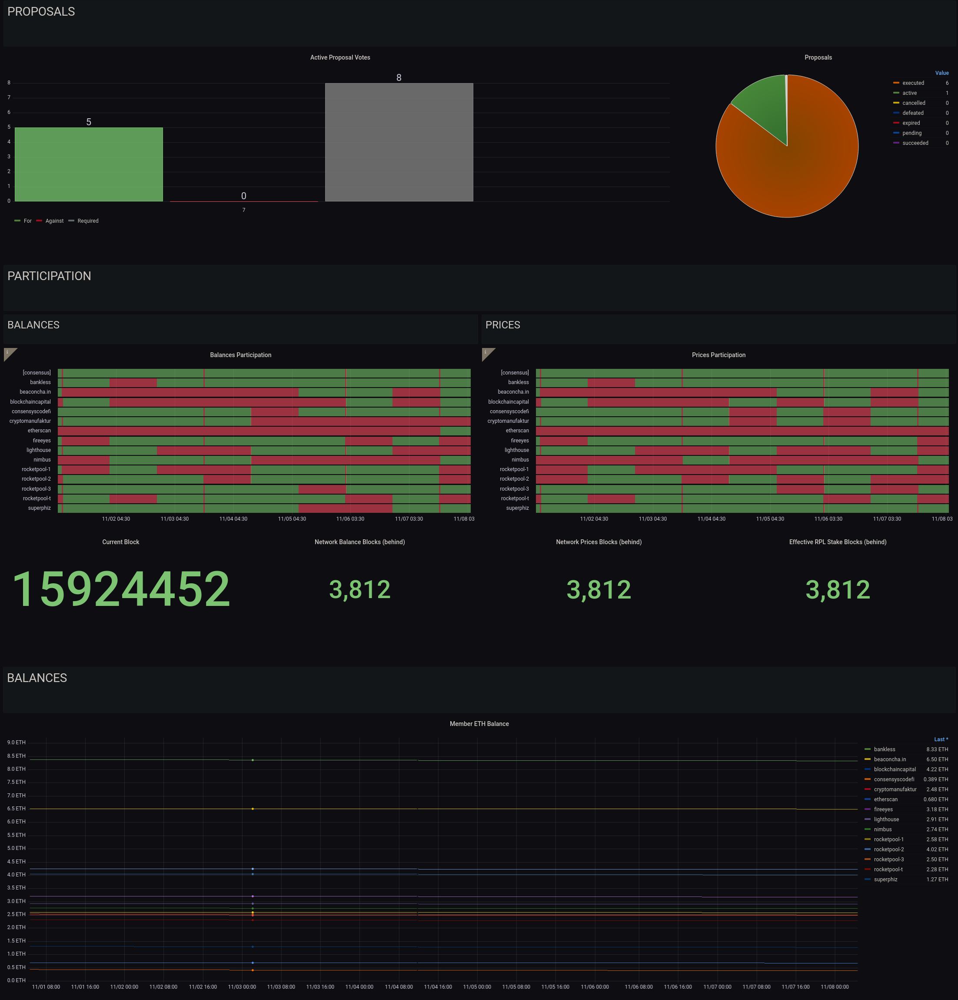
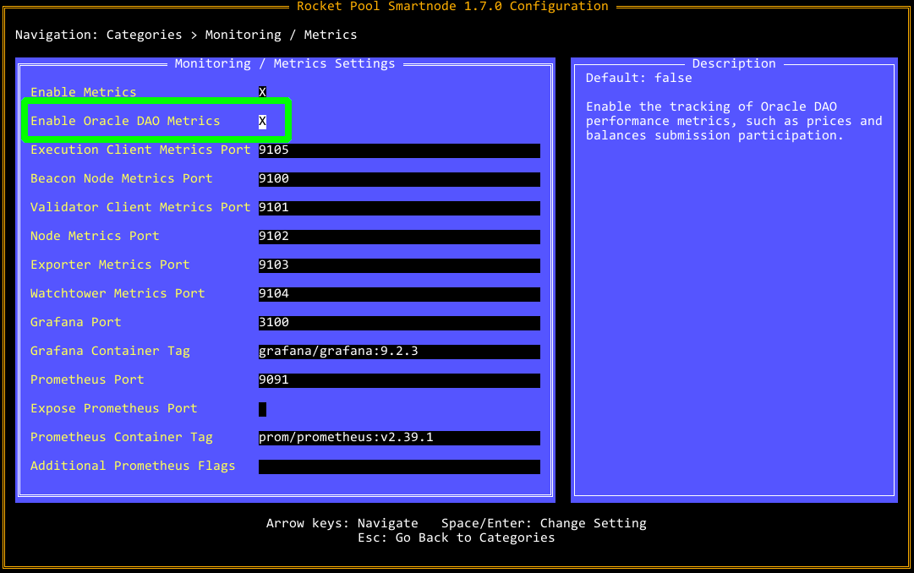

# Monitoring your Oracle DAO Node

Once your node is up and running, it's important that you regularly monitor its health to ensure that it's correctly performing its automated duties.
Doing so involves the following:

- Monitoring the health of your physical (or virtual) system at the OS level
- Monitoring the health of your Execution and/or Consensus clients (if you run local clients)
- Ensuring your node is regularly submitting the required transactions to the chain for status updates
- Ensuring you have a sufficient ETH balance in your node wallet to execute those transactions
- Routinely applying updates to the Smartnode, your clients (if applicable), and your Operating System
- Monitoring the health of the other Oracle DAO members, and communicating with them if you believe their node(s) are not functioning properlyS

In this section, we'll describe a few examples of how to do these via the Smartnode's built-in [Grafana](https://grafana.com/) support.


## The Standard Rocket Pool Dashboard

The Smartnode provides a convenient dashboard that allows you to monitor many of the metrics listed above.
There is one dashboard for each Consensus Client.
Below is an example of the dashboard for Nimbus:

<center>


</center>

- Your machine's hardware health is captured in the upper-left quadrant.
- Your Execution client is functioning properly if the Network Stats in the lower-left quadrant are being populated.
- Your Consensus client is functioning properly if the peer count in the upper-right quadrant is updating with a non-zero number; the exact number depends on your choice of client and your network configuration.
- Your node's ETH balance is displayed in the table at the bottom right.
- Any Operating System updates or Smartnode updates are presented in the `Available Updates` box in the top-middle panel.

::: tip NOTE
Operating System and Smartnode updates require the update tracker, which you can install via `rocketpool service install-update-tracker`.
:::

For information on how to prepare the metrics system and the Smartnode dashboard, please visit the [Monitoring your Node's Performance](../node/performance.md) and the [Setting up the Grafana Dashboard](../node/grafana.md) pages of the Smartnode documentation.


## The Oracle DAO Dashboard

We have also constructed a simple dashboard specifically tailored towards Oracle DAO members:

<center>



</center>

This dashboard that tracks the following:

- The status of the Oracle DAO proposals that need to be voted on or executed (more details on these in the next section)
- The history of submissions for price and balance updates*
- The ETH balances of each Oracle DAO node

**Note that price and balance submission currently requires a quorum of 51% of nodes to agree on each one, at which point the submission is canonized. Submissions from other members will revert as they are no longer required, so if your node does not submit for a given interval, it doesn't mean that it's offline. You should be concerned if you miss more than 5 consecutive intervals in a row, and should check your `watchtower` daemon logs to verify there aren't any issues.*

Enabling this dashboard is a two-step process.

First, enable Oracle DAO metrics in the `Metrics` section of the `rocketpool service config` editor:

<center>



</center>

If you are running in Docker or Hybrid mode, this will restart your `node` daemon to apply the changes.
If you are running in Native mode, please restart the `node` service manually.

Second, import the [Oracle DAO dashboard](https://grafana.com/grafana/dashboards/15003-odao-member-dashboard/) from Grafana Labs (ID `15003`) into your node's local Grafana server.


## Checking the Logs

If you or one of the other Oracle DAO members has expressed concern with your node, the first line of defense is to look at the `watchtower` daemon logs using (for Docker and Hybrid mode) the following command:

```
rocketpool service logs watchtower
```

This will show the `docker` logs for the watchtower container, truncating to the last hundred lines or so.

To go further back, you can use the `-t` flag to indicate the number of lines.
For example:

```
rocketpool service logs watchtower -t 2000
```

will show the last 2000 lines.
As this will get cluttered very fast, you may want to pipe this into a utility like `less` so it is scrollable.


## Next Steps

In the next section, we'll cover the duties that you must perform manually as an Oracle DAO member.