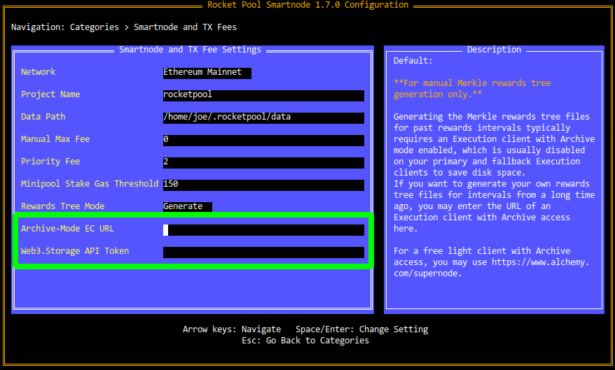

# Setting up an Oracle DAO Node

At a bare minimum, a standard Rocket Pool node runs the following:

- The Smartnode CLI
- The Smartnode API daemon
- The Smartnode `node` daemon 
- The Smartnode `watchtower` daemon

Optionally, the node can also run the following components:

- An Execution Client
- A Beacon Node
- A Validator Client
- MEV-Boost
- Prometheus
- The Prometheus Node Exporter
- Grafana

Each of these components can be run as Docker containers in the standard setup, as `systemd` services in the "Native Mode" setup, or run as externally-managed entities that the Smartnode can connect to via their respective API routes. 

Conveniently, Oracle DAO nodes are the same as normal Rocket Pool nodes, but the `watchtower` daemon performs the supplemental Oracle DAO duties and there are more Prometheus metrics collected for performance monitoring purposes.


## Initial Node Setup

The best way to start is by following [the standard setup instructions](../node/platform.md) for a normal Rocket Pool node.
That process will help you determine how you'd like to configure and run your node.

If you would like to run minipools (validators) on your node, please follow the normal node documentation from start to finish and return here when you're done.

If you do *not* intend to run minipools and instead will use it purely for Oracle DAO duties, you can skip all of the steps relating to staking RPL and minipool creation.
The other steps such as node registration, establishing a good security posture, monitoring the node's health and performance, and updating the Smartnode after an update all still apply to you and you should review them carefully before proceeding.
Return here when you've finished.


## Additional Oracle DAO Configuration

There are two additional settings you need to provision in order to satisfy your Oracle DAO responsibilities.
Please select the mode you use to configure your node below from the tabs below.

:::::: tabs
::::: tab [service config] Interactive UI

Open the `rocketpool service config` TUI and go to the `Smartnode and TX Fees` section.
Here, you will see two options at the bottom:

<center>



</center>

The `Archive-Mode EC URL` must be the HTTP endpoint of the RPC API for your Archive Execution Client.
**Note that if you are already using your Archive EC as your primary client in Externally-Managed mode, you can ignore this setting.**

The `Web3.Storage API Token` must be populated with the API Token for your Web3.Storage account, which you can find in your account settings.
This will be required in order to upload your generated rewards tree artifacts to IPFS.

:::::
::::: tab [service config] Headlessly

Run the following command to configure your node headlessly:

```
rocketpool service config --smartnode-archiveECUrl "http://<your Archive EC URL>" --smartnode-web3StorageApiToken "<your web3.storage API token>"
```

Where:
- `--smartnode-archiveECUrl` must be the HTTP endpoint of the RPC API for your Archive Execution Client.
**Note that if you are already using your Archive EC as your primary client in Externally-Managed mode, you can ignore this setting.**

- `--smartnode-web3StorageApiToken` must be populated with the API Token for your Web3.Storage account, which you can find in your account settings.
This will be required in order to upload your generated rewards tree artifacts to IPFS.

Finally, restart your `watchtower` daemon (i.e., with `docker restart rocketpool_watchtower` in Docker or Hybrid mode, or `sudo systemctl restart rp_watchtower` in Native mode) for the settings to take effect.

:::::
::::: tab Direct Config File

Open the `user-settings.yml` file in your Smartnode directory (`~/.rocketpool` by default) in a text editor.
Scroll down to the `smartnode` section:

```
smartnode:
  archiveECUrl: http://<your Archive EC URL>
  dataPath: /home/user/.rocketpool/data
  manualMaxFee: "0"
  minipoolStakeGasThreshold: "150"
  network: mainnet
  priorityFee: "2"
  projectName: rocketpool
  rewardsTreeMode: generate
  web3StorageApiToken: <your web3.storage API token>
```

Replace the values in the `archiveECUrl` and `web3StorageApiToken` fields, where:

- `archiveECUrl` must be the HTTP endpoint of the RPC API for your Archive Execution Client.
**Note that if you are already using your Archive EC as your primary client in Externally-Managed mode, you can ignore this setting.**

- `web3StorageApiToken` must be populated with the API Token for your Web3.Storage account, which you can find in your account settings.
This will be required in order to upload your generated rewards tree artifacts to IPFS.

Finally, restart your `watchtower` daemon (i.e., with `docker restart rocketpool_watchtower` in Docker or Hybrid mode, or `sudo systemctl restart rp_watchtower` in Native mode) for the settings to take effect.

:::::
::::::


## Oracle DAO Smartnode Commands

The Smartnode CLI's `odao` command group is used to interact with the Oracle DAO contracts and duties on-chain:

```
NAME:
   rocketpool odao - Manage the Rocket Pool oracle DAO

USAGE:
   rocketpool odao command [command options] [arguments...]

COMMANDS:
   status, s             Get oracle DAO status
   members, m            Get the oracle DAO members
   member-settings, b    Get the oracle DAO settings related to oracle DAO members
   proposal-settings, a  Get the oracle DAO settings related to oracle DAO proposals
   minipool-settings, i  Get the oracle DAO settings related to minipools
   propose, p            Make an oracle DAO proposal
   proposals, o          Manage oracle DAO proposals
   join, j               Join the oracle DAO (requires an executed invite proposal)
   leave, l              Leave the oracle DAO (requires an executed leave proposal)

OPTIONS:
   --help, -h  show help
```

### status

The `status` command simply summarizes a few details about the Oracle DAO such as member count and proposal count:

```
The node is a member of the oracle DAO - it can create unbonded minipools, vote on DAO proposals and perform watchtower duties.

There are currently 8 member(s) in the oracle DAO.

There are 29 oracle DAO proposal(s) in total:
- 22 proposal(s) have passed and been executed
- 7 proposal(s) were cancelled, defeated, or have expired
```


### members

The `members` command prints detailed information about each member of the Oracle DAO, including their handle, their contact information, their node address, their RPL bond, and the last time they submitted a proposal for voting:

```
The oracle DAO has 8 members:

--------------------

Member ID:            kermit-2
URL:                  https://www.rocketpool.net
Node address:         0x04ddB06D1429578691F630B67A53916445DA38bE
Joined at:            31 Jul 21 23:32 EDT
Last proposal:        27 Sep 22 21:18 EDT
RPL bond amount:      5000.000000
Unbonded minipools:   0
...
```


### member-settings

`member-settings` shows the current values for each of the configurable parameters related to Oracle DAO membership:

```
ODAO Voting Quorum Threshold: 51.000000%
Required Member RPL Bond: 1750.000000 RPL
Max Number of Unbonded Minipools: 250
Consecutive Challenge Cooldown: 300 Blocks
Challenge Meeting Window: 900 Blocks
Cost for Non-members to Challenge Members: 1.000000 ETH
```

Each of these is described in the [Performing Oracle DAO Duties](duties.md) section.


### proposal-settings

`proposal-settings` shows the current values for each of the configurable parameters related to proposals that the Oracle DAO can vote on:

```
Cooldown Between Proposals: 1h0m0s
Proposal Voting Window: 168h0m0s
Delay Before Voting on a Proposal is Allowed: 15m0s
Window to Execute an Accepted Proposal: 168h0m0s
Window to Act on an Executed Proposal: 168h0m0s
```

Each of these is described in the [Performing Oracle DAO Duties](duties.md) section.


### minipool-settings

`minipool-settings` shows the current values for each of the configurable parameters related to minipools on the Rocket Pool network:

```
Scrub Period: 1h0m0s
```


### propose

The `propose` command is used to submit governance proposals that the rest of the Oracle DAO can vote on.
These can involve changing a setting or modifying the Oracle DAO members (i.e., inviting or kicking other members).

This command is described in more detail in the [Performing Oracle DAO Duties](duties.md) section.


### proposals
The `proposals` command is used to interact with existing Oracle DAO governance proposals.
It can view them, rescind proposals that you made, vote on them, and execute them (if applicable) causing them to take effect after they have been approved by the other members:

```
NAME:
   rocketpool odao proposals - Manage oracle DAO proposals

USAGE:
   rocketpool odao proposals command [command options] [arguments...]

COMMANDS:
   list, l     List the oracle DAO proposals
   details, d  View proposal details
   cancel, c   Cancel a proposal made by the node
   vote, v     Vote on a proposal
   execute, x  Execute a proposal

OPTIONS:
   --help, -h  show help
   
```

This command is described in more detail in the [Performing Oracle DAO Duties](duties.md) section.


### join / leave
The `join` and `leave` commands are used to join the Oracle DAO once you've been invited, or leave the Oracle DAO once the other members have approved your resignation request.


## Joining the Oracle DAO

### The RPL Bond

In order to join the Oracle DAO, your node wallet will need enough RPL in it to cover the required membership bond.
This will be locked in Rocket Pool's vault as part of the joining process.
The exact amount of RPL required for the bond will be determined at the time of your invitation, and will be communicated to you by the other Oracle DAO members prior to onboarding you.

::: warning NOTE
Unlike all other ETH and RPL rewards, the RPL bond is *not* sent to your node's withdrawal address upon exiting the Oracle DAO.
It is sent back to your node wallet itself.
Consider this as extra incentive to protect your node wallet from compromise.
:::


### Accepting an Invitation

Once your node is set up and you have been invited to join the Oracle DAO by the existing members, you can use the `rocketpool odao join` command to accept the invitation.
This will involve two transactions:
- One to lock the RPL required for your bond
- One to join the Oracle DAO when the bond has been received

Once you've joined, your `watchtower` daemon will automatically begin performing its required duties.
You can verify this by looking at its logs (e.g. `rocketpool service logs watchtower` for standard Docker-based installations); the watchtower performs its loop of duties every 4 to 6 minutes, and you will notice a distinct change in its output once you've joined the Oracle DAO.


### Next Steps

Now that you've joined the Oracle DAO, take a look at the next section to learn how to test your node in this role.