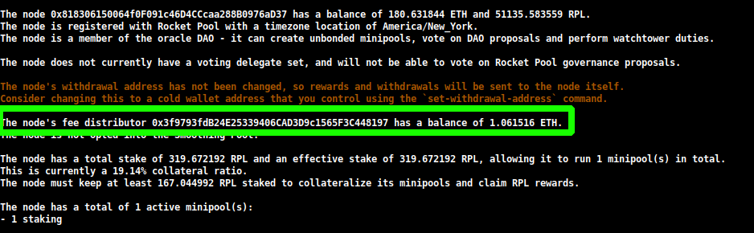

# The Rocket Pool Redstone Update

Rocket Pool's next major update, titled **Redstone**, has been released for beta testing on the Ropsten and Prater test networks.
This page describes the major changes that Redstone brings, including updates to both the Smartnode stack and to the Rocket Pool protocol in general.

Please read through this page thoroughly to understand all of the differences between the previous version of Rocket Pool and Redstone.

::: tip ATTENTION
For detailed information on how to prepare your node for the upgrade and what to do after the upgrade, please look at the following guides:

- [Guide for Docker Mode](./docker-migration.md)
- [Guide for Hybrid Mode](./hybrid-migration.md)
- [Guide for Native Mode](./native-migration.md)
:::


## Client Changes and The Merge

Ropsten (and shortly, Prater) have successfully undergone **The Merge of the Execution and Consensus Layers**.
It no longer uses Proof-of-Work; instead, validators on Ropsten are now responsible for creating and proposing blocks on both chains.
While this comes with some exciting financial benefits (which will be discussed later), it also comes with some important changes to the way validators operate.

Below is a brief summary of the changes to client behavior as part of The Merge:

- Your Execution client now uses three API ports:
  - One for HTTP access to its API (**default 8545**)
  - One for Websocket access to its API (**default 8546**)
  - One for the new **Engine API** used by Consensus clients after The Merge (**default 8551**)

- Execution clients now require a Consensus client to function, and Consensus clients now require an Execution client to function.
  - **Neither one can operate in isolation any longer.**
  
- One Execution client must be linked to one, and only one, Consensus client (and vice versa).
  - You will not be able to link multiple Execution clients to a single Consensus client, or multiple Consensus clients to a single Execution client.
  - Because of this, **fallback execution clients are no longer available** for Rocket Pool node operators.
  
- **Full execution clients** are required.
  - Light clients (like Infura and Pocket) can no longer be used by any validators, Rocket Pool or otherwise.


## Fee Recipients and Your Distributor

As validators are now responsible for creating blocks, that means they receive the **priority fees** (also known as **tips**) attached to each transaction.
These fees are paid in ETH, and they are provided directly to you every time one of your minipool validators proposes a block.
Unlike the ETH locked on the Beacon Chain, **you don't have to wait for withdrawals to access your priority fees**!
They are simply awarded to you as part of the block proposal process.

In order to know where to send the fees to, your Validator Client requires an extra parameter known as the `fee recipient`.
This is the address on the Execution Layer (ETH1) that all of the priority fees earned by your node during block proposals will be sent to. 

Rocket Pool is designed to fairly distribute these rewards, the same way it fairly distributes your Beacon chain rewards: half of any priority fees your minipool validators earn will go to you (plus the average commission of all of your minipools), and the other half will go to the pool stakers (minus your average commission).

To that end, the Smartnode will automatically set your Validator Client's `fee recipient` to a special address known as your node's **fee distributor**.
Your fee distributor is a unique contract on the Execution Layer that's **specific to your node**.
It will hold all of the priority fees you've earned over time, and it contains the logic required to fairly split and distribute them.
This distribution process is controlled by you (the node operator), and can be done whenever you please.
It does not have a time limit.

The address for your node's fee distributor is **deterministically based on your node address**.
That means it is known ahead of time, before the fee distributor is even created.
**The Smartnode will use this address as your fee recipient.**

::: tip NOTE
By default, your fee recipient will be set to the **rETH address** when you install Smartnode v1.5.0 (if the Redstone contract updates haven't been deployed yet).
The Smartnode will automatically update this to your node's fee distributor address once the Redstone update has been deployed.

One exception to this rule is if you are opted into the **Smoothing Pool** - see the section at the end of this page for more information on it.
:::

New Rocket Pool nodes will automatically initialize their node's distributor contract upon registration.
Existing nodes will need to do this process manually.
This only needs to be run once.

One interesting ramification of this is that your distributor's address may start accruing a balance **before** you've initialized your node distributor contract.
This is okay, because your distributor will gain access to all of this existing balance as soon as you initialize it.

You can view your fee distributor's balance as part of:

```
rocketpool node status
```

The output will look like this:

<center>



</center>

To initialize your node's distributor, simply run this new command:

```
rocketpool node initialize-fee-distributor
```

::: warning NOTE
After the Redstone update, you must call this function before you can create any new minipools with `rocketpool node deposit`.
:::

When your distributor has been initialized, you can claim and distribute its entire balance using the following command:

```
rocketpool node distribute-fees
```

This will send your share of the rewards to your **withdrawal address**.


## Rocket Pool Protocol Changes

In addition to the Execution and Consensus client changes and the new priority fees, the Rocket Pool protocol itself has undergone some important changes you should be aware of.


### New Rewards System

One of the most significant changes introduced with the Redstone update is the **new rewards system**.
This is a complete overhaul of the way node operators receive their RPL rewards (and ETH from the Smoothing Pool - discussed later).

The *old* rewards system had the following drawbacks:

- Claiming cost approximately 400k gas, which is quite expensive.
- Node operators had to claim the rewards at each interval (every 28 days), or would forfeit them. This meant the gas costs could become prohibitively expensive for node operators with small amounts of RPL.
- Rewards were determined at the time of the *claim*, not at the time of the checkpoint. If a user staked a significant amount of RPL between the checkpoint and your claim, your rewards could be diluted and you'd receive less RPL than you were expecting.

The *new* claims system solves all of these problems.

At every interval, the Oracle DAO will collectively create a **true snapshot** of the state of the node operators in the Rocket Pool network, including all of their effective stake amounts.
This information is compiled into a [Merkle Tree](https://en.wikipedia.org/wiki/Merkle_tree) - an extremely efficient way to make all of the details available to smart contracts.
The Merkle Tree is built into a JSON file and hosted on the [InterPlanetary File System (IPFS)](https://en.wikipedia.org/wiki/InterPlanetary_File_System), and the root of the Merkle Tree is submitted to the contracts.

This new system has the following features:

- You can now **let rewards accumulate** for as long as you want. No more time limit on when you need to claim.
- You can claim **multiple intervals** all at once.
- Your first claim transaction uses about 85k gas. Each subsequent claim transaction costs about 55k gas.
  - If you're claiming multiple intervals at once, each supplemental interval costs **6k gas** so it's most cost-effective to claim as many of them at once as possible.
- Your RPL rewards **no longer get diluted** - your RPL rewards are fixed at the time of the snapshot, and you are always eligible for that amount.
- You can **restake some (or all) of your RPL rewards** as part of the claiming transaction, which further trims down gas requirements compared to today.
- Currently, **all of your claims must be on Mainnet** but we have the infrastructure in place to build the ability to claim on Layer 2 networks at a later date.

When your node detects a new rewards checkpoint, it will automatically download the JSON file for that interval.
You can then review your rewards using the following command:

```
rocketpool node claim-rewards
```

As intervals go by and you accumulate rewards, the output will look like this:

<center>


</center>

Here you can quickly see how many rewards you've earned at each interval, and can decide which ones you want to claim.
Note that **Ropsten's interval time is set to 1 day to facilitate testing.**

You can also specify an amount you want to restake during this claim:

<center>


</center>

This will let you compound your RPL rewards in one transaction, using substantially less gas than you currently need to use today.

::: tip NOTE
If you prefer to build the rewards checkpoint manually instead of downloading the one created by the Oracle DAO, you can change this setting from `Download` to `Generate` in the TUI:

<center>


</center>

As the tip implies, you will need access to an archive node to do this.
If your local Execution client is not an archive node, you can specify a separate one (such as Infura or Alchemy) in the `Archive-Mode EC URL` box below it.
This URL will only be used when generating Merkle trees; it will not be used for validation duties.
::: 

::: danger WARNING
If you are below 10% RPL collateral *at the time of the snapshot*, you will not be eligible for rewards for that snapshot.
Unlike the current system, where you can simply "top off" before you claim in order to become eligible again, this will be locked in that snapshot forever and **you will never receive rewards for that period**.
You **must** be above 10% collateral at the time of a snapshot in order to receive rewards for that period.
:::


### Smoothing Pool

One final exciting new feature of the Redstone update is the **Smoothing Pool**.
The Smoothing Pool is **an opt-in feature** that will collectively pool the priority fees of every member opted into it.
During a rewards checkpoint, the total ETH balance of the pool is divided into a pool staker portion and a node operator portion.
All of the rewards in the node operator portion are **distributed fairly to every member of the pool**.

In essence, the Smoothing Pool is a way to effectively eliminate the randomness associated with block proposals on the Beacon Chain.
If you've ever had a streak of bad luck and gone months without a proposal, you may find the Smoothing Pool quite exciting.

::: tip NOTE
The Smoothing Pool rewards are built into the Merkle Tree used for RPL rewards, so you claim them at the same time you claim RPL using `rocketpool node claim-rewards`.
:::

To help clarify the details, the Smoothing Pool uses the following rules:

- Opting into the Smoothing Pool is done on a **node level**. If you opt in, all of your minipools are opted in.

- The node operator's total share is determined by the average commission of every minipool in every node opted into the Smoothing Pool.

- Anyone can opt in at any time. They must wait a full rewards interval (1 day on Ropsten, 28 days on Mainnet) before opting out to prevent gaming the system.
  - Once opted out, you must wait another full interval to opt back in.

- The Smoothing Pool calculates the "share" of each minipool (portion of the pool's ETH for the interval) owned by each node opted in.
  - The share is a function of your minipool's performance during the interval (calculated by looking at how many attestations you sent on the Beacon Chain, and how many you missed), and your minipool's commission rate.

- Your node's total share is the sum of your minipool shares.

- Your node's total share is scaled by the amount of time you were opted in.
  - If you were opted in for the full interval, you receive your full share.
  - If you were opted in for 30% of an interval, you receive 30% of your full share.

To opt into the Smoothing Pool, run the following command:

```
rocketpool node join-smoothing-pool
```

This will record you as opted-in in the Rocket Pool contracts and automatically change your Validator Client's `fee recipient` from your node's distributor contract to the Smoothing Pool contract.

To leave the pool, run this command:

```
rocketpool node leave-smoothing-pool
```


### The Penalty System

To ensure that node operators don't "cheat" by manually modifying the fee recipient used in their Validator Client, Rocket Pool employs a penalty system.

The Oracle DAO constantly monitors each block produced by Rocket Pool node operators.
Any block that has a fee recipient other than one of the following addresses is considered to be **invalid**:

- The rETH address
- The Smoothing Pool address
- The node's fee distributor contract (if opted out of the Smoothing Pool)

A minipool that proposed a block with an **invalid** fee recipient will be issued **a strike**.
On the third strike, the minipool will begin receiving **infractions** - each infraction will dock **10% of its total Beacon Chain balance, including ETH earnings** and send them to the rETH pool stakers upon withdrawing funds from the minipool.

Infractions are at a **minipool** level, not a **node** level.

The Smartnode software is designed to ensure honest users will never get penalized, even if it must take the Validator Client offline to do so.
If this happens, you will stop attesting and will see error messages in your log files about why the Smartnode can't correctly set your fee recipient.


## Guides for Pre- and Post-Upgrade

For detailed information on how to prepare your node for the upgrade and what to do after the upgrade, please look at the following guides:

- [Guide for Docker Mode](./docker-migration.md)
- [Guide for Hybrid Mode](./hybrid-migration.md)
- [Guide for Native Mode](./native-migration.md)

