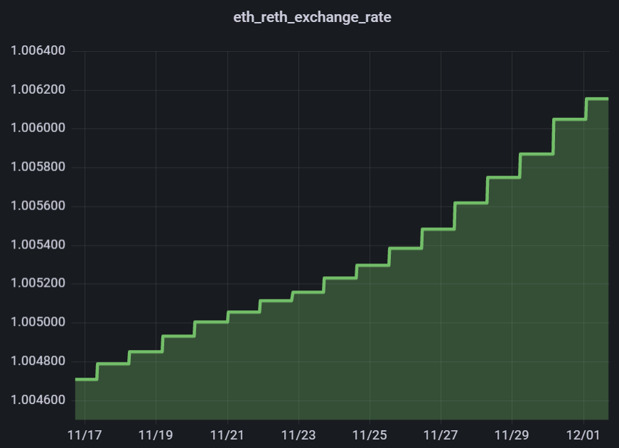

# Staking Overview

This guide will introduce you to how staking with Rocket Pool works (how your ETH is put to work and your rewards are generated) and summarize the ways in which you can stake.

::: tip NOTE
If you're not interested in how staking works and just want to learn how to stake, [**click here to skip to that section.**](#how-to-stake-with-rocket-pool)
:::


## How ETH2 Staking Works

Before getting into Rocket Pool, staking on the [Beacon Chain](https://ethereum.org/en/eth2/beacon-chain/) (ETH2) is done via **validators**.
A validator is a single ETH2 address, to which 32 ETH was deposited, which is now responsible for helping maintain the consistency and security of the Beacon Chain.
They do this by listening for transactions and new block proposals, and **attesting** that the proposed block contains legal, valid transactions by doing some number crunching and verification behind the scenes.
Occasionally, they get to propose new blocks themselves. 

Validators in ETH2 are assigned attestations and block proposals **on a schedule**.
This is very different from ETH1's proof of work system, where everyone is constantly trying to race each other and come up with the next block before everyone else.
This means that unlike ETH1 where a miner isn't guaranteed to earn a block reward unless they find the next block, ETH2 validators are guaranteed to have slow, steady income as long as they perform their duties.
If a validator is offline and misses an attestation or a block proposal, it will be **slightly penalized**.
The penalties are quite small though; as a rule of thumb, if a validator is offline for X hours, it will make all of its lost ETH back after the same X hours of being back online.

Under the current Proof-of-Stake rules, all attestations and block proposals are provided on the Beacon Chain.
Until withdrawals from the Beacon Chain are implemented by the Ethereum core developers, this means **there is currently no way to access staked ETH or its rewards.**
Validators will simply accrue larger and larger balances until they **voluntarily exit** the validator (or get **slashed** for attempting to attack the network).
Both of these actions will relieve the validator of its duties and return the balance back to the operator on the ETH1 chain once withdrawals have been implemented.


## How Rocket Pool Works

Unlike solo stakers, who are required to put 32 ETH up for deposit to create a new validator, Rocket Pool nodes only need to deposit 16 ETH per validator.
This will be coupled with 16 ETH from the staking pool (which stakers deposited in exchange for rETH) to create a new ETH2 validator.
This new validator is called a **minipool**.

To the Beacon chain, a minipool looks exactly the same as a normal validator.
It has the same responsibilities, same rules it must follow, same rewards, and so on.
The only difference is in how the minipool was created on the ETH1 chain, and how withdrawals work when the node operator decides to voluntarily exit the minipool or gets slashed.
All of the creation, withdrawing, and rewards delegation is handled by Rocket Pool's **smart contracts** on the ETH1 chain.
This makes it completely decentralized.


## The rETH Token

As a Rocket Pool staker, your role is to deposit ETH into the deposit pool which will enable a node operator to create a new Beacon Chain validator.
You can stake as little as **0.01 ETH**.

In doing so, you will be given a token called **rETH**. rETH represents both **how much** ETH you deposited, and **when** you deposited it.
The value of rETH is determined by the following ratio:

```
rETH:ETH ratio =  (total ETH staked + Beacon Chain rewards) / (total ETH staked)
```

Since the Beacon Chain rewards will always be positive and will constantly grow, this means that **rETH's value effectively always increases relative to ETH**. The rETH/ETH exchange rate is updated every 24 hours based on Rocket Pool network's rewards earned.

To illustrate this point, here is a chart of rETH's value (relative to ETH) over time - as expected, it demonstrates slow but steady growth:

<center>



</center>

Let's do a simple example as a demonstration.

Say you stake at the very beginning when 1 ETH = 1 rETH.
You deposit 10 ETH and receive 10 rETH back.

After a few years, the balances on the Beacon Chain grow due to validator rewards.
Say 128 ETH had been staked with Rocket Pool and the sum of all validator balances on ETH2 was 160 ETH.
Then 1 ETH would be worth (128/160) = 0.8 rETH; conversely, 1 rETH would be worth (160/128) = 1.25 ETH.

At this point, you could trade your 10 rETH back to Rocket Pool's smart contracts and receive 12.5 ETH in return.

This means **as long as you are holding rETH**, you are staking with Rocket Pool!
**You do not need to get it from Rocket Pool directly.**
For example, you can purchase rETH on an exchange; as every rETH token is exactly the same, you will **automatically receive the benefits of staking just by holding the token!**


::: warning NOTE
Trading rETH back for ETH directly with Rocket Pool is only possible when the staking pool has enough ETH in it to handle your trade.
ETH in this pool comes from two sources:

1. ETH that other stakers have deposited, which hasn't been used by a node operator to create a new validator yet
2. ETH that was returned by a node operator after they exited one of their validators and received their rewards from the Beacon Chain (**note that this is not possible until after the ETH1-ETH2 Merge occurs and withdrawals are enabled**)

It's possible that if node operators have put all of the staking pool to work on the Beacon chain, then the liquidity pool won't have enough balance to cover your unstaking.
In this scenario, you may find other ways to trade your rETH back to ETH (such as a decentralized exchange like [Uniswap](https://app.uniswap.org/#/swap)) - though they will likely come with a small premium.
:::

As an alternative to holding onto and eventually returning your rETH to the Rocket Pool, you are also free to **use it in DeFi applications**.
You can trade it, lend it, use it as collateral... as rETH is a standard ERC20 token, you can use it in any way you could use any other token.

After the Ethereum proof-of-stake (PoS) merge and enabling of staked ETH withdraws, rETH will remain a separate ERC-20 token from ETH.

## Tax Implications

Each country has its own tax laws, and it would be impossible to document them all here.  
In some countries, depositing ETH for rETH may be considered **a taxable event**.
However, because rETH inherently accumulates value while the actual amount of the token you hold remains constant, simply holding it usually **does not generate any taxable events**.

This makes rETH **a preferable staking token for long-term holding** if your country separates short-term and long-term capital gains taxes.

Tax laws related to cryptocurrencies are in their infancy; each user should do their own research and consider speaking with a tax professional.  

Below are some helpful sites that offer tax assistance to users related to Ethereum.
**This is not an official endorsement - users are advised to do their own research regarding tax implications and strategies**:
 - [https://koinly.io/](https://koinly.io/)
 - [https://cryptotaxcalculator.io/](https://cryptotaxcalculator.io/)


## How to Stake with Rocket Pool

As described above, as long as you are holding the rETH token, you are a **Rocket Pool Staker**.
We will summarize several common ways to acquire it here.

::: warning NOTE
All of the methods described here rely on the usage of an Ethereum wallet such as [MetaMask](https://metamask.io/).
If you have never used an Ethereum wallet before, we strongly encourage you to learn more about them and practice using them before staking with Rocket Pool.
The sections below include some steps that are demonstrated with MetaMask as an example; they should translate to your wallet of choice easily enough for you to follow along.
:::


### Via Rocket Pool Directly
With this method, you will use a web3 wallet (such as MetaMask) and interact with Rocket Pool's website to swap ETH for rETH and vice-versa.
This method is **guaranteed** to provide you with the exact amount of rETH that your ETH is worth, since it's coming directly from Rocket Pool's smart contracts, but it can be somewhat expensive if the network's gas prices are high and you're staking a relatively small amount of ETH.

Note, however, that your rETH tokens will be **locked to your address for 24 hours** if you use this method to prevent timing attacks on the network.

::: tip NOTE
If you are practicing staking on the Prater Testnet, the direct method above is the only option currently supported.
:::

[Click here to learn how to stake via Rocket Pool directly.](./via-rp.md)


### Via a Decentralized Exchange on Ethereum (Layer 1)
With this method, you will access a decentralized exchange such as [Uniswap](https://docs.uniswap.org/protocol/introduction) and purchase rETH using your token of choice, just like you would do any other token swap.
This will come with **a smaller transaction fee** than swapping directly via Rocket Pool's website, but you may receive less rETH than the true value depending on liquidity and the fees that the liquidity providers charge.

Note that your rETH will **not be locked to your address** if you stake via an exchange.
You can move them or use them immediately.

[Click here to learn how to swap ETH for rETH via a decentralized exchange on Layer 1.](./via-l1.md)


### Via a Decentralized Exchange on a Layer 2 Network
With this method, you will start by bridging your existing ETH (or other tokens of choice) onto an Ethereum Layer 2 network such as [Optimism](https://www.optimism.io/) or [Arbitrum](https://arbitrum.io/) and then use a decentralized exchange on the network to purchase rETH. If you already have tokens on a Layer 2 network, this method is compelling because **the transaction fees are ~10x smaller than on the Ethereum mainnet**. However, if you have not used a Layer 2 network before, it does require a few additional steps to get set up. 

Note that your rETH will **not be locked to your address** if you stake via an exchange.
You can move them or use them immediately.

[Click here to learn how to swap ETH for rETH via a decentralized exchange on a Layer 2 network.](./via-l2.md)


### Video Demonstration


Community member **Kevster** has put together a helpful video that demonstrates each of these options step-by-step:

<center>
<iframe width="560" height="315" src="https://www.youtube.com/embed/doXK3iDoQgI" title="YouTube video player" frameborder="0" allow="accelerometer; autoplay; clipboard-write; encrypted-media; gyroscope; picture-in-picture" allowfullscreen></iframe>
</center>

For a more detailed writeup, select which method you would like to use from the links above and follow the guide for that section.
