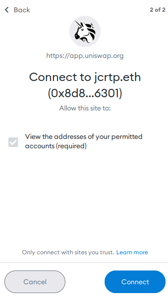
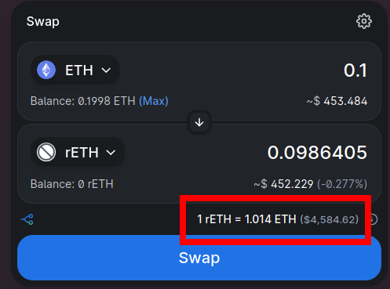
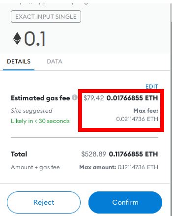

# Staking via a Decentralized Exchange on the Ethereum Network (Layer 1)

As a reminder, you do not have to swap ETH for rETH directly via Rocket Pool in order to enjoy the benefits of decentralized staking.
All you need to do is hold rETH as it inherently grows in value - how you get it doesn't matter!

Many Rocket Pool community members have made rETH available for trade on decentralized exchanges, such as [Uniswap](https://docs.uniswap.org/protocol/introduction).
The advantage of using an exchange instead of Rocket Pool directly is that it **tends to have lower gas fees**.
If this is important to you because you want to stake a small amount of ETH, then using a decentralized exchange might be preferable.

The disadvantage is that you might not get the best deal on rETH.
Uniswap requires a small fee that's given to its liquidity providers; also, the exact price might not match the price according to Rocket Pool but it's usually arbitraged to a very close value so this tends not to be an issue.
Nevertheless, it's always a good idea to compare the rate you would receive on an exchange with the exchange rate according to Rocket Pool. 

In the following example, we will use Uniswap to demonstrate how to swap ETH for rETH.

::: warning NOTE
Currently this method is only available on Mainnet.
If you want to practice on the Prater Testnet, you must [swap with Rocket Pool directly](./via-rp.md).

**The rest of this guide will assume you are on Mainnet.**
:::

This process can be completed with any web3-compatible wallet.
For demonstration purposes, we're going to use [MetaMask](https://metamask.io/) as it is one of the more popular wallet choices.

**You should be able to follow along using similar steps with a different wallet if you choose - just find the comparable function in your wallet for each step.**


## Setting up MetaMask

Start by installing [MetaMask](https://metamask.io/) if you haven't already.
Follow the instructions on their site to install the extension, create an account, and sign in.

Next, open the MetaMask panel using its icon in your browser toolbar.
Click on the **network dropdown** in the toolbar at the top and ensure that **Ethereum Mainnet** is selected:

<center>


</center>

Finally, add the rETH token to MetaMask so you can see your balance and access it for trading.
Click the **Assets** tab, then click **Add Token**:

<center>


</center>

Ensure that **Custom Token** is selected in this dialog.
In the **Token Contract Address** box, put the following value:

```
0xae78736Cd615f374D3085123A210448E74Fc6393
```

The **Token Symbol** should automatically be populated with `rETH`, and the **Decimals of Precision** should automatically be populated with `18`.

Accept the rest of the prompts, and then you will see the rETH token appear in your list.

Now that you have a wallet address in MetaMask, you need to transfer some ETH into it.
**You will need to supply this from an existing wallet or buy ETH on an exchange.**


## Swapping for rETH via Uniswap

Now that your wallet is set up and funded, head to this URL which will open Uniswap and automatically show swapping ETH for rETH:

[https://app.uniswap.org/#/swap?inputCurrency=eth&outputCurrency=0xae78736cd615f374d3085123a210448e74fc6393](https://app.uniswap.org/#/swap?inputCurrency=eth&outputCurrency=0xae78736cd615f374d3085123a210448e74fc6393)

The page will look like this initially:

<center>


</center>

Click on one of the `Connect Wallet` buttons such as the highlighted one in the top-right corner.
You will be prompted with a screen that asks you which wallet provider you want to use.
For this example, select **MetaMask**.

::: tip NOTE
If you're not using MetaMask, one of the other providers such as WalletConnect will likely be compatible with your wallet.
:::

Upon clicking that button, MetaMask will pop up with a prompt asking you to select which accounts you want to use.
Assuming you only have one, your account should already be selected.
Click **Next**.

It will then ask if you would like to give Uniswap access to view the addresses of your accounts:

<center>



</center>

Click **Connect** and after a brief pause window, your wallet will be connected to Uniswap.
You should now see its ETH balance in the top right corner of the screen.

Now, enter the amount of ETH you want to swap and Uniswap's UI will show you the amount of rETH you will receive in return:

<center>



</center>

::: warning NOTE
Notice that the amount of rETH you receive will be **less than** the amount of ETH you put in.
This is normal, because **rETH is worth more than ETH** and continuously appreciates over time.
You can see this in the exchange rate highlighted at the bottom of the screenshot.
:::

Click **Swap** to see the details of the trade, including the minimum amount you could receive due to slippage.
If you're satisfied, click **Confirm Swap**.
This will send the request to MetaMask, where you can review the total transaction cost before confirming it:

<center>



</center>

::: warning NOTE
Pay **close attention** to the estimated gas fee here, highlighted in red.
If it's a significant amount of your overall transaction (here it's over 17%), then it will take a **very long time** before you break even on staking rewards.

If this is the case, you should either wait for the network's average gas price to drop, or [consider using a Layer 2 solution instead](./via-l2.md).
::: 

If you are happy with the gas fees relative to the total amount of rETH you'll be receiving, click **Confirm** to submit the transaction.
After a short period, you should see a notification from MetaMask that it completed successfully, and you will now see the rETH token in your wallet.

That's it! You're now staking with Rocket Pool. All you need to do is hold onto your rETH, and you'll automatically gain your staking rewards as the value of the rETH token increases.
