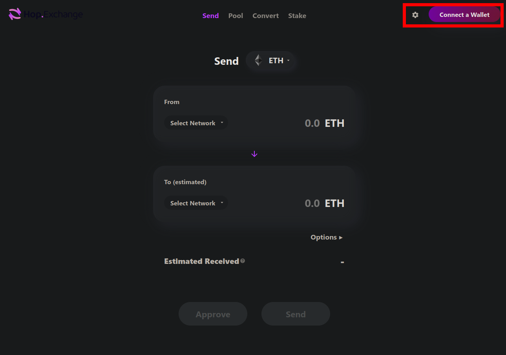
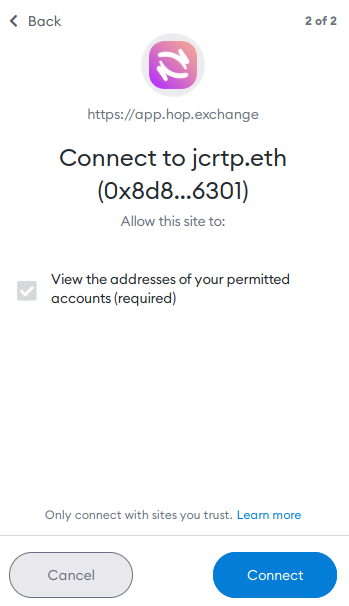
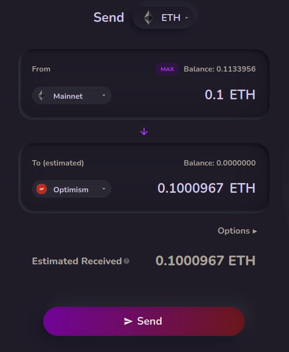
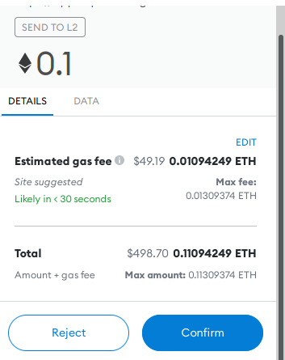
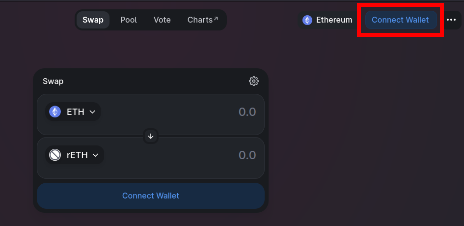
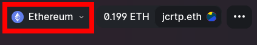
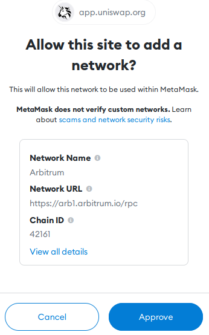
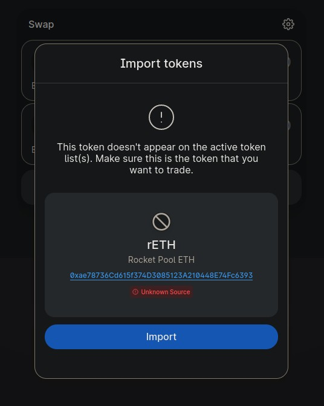
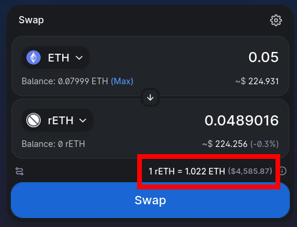
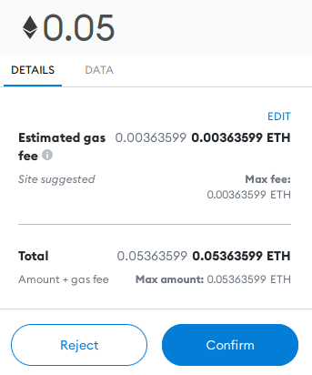

# Staking via a Decentralized Exchange on Layer 2

As a reminder, you do not have to swap ETH for rETH directly via Rocket Pool in order to enjoy the benefits of decentralized staking.
All you need to do is hold rETH as it inherently grows in value - how you get it doesn't matter!

That being said, one of the main concerns (especially in recent times) is the cost of gas associated with staking or swapping ETH for rETH.

To help reduce this, the Ethereum network has started adopting the use of [rollups](https://www.youtube.com/watch?v=7pWxCklcNsU) - also known as **Layer 2**.

Layer 2 comprises several separate networks that live underneath Ethereum, executing lots of transactions like Ethereum normally would, but rolling all of them up into one single "mega" transaction and posting *that* to the main Ethereum chain instead.
Ideally, this means you'd get all of the security benefits associated with Ethereum's decentralized nature, but enjoy **much lower gas fees** for your transactions since the single "mega" transaction's gas fees are distributed evenly amongst each of the smaller ones that were rolled up into it.

Rocket Pool currently supports two Layer 2 networks: [Optimism](https://www.optimism.io/) and [Arbitrum](https://arbitrum.io/).
Both of them have running versions of [Uniswap](https://docs.uniswap.org/protocol/introduction), the most widely-used decentralized exchange protocol.
With Uniswap, you can quickly and easily exchange ETH for rETH.

The advantage of using this approach is that **gas fees will be substantially lower** than with other methods.
If this is important to you because you want to stake a small amount of ETH, then using a Layer 2 network is likely going to be your option of choice.

The disadvantage is that you might not get the best deal on rETH.
Uniswap requires a small fee that's given to its liquidity providers, and large transactions will require large liquidity pools in order to get good deals without too much price impact.
Layer 2 networks tend to have lower rETH liquidity than the main Ethereum network. 

Therefore, we recommend you compare the total rETH you would get on a Layer 2 network with what you'd get via the other methods to determine if it makes sense for you to pursue this path.

You can view the current ETH and rETH balances of the [Optimism pool](https://optimistic.etherscan.io/address/0x8f477a5d632b5691a10a571575d55dc9c3d86d7c#tokentxns) and the [Arbitrum pool](https://info.uniswap.org/#/arbitrum/pools/0xaac7de2b91293ba1791503d9127d2bdf2159db65) to determine if they have enough rETH to cover your swap.

Assuming you are interested in exploring 
In the following example, we will demonstrate how to interact with Layer 2 networks and use Uniswap to swap ETH for rETH.

::: warning NOTE
Currently this method is only available on Mainnet.
If you want to practice on the Prater Testnet, you must [swap with Rocket Pool directly](./via-rp.md).

**The rest of this guide will assume you are on Mainnet.**
:::

This process can be completed with any web3-compatible wallet.
For demonstration purposes, we're going to use [MetaMask](https://metamask.io/) as it is one of the more popular wallet choices.

**You should be able to follow along using similar steps with a different wallet if you choose - just find the comparable function in your wallet for each step.**


## Setting up MetaMask on Mainnet

Start by installing [MetaMask](https://metamask.io/) if you haven't already.
Follow the instructions on their site to install the extension, create an account, and sign in.

Next, open the MetaMask panel using its icon in your browser toolbar.
Click on the **network dropdown** in the toolbar at the top and ensure that **Ethereum Mainnet** is selected:

<center>


</center>

The address directly below that is your **Ethereum wallet address**.

Before going any further, you will need to supply this wallet with ETH.
If you don't already have ETH in the account from prior usage, you can do this by transferring ETH from an existing account to this wallet address.


## Transferring ETH from Layer 1 to Layer 2 via Hop

There are several ways to move bridge ETH from the Ethereum Mainnet to a Layer 2 network.
In this demonstration, we're going to use the [Hop](https://docs.hop.exchange/faq) protocol - a simple and reliable way to move ETH (and a few other coins) from Layer 1 to several Layer 2 networks, or between Layer 2 networks. 

Navigate to the Hop exchange website here:

[https://app.hop.exchange/send?token=ETH](https://app.hop.exchange/send?token=ETH)

The home screen should look like this:

<center>



</center>

Start by clicking on the **Connect a Wallet** button in the top right corner.
You will be prompted with a screen that asks you which wallet provider you want to use.
For this example, select **MetaMask**.

::: tip NOTE
If you're not using MetaMask, one of the other providers such as WalletConnect will likely be compatible with your wallet.
:::

Upon clicking that button, MetaMask will pop up with a prompt asking you to select which accounts you want to use.
Assuming you only have one, your account should already be selected.
Click **Next**.

It will then ask if you would like to give Hop access to view the addresses of your accounts:

<center>



</center>

Click **Connect** and after a brief pause window, your wallet will be connected to Hop.
You should now see its ETH balance in the top right corner of the screen.

Now, you can use the two dropdowns in the **From** and **To (estimated)** boxes to select your networks, and enter the amount of ETH you want to send in the **From** box.

For example, this is what it would look like to send 0.1 ETH from Layer 1 to Arbitrum:

<center>



</center>

::: warning NOTE
As a reminder, Uniswap (and thus Rocket Pool staking) is currently **only supported on Optimism and Arbitrum**.
You must select one of those networks.
:::

When you're ready, click the **Send** button.
Metamask will pop up with a confirmation dialog that shows you the gas fee associated with the transaction:


<center>



</center>

If you are comfortable with those gas fees, click **Confirm** to begin the transaction.
After a few moments, MetaMask will pop up with a successful transaction confirmation message, and your ETH will now be available on your Layer 2 network of choice!


## Connecting to Uniswap on Layer 2

Now that your wallet is set up and funded, head to this URL which will open Uniswap and automatically show swapping ETH for rETH:

[https://app.uniswap.org/#/swap?inputCurrency=eth](https://app.uniswap.org/#/swap?inputCurrency=eth)

The page will look like this initially:

<center>



</center>

Click on one of the `Connect Wallet` buttons such as the highlighted one in the top-right corner.
You will be prompted with a screen that asks you which wallet provider you want to use.
For this example, select **MetaMask**.

::: tip NOTE
If you're not using MetaMask, one of the other providers such as WalletConnect will likely be compatible with your wallet.
:::

Upon clicking that button, MetaMask will pop up with another prompt asking you to select which accounts you want to use, just like it did with Hop.
Leave your account selected, click **Next**, and then click **Connect** as you did with Hop before.
After a brief pause window, your wallet will be connected to Uniswap.
You should now see its ETH balance in the top right corner of the screen.

The first thing to do is change your network from the Ethereum mainnet to the Layer 2 you just swapped to.
Click on the network dropdown at the top right of the screen (highlighted in red here):

<center>



</center>

Once you do, MetaMask will prompt you to confirm that you want to add a custom network:

<center>



</center>

Click **Approve** and then click **Switch Network**.
This will change MetaMask to use the new Layer 2 network instead of Ethereum's mainnet for transactions.

::: warning NOTE
Before you do any transactions with MetaMask, *always* verify which network it's currently using by opening MetaMask and looking at the network dropdown on the top!
It's easy to accidentally switch to a different network and forget!
:::


## Adding rETH to MetaMask

The next step is to add the rETH token to MetaMask so you can see your balance and access it for trading.
Click the **Assets** tab, then click **Add Token**:

<center>


</center>

Ensure that **Custom Token** is selected in this dialog, and select the appropriate tab for the Layer 2 network you chose below:

:::: tabs
::: tab Optimism

In the **Token Contract Address** box, put the following value:

```
0x9bcef72be871e61ed4fbbc7630889bee758eb81d
```

The **Token Symbol** should automatically be populated with `rETH`, and the **Decimals of Precision** should automatically be populated with `18`.

Accept the rest of the prompts, and then you will see the rETH token appear in your list.

:::
::: tab Arbitrum

In the **Token Contract Address** box, put the following value:

```
0xec70dcb4a1efa46b8f2d97c310c9c4790ba5ffa8
```

The **Token Symbol** should automatically be populated with `rETH`, and the **Decimals of Precision** should automatically be populated with `18`.

Accept the rest of the prompts, and then you will see the rETH token appear in your list.

:::
::::


## Swapping ETH for rETH with Uniswap

The final step of the process is to do the swap!

Click on the **Select a token** dropdown and enter the address for rETH that you just added to MetaMask (you can also just type rETH, but **make sure it is the correct token and not an impostor or scam token** by verifying its address first).

::: warning NOTE
You may initially be prompted with a warning that looks like this:

<center>



</center>

This is just a temporary warning until Uniswap adds rETH to its canonical token list on the Layer you're using.
As long as the token address is `0x9bcef72be871e61ed4fbbc7630889bee758eb81d` on Optimism or `0xec70dcb4a1efa46b8f2d97c310c9c4790ba5ffa8` on Arbitrum, you can add it safely.
:::

Next, enter the amount of ETH you want to swap and Uniswap's UI will show you the amount of rETH you will receive in return:

<center>



</center>

::: warning NOTE
Notice that the amount of rETH you receive will be **less than** the amount of ETH you put in.
This is normal, because **rETH is worth more than ETH** and continuously appreciates over time.
You can see this in the exchange rate highlighted at the bottom of the screenshot.
:::

Now click **Swap** to see the details of the trade, including the minimum amount you could receive due to slippage.
If you're satisfied, click **Confirm Swap**.
This will send the request to MetaMask, where you can review the total transaction cost before confirming it:

<center>



</center>

::: tip NOTE
Pay **close attention** to the estimated gas fee here.
You will likely notice that it is **approximately 10x cheaper** in terms of gas fees to do this swap on a Layer 2 network than it is on the Ethereum Mainnet!
::: 

If you are happy with the gas fees relative to the total amount of rETH you'll be receiving, click **Confirm** to submit the transaction.
After a short period, you should see a notification from MetaMask that it completed successfully, and you will now see the rETH token in your wallet.

That's it! You're now staking with Rocket Pool. All you need to do is hold onto your rETH, and you'll automatically gain your staking rewards as the value of the rETH token increases.
