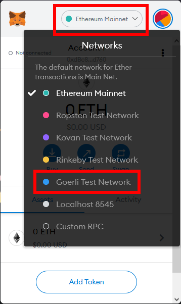
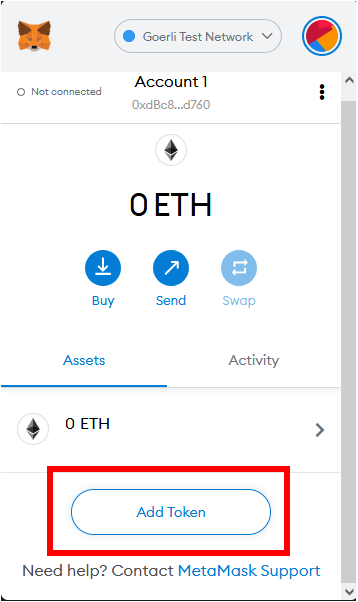
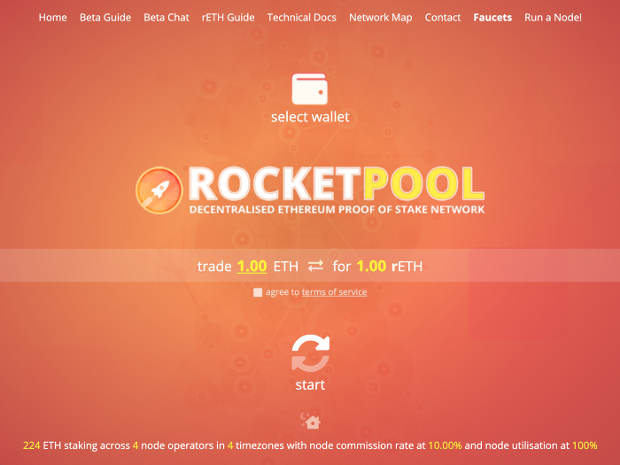
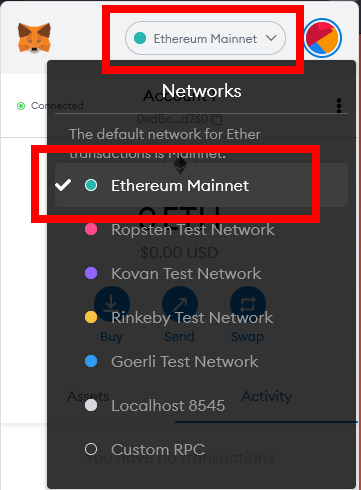

# Staking Directly via Rocket Pool

The easiest way to stake with Rocket Pool is done via its web interface to the underlying smart contracts.

The advantage is that you will always get exactly as much rETH as your ETH is worth, since Rocket Pool's contracts will directly mint the rETH that you receive.
No extra fees, no slippage, no liquidity issues, no sandwiching or front running... you just get the best possible deal for rETH.

The disadvantage is that the gas fee might be quite expensive if you are staking a small amount of ETH - **we strongly recommend you check this before approving the transaction.**
Also, there is a limit to the amount of ETH that can be in the pool at any given time, so it's possible that the pool could be full until Node Operators pull ETH from it and stake that ETH on the Beacon Chain.


The process is slightly different for the Prater Testnet and Mainnet, so choose the network you are interested in from the tabs below.

::::::: tabs
:::::: tab Preparing on the Prater Testnet

::: danger WARNING
When practicing staking on the test network, you **do not need to provide any of your real ETH** during this process.
You will be given **fake test ETH** to use instead.

**Do not attempt to move your real ETH on mainnet to the testnet or you will lose it permanently!** 
:::

Start by installing [MetaMask](https://metamask.io/) if you haven't already.
Follow the instructions on their site to install the extension, create an account, and sign in.

Next, open the MetaMask panel using its icon in your browser toolbar.
Click on the **network dropdown** in the toolbar at the top and select **Goerli Test Network**:

<center>



</center>

Finally, add the rETH token to MetaMask so you can see your balance and access it for trading.
Click the **Assets** tab, then click **Add Token**:

<center>



</center>

Ensure that **Custom Token** is selected in this dialog.
In the **Token Contract Address** box, put the following value:

```
0x178e141a0e3b34152f73ff610437a7bf9b83267a
```

The **Token Symbol** should automatically be populated with `rETH`, and the **Decimals of Precision** should automatically be populated with `18`.

Accept the rest of the prompts, and then you will see the rETH token appear in your list.

Now that you have a wallet address in MetaMask, you need to fill it with some test ETH.
Head over to the [Practicing with the Test Network](../testnet/overview.md#getting-test-eth-on-goerli) page for a quick guide on how to use a testnet faucet to get some test ETH on Goerli.

Once you have some Goerli ETH to test with, head to [https://testnet.rocketpool.net/](https://testnet.rocketpool.net/).

The page should look like this:

<center>



</center>

If you see a notice about a web3 browser being required, or the current network ID being unsupported, make sure you’ve completed the previous steps correctly before continuing.

::::::
:::::: tab Preparing on the Ethereum Mainnet

Start by installing [MetaMask](https://metamask.io/) if you haven't already.
Follow the instructions on their site to install the extension, create an account, and sign in.

Next, open the MetaMask panel using its icon in your browser toolbar.
Click on the **network dropdown** in the toolbar at the top and ensure that **Ethereum Mainnet** is selected:

<center>



</center>

Finally, add the rETH token to MetaMask so you can see your balance and access it for trading.
Click the **Assets** tab, then click **Add Token**:

<center>


</center>

Ensure that **Custom Token** is selected in this dialog.
In the **Token Contract Address** box, put the following value:

```
0xae78736Cd615f374D3085123A210448E74Fc6393
```

The **Token Symbol** should automatically be populated with `rETH`, and the **Decimals of Precision** should automatically be populated with `18`.

Accept the rest of the prompts, and then you will see the rETH token appear in your list.

Now that you have a wallet address in MetaMask, you need to transfer some ETH into it.
You will need to supply this from an existing wallet or buy ETH on an exchange.

Once you have some ETH to stake, head to [https://stake.rocketpool.net/](https://stake.rocketpool.net/).

The page should look like this:

<center>


</center>

If you see a notice about a web3 browser being required, or the current network ID being unsupported, make sure you’ve completed the previous steps correctly before continuing.

::::::
:::::::


Once you're at the site, click on the **connect wallet** button. Please read through and accept the Terms of Service & Privacy Policy, this will enable different ways to connect, then click **connect metamask**.

MetaMask will prompt you to select an account to connect to the website.
Choose one, confirm a few permissions, and you’ll see your balances update in the UI. You can also see an overview of your balances by clicking the wallet icon located at the top right of the window.

<center>


</center>

Now, all that's left to do is deposit your ETH and receive some rETH back!

Enter the amount of ETH you want to deposit in the **Stake ETH** input field on the screen, then click the **Stake** button.

<center>


</center>

MetaMask will pop up with a window asking you to confirm your transaction.

**Check the total gas cost of the transaction before you approve it - if it is very expensive relative to your transaction, you may want to consider acquiring rETH via another method!**

Once you confirm it, the transaction will begin.
When it's been mined and added to the chain, you'll see your balances update!

::: tip NOTE
As described in the previous page, it's **completely normal** to receive less rETH than the amount of ETH you put in.
rETH and ETH have a **dynamic exchange rate**: as the Rocket Pool network earns rewards, 1 rETH will become worth more than 1 ETH, which in turn means 1 ETH will buy less than 1 rETH.
:::

That's it!
You're now staking with Rocket Pool.
All you need to do is hold onto your rETH, and you'll automatically gain your staking rewards as the value of the rETH token increases.


## Unstaking

When you're ready to unstake and trade your rETH back for ETH, head back to the staking website and click on the **double arrow button** in the middle of the trade amounts dialog to switch to rETH mode:

<center>


</center>

As with staking, enter an amount of rETH to unstake and click the **Unstake** button.
Once again, a confirmation dialog will appear in MetaMask.
Confirm the transaction, and once it's been mined, you will see the proper balances in your wallet.

::: warning NOTE
Trading rETH back for ETH is only possible when the **staking liquidity pool** has enough ETH in it to handle your trade.
This is Rocket Pool's pool of ETH that comes from two sources:

1. ETH that other stakers have deposited, which hasn't been used by a Node Operator to create a new validator yet
1. ETH that was returned by a Node Operator after they exited one of their validators and received their rewards from the Beacon Chain (**note that this is not possible until after the ETH1-ETH2 Merge occurs and withdrawals are enabled**)

During the period before the Merge, it's possible that the liquidity pool won't have enough balance to cover your unstaking.
In this scenario, you may find other ways to trade your rETH back to ETH (such as a decentralized exchange like [Uniswap](https://app.uniswap.org/#/swap)) - though they will likely come with a small premium.
:::

That's all there is to staking with Rocket Pool!
We hope that you found the process quick and easy.

Feel free to swing by [our Discord server](https://discord.gg/G46XgK264a) to let us know what you thought of it and keep tabs on the project as it evolves.
